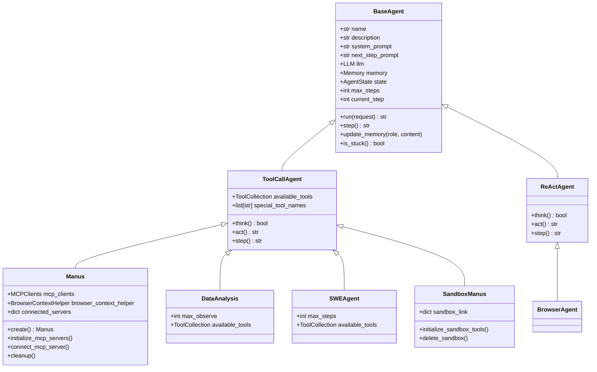
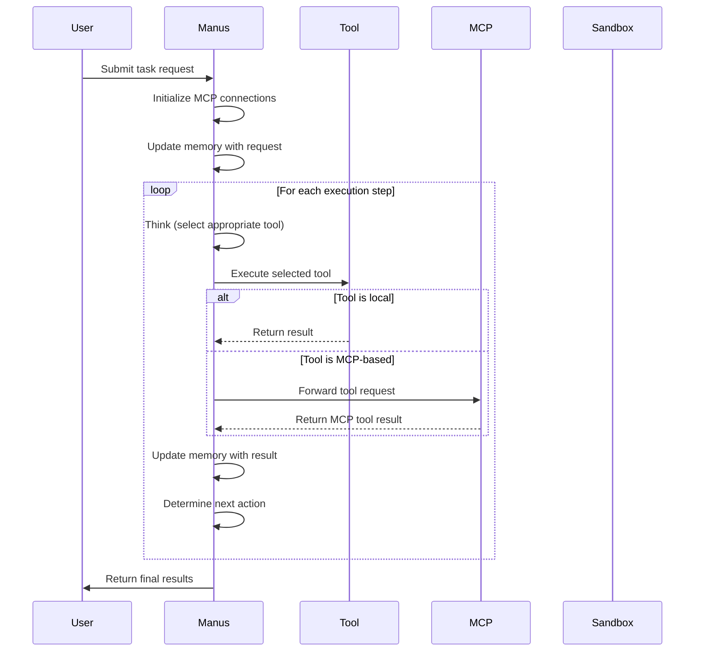
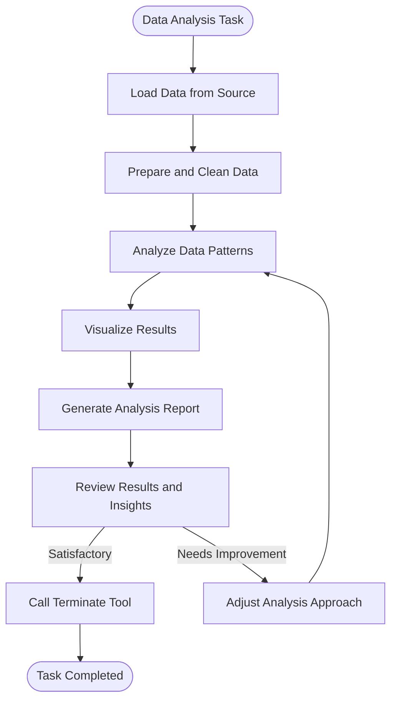
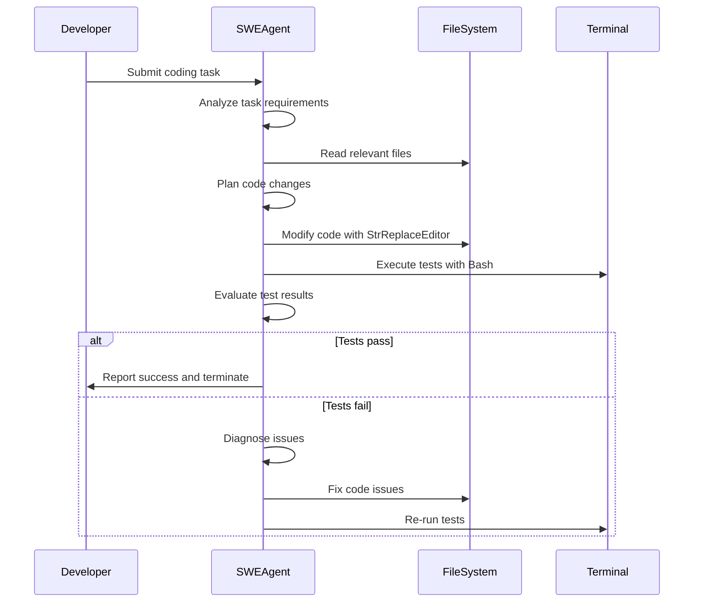
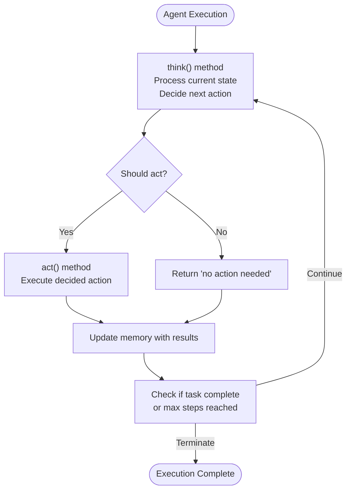
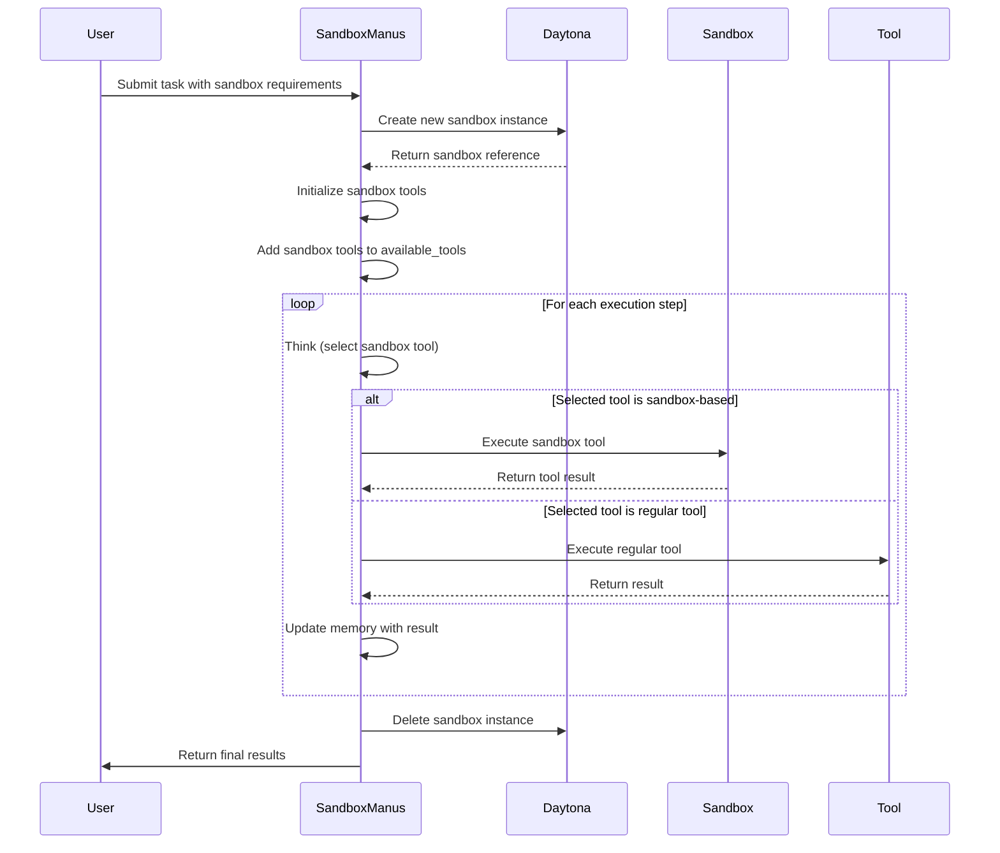
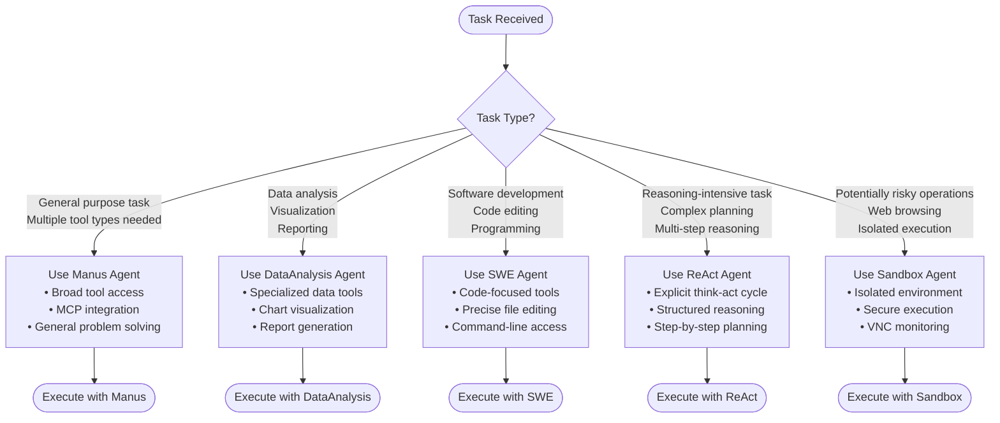
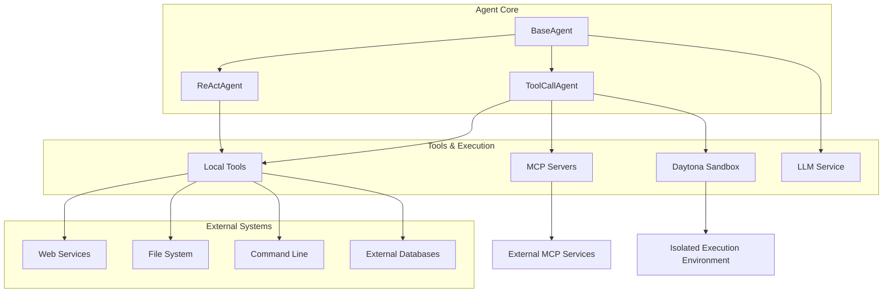
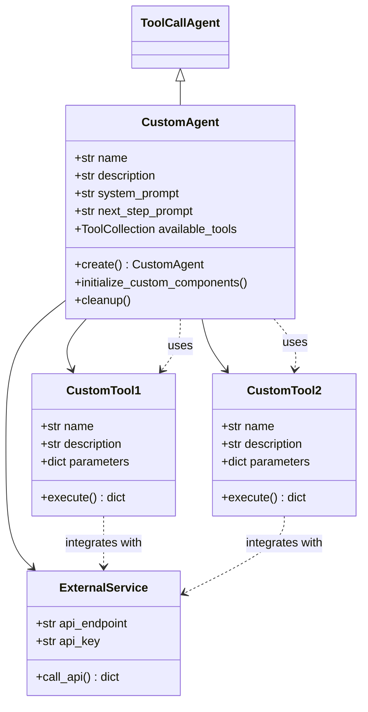

# Agent Types

<cite>
**Referenced Files in This Document**   
- [base.py](file://app/agent/base.py)
- [manus.py](file://app/agent/manus.py)
- [data_analysis.py](file://app/agent/data_analysis.py)
- [swe.py](file://app/agent/swe.py)
- [react.py](file://app/agent/react.py)
- [sandbox_agent.py](file://app/agent/sandbox_agent.py)
- [toolcall.py](file://app/agent/toolcall.py)
- [SYSTEM_PROMPT](file://app/prompt/manus.py)
- [NEXT_STEP_PROMPT](file://app/prompt/manus.py)
- [visualization.py](file://app/prompt/visualization.py)
- [swe.py](file://app/prompt/swe.py)
- [python_execute.py](file://app/tool/python_execute.py)
- [data_visualization.py](file://app/tool/chart_visualization/data_visualization.py)
- [sb_shell_tool.py](file://app/tool/sandbox/sb_shell_tool.py)
- [sb_files_tool.py](file://app/tool/sandbox/sb_files_tool.py)
- [sb_browser_tool.py](file://app/tool/sandbox/sb_browser_tool.py)
- [sb_vision_tool.py](file://app/tool/sandbox/sb_vision_tool.py)
</cite>

## Table of Contents
1. [Introduction](#introduction)
2. [Core Agent Architecture](#core-agent-architecture)
3. [Manus Agent](#manus-agent)
4. [DataAnalysis Agent](#dataanalysis-agent)
5. [SWE Agent](#swe-agent)
6. [ReAct Agent](#react-agent)
7. [Sandbox Agent](#sandbox-agent)
8. [Agent Selection and Use Cases](#agent-selection-and-use-cases)
9. [Integration Points](#integration-points)
10. [Extending and Customizing Agents](#extending-and-customizing-agents)
11. [Common Issues and Best Practices](#common-issues-and-best-practices)

## Introduction
OpenManus implements a modular agent system with specialized agent types designed for different task domains. Each agent type inherits from base classes and is specialized through prompt engineering and tool selection to optimize performance for specific use cases. This document details the architecture, implementation, and usage patterns for each agent type in the OpenManus framework.

## Core Agent Architecture

**Diagram sources**
- [base.py](file://app/agent/base.py#L1-L196)
- [toolcall.py](file://app/agent/toolcall.py)
- [manus.py](file://app/agent/manus.py#L1-L165)
- [data_analysis.py](file://app/agent/data_analysis.py#L1-L37)
- [swe.py](file://app/agent/swe.py#L1-L24)
- [sandbox_agent.py](file://app/agent/sandbox_agent.py#L1-L223)
- [react.py](file://app/agent/react.py#L1-L38)

**Section sources**
- [base.py](file://app/agent/base.py#L1-L196)
- [toolcall.py](file://app/agent/toolcall.py)

## Manus Agent

The Manus agent serves as the general-purpose agent in OpenManus, designed to handle a wide variety of tasks through comprehensive tool access. It inherits from `ToolCallAgent` and specializes in multi-modal task execution by integrating local tools with MCP (Modular Cognitive Processing) servers.

The agent is initialized with a rich set of tools including Python execution, browser automation, file editing, human interaction, and task termination. It dynamically connects to configured MCP servers, incorporating their tools into its available tool collection. The Manus agent uses prompt engineering with a system prompt that establishes its role as an all-capable AI assistant and a next-step prompt that guides proactive tool selection.

During execution, the Manus agent monitors browser usage in recent messages and dynamically adjusts its next-step prompt context through the `BrowserContextHelper`. This allows for more informed decision-making when web browsing tasks are in progress.

**Diagram sources**
- [manus.py](file://app/agent/manus.py#L1-L165)
- [toolcall.py](file://app/agent/toolcall.py)
- [prompt/manus.py](file://app/prompt/manus.py#L1-L10)

**Section sources**
- [manus.py](file://app/agent/manus.py#L1-L165)
- [prompt/manus.py](file://app/prompt/manus.py#L1-L10)

## DataAnalysis Agent

The DataAnalysis agent specializes in data processing, visualization, and reporting tasks. It extends the `ToolCallAgent` class with a focused toolset optimized for data-centric workflows, including specialized Python execution, data visualization preparation, and chart generation capabilities.

This agent uses a domain-specific system prompt that establishes its role in data analysis tasks and emphasizes the importance of generating analysis conclusion reports. The next-step prompt guides the agent to break down problems and use tools step by step, with specific instructions to review and fix errors in observations.

The DataAnalysis agent is configured with a higher `max_observe` value (15000) compared to other agents, accommodating the larger data outputs typical in data analysis workflows. Its tool collection includes `NormalPythonExecute` for data processing, `VisualizationPrepare` for chart preparation, `DataVisualization` for rendering charts in various formats, and `Terminate` for task completion.

**Diagram sources**
- [data_analysis.py](file://app/agent/data_analysis.py#L1-L37)
- [prompt/visualization.py](file://app/prompt/visualization.py#L1-L10)
- [data_visualization.py](file://app/tool/chart_visualization/data_visualization.py#L1-L263)

**Section sources**
- [data_analysis.py](file://app/agent/data_analysis.py#L1-L37)
- [prompt/visualization.py](file://app/prompt/visualization.py#L1-L10)

## SWE Agent

The SWE (Software Engineering) agent is designed specifically for programming tasks and code development. It inherits from `ToolCallAgent` but implements a distinct paradigm focused on direct computer interaction for software engineering workflows.

This agent uses a specialized system prompt that establishes its role as an autonomous programmer working in a command-line environment with a file editor. The prompt emphasizes proper indentation in code and restricts the agent to issuing one tool call at a time, preventing the execution of multiple commands simultaneously.

The SWE agent's toolset is minimal but powerful, consisting of Bash execution for command-line operations, `StrReplaceEditor` for precise code modifications, and `Terminate` for task completion. This focused tool selection encourages the agent to solve programming tasks through careful, step-by-step code modifications rather than broad tool usage.

**Diagram sources**
- [swe.py](file://app/agent/swe.py#L1-L24)
- [prompt/swe.py](file://app/prompt/swe.py#L1-L22)
- [bash.py](file://app/tool/bash.py)
- [str_replace_editor.py](file://app/tool/str_replace_editor.py)

**Section sources**
- [swe.py](file://app/agent/swe.py#L1-L24)
- [prompt/swe.py](file://app/prompt/swe.py#L1-L22)

## ReAct Agent

The ReAct (Reasoning and Acting) agent implements a cognitive architecture that separates reasoning from action execution. It inherits from the `BaseAgent` class and defines an abstract interface for the ReAct paradigm, which can be extended by specialized agents.

This agent type formalizes the think-act cycle by defining abstract methods for `think()` and `act()`, with a concrete `step()` method that orchestrates their execution. The `think()` method is responsible for processing the current state and deciding on the next action, while the `act()` method executes the decided actions.

The ReAct pattern enables more deliberate decision-making by ensuring that reasoning and action are distinct phases in the agent's workflow. This separation allows for more sophisticated planning and reduces the likelihood of impulsive or poorly considered actions.

**Diagram sources**
- [react.py](file://app/agent/react.py#L1-L38)
- [base.py](file://app/agent/base.py#L1-L196)

**Section sources**
- [react.py](file://app/agent/react.py#L1-L38)

## Sandbox Agent

The Sandbox agent (SandboxManus) provides isolated execution capabilities through integration with Daytona sandbox environments. It inherits from `ToolCallAgent` like the general Manus agent but specializes in sandbox-based tool execution.

This agent is initialized with sandbox-specific tools that enable secure execution of potentially risky operations in an isolated environment. During creation, it establishes a sandbox instance and configures various sandbox tools for browser automation, file operations, shell commands, and vision capabilities.

The agent maintains references to sandbox links (VNC and website URLs) for monitoring and debugging purposes. It provides methods to initialize sandbox tools with password protection and to delete sandboxes when cleanup is required. The sandbox integration allows for safe execution of web browsing tasks, file system modifications, and command-line operations without risking the host environment.

**Diagram sources**
- [sandbox_agent.py](file://app/agent/sandbox_agent.py#L1-L223)
- [daytona/sandbox.py](file://app/daytona/sandbox.py)
- [sb_shell_tool.py](file://app/tool/sandbox/sb_shell_tool.py#L1-L419)
- [sb_files_tool.py](file://app/tool/sandbox/sb_files_tool.py#L1-L361)

**Section sources**
- [sandbox_agent.py](file://app/agent/sandbox_agent.py#L1-L223)
- [daytona/README.md](file://app/daytona/README.md#L1-L57)

## Agent Selection and Use Cases

Choosing the appropriate agent type depends on the nature of the task at hand. The following guidelines help determine which agent to use for different scenarios:

**Diagram sources**
- [manus.py](file://app/agent/manus.py#L1-L165)
- [data_analysis.py](file://app/agent/data_analysis.py#L1-L37)
- [swe.py](file://app/agent/swe.py#L1-L24)
- [react.py](file://app/agent/react.py#L1-L38)
- [sandbox_agent.py](file://app/agent/sandbox_agent.py#L1-L223)

**Section sources**
- [manus.py](file://app/agent/manus.py#L1-L165)
- [data_analysis.py](file://app/agent/data_analysis.py#L1-L37)
- [swe.py](file://app/agent/swe.py#L1-L24)
- [react.py](file://app/agent/react.py#L1-L38)
- [sandbox_agent.py](file://app/agent/sandbox_agent.py#L1-L223)

## Integration Points

Agents in OpenManus integrate with various external systems and components through well-defined interfaces. These integration points enable the agents to extend their capabilities beyond basic functionality.

**Diagram sources**
- [manus.py](file://app/agent/manus.py#L1-L165)
- [toolcall.py](file://app/agent/toolcall.py)
- [mcp.py](file://app/agent/mcp.py)
- [sandbox_agent.py](file://app/agent/sandbox_agent.py#L1-L223)
- [llm.py](file://app/llm.py)

**Section sources**
- [manus.py](file://app/agent/manus.py#L1-L165)
- [toolcall.py](file://app/agent/toolcall.py)
- [mcp.py](file://app/agent/mcp.py)
- [sandbox_agent.py](file://app/agent/sandbox_agent.py#L1-L223)

## Extending and Customizing Agents

Creating new agents or extending existing ones in OpenManus follows a consistent pattern based on inheritance and composition. Developers can create specialized agents by inheriting from base agent classes and customizing their behavior through prompt engineering and tool selection.

To create a new agent, extend either `ToolCallAgent` for tool-based workflows or `ReActAgent` for reasoning-act architectures. Customize the agent by setting appropriate prompts, configuring tool collections, and overriding methods as needed. The factory pattern used in agent creation (e.g., the `create` class method) allows for proper asynchronous initialization of agent components.

When extending agents, consider the principle of least privilege by including only the tools necessary for the agent's intended purpose. This improves security and focuses the agent's capabilities on its specific domain. Prompt engineering should align with the agent's toolset and intended use cases, guiding the LLM toward appropriate tool selection and task execution patterns.

**Diagram sources**
- [base.py](file://app/agent/base.py#L1-L196)
- [toolcall.py](file://app/agent/toolcall.py)
- [manus.py](file://app/agent/manus.py#L1-L165)

**Section sources**
- [base.py](file://app/agent/base.py#L1-L196)
- [toolcall.py](file://app/agent/toolcall.py)

## Common Issues and Best Practices

When working with OpenManus agents, several common issues may arise, along with established best practices for optimal performance and reliability.

**Common Issues:**
- **Tool selection errors**: Agents may select inappropriate tools for the task. Mitigate by refining prompts and ensuring tool descriptions are clear.
- **State management**: Agents can become stuck in loops. The framework includes stuck state detection that adds prompts to change strategies when duplicate responses are detected.
- **Sandbox initialization failures**: Ensure Daytona API keys are properly configured and sandbox images are available.
- **MCP server connection issues**: Verify server configurations in the MCP settings and ensure network connectivity.
- **Resource cleanup**: Always ensure proper cleanup of sandboxes and MCP connections to prevent resource leaks.

**Best Practices:**
- **Prompt engineering**: Craft system and next-step prompts that clearly define the agent's role and guide appropriate tool selection.
- **Tool minimization**: Include only necessary tools for each agent type to focus capabilities and improve security.
- **Error handling**: Implement robust error handling in custom tools and ensure agents can recover from tool execution failures.
- **Monitoring**: Use the provided VNC and website links to monitor sandbox agent activities during execution.
- **Testing**: Test new agents and tools with simple tasks before deploying them for complex workflows.
- **Documentation**: Maintain clear documentation of agent capabilities and limitations to guide users in appropriate selection.

**Section sources**
- [base.py](file://app/agent/base.py#L1-L196)
- [manus.py](file://app/agent/manus.py#L1-L165)
- [sandbox_agent.py](file://app/agent/sandbox_agent.py#L1-L223)
- [daytona/README.md](file://app/daytona/README.md#L1-L57)