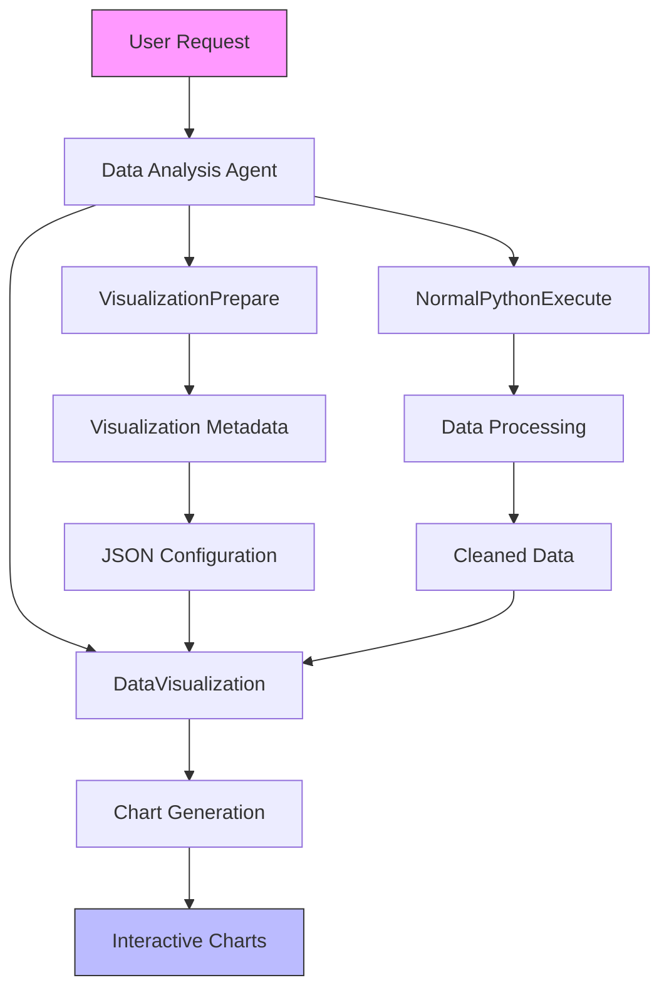
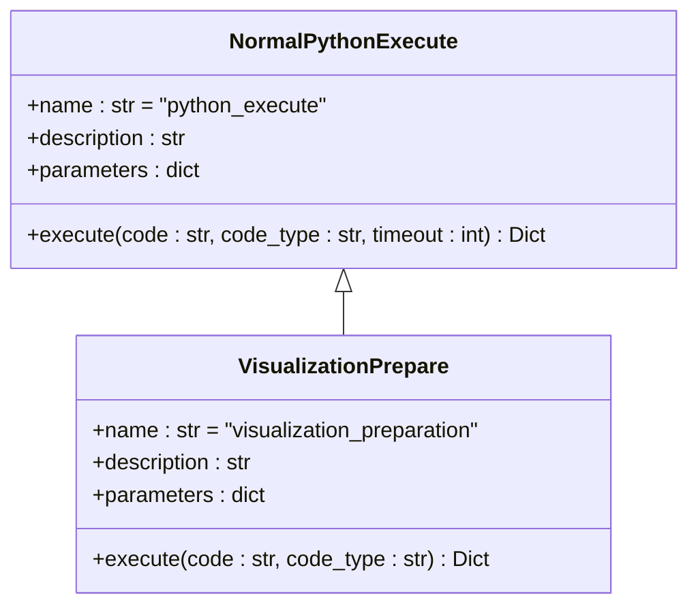
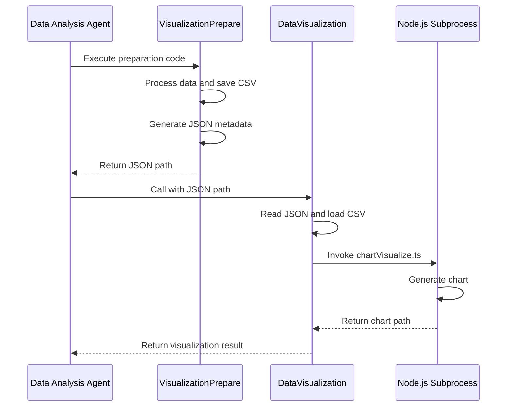
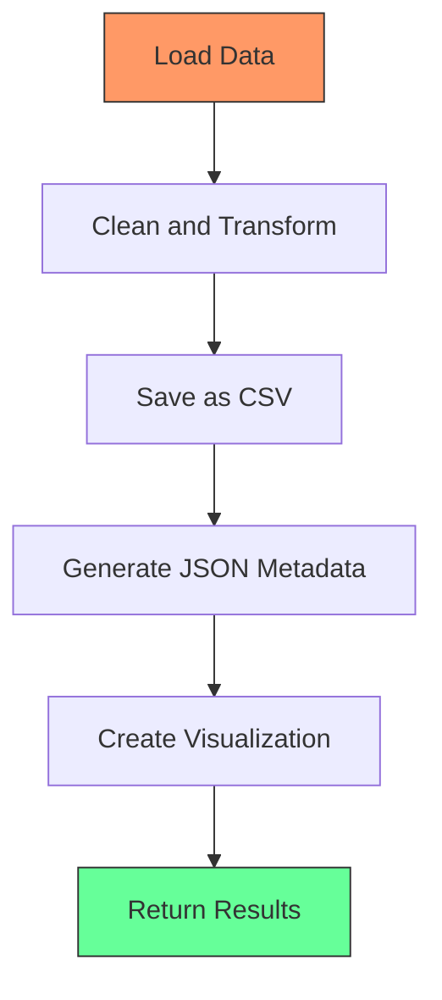

# Data Analysis Agent

<cite>
**Referenced Files in This Document**   
- [data_analysis.py](file://app/agent/data_analysis.py)
- [chart_prepare.py](file://app/tool/chart_visualization/chart_prepare.py)
- [data_visualization.py](file://app/tool/chart_visualization/data_visualization.py)
- [python_execute.py](file://app/tool/chart_visualization/python_execute.py)
- [visualization.py](file://app/prompt/visualization.py)
- [config.py](file://app/config.py)
</cite>

## Table of Contents
1. [Introduction](#introduction)
2. [Core Components](#core-components)
3. [Architecture Overview](#architecture-overview)
4. [Detailed Component Analysis](#detailed-component-analysis)
5. [Data Processing Workflow](#data-processing-workflow)
6. [Prompt Engineering and Reasoning](#prompt-engineering-and-reasoning)
7. [Sandboxed Execution and Security](#sandboxed-execution-and-security)
8. [Error Handling and Data Validation](#error-handling-and-data-validation)
9. [Extensibility and Customization](#extensibility-and-customization)
10. [Performance Considerations](#performance-considerations)

## Introduction
The Data Analysis Agent is a specialized component designed for processing, analyzing, and visualizing structured datasets. It leverages Python execution capabilities and advanced chart visualization tools to transform raw data into meaningful insights and interactive visual representations. The agent follows a systematic workflow that begins with data loading and preprocessing, proceeds through statistical analysis, and culminates in the generation of comprehensive visualizations. Built with extensibility in mind, the agent can be adapted to handle various data formats and visualization types while maintaining robust security through sandboxed code execution.

**Section sources**
- [data_analysis.py](file://app/agent/data_analysis.py#L1-L38)

## Core Components
The Data Analysis Agent comprises several interconnected components that work together to deliver comprehensive data analysis capabilities. At its core, the agent utilizes three primary tools: NormalPythonExecute for general data processing, VisualizationPrepare for preparing visualization metadata, and DataVisualization for generating actual charts. These components are orchestrated through a well-defined agent framework that manages the execution flow and tool selection process. The integration between these components enables a seamless transition from raw data to insightful visualizations, with each tool specializing in a specific phase of the analysis pipeline.

**Section sources**
- [data_analysis.py](file://app/agent/data_analysis.py#L29-L36)
- [chart_prepare.py](file://app/tool/chart_visualization/chart_prepare.py#L3-L37)
- [data_visualization.py](file://app/tool/chart_visualization/data_visualization.py#L14-L262)

## Architecture Overview
The Data Analysis Agent follows a modular architecture that separates concerns between data processing, visualization preparation, and chart generation. This design enables clear separation of responsibilities while maintaining flexibility in the analysis workflow. The agent operates within a controlled environment that ensures secure code execution and proper resource management.

**Diagram sources**
- [data_analysis.py](file://app/agent/data_analysis.py#L1-L38)
- [chart_prepare.py](file://app/tool/chart_visualization/chart_prepare.py#L3-L37)
- [data_visualization.py](file://app/tool/chart_visualization/data_visualization.py#L14-L262)

## Detailed Component Analysis

### Data Analysis Agent Implementation
The DataAnalysis class extends the ToolCallAgent to provide specialized capabilities for data analysis tasks. It is configured with a system prompt that establishes its role and capabilities, and a next-step prompt that guides its reasoning process. The agent has a maximum step limit of 20 and can observe up to 15,000 characters of output, providing sufficient capacity for complex analysis tasks. Its available tools are carefully selected to cover the entire data analysis workflow, from initial data processing to final visualization.

**Section sources**
- [data_analysis.py](file://app/agent/data_analysis.py#L1-L38)

### Visualization Preparation Tool
The VisualizationPrepare tool serves as an intermediary between raw data processing and chart generation. It executes Python code to transform source data into cleaned CSV files and generates metadata for visualization. The tool supports two modes: "visualization" for creating new charts from data, and "insight" for enhancing existing charts with additional insights. It outputs JSON configuration files that specify the data source and chart description, which are then consumed by the DataVisualization tool.

**Diagram sources**
- [chart_prepare.py](file://app/tool/chart_visualization/chart_prepare.py#L3-L37)
- [python_execute.py](file://app/tool/chart_visualization/python_execute.py#L4-L35)

### Data Visualization Engine
The DataVisualization tool is responsible for generating actual charts from prepared data and metadata. It reads JSON configuration files produced by VisualizationPrepare, loads the corresponding CSV data, and invokes a Node.js subprocess to create visualizations. The tool supports multiple output formats, including interactive HTML charts and static PNG images. It can also enhance existing charts with insights by modifying them based on specified insight IDs. The visualization process is asynchronous, allowing for efficient handling of multiple charts simultaneously.

**Diagram sources**
- [data_visualization.py](file://app/tool/chart_visualization/data_visualization.py#L14-L262)
- [chart_prepare.py](file://app/tool/chart_visualization/chart_prepare.py#L3-L37)

## Data Processing Workflow
The data analysis workflow follows a structured sequence of operations that ensures reliable and reproducible results. When presented with a data analysis request, the agent first uses NormalPythonExecute to load and preprocess the data, handling tasks such as cleaning, transformation, and basic statistical analysis. The processed data is saved in CSV format within the workspace directory. Next, VisualizationPrepare generates a JSON configuration file that specifies the visualization requirements, including the data source path and chart description. Finally, DataVisualization reads this configuration and produces the requested charts, saving them in the designated output format.

**Diagram sources**
- [data_analysis.py](file://app/agent/data_analysis.py#L29-L36)
- [chart_prepare.py](file://app/tool/chart_visualization/chart_prepare.py#L3-L37)
- [data_visualization.py](file://app/tool/chart_visualization/data_visualization.py#L14-L262)

## Prompt Engineering and Reasoning
The agent's behavior is guided by carefully crafted prompts that establish its role and decision-making process. The system prompt defines the agent as an AI designed for data analysis and visualization tasks, emphasizing its access to various tools and the workspace directory structure. The next-step prompt instructs the agent to break down complex problems into manageable steps, select appropriate tools proactively, explain execution results, and suggest subsequent actions. This prompt engineering approach enables the agent to reason systematically about data analysis tasks and make informed decisions about tool selection and execution order.

**Section sources**
- [visualization.py](file://app/prompt/visualization.py#L1-L11)

## Sandboxed Execution and Security
The Data Analysis Agent incorporates security measures to ensure safe execution of potentially untrusted code. While the current implementation does not explicitly enable sandboxing in the configuration, the architecture supports it through the SandboxSettings class in config.py. Python code execution is handled by the PythonExecute tool, which runs code in a restricted environment with timeout protection. This prevents infinite loops and limits resource consumption. The agent operates within a designated workspace directory, restricting file system access to prevent unauthorized modifications to the host system.

**Section sources**
- [python_execute.py](file://app/tool/python_execute.py#L8-L74)
- [config.py](file://app/config.py#L1-L373)

## Error Handling and Data Validation
The agent implements comprehensive error handling mechanisms to manage various failure scenarios. Each tool returns structured results that include both observation data and success status, allowing the agent to detect and respond to errors appropriately. The DataVisualization tool includes specific error handling for missing files, failed chart generation, and subprocess execution issues. When errors occur, the agent receives detailed error messages that can be used to diagnose problems and attempt corrective actions. The JSON configuration format used for visualization metadata provides a standardized way to validate data before chart generation, reducing the likelihood of runtime errors.

**Section sources**
- [data_visualization.py](file://app/tool/chart_visualization/data_visualization.py#L147-L193)
- [python_execute.py](file://app/tool/python_execute.py#L8-L74)

## Extensibility and Customization
The Data Analysis Agent is designed with extensibility in mind, allowing for easy addition of new visualization types and data formats. The modular architecture separates data processing from visualization, making it straightforward to introduce new data sources or output formats. To add support for a new visualization type, developers can extend the DataVisualization tool or create a new tool that follows the same interface pattern. Similarly, support for additional data formats can be implemented by enhancing the data loading capabilities in the preparation phase. The agent's configuration system allows for easy customization of behavior through prompt engineering and parameter tuning.

**Section sources**
- [data_analysis.py](file://app/agent/data_analysis.py#L1-L38)
- [data_visualization.py](file://app/tool/chart_visualization/data_visualization.py#L14-L262)

## Performance Considerations
When handling large datasets, the Data Analysis Agent employs several strategies to maintain performance and responsiveness. The asynchronous implementation of the DataVisualization tool allows for concurrent processing of multiple charts, improving throughput. Data is processed in chunks where appropriate, and memory usage is monitored to prevent excessive resource consumption. The agent's step limit and observation truncation settings help manage computational complexity, while the timeout mechanism in code execution prevents long-running operations from blocking the analysis pipeline. For optimal performance with large datasets, it is recommended to preprocess data to reduce dimensionality and use efficient data formats such as Parquet when possible.

**Section sources**
- [data_analysis.py](file://app/agent/data_analysis.py#L1-L38)
- [data_visualization.py](file://app/tool/chart_visualization/data_visualization.py#L14-L262)
- [python_execute.py](file://app/tool/python_execute.py#L8-L74)