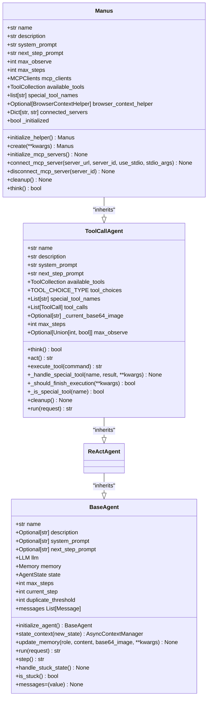
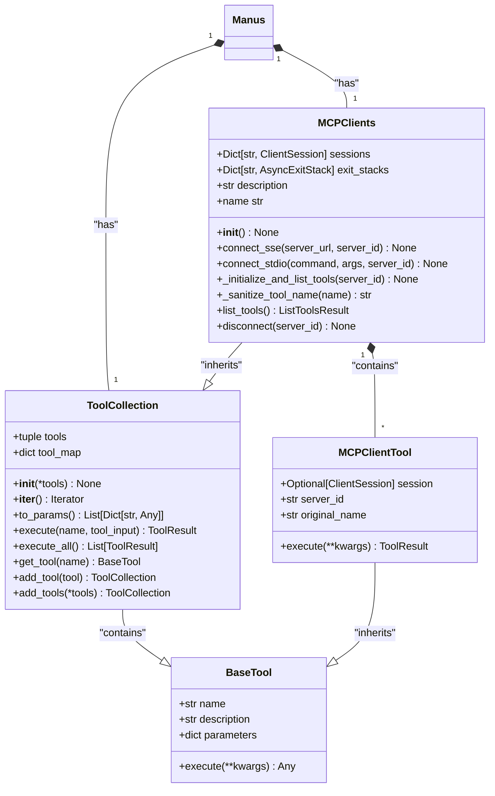
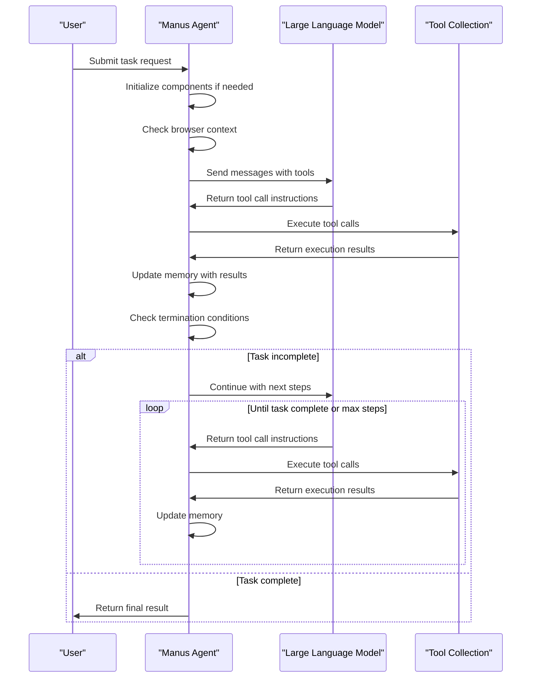

# Manus Agent

<cite>
**Referenced Files in This Document**   
- [manus.py](file://app/agent/manus.py)
- [base.py](file://app/agent/base.py)
- [toolcall.py](file://app/agent/toolcall.py)
- [manus.py](file://app/prompt/manus.py)
- [tool_collection.py](file://app/tool/tool_collection.py)
- [mcp.py](file://app/tool/mcp.py)
- [python_execute.py](file://app/tool/python_execute.py)
- [browser_use_tool.py](file://app/tool/browser_use_tool.py)
- [str_replace_editor.py](file://app/tool/str_replace_editor.py)
- [ask_human.py](file://app/tool/ask_human.py)
- [terminate.py](file://app/tool/terminate.py)
- [config.py](file://app/config.py)
</cite>

## Table of Contents
1. [Introduction](#introduction)
2. [Core Architecture](#core-architecture)
3. [Initialization Process](#initialization-process)
4. [Tool Management](#tool-management)
5. [Prompt Engineering](#prompt-engineering)
6. [Task Execution Flow](#task-execution-flow)
7. [Memory and State Management](#memory-and-state-management)
8. [Error Handling and Cleanup](#error-handling-and-cleanup)
9. [Configuration and Customization](#configuration-and-customization)
10. [Common Issues and Best Practices](#common-issues-and-best-practices)

## Introduction

The Manus Agent serves as the primary general-purpose AI agent within the OpenManus framework, designed to handle diverse user tasks through intelligent orchestration of various tools and services. As the default agent type, Manus provides a flexible and extensible foundation for executing complex workflows that may involve web browsing, code execution, file manipulation, and human interaction. The agent operates by leveraging Large Language Models (LLMs) to make decisions about tool usage, maintaining context through memory management, and coordinating both local and remote tool execution through the Model Context Protocol (MCP). This documentation provides a comprehensive overview of the Manus Agent's architecture, implementation details, and operational patterns, serving as a reference for developers and users working with the OpenManus platform.

**Section sources**
- [manus.py](file://app/agent/manus.py#L17-L164)

## Core Architecture

The Manus Agent is implemented as a class that inherits from the ToolCallAgent base class, establishing a hierarchical relationship within the agent framework. This inheritance pattern allows Manus to leverage the core functionality of tool orchestration while extending it with specialized capabilities for handling both local and MCP-based tools. The agent's architecture is centered around several key components: the tool collection system, which manages available tools; the MCP client integration, which enables remote tool access; and the prompt template system, which guides LLM behavior. The agent maintains state through various fields including memory for conversation history, configuration parameters for execution limits, and helper components for specialized functionality like browser context management. This modular design enables the Manus Agent to dynamically adapt to different task requirements while maintaining a consistent interface for interaction with the LLM and external systems.

**Diagram sources **
- [manus.py](file://app/agent/manus.py#L17-L164)
- [toolcall.py](file://app/agent/toolcall.py#L17-L249)
- [base.py](file://app/agent/base.py#L14-L196)

## Initialization Process

The Manus Agent employs a sophisticated initialization process that ensures proper setup of all required components before the agent becomes operational. The process begins with the factory method `create()`, which serves as the primary entry point for agent instantiation. This asynchronous method first creates an instance of the Manus class with the provided configuration parameters, then proceeds to initialize connections to configured MCP servers through the `initialize_mcp_servers()` method. During MCP server initialization, the agent iterates through the server configurations defined in the application settings, establishing connections via either SSE (Server-Sent Events) or stdio (standard input/output) transport mechanisms based on the server type. The initialization process also includes the synchronous `initialize_helper()` method, which sets up the BrowserContextHelper component for managing browser interactions. This multi-phase initialization ensures that all external dependencies and internal components are properly configured before the agent begins processing user requests, with the `_initialized` flag tracking the completion status of the initialization sequence.

**Section sources**
- [manus.py](file://app/agent/manus.py#L59-L64)
- [manus.py](file://app/agent/manus.py#L66-L88)
- [manus.py](file://app/agent/manus.py#L53-L56)

## Tool Management

The Manus Agent implements a comprehensive tool management system that enables the dynamic integration and utilization of both local and remote tools. At the core of this system is the `available_tools` field, which contains a `ToolCollection` instance that aggregates all accessible tools for the agent. The default tool set includes essential local tools such as `PythonExecute` for code execution, `BrowserUseTool` for web browsing, `StrReplaceEditor` for file manipulation, `AskHuman` for human interaction, and `Terminate` for ending sessions. The agent's integration with MCP (Model Context Protocol) allows for the addition of remote tools from external servers, which are dynamically incorporated into the available tools collection through the `connect_mcp_server()` method. When connecting to an MCP server, the agent establishes a session, retrieves the list of available tools from the server, and adds them to the tool collection with appropriately sanitized names that include the server identifier. The `disconnect_mcp_server()` method provides the capability to remove tools from a specific server, rebuilding the available tools collection to exclude the disconnected server's tools while preserving the base local tools. This flexible tool management architecture enables the Manus Agent to adapt to different execution environments and extend its capabilities through external services.

**Diagram sources **
- [tool_collection.py](file://app/tool/tool_collection.py#L8-L70)
- [mcp.py](file://app/tool/mcp.py#L36-L193)
- [manus.py](file://app/agent/manus.py#L33-L41)

## Prompt Engineering

The Manus Agent leverages carefully designed prompt templates to guide the behavior of the underlying Large Language Model (LLM) in task execution and tool selection. These prompts are defined in the `app/prompt/manus.py` module and are incorporated into the agent through class-level attributes. The `SYSTEM_PROMPT` provides the foundational context for the agent, establishing its identity as "OpenManus, an all-capable AI assistant" with various tools at its disposal for handling programming, information retrieval, file processing, web browsing, and human interaction tasks. The prompt dynamically incorporates the workspace directory from the application configuration, providing the agent with awareness of its execution environment. The `NEXT_STEP_PROMPT` guides the agent's decision-making process by instructing it to proactively select appropriate tools based on user needs, break down complex tasks into sequential steps, and clearly explain execution results. This prompt engineering approach enables the agent to adopt a strategic, step-by-step problem-solving methodology while maintaining transparency in its reasoning process. The prompts are formatted as class attributes in the Manus class, with the `SYSTEM_PROMPT` being formatted with the workspace root directory at initialization, ensuring that the agent has up-to-date contextual information for each session.

**Section sources**
- [manus.py](file://app/agent/manus.py#L23-L24)
- [manus.py](file://app/agent/manus.py#L17-L24)
- [manus.py](file://app/prompt/manus.py#L1-L10)

## Task Execution Flow

The Manus Agent follows a structured execution flow that coordinates LLM decision-making with tool orchestration to accomplish user tasks. The core of this process is the `think()` method, which determines the next actions based on the current state and context. When invoked, the method first checks the initialization status and ensures MCP servers are properly connected if needed. It then examines recent messages to detect if browser interaction is in progress, dynamically adjusting the next step prompt through the BrowserContextHelper to provide appropriate context for web browsing tasks. The agent then delegates to the parent `think()` method from ToolCallAgent, which formats the conversation history and sends it to the LLM with the available tools specification. The LLM responds with tool call instructions, which are processed by the agent's `act()` method from the parent class. This method executes each tool call in sequence, handling the results and adding them to the conversation memory. The execution continues in a loop until the maximum step count is reached or a termination condition is met, such as the use of the `Terminate` tool. This iterative process allows the agent to handle complex, multi-step tasks by breaking them down into individual tool invocations, with each step informed by the results of previous actions.

**Diagram sources **
- [manus.py](file://app/agent/manus.py#L139-L164)
- [toolcall.py](file://app/agent/toolcall.py#L40-L100)

## Memory and State Management

The Manus Agent implements a sophisticated memory and state management system that enables it to maintain context across multiple interactions and tool executions. The agent inherits memory management capabilities from the BaseAgent class, utilizing a Memory object to store the conversation history as a sequence of messages. This memory includes user inputs, system prompts, assistant responses, and tool execution results, providing the LLM with the necessary context for making informed decisions about subsequent actions. The agent's state is tracked through the `state` field, which can take values such as IDLE, RUNNING, or FINISHED, allowing for proper lifecycle management. The `think()` method uses the memory to detect patterns such as duplicate responses, which could indicate the agent is stuck in a loop, and applies strategies to break out of such situations. The agent also maintains specialized state for browser interactions through the BrowserContextHelper, which tracks the current browser session and provides context-specific prompts when web browsing is in progress. This comprehensive state management system ensures that the agent can handle complex, multi-step tasks while maintaining awareness of its progress and avoiding redundant actions.

**Section sources**
- [manus.py](file://app/agent/manus.py#L139-L164)
- [base.py](file://app/agent/base.py#L14-L196)

## Error Handling and Cleanup

The Manus Agent incorporates robust error handling and resource cleanup mechanisms to ensure reliable operation and proper resource management. The agent's `cleanup()` method is responsible for releasing resources used during its lifecycle, including browser instances and MCP server connections. This method is designed to be called both explicitly and through the agent's context management, ensuring that cleanup occurs even if an error interrupts normal execution. When cleaning up, the agent first closes any active browser sessions through the BrowserContextHelper, then disconnects from all initialized MCP servers to terminate remote connections and free associated resources. The agent also implements error handling within its tool execution process, with the `execute_tool()` method from the parent ToolCallAgent class catching exceptions and returning appropriate error messages to the LLM. This allows the agent to gracefully handle tool execution failures without crashing. Additionally, the agent's MCP client implementation includes error handling for connection failures, with try-except blocks around server connection attempts and appropriate logging of connection issues. These comprehensive error handling and cleanup mechanisms ensure that the Manus Agent can operate reliably in production environments while maintaining system stability.

**Section sources**
- [manus.py](file://app/agent/manus.py#L130-L137)
- [toolcall.py](file://app/agent/toolcall.py#L200-L220)

## Configuration and Customization

The Manus Agent supports extensive configuration and customization options that allow it to be adapted to different use cases and environments. Configuration is primarily managed through the application's config system, which loads settings from TOML files and environment variables. The agent's behavior can be customized through several key parameters, including `max_steps` which limits the number of execution steps, and `max_observe` which constrains the length of tool output included in the context. The agent's tool set can be customized by modifying the `available_tools` collection, allowing developers to add or remove tools based on specific requirements. Integration with MCP servers is configured through the `mcp_config` in the application settings, where administrators can define multiple server connections with different transport methods (SSE or stdio). The agent's prompts can also be customized by modifying the templates in `app/prompt/manus.py`, enabling organizations to tailor the agent's behavior and communication style to their specific needs. This flexible configuration system allows the Manus Agent to serve as a versatile foundation that can be specialized for particular domains or deployment scenarios while maintaining its core capabilities.

**Section sources**
- [manus.py](file://app/agent/manus.py#L26-L27)
- [config.py](file://app/config.py#L1-L372)

## Common Issues and Best Practices

When working with the Manus Agent, several common issues may arise that developers should be aware of, along with corresponding best practices for optimal performance. One frequent issue is tool selection errors, where the LLM may attempt to use non-existent or inappropriate tools. This can be mitigated by ensuring the prompt templates clearly describe available tools and their proper usage. LLM timeout handling is another consideration, particularly when processing large amounts of data or executing complex tasks; setting appropriate `max_steps` and `max_observe` values can prevent excessive resource consumption. For web browsing tasks, ensuring the browser environment is properly configured with appropriate proxy settings and security options is crucial for reliable operation. Best practices include regularly updating the agent's tool collection to reflect available capabilities, monitoring MCP server connections for stability, and implementing proper error handling in custom tools. When extending the Manus Agent for specific domains, it's recommended to create specialized subclasses that inherit from Manus while adding domain-specific tools and prompts, rather than modifying the core agent directly. This approach maintains the integrity of the base agent while enabling targeted enhancements for particular use cases.

**Section sources**
- [manus.py](file://app/agent/manus.py#L17-L164)
- [config.py](file://app/config.py#L1-L372)