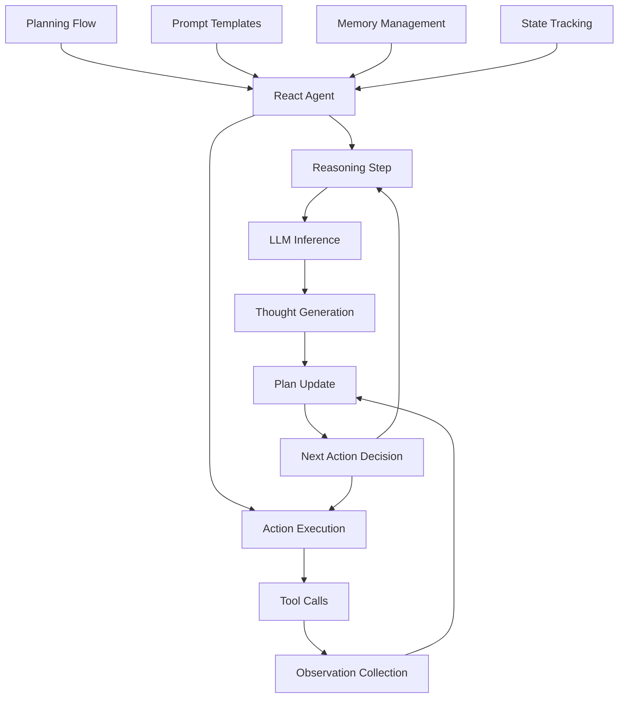
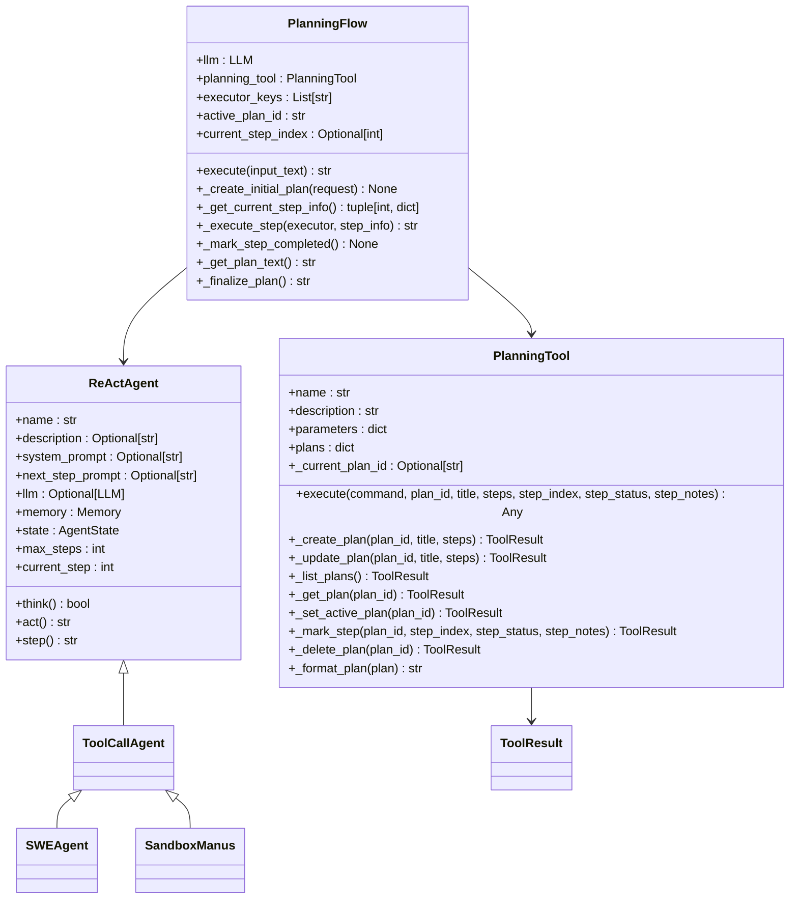
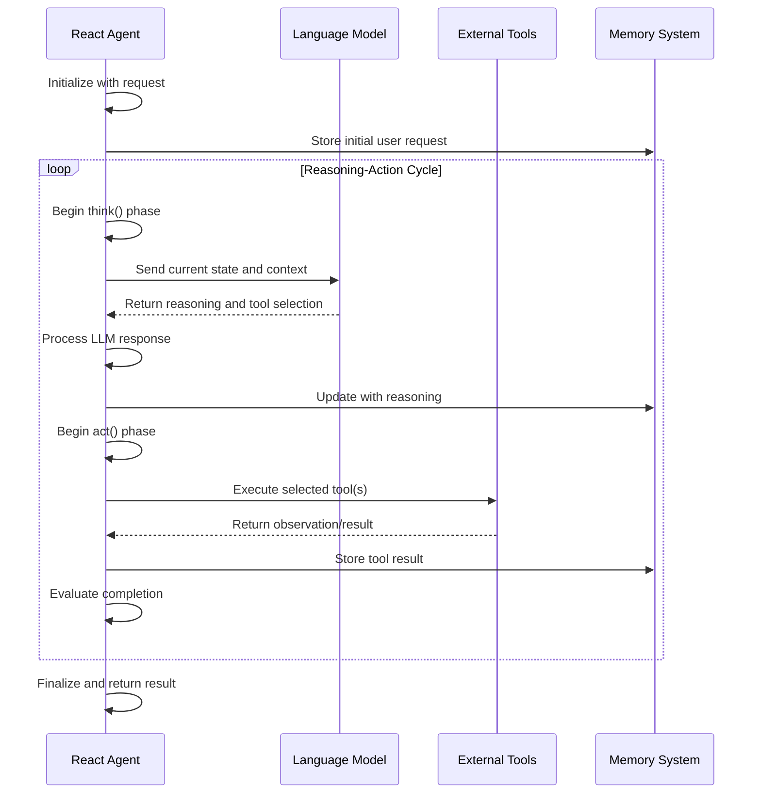
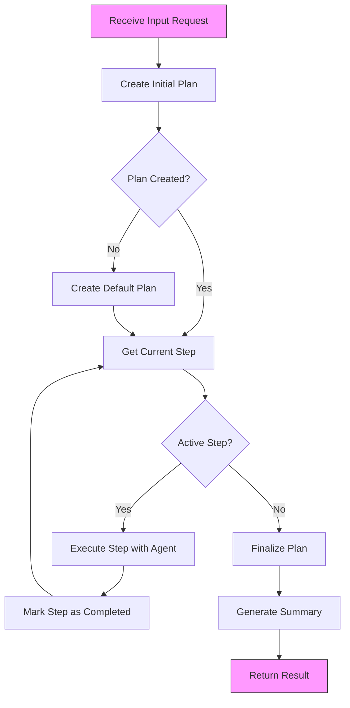
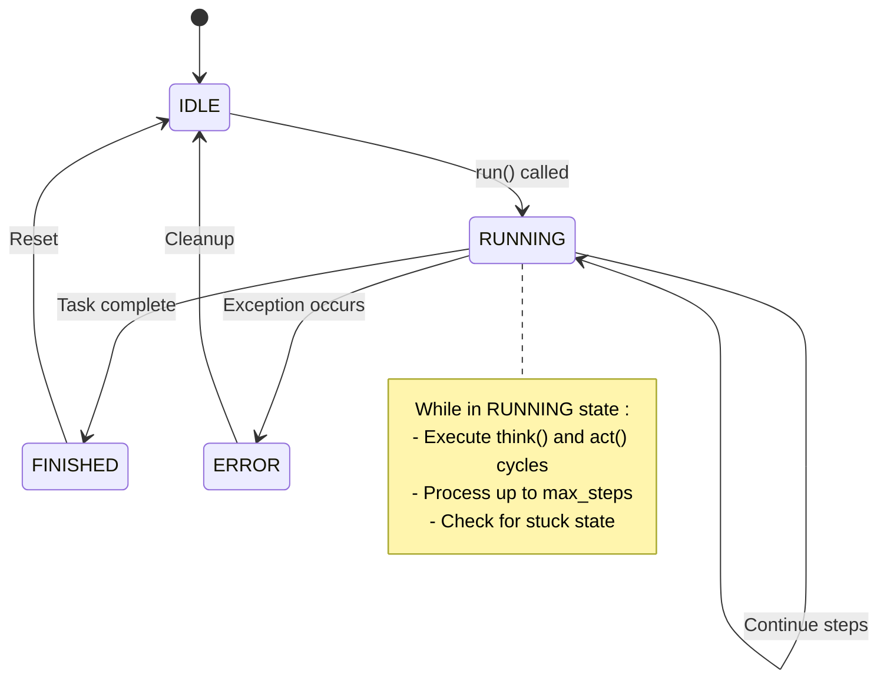
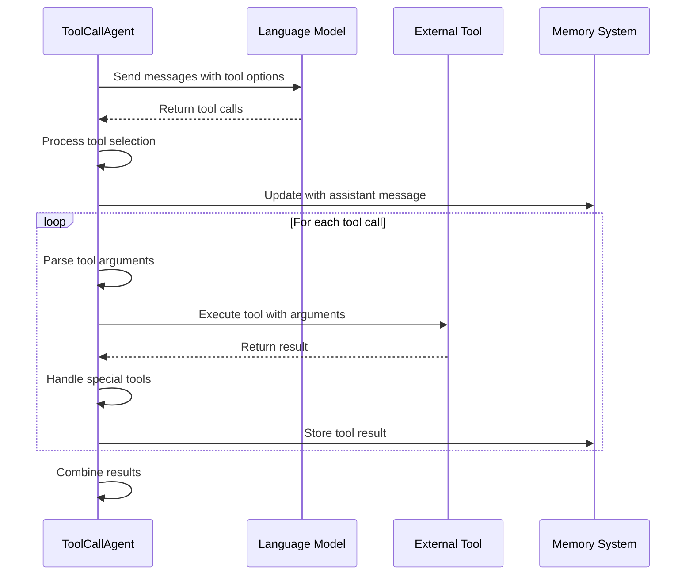
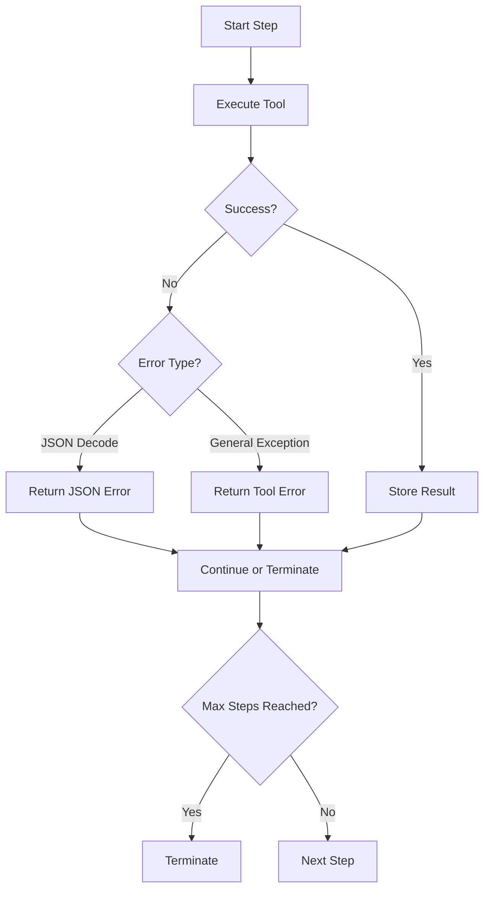
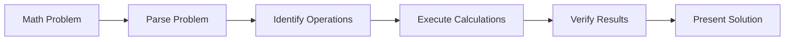
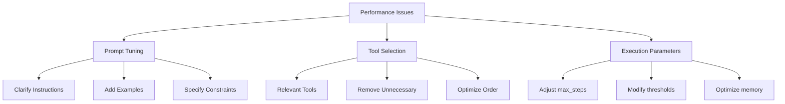

# React Agent

<cite>
**Referenced Files in This Document**   
- [app/agent/react.py](file://app/agent/react.py)
- [app/flow/planning.py](file://app/flow/planning.py)
- [app/prompt/planning.py](file://app/prompt/planning.py)
- [app/tool/planning.py](file://app/tool/planning.py)
- [app/agent/toolcall.py](file://app/agent/toolcall.py)
- [app/agent/base.py](file://app/agent/base.py)
- [app/schema.py](file://app/schema.py)
- [app/llm.py](file://app/llm.py)
</cite>

## Table of Contents
1. [Introduction](#introduction)
2. [Architecture Overview](#architecture-overview)
3. [Core Components](#core-components)
4. [Reasoning and Action Cycle](#reasoning-and-action-cycle)
5. [Planning and Execution Flow](#planning-and-execution-flow)
6. [State Management and Memory](#state-management-and-memory)
7. [Tool Integration and Execution](#tool-integration-and-execution)
8. [Error Handling and Loop Detection](#error-handling-and-loop-detection)
9. [Use Cases and Examples](#use-cases-and-examples)
10. [Performance Optimization](#performance-optimization)
11. [Conclusion](#conclusion)

## Introduction

The React Agent implements the ReAct (Reason + Act) framework for iterative problem solving, enabling step-by-step reasoning and action execution to achieve complex goals. This agent architecture alternates between reasoning steps and tool actions, allowing for systematic problem solving through structured thought-action cycles. The implementation is designed to handle multi-step tasks that require planning, execution, and adaptation based on feedback.

The React Agent is particularly effective for tasks that benefit from explicit reasoning traces, such as solving mathematical problems, navigating websites, conducting multi-step research, or performing complex data analysis. By breaking down problems into manageable steps and maintaining intermediate state, the agent can tackle challenges that would be difficult for direct response generation models.

This documentation provides a comprehensive analysis of the React Agent's architecture, focusing on its implementation in `react.py`, integration with planning flows in `app/flow/planning.py`, and the structured prompt templates defined in `app/prompt/planning.py` that guide the thought-action cycles.

**Section sources**
- [app/agent/react.py](file://app/agent/react.py#L1-L37)
- [app/flow/planning.py](file://app/flow/planning.py#L1-L443)
- [app/prompt/planning.py](file://app/prompt/planning.py#L1-L28)

## Architecture Overview

The React Agent follows a modular architecture that separates concerns between reasoning, action execution, planning, and state management. The core components work together to implement the ReAct framework, where the agent alternates between thinking about the current state and taking actions through tool calls.

**Diagram sources**
- [app/agent/react.py](file://app/agent/react.py#L10-L37)
- [app/flow/planning.py](file://app/flow/planning.py#L44-L441)
- [app/prompt/planning.py](file://app/prompt/planning.py#L1-L28)

The architecture is built on a foundation of several key components:
- The ReActAgent base class that defines the reasoning and action interface
- PlanningFlow for managing task execution and step progression
- Structured prompt templates that guide the agent's thought process
- Tool integration for executing external actions
- Memory and state management for maintaining context across steps

This design enables the agent to handle complex, multi-step tasks by breaking them down into manageable components and maintaining a clear separation between reasoning and action phases.

**Section sources**
- [app/agent/react.py](file://app/agent/react.py#L10-L37)
- [app/flow/planning.py](file://app/flow/planning.py#L44-L441)
- [app/prompt/planning.py](file://app/prompt/planning.py#L1-L28)

## Core Components

The React Agent architecture consists of several core components that work together to implement the ReAct framework. The primary component is the ReActAgent class, which serves as the foundation for the reasoning and action cycle. This abstract base class defines the interface for thinking and acting, with concrete implementations provided by subclasses.

The PlanningFlow component manages the overall execution flow, creating and tracking plans for task completion. It integrates with the PlanningTool to create, update, and monitor the progress of plans. The prompt templates in `app/prompt/planning.py` provide structured guidance for the agent's reasoning process, ensuring consistent and effective thought-action cycles.

**Diagram sources**
- [app/agent/react.py](file://app/agent/react.py#L10-L37)
- [app/flow/planning.py](file://app/flow/planning.py#L44-L441)
- [app/tool/planning.py](file://app/tool/planning.py#L13-L362)

The ReActAgent class provides the fundamental structure for the reasoning-action cycle, while PlanningFlow orchestrates the execution of multi-step tasks. The PlanningTool enables the creation and management of structured plans, allowing the agent to break down complex problems into manageable steps.

**Section sources**
- [app/agent/react.py](file://app/agent/react.py#L10-L37)
- [app/flow/planning.py](file://app/flow/planning.py#L44-L441)
- [app/tool/planning.py](file://app/tool/planning.py#L13-L362)

## Reasoning and Action Cycle

The React Agent implements the ReAct framework through a structured reasoning and action cycle. This cycle alternates between thinking about the current state and taking actions through tool calls. The core of this process is defined in the ReActAgent class, which provides the abstract interface for thinking and acting.

**Diagram sources**
- [app/agent/react.py](file://app/agent/react.py#L25-L37)
- [app/agent/toolcall.py](file://app/agent/toolcall.py#L38-L128)
- [app/agent/toolcall.py](file://app/agent/toolcall.py#L130-L163)

The reasoning phase involves analyzing the current state, including the user request, previous actions, and observations, to determine the next appropriate action. This is implemented in the `think()` method, which uses the language model to generate reasoning and select tools. The action phase, implemented in the `act()` method, executes the selected tools and records the observations.

The cycle continues until the task is completed or a termination condition is met. The agent uses the `step()` method to coordinate the think-act sequence, incrementing the step counter and managing the overall execution flow. This iterative approach allows the agent to adapt to new information and adjust its strategy as needed.

**Section sources**
- [app/agent/react.py](file://app/agent/react.py#L25-L37)
- [app/agent/toolcall.py](file://app/agent/toolcall.py#L38-L163)

## Planning and Execution Flow

The PlanningFlow component manages the overall execution of tasks by creating and tracking structured plans. When a request is received, the PlanningFlow creates an initial plan using the PlanningTool and the language model. This plan is then executed step by step, with each step being processed by an appropriate agent.

**Diagram sources**
- [app/flow/planning.py](file://app/flow/planning.py#L93-L133)
- [app/flow/planning.py](file://app/flow/planning.py#L135-L210)
- [app/flow/planning.py](file://app/flow/planning.py#L212-L274)

The planning process begins with `_create_initial_plan()`, which uses the language model to generate a structured plan based on the user request. If the LLM fails to create a plan, a default plan is created with basic steps. The plan is stored in the PlanningTool and assigned a unique ID.

During execution, `_get_current_step_info()` identifies the next uncompleted step in the plan, marking it as "in_progress". The `_execute_step()` method then delegates the step to an appropriate agent, providing context about the current plan status. After successful execution, `_mark_step_completed()` updates the plan to reflect the completed step.

This structured approach ensures that complex tasks are broken down into manageable steps, with progress tracked systematically. The flow continues until all steps are completed or the agent signals termination.

**Section sources**
- [app/flow/planning.py](file://app/flow/planning.py#L93-L133)
- [app/flow/planning.py](file://app/flow/planning.py#L135-L210)
- [app/flow/planning.py](file://app/flow/planning.py#L212-L274)

## State Management and Memory

The React Agent maintains state and memory throughout the execution process to preserve context and track progress. The BaseAgent class provides the foundation for state management, with the AgentState enum defining possible states (IDLE, RUNNING, FINISHED, ERROR). The agent transitions between these states as it processes requests.

**Diagram sources**
- [app/agent/base.py](file://app/agent/base.py#L12-L195)
- [app/schema.py](file://app/schema.py#L31-L37)

Memory management is handled through the Memory class, which stores a sequence of messages representing the conversation history. Each message includes the role (user, system, assistant, tool), content, and metadata. The memory is updated after each reasoning and action step, preserving the complete context of the agent's thought process and interactions.

The agent also includes mechanisms to detect and handle stuck states, where it may be caught in a loop of repeating the same responses. The `is_stuck()` method checks for duplicate assistant messages, and `handle_stuck_state()` adds a prompt to encourage new strategies when a loop is detected. This helps prevent infinite loops and encourages the agent to explore alternative approaches.

**Section sources**
- [app/agent/base.py](file://app/agent/base.py#L12-L195)
- [app/schema.py](file://app/schema.py#L31-L37)
- [app/schema.py](file://app/schema.py#L158-L186)

## Tool Integration and Execution

The React Agent integrates with external tools through the ToolCallAgent class, which extends the ReActAgent to handle tool execution. Tools are defined as functions that the agent can call to perform specific actions, such as executing code, browsing the web, or searching information.

**Diagram sources**
- [app/agent/toolcall.py](file://app/agent/toolcall.py#L17-L249)
- [app/tool/planning.py](file://app/tool/planning.py#L13-L362)

The tool execution process begins in the `think()` method, where the agent queries the language model with available tools. The LLM response may include tool calls, which are processed and stored. In the `act()` method, each tool call is executed sequentially, with results recorded in memory.

Special tools like Terminate can change the agent's state to FINISHED, signaling task completion. The agent also handles errors during tool execution, providing appropriate error messages and continuing execution when possible. This robust error handling ensures that tool failures don't necessarily terminate the entire task.

**Section sources**
- [app/agent/toolcall.py](file://app/agent/toolcall.py#L17-L249)
- [app/tool/planning.py](file://app/tool/planning.py#L13-L362)

## Error Handling and Loop Detection

The React Agent includes comprehensive error handling and loop detection mechanisms to ensure robust execution. The architecture is designed to handle various failure modes and prevent infinite loops that could occur during the reasoning-action cycle.

When exceptions occur during tool execution, the agent catches them and returns appropriate error messages rather than crashing. This allows the agent to continue processing or gracefully terminate when necessary. The `execute_tool()` method includes specific error handling for JSON parsing errors and general exceptions, providing informative error messages.

**Diagram sources**
- [app/agent/toolcall.py](file://app/agent/toolcall.py#L165-L207)
- [app/agent/base.py](file://app/agent/base.py#L169-L185)

The agent also includes a sophisticated loop detection system. The `is_stuck()` method checks for duplicate assistant messages in the conversation history, indicating that the agent may be repeating the same reasoning pattern. When a loop is detected, `handle_stuck_state()` modifies the next step prompt to encourage new strategies and break the cycle.

Additionally, the agent enforces a maximum step limit (`max_steps`) to prevent infinite execution. If this limit is reached, the agent terminates and returns a message indicating that the maximum number of steps was reached. These safeguards ensure that the agent makes progress toward its goal or terminates gracefully when unable to do so.

**Section sources**
- [app/agent/toolcall.py](file://app/agent/toolcall.py#L165-L207)
- [app/agent/base.py](file://app/agent/base.py#L169-L185)

## Use Cases and Examples

The React Agent is particularly effective for complex tasks that benefit from explicit reasoning and step-by-step execution. Several use cases demonstrate the agent's capabilities in solving problems that require planning, tool usage, and iterative refinement.

For mathematical problem solving, the agent can break down complex equations into manageable steps, using reasoning to determine the appropriate mathematical operations and tools to apply. It can show its work step by step, making the solution process transparent and verifiable.

When navigating websites, the agent can use browser tools to interact with web pages, following a plan to find specific information or complete tasks like form filling. The planning system ensures that the agent maintains context across multiple page interactions.

For multi-step research tasks, the agent can create a research plan, execute searches using appropriate tools, analyze the results, and synthesize findings into a coherent report. This approach outperforms direct response generation by ensuring comprehensive coverage of the research topic.

The step-by-step reasoning approach is superior to direct response generation for tasks that require:
- Complex planning and coordination
- Multiple tool interactions
- Verification of intermediate results
- Adaptation based on feedback
- Transparent reasoning processes

**Section sources**
- [app/agent/react.py](file://app/agent/react.py#L10-L37)
- [app/flow/planning.py](file://app/flow/planning.py#L44-L441)
- [app/agent/toolcall.py](file://app/agent/toolcall.py#L17-L249)

## Performance Optimization

Optimizing the React Agent's performance involves several strategies related to prompt engineering, tool selection, and execution parameters. The structured prompt templates in `app/prompt/planning.py` play a crucial role in guiding effective reasoning and action selection.

The PLANNING_SYSTEM_PROMPT provides clear instructions for the agent's role and responsibilities, emphasizing the need for structured plans and efficient progress. The NEXT_STEP_PROMPT guides the agent in deciding its next action, encouraging concise reasoning and appropriate tool selection.

**Diagram sources**
- [app/prompt/planning.py](file://app/prompt/planning.py#L1-L28)
- [app/agent/base.py](file://app/agent/base.py#L12-L195)

Effective tool selection is critical for performance. Including only relevant tools reduces the complexity of the decision space for the language model, leading to more reliable tool selection. The agent's `available_tools` collection should be tailored to the specific task domain.

Execution parameters like `max_steps` and `duplicate_threshold` can be adjusted based on task complexity. For simpler tasks, a lower maximum step count may be appropriate, while complex tasks may require more steps. The duplicate threshold controls sensitivity to repetitive patterns, balancing the need to avoid loops with the risk of premature strategy changes.

**Section sources**
- [app/prompt/planning.py](file://app/prompt/planning.py#L1-L28)
- [app/agent/base.py](file://app/agent/base.py#L12-L195)

## Conclusion

The React Agent implements a robust ReAct (Reason + Act) framework for iterative problem solving, providing a structured approach to complex task execution. By alternating between reasoning steps and tool actions, the agent can tackle challenges that require planning, adaptation, and multiple interactions with external systems.

The architecture combines several key components: the ReActAgent base class for the reasoning-action cycle, PlanningFlow for task orchestration, structured prompt templates for guidance, and comprehensive tool integration for action execution. This modular design enables the agent to handle diverse tasks while maintaining clear separation of concerns.

The agent's effectiveness stems from its ability to break down complex problems into manageable steps, maintain intermediate state, and adapt based on feedback. This step-by-step reasoning approach outperforms direct response generation for tasks requiring planning, verification, and multiple tool interactions.

Future improvements could focus on enhancing the planning system with more sophisticated goal decomposition, expanding the tool ecosystem for broader capabilities, and refining the prompt templates for more reliable reasoning. The current implementation provides a solid foundation for building intelligent agents capable of solving complex, real-world problems.

**Section sources**
- [app/agent/react.py](file://app/agent/react.py#L1-L37)
- [app/flow/planning.py](file://app/flow/planning.py#L1-L443)
- [app/prompt/planning.py](file://app/prompt/planning.py#L1-L28)