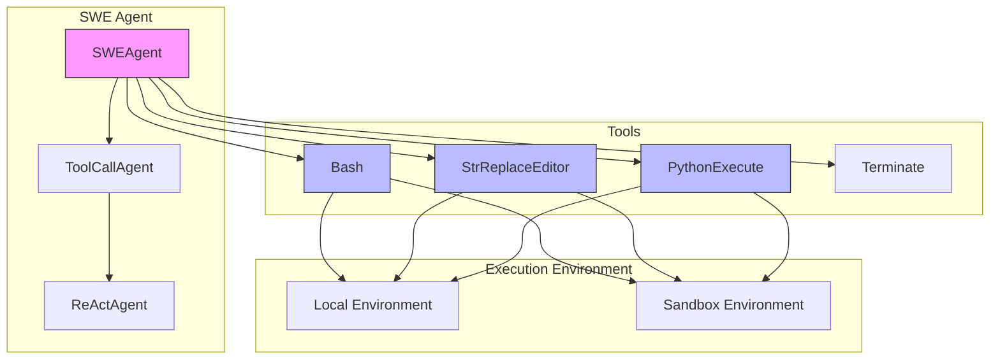
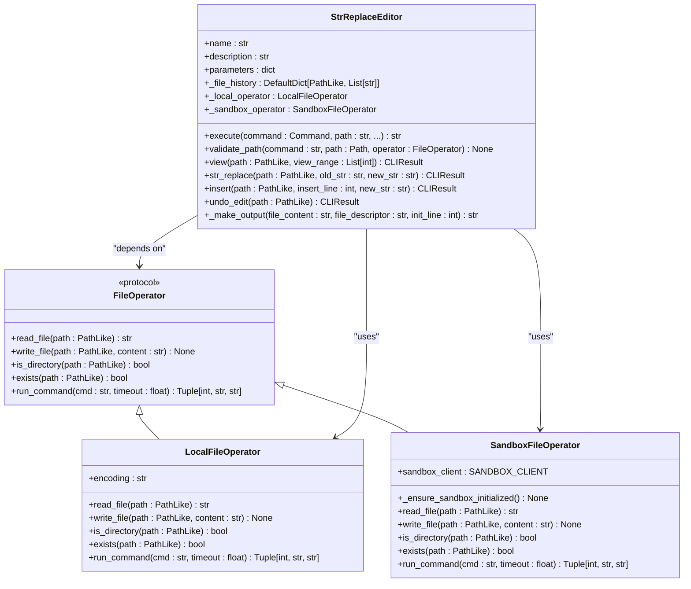
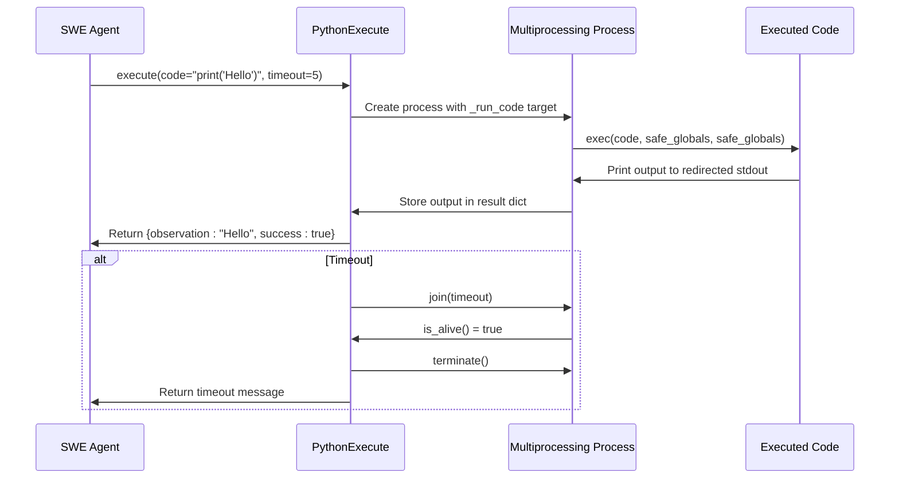

# SWE Agent

<cite>
**Referenced Files in This Document**   
- [swe.py](file://app/agent/swe.py)
- [file_operators.py](file://app/tool/file_operators.py)
- [python_execute.py](file://app/tool/python_execute.py)
- [swe.py](file://app/prompt/swe.py)
- [str_replace_editor.py](file://app/tool/str_replace_editor.py)
- [bash.py](file://app/tool/bash.py)
</cite>

## Table of Contents
1. [Introduction](#introduction)
2. [Core Components](#core-components)
3. [Architecture Overview](#architecture-overview)
4. [Detailed Component Analysis](#detailed-component-analysis)
5. [Prompt Strategy and Reasoning Flow](#prompt-strategy-and-reasoning-flow)
6. [Execution and Testing Workflow](#execution-and-testing-workflow)
7. [Error Handling and Security](#error-handling-and-security)
8. [Integration with Version Control](#integration-with-version-control)
9. [Best Practices and Configuration](#best-practices-and-configuration)
10. [Conclusion](#conclusion)

## Introduction

The SWE (Software Engineering) Agent is an autonomous AI programmer designed to solve software development tasks by directly interacting with the computer environment. It operates through a structured workflow that combines natural language reasoning with precise file operations and secure code execution. The agent is implemented in `swe.py` and leverages specialized tools for file manipulation, code execution, and system interaction. It supports step-by-step reasoning, code generation, refactoring, debugging, and testing within a secure sandbox environment. This document provides a comprehensive analysis of its implementation, focusing on its use of file operations, secure Python execution, prompt engineering, and integration with development workflows.

## Core Components

The SWE Agent is built on a modular architecture that separates concerns between agent logic, tool execution, file operations, and security. Its core functionality is distributed across several key components that enable it to perform complex software engineering tasks autonomously. The agent inherits from `ToolCallAgent`, which provides the foundation for handling tool/function calls and managing state across multiple steps. It utilizes specialized tools for file editing, shell commands, and code execution, all operating within a configurable execution environment that can run locally or in a sandbox.

**Section sources**
- [swe.py](file://app/agent/swe.py#L9-L23)
- [toolcall.py](file://app/agent/toolcall.py#L17-L249)

## Architecture Overview

The SWE Agent follows a layered architecture that separates the agent logic from the underlying tool implementations and execution environment. At the highest level, the agent receives a task and uses its reasoning capabilities to determine the sequence of actions needed to complete it. These actions are translated into tool calls that interact with the file system, execute code, or perform other operations. The architecture is designed to be extensible, allowing new tools to be added while maintaining a consistent interface for tool execution and result handling.

**Diagram sources**
- [swe.py](file://app/agent/swe.py#L9-L23)
- [toolcall.py](file://app/agent/toolcall.py#L17-L249)
- [bash.py](file://app/tool/bash.py#L40-L158)
- [str_replace_editor.py](file://app/tool/str_replace_editor.py#L105-L111)
- [python_execute.py](file://app/tool/python_execute.py#L8-L74)

## Detailed Component Analysis

### SWE Agent Implementation

The SWE Agent is implemented as a class that inherits from `ToolCallAgent`, which itself extends `ReActAgent`. This inheritance chain provides the agent with the ability to reason about tasks and take actions through tool calls. The agent is configured with a specific system prompt that defines its behavior and constraints. It has access to a collection of tools that enable it to read and write files, execute shell commands, and terminate its execution. The agent is designed to operate within a limited number of steps (20 by default) to prevent infinite loops and ensure task completion within reasonable timeframes.

**Section sources**
- [swe.py](file://app/agent/swe.py#L9-L23)

### File Operations System

The file operations system is implemented through a protocol-based architecture that allows the agent to work in both local and sandboxed environments. The `FileOperator` protocol defines the interface for file operations, including reading, writing, checking existence, and running commands. Two concrete implementations are provided: `LocalFileOperator` for operations on the host filesystem, and `SandboxFileOperator` for operations within an isolated environment. The `StrReplaceEditor` tool uses this system to provide a rich interface for viewing, creating, and editing files with features like line-range viewing, string replacement, and edit history with undo functionality.

**Diagram sources**
- [file_operators.py](file://app/tool/file_operators.py#L15-L157)
- [str_replace_editor.py](file://app/tool/str_replace_editor.py#L105-L111)

### Secure Python Execution

The Python execution system is implemented in `python_execute.py` as a tool that allows the agent to run Python code in a secure and controlled manner. The `PythonExecute` class uses Python's multiprocessing module to run code in a separate process with a configurable timeout. This prevents infinite loops and ensures that code execution does not block the agent indefinitely. The execution environment is sandboxed by redirecting stdout to capture output, and using a restricted global namespace to limit access to potentially dangerous built-in functions. The tool only captures printed output, not return values, encouraging the use of print statements for debugging and result reporting.

**Diagram sources**
- [python_execute.py](file://app/tool/python_execute.py#L8-L74)

## Prompt Strategy and Reasoning Flow

The SWE Agent's behavior is guided by a carefully crafted system prompt defined in `app/prompt/swe.py`. This prompt establishes the agent's role as an autonomous programmer working in a command-line interface with a file editor. It emphasizes the importance of proper indentation in code, as the agent must generate code with exact whitespace to ensure correct syntax. The prompt enforces a strict response format where the agent must include exactly one tool call per response, preventing it from issuing multiple commands simultaneously. This step-by-step approach enables careful reasoning and allows the system to validate each action before proceeding.

The prompt also provides specific instructions about the environment, noting that interactive sessions (like Python REPL or Vim) are not supported. This prevents the agent from attempting to start interactive processes that would block further execution. The agent is trained to think through its next steps before making a tool call, with all discussion preserved for future reference. This creates a transparent audit trail of the agent's reasoning process, making it easier to understand and debug its behavior.

**Section sources**
- [swe.py](file://app/agent/swe.py#L15-L15)
- [swe.py](file://app/prompt/swe.py#L1-L22)

## Execution and Testing Workflow

The SWE Agent follows a structured workflow when performing software development tasks. When presented with a request, it begins by analyzing the task and determining the necessary steps to complete it. The agent typically starts by exploring the codebase using the `view` command to understand the existing structure and identify relevant files. Once it has a plan, it uses the `str_replace` or `insert` commands to modify code, carefully specifying the exact text to replace and the new content to insert.

For code generation tasks, the agent creates new files using the `create` command with the complete file content. After making changes, it can execute Python code using the `python_execute` tool to test functionality or run unit tests. The agent can also use the `bash` tool to run shell commands, such as executing scripts, running tests, or checking version control status. If compilation or runtime errors occur, the agent analyzes the error messages and makes additional modifications to fix the issues.

The agent's workflow is designed to be iterative, with each step building on the results of previous actions. It can use the `undo_edit` command to revert changes if needed, maintaining a history of edits for each file. This allows for safe experimentation and correction of mistakes. The agent continues this cycle of reasoning, modification, and testing until the task is complete or the maximum number of steps is reached.

**Section sources**
- [swe.py](file://app/agent/swe.py#L18-L20)
- [str_replace_editor.py](file://app/tool/str_replace_editor.py#L113-L163)
- [python_execute.py](file://app/tool/python_execute.py#L38-L74)
- [bash.py](file://app/tool/bash.py#L40-L158)

## Error Handling and Security

The SWE Agent incorporates multiple layers of error handling and security measures to ensure reliable and safe operation. At the tool level, each operation includes comprehensive exception handling that converts Python exceptions into structured error messages. For file operations, the agent validates paths to ensure they are absolute and checks file existence before attempting to read or modify them. The `str_replace` command includes safeguards to prevent ambiguous replacements by requiring the `old_str` parameter to match exactly one occurrence in the file.

Security is a primary concern, particularly when executing untrusted code. The `PythonExecute` tool runs code in a separate process with a strict timeout, preventing infinite loops and resource exhaustion. The execution environment is restricted by using a controlled global namespace that limits access to potentially dangerous built-in functions. Code runs with redirected stdout, capturing output without allowing direct interaction with the terminal.

The sandbox environment provides an additional layer of security by isolating file operations and command execution from the host system. When configured to use the sandbox, all file reads, writes, and shell commands are executed within an isolated container. This prevents the agent from accidentally or maliciously modifying critical system files or accessing sensitive data. The sandbox is initialized on-demand and persists for the duration of the agent's execution, providing a consistent environment for multi-step tasks.

**Section sources**
- [file_operators.py](file://app/tool/file_operators.py#L95-L157)
- [python_execute.py](file://app/tool/python_execute.py#L24-L36)
- [str_replace_editor.py](file://app/tool/str_replace_editor.py#L165-L193)

## Integration with Version Control

While the provided code does not explicitly show version control integration, the SWE Agent's architecture supports such integration through its tool system. The `bash` tool can execute Git commands, allowing the agent to commit changes, create branches, or check the status of the repository. A production implementation would likely include specialized tools for common version control operations, enabling the agent to work within established development workflows.

The agent's step-by-step approach and edit history are naturally compatible with version control practices. Each code modification can be accompanied by a descriptive commit message, creating a clear audit trail of changes. The agent could be configured to create feature branches for new development, run tests before committing, and follow team-specific branching strategies. This integration would allow the agent to participate in code review processes, where its proposed changes could be examined by human developers before being merged.

The use of absolute paths in file operations ensures that the agent works within the correct repository context, preventing accidental modifications to files outside the project directory. Combined with the sandbox environment, this provides a safe way to experiment with changes before applying them to the main codebase.

**Section sources**
- [bash.py](file://app/tool/bash.py#L40-L158)
- [str_replace_editor.py](file://app/tool/str_replace_editor.py#L105-L111)

## Best Practices and Configuration

Configuring the SWE Agent for optimal performance requires careful consideration of several factors. The agent should be configured to use the sandbox environment by default, especially when working with untrusted code or in production systems. This provides isolation and prevents unintended side effects on the host system. The timeout settings for code execution should be adjusted based on the expected complexity of tasks, with longer timeouts for computationally intensive operations.

For different programming languages, the agent can be extended with language-specific tools that provide syntax-aware editing, linting, and testing capabilities. While the current implementation focuses on Python, the architecture supports adding tools for other languages by implementing similar execution and analysis capabilities. Project-specific configuration can include custom prompts, predefined file templates, and project-specific tool integrations.

When implementing new features from specifications, the agent should follow a test-driven development approach, first writing unit tests that define the expected behavior, then implementing the code to pass those tests. For bug fixing, the agent should first reproduce the issue, then analyze the error messages and stack traces to identify the root cause before making targeted fixes.

Monitoring and logging are essential for understanding the agent's behavior and diagnosing issues. The comprehensive logging system captures tool usage, execution results, and error messages, providing valuable insights into the agent's decision-making process. These logs can be used to improve the agent's performance over time by identifying common failure patterns and refining its strategies.

**Section sources**
- [swe.py](file://app/agent/swe.py#L23-L23)
- [config.py](file://app/config.py)
- [python_execute.py](file://app/tool/python_execute.py#L38-L74)

## Conclusion

The SWE Agent represents a sophisticated approach to autonomous software development, combining advanced reasoning capabilities with precise code manipulation and secure execution. Its modular architecture, built on a foundation of tool abstraction and protocol-based interfaces, enables flexible and extensible functionality. The agent's strict adherence to step-by-step reasoning, combined with its comprehensive error handling and security measures, makes it a reliable tool for a wide range of programming tasks.

By leveraging the file operations system and secure Python execution, the agent can perform complex software engineering activities while maintaining safety and reliability. Its design principles—clear separation of concerns, comprehensive error handling, and secure execution—provide a strong foundation for building autonomous programming systems. As AI-assisted development continues to evolve, the SWE Agent's architecture offers a blueprint for creating intelligent tools that can collaborate effectively with human developers to improve productivity and code quality.