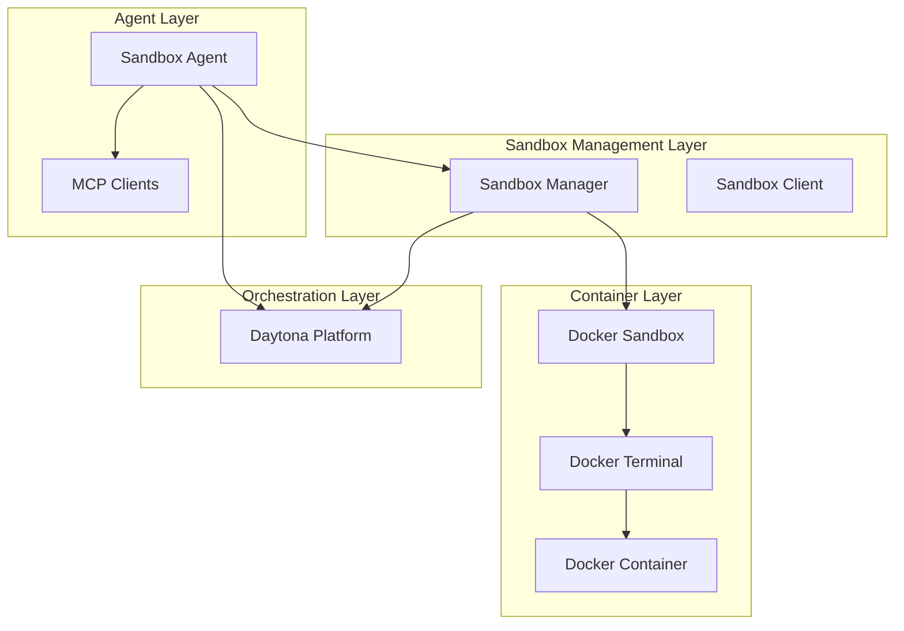
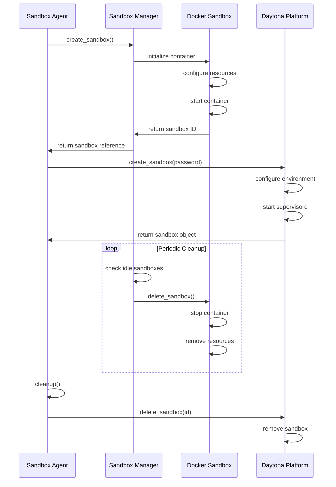
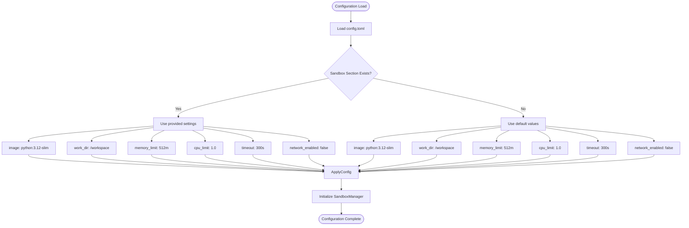
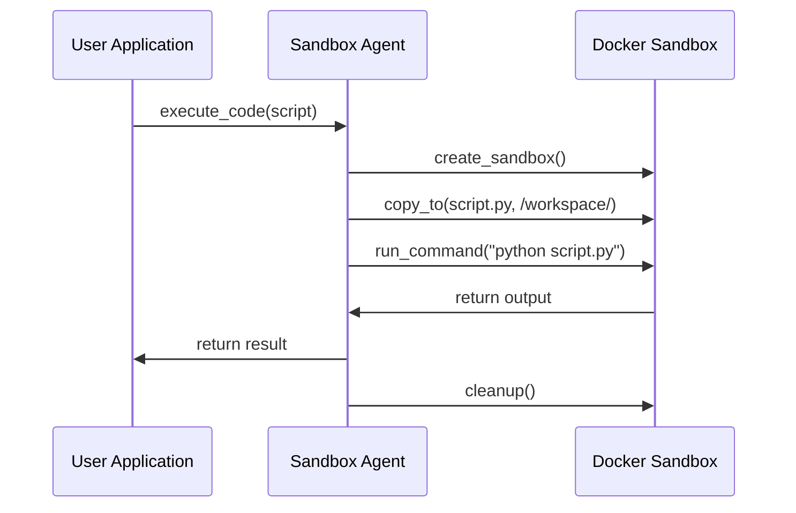
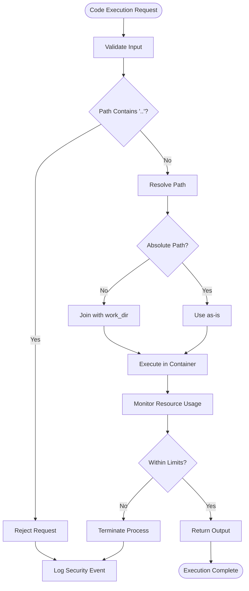
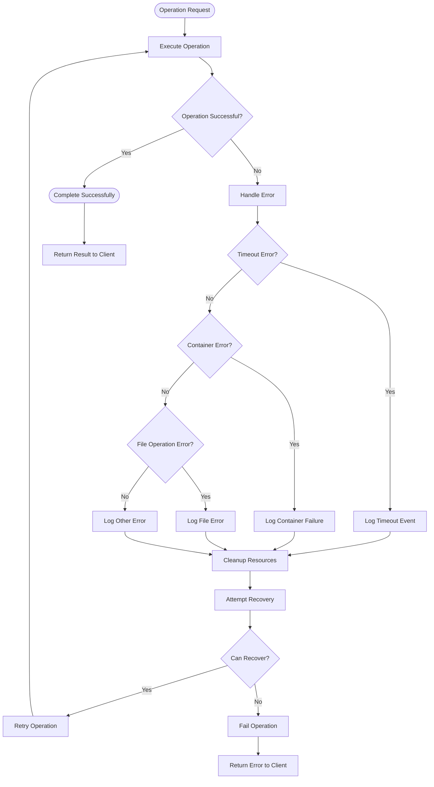

# Sandbox Agent

<cite>
**Referenced Files in This Document**   
- [sandbox_agent.py](file://app/agent/sandbox_agent.py)
- [sandbox.py](file://app/sandbox/core/sandbox.py)
- [manager.py](file://app/sandbox/core/manager.py)
- [client.py](file://app/sandbox/client.py)
- [sandbox.py](file://app/daytona/sandbox.py)
- [config.py](file://app/config.py)
</cite>

## Table of Contents
1. [Introduction](#introduction)
2. [Architecture Overview](#architecture-overview)
3. [Core Components](#core-components)
4. [Sandbox Lifecycle Management](#sandbox-lifecycle-management)
5. [Configuration Options](#configuration-options)
6. [Execution Examples](#execution-examples)
7. [Security Considerations](#security-considerations)
8. [Error Handling and Performance](#error-handling-and-performance)
9. [Best Practices](#best-practices)

## Introduction

The Sandbox Agent is a secure execution environment designed for running potentially unsafe operations within isolated containers. It leverages Docker-based sandboxing to provide a controlled environment for executing untrusted code, shell commands, and external scripts. The agent integrates with Daytona for workspace and session management, enabling persistent sandbox environments with VNC access and web previews. This documentation details the implementation, configuration, and usage patterns for the Sandbox Agent, focusing on secure execution practices and production deployment considerations.

## Architecture Overview

The Sandbox Agent architecture consists of multiple interconnected components that work together to provide secure, isolated execution environments. The system follows a layered approach with clear separation between the agent interface, sandbox management, and container execution layers.

**Diagram sources**
- [sandbox_agent.py](file://app/agent/sandbox_agent.py#L1-L223)
- [sandbox.py](file://app/sandbox/core/sandbox.py#L17-L461)
- [manager.py](file://app/sandbox/core/manager.py#L15-L313)
- [client.py](file://app/sandbox/client.py#L1-L201)
- [sandbox.py](file://app/daytona/sandbox.py#L1-L165)

## Core Components

The Sandbox Agent system comprises several core components that work together to provide secure execution capabilities. The main components include the Sandbox Agent itself, the DockerSandbox implementation, the SandboxManager for resource management, and the Daytona integration for cloud-based sandboxing.

The Sandbox Agent (SandboxManus) serves as the primary interface for executing operations within the sandbox environment. It manages tool integration, MCP server connections, and sandbox lifecycle operations. The DockerSandbox class provides the underlying container execution environment with resource limits and file operations. The SandboxManager handles multiple sandbox instances, enforcing limits on concurrent sandboxes and automatically cleaning up idle environments.

**Section sources**
- [sandbox_agent.py](file://app/agent/sandbox_agent.py#L1-L223)
- [sandbox.py](file://app/sandbox/core/sandbox.py#L17-L461)
- [manager.py](file://app/sandbox/core/manager.py#L15-L313)

## Sandbox Lifecycle Management

The Sandbox Agent provides comprehensive lifecycle management for sandbox environments, from creation to cleanup. The lifecycle is managed through a combination of local Docker-based sandboxes and cloud-based Daytona sandboxes, with automatic resource cleanup and idle timeout handling.

**Diagram sources**
- [sandbox.py](file://app/sandbox/core/sandbox.py#L48-L102)
- [manager.py](file://app/sandbox/core/manager.py#L113-L156)
- [sandbox.py](file://app/daytona/sandbox.py#L101-L146)
- [sandbox_agent.py](file://app/agent/sandbox_agent.py#L176-L185)

## Configuration Options

The Sandbox Agent supports extensive configuration options for resource limits, network access, and container lifecycle management. These configurations are defined in the SandboxSettings class and can be customized through the application configuration system.

**Diagram sources**
- [config.py](file://app/config.py#L93-L104)
- [sandbox.py](file://app/sandbox/core/sandbox.py#L31-L46)
- [manager.py](file://app/sandbox/core/manager.py#L15-L313)

**Section sources**
- [config.py](file://app/config.py#L93-L104)

## Execution Examples

The Sandbox Agent supports various execution patterns for running untrusted code, shell commands, and external scripts in isolated environments. These examples demonstrate common usage scenarios and integration patterns.

### Running Python Code
The Sandbox Agent can execute Python code in isolated environments, providing a safe way to evaluate untrusted scripts. The agent uses the SandboxShellTool to execute Python commands within the container.

### Executing Shell Commands
Shell commands can be executed through the sandbox environment using the run_command method. This allows for safe execution of system commands with resource limits and network restrictions.

### Processing External Scripts
External scripts can be securely processed by copying them into the sandbox environment, executing them, and retrieving the results. The copy_to and copy_from methods facilitate file transfer between the host and container.

**Diagram sources**
- [sandbox.py](file://app/sandbox/core/sandbox.py#L139-L163)
- [sandbox.py](file://app/sandbox/core/sandbox.py#L314-L374)
- [sandbox.py](file://app/sandbox/core/sandbox.py#L254-L312)

## Security Considerations

The Sandbox Agent implements multiple security measures to ensure safe execution of untrusted code. These include container isolation, resource limits, network restrictions, and path traversal prevention.

### Container Isolation
Each sandbox runs in a separate Docker container with its own filesystem and network stack. The containers are configured with limited resources and restricted capabilities to prevent resource exhaustion attacks.

### Resource Limits
The agent enforces strict resource limits on memory, CPU, and execution time. These limits prevent denial-of-service attacks and ensure fair resource allocation across multiple sandboxes.

### Network Restrictions
By default, sandbox environments are created with network access disabled (network_mode="none"). This prevents executed code from making external network connections unless explicitly enabled.

### Path Traversal Prevention
The _safe_resolve_path method validates all file paths to prevent directory traversal attacks. It checks for ".." patterns in paths and ensures that all file operations are confined to the designated working directory.

**Diagram sources**
- [sandbox.py](file://app/sandbox/core/sandbox.py#L231-L252)
- [sandbox.py](file://app/sandbox/core/sandbox.py#L48-L102)
- [sandbox.py](file://app/sandbox/core/sandbox.py#L104-L120)

## Error Handling and Performance

The Sandbox Agent includes comprehensive error handling and performance monitoring capabilities to ensure reliable operation and graceful failure recovery.

### Error Handling
The agent implements structured error handling for various failure scenarios, including container creation failures, command execution timeouts, and file operation errors. All errors are logged with appropriate context to facilitate debugging and monitoring.

### Performance Overhead
While containerization introduces some performance overhead, the agent is optimized for efficient execution. The use of asynchronous operations and connection pooling minimizes latency, and resource limits prevent any single sandbox from impacting overall system performance.

### Container Failure Recovery
The agent includes automatic recovery mechanisms for container failures. When a container fails, the agent logs the error, cleans up resources, and can optionally create a new sandbox for retry operations.

**Diagram sources**
- [sandbox.py](file://app/sandbox/core/sandbox.py#L139-L163)
- [sandbox.py](file://app/sandbox/core/sandbox.py#L424-L453)
- [sandbox_agent.py](file://app/agent/sandbox_agent.py#L187-L195)

## Best Practices

When deploying the Sandbox Agent in production environments, several best practices should be followed to ensure security, reliability, and performance.

### Production Deployment
Deploy the Sandbox Agent in a dedicated environment with proper resource allocation. Use container orchestration platforms like Kubernetes for scaling and high availability. Implement monitoring and alerting for sandbox creation, resource usage, and error rates.

### CI/CD Integration
Integrate the Sandbox Agent with CI/CD pipelines to provide secure code evaluation and testing environments. Use the agent to execute automated tests, perform code analysis, and validate deployments in isolated environments.

### Resource Management
Configure appropriate resource limits based on workload requirements. Monitor sandbox usage patterns and adjust limits accordingly. Implement quotas to prevent individual users or applications from consuming excessive resources.

### Security Hardening
Regularly update the base Docker images to include security patches. Implement network policies to restrict container communication. Use read-only filesystems when possible and minimize the attack surface by removing unnecessary tools and libraries.

### Monitoring and Logging
Enable comprehensive logging for all sandbox operations. Monitor for suspicious activities such as repeated failed executions or attempts to access restricted resources. Implement audit trails for compliance and security investigations.

**Section sources**
- [config.py](file://app/config.py#L93-L104)
- [sandbox.py](file://app/sandbox/core/sandbox.py#L17-L461)
- [manager.py](file://app/sandbox/core/manager.py#L15-L313)