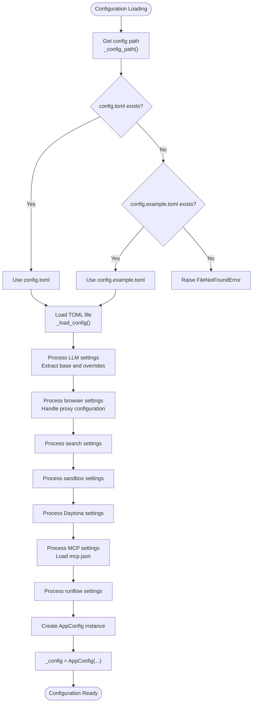

# Configuration

<cite>
**Referenced Files in This Document**   
- [app/config.py](file://app/config.py)
- [config/config.example.toml](file://config/config.example.toml)
- [config/config.example-model-anthropic.toml](file://config/config.example-model-anthropic.toml)
- [config/config.example-model-azure.toml](file://config/config.example-model-azure.toml)
- [config/config.example-model-ollama.toml](file://config/config.example-model-ollama.toml)
- [config/config.example-model-google.toml](file://config/config.example-model-google.toml)
- [config/config.example-model-ppio.toml](file://config/config.example-model-ppio.toml)
- [config/config.example-daytona.toml](file://config/config.example-daytona.toml)
- [config/mcp.example.json](file://config/mcp.example.json)
</cite>

## Table of Contents
1. [Introduction](#introduction)
2. [Configuration System Overview](#configuration-system-overview)
3. [TOML Configuration Structure](#toml-configuration-structure)
4. [LLM Configuration](#llm-configuration)
5. [MCP Server Configuration](#mcp-server-configuration)
6. [Sandbox and Daytona Settings](#sandbox-and-daytona-settings)
7. [Pydantic Configuration Models](#pydantic-configuration-models)
8. [Configuration Loading Process](#configuration-loading-process)
9. [Practical Configuration Examples](#practical-configuration-examples)
10. [Common Configuration Issues](#common-configuration-issues)

## Introduction
OpenManus provides a flexible and comprehensive configuration system based on TOML files that allows users to customize various aspects of the application including LLM settings, sandbox environments, MCP servers, and workflow behaviors. The configuration system is designed to be both user-friendly for basic setups and highly extensible for advanced use cases. This document details the complete configuration framework, explaining how to set up different LLM providers, configure MCP servers, manage sandbox environments, and properly structure configuration files for optimal performance.

## Configuration System Overview
The OpenManus configuration system uses a hierarchical approach with TOML files as the primary configuration format. The system follows a specific loading order and validation process to ensure configuration integrity. At its core, the configuration is managed by a singleton `Config` class in `app/config.py` that handles loading, parsing, and providing access to configuration data throughout the application.

The configuration system supports multiple configuration files for different scenarios:
- `config.toml`: Primary configuration file (takes precedence)
- `config.example.toml`: Default template with comprehensive examples
- Provider-specific examples: Configuration templates for different LLM providers
- `mcp.json`: Separate JSON file for MCP server definitions

The system implements a fallback mechanism where if `config.toml` doesn't exist, it will automatically use `config.example.toml` as the configuration source, making it easy for new users to get started without creating configuration files from scratch.

**Section sources**
- [app/config.py](file://app/config.py#L196-L368)
- [config/config.example.toml](file://config/config.example.toml#L1-L106)

## TOML Configuration Structure
The OpenManus configuration uses TOML (Tom's Obvious, Minimal Language) format, which provides a clean and readable structure for configuration data. The main configuration file contains several top-level sections that define different aspects of the application's behavior.

### Core Configuration Sections
The primary configuration file includes the following sections:

**[llm]**: Global LLM settings that apply to all language model operations
```toml
[llm]
model = "claude-3-7-sonnet-20250219"
base_url = "https://api.anthropic.com/v1/"
api_key = "YOUR_API_KEY"
max_tokens = 8192
temperature = 0.0
```

**[llm.vision]**: Optional vision-specific model configuration
```toml
[llm.vision]
model = "claude-3-7-sonnet-20250219"
base_url = "https://api.anthropic.com/v1/"
api_key = "YOUR_API_KEY"
max_tokens = 8192
temperature = 0.0
```

**[mcp]**: Model Context Protocol server configuration
```toml
[mcp]
server_reference = "app.mcp.server"
```

**[runflow]**: Workflow execution settings
```toml
[runflow]
use_data_analysis_agent = false
```

**[browser]**: Browser automation settings (optional)
```toml
[browser]
headless = false
disable_security = true
```

**[search]**: Search engine configuration (optional)
```toml
[search]
engine = "Google"
fallback_engines = ["DuckDuckGo", "Baidu", "Bing"]
retry_delay = 60
max_retries = 3
lang = "en"
country = "us"
```

**[sandbox]**: Execution sandbox settings (optional)
```toml
[sandbox]
use_sandbox = false
image = "python:3.12-slim"
work_dir = "/workspace"
memory_limit = "1g"
cpu_limit = 2.0
timeout = 300
network_enabled = true
```

**[daytona]**: Daytona workspace configuration
```toml
[daytona]
daytona_api_key = ""
daytona_server_url = "https://app.daytona.io/api"
daytona_target = "us"
sandbox_image_name = "whitezxj/sandbox:0.1.0"
sandbox_entrypoint = "/usr/bin/supervisord -n -c /etc/supervisor/conf.d/supervisord.conf"
VNC_password = "123456"
```

**Section sources**
- [config/config.example.toml](file://config/config.example.toml#L1-L106)
- [config/config.example-daytona.toml](file://config/config.example-daytona.toml#L1-L115)

## LLM Configuration
The LLM configuration section defines the language model settings used by OpenManus for various AI operations. The system supports multiple LLM providers with provider-specific configuration templates available in the config directory.

### Global LLM Settings
The `[llm]` section contains the default configuration for language models:
- **model**: Specifies the model name to use (e.g., "claude-3-7-sonnet-20250219")
- **base_url**: API endpoint URL for the LLM provider
- **api_key**: Authentication key for accessing the LLM API
- **max_tokens**: Maximum number of tokens in the response
- **temperature**: Controls randomness in model responses (lower values = more deterministic)
- **api_type**: Specifies the API type (e.g., "aws" for Amazon Bedrock, "azure" for Azure OpenAI)
- **api_version**: API version for Azure OpenAI

### Provider-Specific Configuration Examples
OpenManus provides example configuration files for different LLM providers:

**Anthropic Configuration** (`config.example-model-anthropic.toml`):
```toml
[llm]
model = "claude-3-7-sonnet-latest"
base_url = "https://api.anthropic.com/v1/"
api_key = "YOUR_API_KEY"
max_tokens = 8192
temperature = 0.0
```

**Azure OpenAI Configuration** (`config.example-model-azure.toml`):
```toml
[llm]
api_type = 'azure'
model = "gpt-4o-mini"
base_url = "{YOUR_AZURE_ENDPOINT.rstrip('/')}/openai/deployments/{AZURE_DEPLOYMENT_ID}"
api_key = "YOUR_API_KEY"
max_tokens = 8096
temperature = 0.0
api_version = "AZURE API VERSION"
```

**Ollama Configuration** (`config.example-model-ollama.toml`):
```toml
[llm]
api_type = 'ollama'
model = "llama3.2"
base_url = "http://localhost:11434/v1"
api_key = "ollama"
max_tokens = 4096
temperature = 0.0
```

**Google Gemini Configuration** (`config.example-model-google.toml`):
```toml
[llm]
model = "gemini-2.0-flash"
base_url = "https://generativelanguage.googleapis.com/v1beta/openai/"
api_key = "YOUR_API_KEY"
temperature = 0.0
max_tokens = 8096
```

**PPIO Configuration** (`config.example-model-ppio.toml`):
```toml
[llm]
api_type = 'ppio'
model = "deepseek/deepseek-v3-0324"
base_url = "https://api.ppinfra.com/v3/openai"
api_key = "your ppio api key"
max_tokens = 16000
temperature = 0.0
```

### Vision Model Configuration
The optional `[llm.vision]` section allows configuration of vision-capable models:
- Uses the same structure as the global `[llm]` section
- Can have different model specifications than the base LLM
- Enables vision-specific capabilities when configured

**Section sources**
- [config/config.example.toml](file://config/config.example.toml#L1-L106)
- [config/config.example-model-anthropic.toml](file://config/config.example-model-anthropic.toml#L1-L17)
- [config/config.example-model-azure.toml](file://config/config.example-model-azure.toml#L1-L19)
- [config/config.example-model-ollama.toml](file://config/config.example-model-ollama.toml#L1-L18)
- [config/config.example-model-google.toml](file://config/config.example-model-google.toml#L1-L17)
- [config/config.example-model-ppio.toml](file://config/config.example-model-ppio.toml#L1-L18)

## MCP Server Configuration
The MCP (Model Context Protocol) server configuration allows integration with external MCP servers for enhanced functionality.

### MCP Configuration Structure
The MCP configuration is split between TOML and JSON files:
- **TOML file**: Contains the main `[mcp]` section with server reference
- **JSON file**: Contains detailed server configurations in `mcp.json`

```toml
[mcp]
server_reference = "app.mcp.server"
```

### MCP Server Types
MCP servers can be configured with two connection types:

**SSE (Server-Sent Events)**: For servers that support event streaming
```json
{
    "mcpServers": {
        "server1": {
            "type": "sse",
            "url": "http://localhost:8000/sse"
        }
    }
}
```

**Stdio (Standard I/O)**: For local processes that communicate via stdin/stdout
```json
{
    "mcpServers": {
        "local_server": {
            "type": "stdio",
            "command": "python",
            "args": ["-m", "my_mcp_server", "--port", "8080"]
        }
    }
}
```

### Server Configuration Parameters
Each MCP server configuration includes:
- **type**: Connection type ("sse" or "stdio")
- **url**: Server URL for SSE connections
- **command**: Command to execute for stdio connections
- **args**: Array of arguments for the command

The system loads MCP server configurations from `config/mcp.json` and merges them with the TOML configuration during initialization.

**Section sources**
- [app/config.py](file://app/config.py#L126-L170)
- [config/mcp.example.json](file://config/mcp.example.json#L1-L9)
- [config/config.example.toml](file://config/config.example.toml#L100-L102)

## Sandbox and Daytona Settings
OpenManus provides configuration options for both local sandbox environments and Daytona cloud workspaces.

### Sandbox Configuration
The `[sandbox]` section configures the local execution environment:
```toml
[sandbox]
use_sandbox = false
image = "python:3.12-slim"
work_dir = "/workspace"
memory_limit = "1g"
cpu_limit = 2.0
timeout = 300
network_enabled = true
```

**Configuration Parameters:**
- **use_sandbox**: Enables or disables sandbox mode
- **image**: Docker image to use for the sandbox
- **work_dir**: Working directory inside the container
- **memory_limit**: Memory limit for the container (e.g., "512m", "1g")
- **cpu_limit**: CPU limit as a fraction (1.0 = 1 CPU core)
- **timeout**: Command timeout in seconds
- **network_enabled**: Allows or blocks network access

### Daytona Workspace Configuration
The `[daytona]` section configures integration with Daytona cloud workspaces:
```toml
[daytona]
daytona_api_key = ""
daytona_server_url = "https://app.daytona.io/api"
daytona_target = "us"
sandbox_image_name = "whitezxj/sandbox:0.1.0"
sandbox_entrypoint = "/usr/bin/supervisord -n -c /etc/supervisor/conf.d/supervisord.conf"
VNC_password = "123456"
```

**Configuration Parameters:**
- **daytona_api_key**: Authentication key for Daytona API
- **daytona_server_url**: Base URL for the Daytona server
- **daytona_target**: Target region ("us" or "eu")
- **sandbox_image_name**: Docker image name for the sandbox
- **sandbox_entrypoint**: Command to run when starting the sandbox
- **VNC_password**: Password for VNC access to the sandbox

**Section sources**
- [app/config.py](file://app/config.py#L93-L104)
- [app/config.py](file://app/config.py#L106-L124)
- [config/config.example.toml](file://config/config.example.toml#L85-L92)
- [config/config.example-daytona.toml](file://config/config.example-daytona.toml#L98-L110)

## Pydantic Configuration Models
The OpenManus configuration system uses Pydantic models for data validation and type safety. These models ensure that configuration data is properly structured and validated before use.

### Core Configuration Models
The system defines several Pydantic models in `app/config.py`:

**LLMSettings**: Validates LLM configuration
```python
class LLMSettings(BaseModel):
    model: str = Field(..., description="Model name")
    base_url: str = Field(..., description="API base URL")
    api_key: str = Field(..., description="API key")
    max_tokens: int = Field(4096, description="Maximum number of tokens per request")
    max_input_tokens: Optional[int] = Field(None, description="Maximum input tokens")
    temperature: float = Field(1.0, description="Sampling temperature")
    api_type: str = Field(..., description="Azure, Openai, or Ollama")
    api_version: str = Field(..., description="Azure Openai version if AzureOpenai")
```

**SandboxSettings**: Validates sandbox configuration
```python
class SandboxSettings(BaseModel):
    use_sandbox: bool = Field(False, description="Whether to use the sandbox")
    image: str = Field("python:3.12-slim", description="Base image")
    work_dir: str = Field("/workspace", description="Container working directory")
    memory_limit: str = Field("512m", description="Memory limit")
    cpu_limit: float = Field(1.0, description="CPU limit")
    timeout: int = Field(300, description="Default command timeout (seconds)")
    network_enabled: bool = Field(False, description="Whether network access is allowed")
```

**DaytonaSettings**: Validates Daytona configuration
```python
class DaytonaSettings(BaseModel):
    daytona_api_key: str
    daytona_server_url: Optional[str] = Field("https://app.daytona.io/api", description="")
    daytona_target: Optional[str] = Field("us", description="enum ['eu', 'us']")
    sandbox_image_name: Optional[str] = Field("whitezxj/sandbox:0.1.0", description="")
    sandbox_entrypoint: Optional[str] = Field("/usr/bin/supervisord -n -c /etc/supervisor/conf.d/supervisord.conf", description="")
    VNC_password: Optional[str] = Field("123456", description="VNC password for the vnc service in sandbox")
```

**MCPServerConfig**: Validates individual MCP server configuration
```python
class MCPServerConfig(BaseModel):
    type: str = Field(..., description="Server connection type (sse or stdio)")
    url: Optional[str] = Field(None, description="Server URL for SSE connections")
    command: Optional[str] = Field(None, description="Command for stdio connections")
    args: List[str] = Field(default_factory=list, description="Arguments for stdio command")
```

**MCPSettings**: Validates MCP configuration and loads server definitions
```python
class MCPSettings(BaseModel):
    server_reference: str = Field("app.mcp.server", description="Module reference for the MCP server")
    servers: Dict[str, MCPServerConfig] = Field(default_factory=dict, description="MCP server configurations")

    @classmethod
    def load_server_config(cls) -> Dict[str, MCPServerConfig]:
        """Load MCP server configuration from JSON file"""
        config_path = PROJECT_ROOT / "config" / "mcp.json"
        # Implementation details...
```

### Configuration Class Hierarchy
The main `Config` class implements a singleton pattern and manages the configuration lifecycle:
- Uses threading locks for thread-safe initialization
- Implements lazy loading of configuration data
- Provides property accessors for different configuration sections
- Handles configuration file discovery and fallback

**Section sources**
- [app/config.py](file://app/config.py#L18-L29)
- [app/config.py](file://app/config.py#L93-L104)
- [app/config.py](file://app/config.py#L106-L124)
- [app/config.py](file://app/config.py#L126-L135)
- [app/config.py](file://app/config.py#L137-L170)

## Configuration Loading Process
The OpenManus configuration system follows a specific loading and initialization process to ensure reliable configuration management.

### Configuration Loading Flow


**Diagram sources**
- [app/config.py](file://app/config.py#L196-L368)

### Key Loading Steps
1. **Path Resolution**: The system first checks for `config.toml`, falling back to `config.example.toml` if not found
2. **TOML Parsing**: Uses `tomllib` to parse the TOML file into a Python dictionary
3. **LLM Configuration Processing**: Extracts base LLM settings and model-specific overrides
4. **Component Configuration**: Processes settings for browser, search, sandbox, Daytona, MCP, and runflow
5. **MCP JSON Loading**: Loads additional MCP server configurations from `mcp.json`
6. **AppConfig Creation**: Creates a validated `AppConfig` instance with all configuration data
7. **Property Access Setup**: Configures property accessors for easy configuration retrieval

The loading process handles various edge cases, such as missing configuration sections (using defaults) and invalid configuration values (raising appropriate errors).

**Section sources**
- [app/config.py](file://app/config.py#L196-L368)

## Practical Configuration Examples
This section provides practical examples of configuration files for common use cases.

### Basic Configuration (config.toml)
```toml
# Global LLM configuration
[llm]
model = "claude-3-7-sonnet-20250219"
base_url = "https://api.anthropic.com/v1/"
api_key = "your-anthropic-api-key"
max_tokens = 8192
temperature = 0.0

# Vision model configuration
[llm.vision]
model = "claude-3-7-sonnet-20250219"
base_url = "https://api.anthropic.com/v1/"
api_key = "your-anthropic-api-key"
max_tokens = 8192
temperature = 0.0

# MCP configuration
[mcp]
server_reference = "app.mcp.server"

# Runflow configuration
[runflow]
use_data_analysis_agent = true
```

### Advanced Configuration with Multiple Features
```toml
# Global LLM configuration
[llm]
model = "gpt-4o-mini"
api_type = 'azure'
base_url = "https://your-azure-endpoint.com/openai/deployments/your-deployment-id"
api_key = "your-azure-api-key"
api_version = "2024-08-01-preview"
max_tokens = 8096
temperature = 0.7

# Vision model configuration
[llm.vision]
model = "gpt-4o"
api_type = 'azure'
base_url = "https://your-azure-endpoint.com/openai/deployments/your-vision-deployment-id"
api_key = "your-azure-api-key"
api_version = "2024-08-01-preview"
max_tokens = 8192
temperature = 0.7

# Browser configuration
[browser]
headless = true
disable_security = false
extra_chromium_args = ["--no-sandbox", "--disable-dev-shm-usage"]

# Search configuration
[search]
engine = "Google"
fallback_engines = ["Bing", "DuckDuckGo"]
retry_delay = 120
max_retries = 5
lang = "en"
country = "us"

# Sandbox configuration
[sandbox]
use_sandbox = true
image = "python:3.12-slim"
work_dir = "/workspace"
memory_limit = "2g"
cpu_limit = 2.0
timeout = 600
network_enabled = true

# Daytona configuration
[daytona]
daytona_api_key = "your-daytona-api-key"
daytona_target = "us"
VNC_password = "securepassword123"

# MCP configuration
[mcp]
server_reference = "app.mcp.server"
```

### MCP Server Configuration (mcp.json)
```json
{
    "mcpServers": {
        "vision-server": {
            "type": "sse",
            "url": "http://localhost:8001/sse"
        },
        "data-analysis": {
            "type": "stdio",
            "command": "python",
            "args": ["-m", "mcp_data_analysis", "--model", "gpt-4o"]
        },
        "local-tools": {
            "type": "sse",
            "url": "http://localhost:8002/sse"
        }
    }
}
```

**Section sources**
- [config/config.example.toml](file://config/config.example.toml#L1-L106)
- [config/mcp.example.json](file://config/mcp.example.json#L1-L9)

## Common Configuration Issues
This section addresses common configuration problems and their solutions.

### Configuration File Not Found
**Issue**: The application cannot find a configuration file.
**Solution**: Ensure either `config.toml` or `config.example.toml` exists in the `config/` directory. The system will use `config.example.toml` as a fallback if `config.toml` is not present.

### Invalid TOML Syntax
**Issue**: Configuration fails to load due to syntax errors.
**Solution**: Validate TOML syntax using online validators or IDE extensions. Common issues include:
- Missing quotes around strings with spaces
- Incorrect array syntax
- Improper nesting of sections

### Missing Required Fields
**Issue**: Required configuration fields are missing.
**Solution**: Ensure all required fields are present:
- `[llm]` section must have `model`, `base_url`, and `api_key`
- For Azure, `api_type` and `api_version` are required
- For AWS Bedrock, `api_type` is required

### MCP Server Connection Issues
**Issue**: MCP servers cannot be reached or fail to start.
**Solution**:
- Verify the server is running before starting OpenManus
- Check URL format for SSE connections (include protocol: http:// or https://)
- Ensure command and arguments are correct for stdio connections
- Validate that the `mcp.json` file is properly formatted

### Sandbox Configuration Problems
**Issue**: Sandbox operations fail or timeout.
**Solution**:
- Verify Docker is installed and running
- Check that the specified image exists or can be pulled
- Adjust memory and CPU limits based on system resources
- Increase timeout values for long-running operations

### Environment Variable Conflicts
**Issue**: Configuration values conflict with environment variables.
**Solution**: The application prioritizes configuration files over environment variables. If conflicts occur, either:
- Remove conflicting environment variables
- Update the configuration file with the desired values

### Debugging Configuration
To debug configuration issues:
1. Enable verbose logging to see configuration loading details
2. Check the console output for validation errors
3. Use the configuration validation methods in `app/config.py`
4. Test with the example configuration files first, then gradually customize

**Section sources**
- [app/config.py](file://app/config.py#L196-L368)
- [config/config.example.toml](file://config/config.example.toml#L1-L106)
- [config/mcp.example.json](file://config/mcp.example.json#L1-L9)