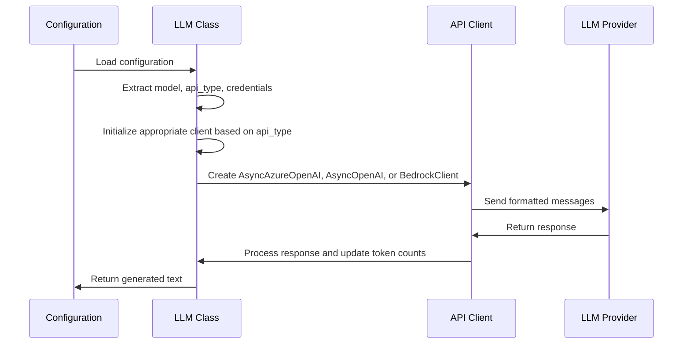
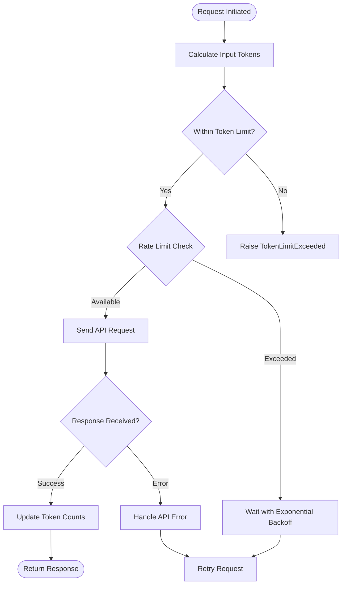

# LLM Configuration

<cite>
**Referenced Files in This Document**   
- [llm.py](file://app/llm.py)
- [config.example.toml](file://config/config.example.toml)
- [config.example-model-anthropic.toml](file://config/config.example-model-anthropic.toml)
- [config.example-model-azure.toml](file://config/config.example-model-azure.toml)
- [config.example-model-google.toml](file://config/config.example-model-google.toml)
- [config.example-model-ollama.toml](file://config/config.example-model-ollama.toml)
- [config.example-model-ppio.toml](file://config/config.example-model-ppio.toml)
</cite>

## Table of Contents
1. [Introduction](#introduction)
2. [Provider-Specific Configuration](#provider-specific-configuration)
3. [Vision Model Configuration](#vision-model-configuration)
4. [Multiple LLM Profiles](#multiple-llm-profiles)
5. [LLM Initialization and API Usage](#llm-initialization-and-api-usage)
6. [Authentication Methods](#authentication-methods)
7. [Rate Limiting and Performance Tuning](#rate-limiting-and-performance-tuning)
8. [Troubleshooting Common Issues](#troubleshooting-common-issues)

## Introduction
This document provides comprehensive guidance on configuring Large Language Models (LLMs) within the OpenManus framework. It covers configuration requirements for various LLM providers, including OpenAI, Anthropic, Azure, Ollama, Google, and PPIO. The configuration system supports both standard text models and vision-capable models, allowing for flexible deployment across different use cases. The framework enables the creation of multiple LLM profiles for different workflows and provides robust error handling for connectivity and authorization issues.

**Section sources**
- [config.example.toml](file://config/config.example.toml#L1-L106)

## Provider-Specific Configuration
Each LLM provider requires specific configuration parameters to establish proper connectivity and functionality. The configuration is defined in TOML format with provider-specific fields that control API behavior.

For **Anthropic** models, the configuration requires the model identifier, API endpoint URL, and authentication key:
```toml
[llm]
model = "claude-3-7-sonnet-latest"
base_url = "https://api.anthropic.com/v1/"
api_key = "YOUR_API_KEY"
max_tokens = 8192
temperature = 0.0
```

**Azure OpenAI** services require additional parameters including API type and version:
```toml
[llm]
api_type = 'azure'
model = "gpt-4o-mini"
base_url = "{YOUR_AZURE_ENDPOINT.rstrip('/')}/openai/deployments/{AZURE_DEPLOYMENT_ID}"
api_key = "YOUR_API_KEY"
max_tokens = 8096
temperature = 0.0
api_version = "AZURE API VERSION"
```

**Ollama** configuration specifies the local endpoint and model name:
```toml
[llm]
api_type = 'ollama'
model = "llama3.2"
base_url = "http://localhost:11434/v1"
api_key = "ollama"
max_tokens = 4096
temperature = 0.0
```

**Google** models use the Generative Language API endpoint:
```toml
[llm]
model = "gemini-2.0-flash"
base_url = "https://generativelanguage.googleapis.com/v1beta/openai/"
api_key = "YOUR_API_KEY"
temperature = 0.0
max_tokens = 8096
```

**PPIO** configuration includes the infrastructure API endpoint:
```toml
[llm]
api_type = 'ppio'
model = "deepseek/deepseek-v3-0324"
base_url = "https://api.ppinfra.com/v3/openai"
api_key = "your ppio api key"
max_tokens = 16000
temperature = 0.0
```

The `api_type` field determines the client implementation used, while `api_version` is specifically required for Azure services. Model identifiers follow each provider's naming conventions and must match available models in the respective service.

**Section sources**
- [config.example-model-anthropic.toml](file://config/config.example-model-anthropic.toml#L1-L17)
- [config.example-model-azure.toml](file://config/config.example-model-azure.toml#L1-L19)
- [config.example-model-ollama.toml](file://config/config.example-model-ollama.toml#L1-L18)
- [config.example-model-google.toml](file://config/config.example-model-google.toml#L1-L17)
- [config.example-model-ppio.toml](file://config/config.example-model-ppio.toml#L1-L17)

## Vision Model Configuration
Vision models are configured separately from standard text models using the `[llm.vision]` configuration section. This allows the system to maintain distinct settings for multimodal processing while sharing the same configuration structure as standard models.

The framework identifies vision-capable models through the `MULTIMODAL_MODELS` constant, which includes models like "gpt-4o", "gpt-4o-mini", and various Claude 3 models. When a model is recognized as multimodal, the system automatically enables image processing capabilities.

Vision model configuration follows the same pattern as standard models but is isolated in its own configuration section:
```toml
[llm.vision]
model = "claude-3-7-sonnet-20250219"
base_url = "https://api.anthropic.com/v1/"
api_key = "YOUR_API_KEY"
max_tokens = 8192
temperature = 0.0
```

For Ollama, a specific vision-capable model is specified:
```toml
[llm.vision]
api_type = 'ollama'
model = "llama3.2-vision"
base_url = "http://localhost:11434/v1"
api_key = "ollama"
max_tokens = 4096
temperature = 0.0
```

The system calculates image token costs based on detail level and dimensions, with different pricing for low, medium, and high-detail images. High-detail images are processed by scaling to fit within a 2048x2048 square, then scaling the shortest side to 768px, and finally counting 512px tiles at 170 tokens each plus a base cost of 85 tokens.

**Section sources**
- [config.example.toml](file://config/config.example.toml#L20-L35)
- [config.example-model-anthropic.toml](file://config/config.example-model-anthropic.toml#L19-L25)
- [config.example-model-azure.toml](file://config/config.example-model-azure.toml#L21-L27)
- [app/llm.py](file://app/llm.py#L34-L41)
- [app/llm.py](file://app/llm.py#L44-L170)

## Multiple LLM Profiles
The configuration system supports multiple LLM profiles for different use cases through named configuration sections. While the default configuration uses the `[llm]` section, additional profiles can be defined and accessed by name.

Profiles are instantiated as singleton objects through the LLM class's `__new__` method, which maintains a registry of instances by configuration name. This ensures that multiple components requesting the same profile share the same connection and state.

The configuration system allows for profile-specific settings while maintaining a consistent structure across providers. Each profile can have its own model, token limits, temperature settings, and API credentials. This enables scenarios such as using a high-precision model for critical tasks and a faster, lower-cost model for routine operations.

Profile selection occurs at initialization time when creating an LLM instance with a specific configuration name. The system looks up the named configuration or falls back to the default if the named configuration is not found.

**Section sources**
- [app/llm.py](file://app/llm.py#L173-L765)
- [app/llm.py](file://app/llm.py#L176-L183)

## LLM Initialization and API Usage
LLM initialization and API calls are managed through the LLM class, which handles provider-specific client creation based on the configuration parameters. The initialization process extracts settings from the configuration and creates the appropriate client instance based on the `api_type` field.

When `api_type` is "azure", the system creates an `AsyncAzureOpenAI` client with the specified base URL, API key, and API version. For "aws" (Amazon Bedrock), it uses a custom `BedrockClient`. For all other providers, it defaults to `AsyncOpenAI` with the provided API key and base URL.

The LLM class provides several methods for interacting with the language model:
- `ask()`: Sends a prompt and returns the response, with optional streaming
- `ask_with_images()`: Handles multimodal inputs with image attachments
- `ask_tool()`: Processes tool/function calling requests

These methods handle message formatting, token counting, and error handling automatically. The `format_messages()` method converts various message formats into the standard OpenAI message format, processing base64 images when the model supports them.

Token counting is performed by the `TokenCounter` class, which calculates token usage for text, images, and tool calls. The system tracks cumulative token usage and can enforce input token limits when configured.



**Diagram sources**
- [app/llm.py](file://app/llm.py#L185-L226)
- [app/llm.py](file://app/llm.py#L360-L478)
- [app/llm.py](file://app/llm.py#L487-L634)
- [app/llm.py](file://app/llm.py#L643-L765)

**Section sources**
- [app/llm.py](file://app/llm.py#L173-L765)

## Authentication Methods
Authentication is handled through API keys specified in the configuration file. Each provider requires a valid API key to authenticate requests, which is passed to the client during initialization.

The system supports different authentication patterns based on the provider:
- **OpenAI-style providers**: Use the `api_key` field directly
- **Azure**: Uses API key with additional `api_version` requirement
- **AWS Bedrock**: Requires AWS credentials (though the configuration shows a placeholder key)
- **Ollama**: Uses a simple authentication token
- **PPIO**: Uses a standard API key

The LLM class validates authentication during the API call process, with specific error handling for authentication failures. When an `AuthenticationError` is encountered, the system logs an explicit message advising users to check their API key.

For security, API keys should never be committed to version control. The example configuration files use placeholder values like "YOUR_API_KEY" to remind users to provide their own credentials. The system does not provide built-in key management or encryption, so keys should be protected through external means such as environment variables or secret management systems.

**Section sources**
- [app/llm.py](file://app/llm.py#L360-L478)
- [app/llm.py](file://app/llm.py#L487-L634)
- [app/llm.py](file://app/llm.py#L643-L765)

## Rate Limiting and Performance Tuning
The system implements comprehensive rate limiting and performance tuning parameters to optimize LLM usage and prevent service disruptions.

Rate limiting is handled through the `tenacity` library's retry mechanism, which automatically retries failed requests with exponential backoff. The retry configuration waits a random interval between 1 and 60 seconds between attempts and stops after 6 attempts. This helps mitigate transient rate limit errors from the LLM providers.

Performance tuning parameters include:
- `max_tokens`: Limits the maximum number of tokens in the response
- `temperature`: Controls response randomness (0.0 for deterministic, higher for more creative)
- `stream`: Enables or disables streaming responses
- `max_input_tokens`: Optional limit on cumulative input tokens

The token counting system provides detailed tracking of both input and completion tokens, logging cumulative usage for monitoring and cost management. For streaming responses, the system estimates completion tokens based on the generated text.

The `check_token_limit()` method prevents requests that would exceed configured input token limits, raising a `TokenLimitExceeded` exception when limits are approached. This helps prevent excessive usage and associated costs.



**Diagram sources**
- [app/llm.py](file://app/llm.py#L248-L253)
- [app/llm.py](file://app/llm.py#L255-L263)
- [app/llm.py](file://app/llm.py#L237-L246)

**Section sources**
- [app/llm.py](file://app/llm.py#L360-L478)
- [app/llm.py](file://app/llm.py#L487-L634)
- [app/llm.py](file://app/llm.py#L643-L765)

## Troubleshooting Common Issues
This section addresses common connectivity and authorization issues encountered when configuring and using LLMs in the OpenManus framework.

**Authentication Failures**: When receiving authentication errors, verify that the `api_key` in the configuration matches your provider's credentials. Check for typos, extra whitespace, or expired keys. The system logs explicit messages when authentication fails, advising users to "Check API key."

**Rate Limit Exceeded**: If encountering rate limit errors, consider these solutions:
- Implement longer retry intervals
- Reduce request frequency
- Upgrade your provider plan for higher limits
- Implement request queuing
- Use caching for repeated queries

**Token Limit Exceeded**: When input token limits are exceeded:
- Reduce the context window by removing older conversation history
- Implement summarization of previous interactions
- Increase the `max_input_tokens` configuration if supported by your use case
- Split large requests into smaller, sequential queries

**Model Not Found**: If the specified model is not available:
- Verify the model identifier matches exactly with what's offered by the provider
- Check for regional availability restrictions
- Ensure the model name follows the correct format for the provider
- For Azure, verify the deployment name matches exactly

**Connectivity Issues**: For connection problems:
- Verify the `base_url` is correct and accessible
- Check network connectivity and firewall rules
- Test the endpoint with a simple curl command
- Ensure any required proxies are configured

**Vision Model Issues**: When working with vision models:
- Ensure images are properly formatted and within size limits
- Verify the model is in the `MULTIMODAL_MODELS` list
- Check that image URLs are accessible
- Confirm the `ask_with_images()` method is being used appropriately

The system provides detailed logging of token usage and API interactions, which can be invaluable for diagnosing performance and cost issues. Monitoring the cumulative token counts can help identify patterns of excessive usage.

**Section sources**
- [app/llm.py](file://app/llm.py#L360-L478)
- [app/llm.py](file://app/llm.py#L487-L634)
- [app/llm.py](file://app/llm.py#L643-L765)
- [app/llm.py](file://app/llm.py#L34-L41)