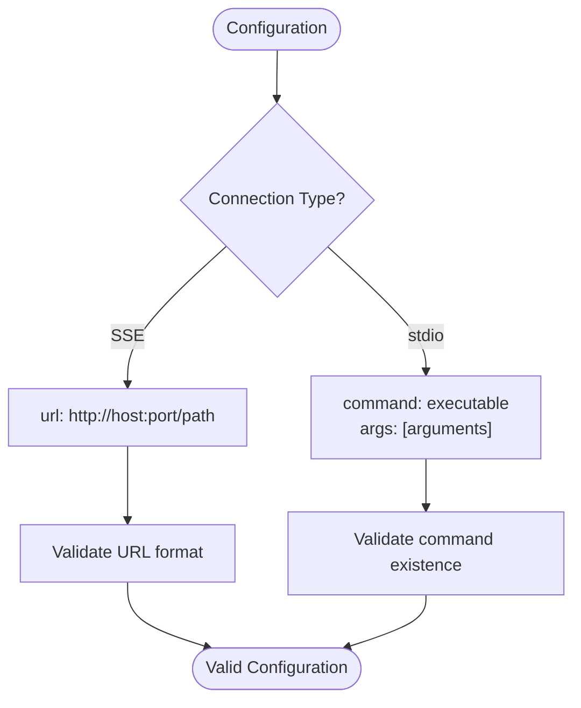
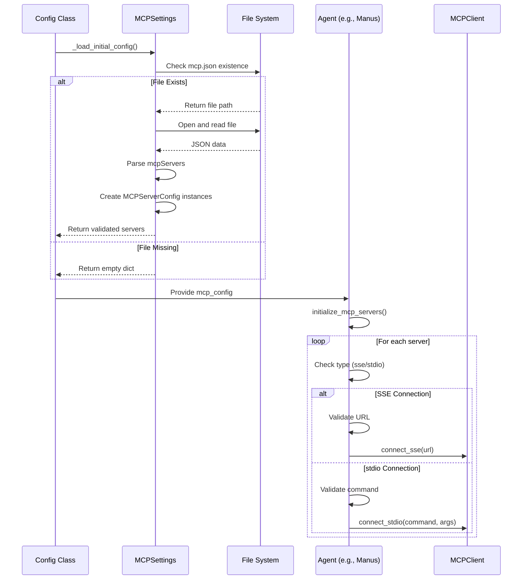
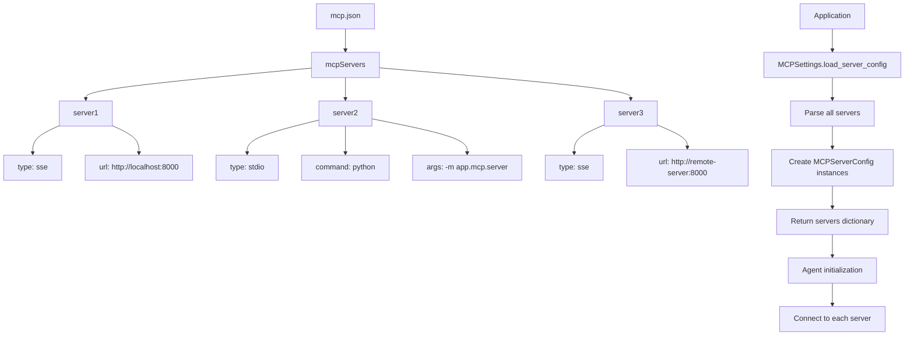

# MCP Server Configuration

<cite>
**Referenced Files in This Document**   
- [mcp.example.json](file://config/mcp.example.json)
- [config.py](file://app/config.py)
- [manus.py](file://app/agent/manus.py)
- [mcp.py](file://app/tool/mcp.py)
- [server.py](file://app/mcp/server.py)
- [run_mcp.py](file://run_mcp.py)
- [run_mcp_server.py](file://run_mcp_server.py)
- [config.example.toml](file://config/config.example.toml)
</cite>

## Table of Contents
1. [MCP Server Configuration](#mcp-server-configuration)
2. [JSON Configuration Structure](#json-configuration-structure)
3. [Connection Types: SSE vs stdio](#connection-types-sse-vs-stdio)
4. [MCPSettings Class Implementation](#mcpsettings-class-implementation)
5. [Multiple MCP Server Configuration](#multiple-mcp-server-configuration)
6. [Practical Configuration Examples](#practical-configuration-examples)
7. [Security Considerations](#security-considerations)
8. [Troubleshooting Common Issues](#troubleshooting-common-issues)

## JSON Configuration Structure

The MCP server configuration is defined in a JSON file named `mcp.json` (with `mcp.example.json` as the template). The configuration centers around the `mcpServers` object, which contains server definitions identified by unique server IDs. Each server configuration includes four key fields: `type`, `url`, `command`, and `args`.

The `type` field specifies the connection protocol, with two supported values: "sse" for Server-Sent Events and "stdio" for standard input/output communication. For SSE connections, the `url` field is required and specifies the endpoint where the MCP server is accessible. For stdio connections, the `command` field specifies the executable to launch, and the `args` field (optional) contains command-line arguments for the server process.

```json
{
    "mcpServers": {
      "server1": {
        "type": "sse",
        "url": "http://localhost:8000/sse"
      }
    }
}
```

**Section sources**
- [mcp.example.json](file://config/mcp.example.json#L0-L7)
- [config.py](file://app/config.py#L126-L134)

## Connection Types: SSE vs stdio

### SSE (Server-Sent Events) Connection
The SSE connection type enables communication through HTTP-based Server-Sent Events, where the server pushes updates to the client over a persistent connection. This type is suitable for remote MCP servers or when running the server as a separate service. The `url` field must be provided with a valid HTTP endpoint. SSE connections are stateful and maintain an open connection for the duration of the session, making them ideal for long-running server processes.

### stdio (Standard Input/Output) Connection
The stdio connection type uses standard input and output streams for communication, typically launching the MCP server as a child process. This type is appropriate for local server instances and development environments. The `command` field specifies the executable to run (e.g., Python interpreter), and `args` provides additional parameters. stdio connections are process-bound and terminate when the parent process ends, offering tighter integration but limited to local execution.

The choice between connection types depends on deployment requirements: SSE for distributed, network-accessible servers, and stdio for embedded, local server instances.



**Diagram sources**
- [config.py](file://app/config.py#L126-L134)
- [mcp.py](file://app/tool/mcp.py#L36-L68)

**Section sources**
- [config.py](file://app/config.py#L126-L134)
- [mcp.py](file://app/tool/mcp.py#L36-L68)

## MCPSettings Class Implementation

The `MCPSettings` class in `app/config.py` handles the loading, validation, and management of MCP server configurations. It uses Pydantic models to ensure type safety and data validation. The class contains two primary components: `MCPServerConfig` for individual server configurations and `MCPSettings` for the overall MCP configuration.

The `load_server_config` class method is responsible for reading and parsing the JSON configuration file. It first checks for the existence of `mcp.json` in the config directory, defaulting to an empty configuration if the file is not found. The method parses the JSON content, extracts the `mcpServers` object, and instantiates `MCPServerConfig` objects for each server definition. Error handling is implemented to catch JSON parsing errors, file access issues, and invalid configurations, raising a `ValueError` with descriptive messages when problems occur.

The configuration loading process integrates with the application's startup sequence, where the `Config` class initializes the MCP settings during application startup. Server connections are established asynchronously when agents like `Manus` initialize, using the connection parameters from the loaded configuration.



**Diagram sources**
- [config.py](file://app/config.py#L148-L170)
- [manus.py](file://app/agent/manus.py#L66-L88)

**Section sources**
- [config.py](file://app/config.py#L126-L170)

## Multiple MCP Server Configuration

The configuration system supports multiple MCP servers through the `mcpServers` object in the JSON file. Each server is defined with a unique identifier (server ID) as the key, allowing the application to reference specific servers by name. This enables scenarios where different agents or workflows connect to different MCP servers based on their requirements.

To configure multiple servers, add additional entries to the `mcpServers` object, each with a unique server ID and appropriate connection parameters. The `MCPSettings` class loads all server configurations into a dictionary, where the server ID serves as the key. Agents can then iterate through the configured servers and establish connections based on the connection type specified in each configuration.

The system handles server initialization during agent startup, with error handling to manage connection failures for individual servers without affecting the entire initialization process. Successfully connected servers are tracked in the agent's `connected_servers` dictionary, allowing for proper cleanup and disconnection when the agent terminates.



**Diagram sources**
- [config.py](file://app/config.py#L126-L159)
- [manus.py](file://app/agent/manus.py#L66-L88)

**Section sources**
- [config.py](file://app/config.py#L126-L159)
- [manus.py](file://app/agent/manus.py#L66-L88)

## Practical Configuration Examples

### Local MCP Server Setup
To configure a local MCP server using stdio connection, create an `mcp.json` file with the following content:

```json
{
    "mcpServers": {
        "local-server": {
            "type": "stdio",
            "command": "python",
            "args": ["-m", "app.mcp.server"]
        }
    }
}
```

This configuration launches the MCP server as a subprocess using the Python interpreter. The server runs within the same environment as the main application, making it suitable for development and testing. The `run_mcp_server.py` script provides a convenient entry point for launching the server.

### Remote MCP Server Setup
For a remote MCP server using SSE connection, configure the JSON file as follows:

```json
{
    "mcpServers": {
        "remote-server": {
            "type": "sse",
            "url": "http://api.example.com/mcp-sse"
        }
    }
}
```

This setup connects to an MCP server running on a remote host. The URL should point to the SSE endpoint of the server. For production deployments, ensure the URL uses HTTPS for secure communication.

### Referencing in TOML Configuration
The MCP servers are referenced in the main `config.toml` file through the `mcp` section:

```toml
[mcp]
server_reference = "app.mcp.server"
```

The `server_reference` field specifies the module path for the MCP server implementation, which is used when launching stdio-based servers. Multiple servers defined in `mcp.json` are automatically loaded and initialized based on their configuration, without requiring additional entries in the TOML file.

**Section sources**
- [mcp.example.json](file://config/mcp.example.json#L0-L7)
- [config.py](file://app/config.py#L126-L134)
- [config.example.toml](file://config/config.example.toml#L98-L100)
- [run_mcp_server.py](file://run_mcp_server.py#L0-L10)

## Security Considerations

When deploying MCP servers in production environments, several security considerations must be addressed. For SSE connections, always use HTTPS instead of HTTP to encrypt communication between the client and server. This prevents eavesdropping and man-in-the-middle attacks. Implement authentication mechanisms such as API keys or tokens to ensure only authorized clients can connect to the MCP server.

For stdio connections, ensure the executing environment is properly sandboxed, especially when processing untrusted input. Limit the permissions of the process running the MCP server to the minimum required for its operation. When using command-line arguments, validate and sanitize inputs to prevent command injection attacks.

Network exposure should be minimized: SSE endpoints should be protected by firewalls and access controls, only exposing them to trusted clients. Consider implementing rate limiting to prevent abuse and denial-of-service attacks. For sensitive deployments, use private networks or VPNs to isolate MCP server communication.

Environment variables should be used for sensitive configuration values like API keys, rather than hardcoding them in configuration files. Ensure configuration files have appropriate file permissions to prevent unauthorized access.

**Section sources**
- [server.py](file://app/mcp/server.py#L144-L179)
- [mcp.py](file://app/tool/mcp.py#L36-L68)
- [run_mcp.py](file://run_mcp.py#L0-L35)

## Troubleshooting Common Issues

### Connection Timeouts
Connection timeouts typically occur when the MCP server is unreachable or overloaded. For SSE connections, verify the server URL is correct and the server is running. Check network connectivity and firewall settings. Increase timeout values in the client configuration if the server requires more time to respond. For stdio connections, ensure the command executable is in the system PATH and has execute permissions.

### Authentication Failures
Authentication failures indicate a mismatch between expected and provided credentials. Verify that any required API keys or tokens are correctly configured in the environment or configuration files. Check that authentication headers are properly formatted and included in SSE requests. For stdio connections, ensure the executing user has the necessary permissions to access required resources.

### Server Startup Problems
Server startup issues often stem from missing dependencies or incorrect command parameters. Verify that all required packages are installed in the environment. Check that the Python interpreter can locate the `app.mcp.server` module. For stdio connections, validate that the command and arguments are correctly specified in the configuration. Examine server logs for detailed error messages that can pinpoint the root cause.

Configuration validation is critical: ensure the JSON file is properly formatted and all required fields are present. Use the `mcp.example.json` file as a template to avoid structural errors. When troubleshooting, enable verbose logging to capture detailed information about connection attempts and server initialization.

**Section sources**
- [config.py](file://app/config.py#L148-L170)
- [manus.py](file://app/agent/manus.py#L66-L88)
- [mcp.py](file://app/tool/mcp.py#L140-L171)
- [server.py](file://app/mcp/server.py#L144-L179)