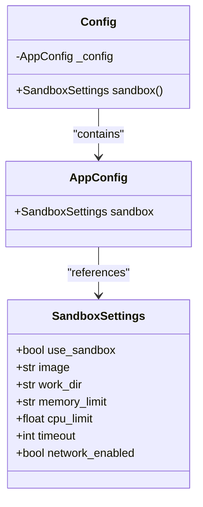
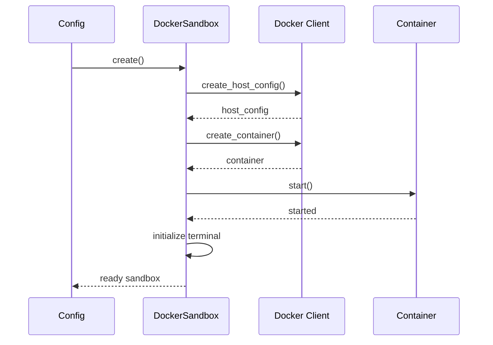

# Sandbox Configuration

<cite>
**Referenced Files in This Document**   
- [config.example.toml](file://config/config.example.toml)
- [app/config.py](file://app/config.py)
- [app/sandbox/core/sandbox.py](file://app/sandbox/core/sandbox.py)
- [app/sandbox/core/manager.py](file://app/sandbox/core/manager.py)
</cite>

## Table of Contents
1. [Sandbox Configuration Overview](#sandbox-configuration-overview)
2. [Sandbox Settings Parameters](#sandbox-settings-parameters)
3. [Configuration Validation and Implementation](#configuration-validation-and-implementation)
4. [Secure Configuration Examples](#secure-configuration-examples)
5. [Resource Limit Recommendations](#resource-limit-recommendations)
6. [Common Issues and Troubleshooting](#common-issues-and-troubleshooting)

## Sandbox Configuration Overview

The sandbox configuration provides a secure, isolated execution environment for code execution within the application. The configuration is defined in the `config.example.toml` file under the `[sandbox]` section and is validated and implemented through the `SandboxSettings` Pydantic model in `app/config.py`. The Docker-based sandbox implementation in `app/sandbox/core/sandbox.py` creates and manages containerized environments with specified resource constraints and security settings.

The sandbox environment ensures that code execution occurs in a controlled, isolated context with defined resource limits, preventing potential security risks and system resource exhaustion. The configuration allows fine-grained control over container properties, resource allocation, and network access.

**Section sources**
- [config.example.toml](file://config/config.example.toml#L100-L105)
- [app/config.py](file://app/config.py#L93-L104)

## Sandbox Settings Parameters

The sandbox configuration includes several key parameters that control the behavior and security of the execution environment:

### use_sandbox
- **Default**: `false`
- **Description**: Determines whether the sandbox environment is enabled for code execution. When set to `true`, all code execution occurs within an isolated Docker container. When `false`, code executes in the host environment, which poses significant security risks but may be acceptable in trusted development environments.

### image
- **Default**: `"python:3.12-slim"`
- **Description**: Specifies the Docker base image used for the sandbox container. The default `python:3.12-slim` image provides a minimal Python 3.12 environment with reduced attack surface. This image is optimized for size and security, containing only essential packages.

### work_dir
- **Default**: `"/workspace"`
- **Description**: Defines the working directory within the container where code execution occurs. All file operations and command execution take place relative to this directory, providing a consistent execution context.

### memory_limit
- **Default**: `"512m"`
- **Description**: Sets the maximum memory allocation for the container. The value follows Docker's memory limit format (e.g., "512m" for 512 megabytes, "1g" for 1 gigabyte). This prevents memory exhaustion attacks and ensures fair resource distribution.

### cpu_limit
- **Default**: `1.0`
- **Description**: Specifies the maximum CPU allocation as a fraction of available CPU resources. A value of `1.0` represents one full CPU core, while `0.5` represents half a core. This limits CPU-intensive operations and prevents denial-of-service attacks.

### timeout
- **Default**: `300`
- **Description**: Defines the maximum execution time in seconds before commands are terminated. This prevents infinite loops and long-running processes from consuming system resources indefinitely.

### network_enabled
- **Default**: `false`
- **Description**: Controls whether the sandbox container has network access. When `false`, the container is completely isolated from network resources, preventing data exfiltration and unauthorized external connections. When `true`, limited network access is permitted.

**Section sources**
- [config.example.toml](file://config/config.example.toml#L100-L105)
- [app/config.py](file://app/config.py#L93-L104)

## Configuration Validation and Implementation

The sandbox configuration is validated and implemented through a well-defined architecture that ensures security and reliability.

### Configuration Validation with Pydantic

The `SandboxSettings` Pydantic model in `app/config.py` validates all sandbox configuration parameters, ensuring type safety and proper formatting. The model defines default values and descriptions for each parameter, providing clear documentation and preventing invalid configurations.



**Diagram sources**
- [app/config.py](file://app/config.py#L93-L104)
- [app/config.py](file://app/config.py#L335-L336)

### Docker-Based Sandbox Implementation

The `DockerSandbox` class in `app/sandbox/core/sandbox.py` implements the sandbox environment using Docker containers. The implementation creates isolated containers with the specified configuration parameters, ensuring secure code execution.



**Diagram sources**
- [app/sandbox/core/sandbox.py](file://app/sandbox/core/sandbox.py#L48-L102)
- [app/sandbox/core/sandbox.py](file://app/sandbox/core/sandbox.py#L17-L461)

The sandbox implementation applies security measures including:
- Path traversal prevention through `_safe_resolve_path()` method
- Resource limits enforced via Docker host configuration
- Network isolation when `network_enabled` is `false`
- Automatic cleanup of resources through context managers

**Section sources**
- [app/config.py](file://app/config.py#L93-L104)
- [app/sandbox/core/sandbox.py](file://app/sandbox/core/sandbox.py#L17-L461)

## Secure Configuration Examples

### Production Configuration

For production environments, the following secure configuration is recommended:

```toml
[sandbox]
use_sandbox = true
image = "python:3.12-slim"
work_dir = "/workspace"
memory_limit = "512m"
cpu_limit = 1.0
timeout = 300
network_enabled = false
```

This configuration provides maximum security by:
- Enabling the sandbox environment
- Using a minimal, secure base image
- Limiting memory to 512MB to prevent memory exhaustion
- Restricting CPU usage to one core
- Setting a reasonable 5-minute timeout
- Disabling network access to prevent data exfiltration

### Development Configuration

For development environments, a more permissive configuration may be appropriate:

```toml
[sandbox]
use_sandbox = true
image = "python:3.12-slim"
work_dir = "/workspace"
memory_limit = "1g"
cpu_limit = 2.0
timeout = 600
network_enabled = true
```

This development configuration allows:
- Increased memory limit (1GB) for memory-intensive operations
- Higher CPU allocation (2 cores) for faster execution
- Extended timeout (10 minutes) for debugging long-running processes
- Network access for package installation and external API calls

**Section sources**
- [config.example.toml](file://config/config.example.toml#L100-L105)
- [app/config.py](file://app/config.py#L93-L104)

## Resource Limit Recommendations

### Memory Limits
- **Minimal**: 256m - Suitable for simple scripts and small operations
- **Standard**: 512m - Recommended for most applications and moderate workloads
- **High**: 1g - Appropriate for data processing and memory-intensive tasks
- **Maximum**: 2g - Only for specialized, resource-heavy operations

### CPU Limits
- **Minimal**: 0.5 - For lightweight operations and background tasks
- **Standard**: 1.0 - Balanced performance for general use
- **High**: 2.0 - For CPU-intensive computations and parallel processing
- **Maximum**: 4.0 - Only for specialized computational tasks

### Timeout Values
- **Short**: 60 seconds - For simple, fast operations
- **Standard**: 300 seconds (5 minutes) - Recommended for most use cases
- **Long**: 600 seconds (10 minutes) - For complex operations and debugging
- **Maximum**: 1800 seconds (30 minutes) - Only for exceptional cases

When selecting resource limits, consider the trade-off between performance and security. More generous limits improve performance but increase potential attack surface and resource consumption.

**Section sources**
- [app/config.py](file://app/config.py#L93-L104)
- [app/sandbox/core/sandbox.py](file://app/sandbox/core/sandbox.py#L48-L102)

## Common Issues and Troubleshooting

### Container Startup Failures
**Symptoms**: Sandbox creation fails with Docker API errors or image pull failures.

**Solutions**:
- Ensure Docker daemon is running and accessible
- Verify the specified image exists in the Docker registry
- Check network connectivity for image pulling
- Validate Docker permissions and resource availability

### Resource Exhaustion
**Symptoms**: Commands fail with out-of-memory errors or timeout exceptions.

**Solutions**:
- Increase `memory_limit` parameter for memory-intensive operations
- Adjust `cpu_limit` to provide more processing power
- Extend `timeout` value for long-running processes
- Optimize code to reduce resource consumption

### Network Access Configuration
**Symptoms**: Network operations fail when `network_enabled = false`.

**Solutions**:
- Set `network_enabled = true` only when network access is required
- Pre-install required packages in the container image
- Use offline package repositories when possible
- Implement proper network security measures when enabling network access

### File System Issues
**Symptoms**: File operations fail with permission errors or path traversal warnings.

**Solutions**:
- Ensure all file paths are relative to `work_dir`
- Avoid using `..` in file paths to prevent path traversal
- Verify directory permissions and existence
- Use the sandbox's file operations methods rather than direct system calls

The sandbox implementation includes comprehensive error handling and cleanup mechanisms to ensure that failed operations do not leave orphaned containers or consume system resources.

**Section sources**
- [app/sandbox/core/sandbox.py](file://app/sandbox/core/sandbox.py#L48-L102)
- [app/sandbox/core/sandbox.py](file://app/sandbox/core/sandbox.py#L254-L312)
- [app/sandbox/core/manager.py](file://app/sandbox/core/manager.py#L113-L156)