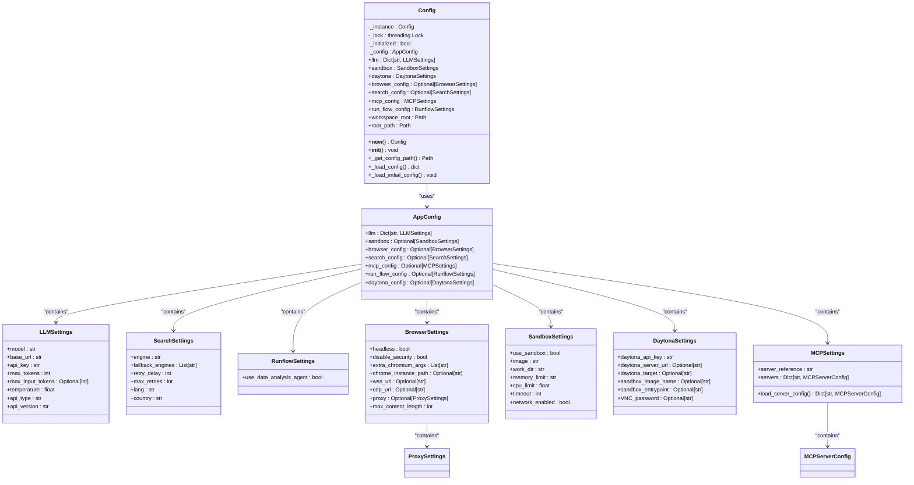

# TOML Configuration

<cite>
**Referenced Files in This Document**   
- [config.example.toml](file://config/config.example.toml)
- [config.example-model-anthropic.toml](file://config/config.example-model-anthropic.toml)
- [config.example-model-azure.toml](file://config/config.example-model-azure.toml)
- [config.example-model-ollama.toml](file://config/config.example-model-ollama.toml)
- [config.example-model-google.toml](file://config/config.example-model-google.toml)
- [config.example-daytona.toml](file://config/config.example-daytona.toml)
- [app/config.py](file://app/config.py)
</cite>

## Table of Contents
1. [Introduction](#introduction)
2. [Core Configuration Sections](#core-configuration-sections)
3. [LLM Configuration](#llm-configuration)
4. [Vision Model Configuration](#vision-model-configuration)
5. [Search Configuration](#search-configuration)
6. [Runflow Configuration](#runflow-configuration)
7. [Daytona Configuration](#daytona-configuration)
8. [MCP Configuration](#mcp-configuration)
9. [Configuration Loading and Validation](#configuration-loading-and-validation)
10. [Provider-Specific Configuration Examples](#provider-specific-configuration-examples)
11. [Common Configuration Issues](#common-configuration-issues)

## Introduction
The OpenManus configuration system uses TOML (Tom's Obvious, Minimal Language) format for defining application settings. The configuration framework provides a flexible way to manage LLM providers, search engines, sandbox environments, and other system components. This document details the structure and purpose of the configuration files, focusing on the `config.example.toml` file and its variants for different LLM providers.

**Section sources**
- [config.example.toml](file://config/config.example.toml#L1-L105)

## Core Configuration Sections
The OpenManus configuration is organized into several key sections that control different aspects of the system's behavior. The primary configuration sections include:

- **[llm]**: Global LLM settings that define the default language model configuration
- **[llm.vision]**: Optional configuration for vision-capable LLM models
- **[search]**: Search engine settings for agent operations
- **[runflow]**: Workflow configuration for run-flow operations
- **[mcp]**: Model Context Protocol server configuration
- **[daytona]**: Daytona integration settings for sandbox environments

Each section contains specific parameters that control the behavior of the corresponding system component, with sensible defaults provided for most settings.

**Section sources**
- [config.example.toml](file://config/config.example.toml#L1-L105)

## LLM Configuration
The `[llm]` section defines the default Large Language Model (LLM) settings used throughout the application. This section contains essential parameters for connecting to and configuring the primary LLM provider.

```toml
[llm]
model = "claude-3-7-sonnet-20250219"
base_url = "https://api.anthropic.com/v1/"
api_key = "YOUR_API_KEY"
max_tokens = 8192
temperature = 0.0
```

The configuration supports model-specific overrides through nested configuration blocks, allowing different settings for specific use cases while maintaining a global default configuration. The system also includes commented configuration blocks for various LLM providers, making it easy to switch between different services.

**Section sources**
- [config.example.toml](file://config/config.example.toml#L2-L8)
- [app/config.py](file://app/config.py#L18-L29)

## Vision Model Configuration
The `[llm.vision]` section provides optional configuration for vision-capable LLM models. This allows the system to use specialized models when image processing or visual understanding is required.

```toml
[llm.vision]
model = "claude-3-7-sonnet-20250219"
base_url = "https://api.anthropic.com/v1/"
api_key = "YOUR_API_KEY"
max_tokens = 8192
temperature = 0.0
```

This configuration follows the same structure as the global LLM settings but is specifically tailored for vision models. When not specified, the system will fall back to the default LLM configuration for vision tasks.

**Section sources**
- [config.example.toml](file://config/config.example.toml#L20-L25)
- [app/config.py](file://app/config.py#L18-L29)

## Search Configuration
The `[search]` section controls the search engine settings used by agents for information retrieval. This configuration allows customization of the search engine and related parameters.

```toml
[search]
engine = "Google"
fallback_engines = ["DuckDuckGo", "Baidu", "Bing"]
retry_delay = 60
max_retries = 3
lang = "en"
country = "us"
```

The search configuration includes a primary engine setting with fallback options that are tried in sequence when the primary engine fails. Additional parameters control retry behavior, language preferences, and geographic targeting for search results.

**Section sources**
- [config.example.toml](file://config/config.example.toml#L47-L56)
- [app/config.py](file://app/config.py#L38-L59)

## Runflow Configuration
The `[runflow]` section enables configuration of additional agents within the run-flow workflow to handle different types of tasks.

```toml
[runflow]
use_data_analysis_agent = false
```

This configuration currently supports enabling the Data Analysis Agent, which can solve various data analysis tasks. The boolean flag determines whether this specialized agent is included in the workflow.

**Section sources**
- [config.example.toml](file://config/config.example.toml#L103-L105)
- [app/config.py](file://app/config.py#L62-L65)

## Daytona Configuration
The `[daytona]` section contains settings for integrating with the Daytona platform, which provides sandbox environments for secure code execution.

```toml
[daytona]
daytona_api_key = ""
daytona_server_url = "https://app.daytona.io/api"
daytona_target = "us"
sandbox_image_name = "whitezxj/sandbox:0.1.0"
sandbox_entrypoint = "/usr/bin/supervisord -n -c /etc/supervisor/conf.d/supervisord.conf"
VNC_password = "123456"
```

These settings include authentication credentials, server endpoints, and container configuration parameters for the Daytona integration.

**Section sources**
- [config.example-daytona.toml](file://config/config.example-daytona.toml#L106-L114)
- [app/config.py](file://app/config.py#L107-L123)

## MCP Configuration
The `[mcp]` section configures the Model Context Protocol servers used by the application.

```toml
[mcp]
server_reference = "app.mcp.server"
```

This configuration specifies the module reference for the MCP server and can be extended with additional server configurations loaded from a separate JSON file (`mcp.json`).

**Section sources**
- [config.example.toml](file://config/config.example.toml#L98-L99)
- [app/config.py](file://app/config.py#L137-L170)

## Configuration Loading and Validation
The configuration system in OpenManus uses Pydantic models to load and validate TOML configuration data. The `Config` class in `app/config.py` implements a singleton pattern to ensure consistent configuration access throughout the application.



**Diagram sources**
- [app/config.py](file://app/config.py#L18-L193)

The configuration loading process follows these steps:
1. Locate the configuration file (first checking for `config.toml`, then falling back to `config.example.toml`)
2. Parse the TOML file using `tomllib`
3. Extract the base LLM configuration and any model-specific overrides
4. Create default settings from the base configuration
5. Process configuration for other components (browser, search, sandbox, etc.)
6. Validate all settings using Pydantic models
7. Store the validated configuration in the singleton instance

The system supports model-specific overrides by detecting nested configuration blocks within the `[llm]` section and merging them with the default settings.

**Section sources**
- [app/config.py](file://app/config.py#L196-L368)

## Provider-Specific Configuration Examples
OpenManus provides example configuration files for different LLM providers, making it easy to switch between services. These examples demonstrate the specific settings required for each provider.

### Anthropic Configuration
```toml
[llm]
model = "claude-3-7-sonnet-latest"
base_url = "https://api.anthropic.com/v1/"
api_key = "YOUR_API_KEY"
max_tokens = 8192
temperature = 0.0
```

### Azure OpenAI Configuration
```toml
[llm]
api_type = 'azure'
model = "gpt-4o-mini"
base_url = "{YOUR_AZURE_ENDPOINT.rstrip('/')}/openai/deployments/{AZURE_DEPLOYMENT_ID}"
api_key = "YOUR_API_KEY"
max_tokens = 8096
temperature = 0.0
api_version = "2024-08-01-preview"
```

### Ollama Configuration
```toml
[llm]
api_type = 'ollama'
model = "llama3.2"
base_url = "http://localhost:11434/v1"
api_key = "ollama"
max_tokens = 4096
temperature = 0.0
```

### Google Gemini Configuration
```toml
[llm]
model = "gemini-2.0-flash"
base_url = "https://generativelanguage.googleapis.com/v1beta/openai/"
api_key = "YOUR_API_KEY"
temperature = 0.0
max_tokens = 8096
```

These provider-specific configurations can be used as templates by copying them to `config.toml` and updating the appropriate values.

**Section sources**
- [config.example-model-anthropic.toml](file://config/config.example-model-anthropic.toml#L2-L16)
- [config.example-model-azure.toml](file://config/config.example-model-azure.toml#L2-L18)
- [config.example-model-ollama.toml](file://config/config.example-model-ollama.toml#L2-L17)
- [config.example-model-google.toml](file://config/config.example-model-google.toml#L2-L16)

## Common Configuration Issues
When configuring OpenManus, several common issues may arise. Understanding these issues and their solutions can help ensure smooth operation.

### Incorrect API Endpoints
Using incorrect base URLs for LLM providers is a common issue. Ensure that the `base_url` parameter matches the provider's API endpoint requirements:
- Anthropic: `https://api.anthropic.com/v1/`
- Azure OpenAI: `{YOUR_AZURE_ENDPOINT}/openai/deployments/{AZURE_DEPLOYMENT_ID}`
- Ollama: `http://localhost:11434/v1`
- Google Gemini: `https://generativelanguage.googleapis.com/v1beta/openai/`

### Missing Required Fields
Each LLM provider requires specific fields to be configured:
- **api_key**: Required for all providers
- **api_type**: Required for Azure and Ollama
- **api_version**: Required for Azure
- **model**: Required for all providers

### Environment-Specific Configuration Management
For managing configurations across different environments (development, staging, production), consider these approaches:
1. Use environment variables for sensitive data like API keys
2. Create separate configuration files for each environment
3. Use the example files as templates and exclude the actual `config.toml` from version control

The configuration system automatically falls back to `config.example.toml` if `config.toml` is not present, making it easy to distribute configuration templates without exposing sensitive information.

**Section sources**
- [config.example.toml](file://config/config.example.toml#L1-L105)
- [app/config.py](file://app/config.py#L196-L368)