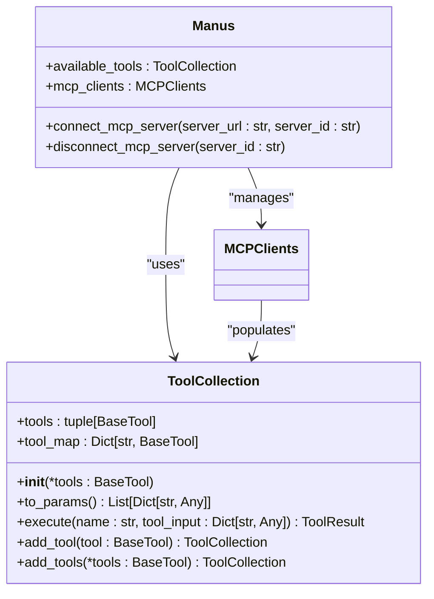
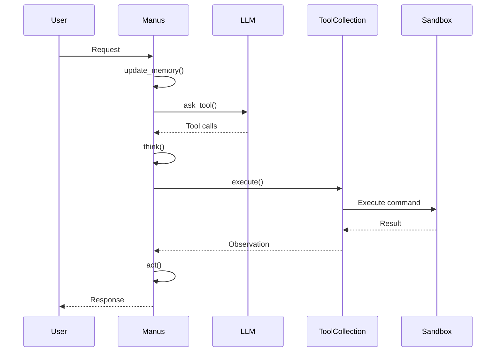

# Agent Architecture

<cite>
**Referenced Files in This Document**   
- [main.py](file://main.py)
- [sandbox_main.py](file://sandbox_main.py)
- [app/agent/manus.py](file://app/agent/manus.py)
- [app/agent/toolcall.py](file://app/agent/toolcall.py)
- [app/agent/sandbox_agent.py](file://app/agent/sandbox_agent.py)
- [app/tool/tool_collection.py](file://app/tool/tool_collection.py)
- [app/llm.py](file://app/llm.py)
</cite>

## Table of Contents
1. [Introduction](#introduction)
2. [Core Agent Components](#core-agent-components)
3. [Agent Lifecycle Management](#agent-lifecycle-management)
4. [Tool Collection and Dynamic Tool Management](#tool-collection-and-dynamic-tool-management)
5. [Agent-LLM-Sandbox Interaction](#agent-llm-sandbox-interaction)
6. [CLI Entry Points and Agent Instantiation](#cli-entry-points-and-agent-instantiation)
7. [Common Issues and Troubleshooting](#common-issues-and-troubleshooting)
8. [Best Practices for Extending Agent Architecture](#best-practices-for-extending-agent-architecture)

## Introduction
The Agent Architecture in OpenManus centers around Manus, the primary orchestrator agent responsible for coordinating tool usage, managing state, and interfacing with Large Language Models (LLMs). Manus serves as a versatile general-purpose agent capable of solving diverse tasks by leveraging both local and remote tools through the Model Context Protocol (MCP). This architecture enables dynamic tool management, stateful execution, and seamless integration with LLMs for intelligent decision-making. The agent operates within a structured lifecycle from initialization to execution and cleanup, ensuring robust resource management and error handling throughout its operation.

## Core Agent Components

The Manus agent is built upon a hierarchical architecture that extends from base agent classes to specialized implementations. At its core, Manus inherits from `ToolCallAgent`, which itself extends `ReActAgent`, establishing a foundation for reactive, tool-driven behavior. The agent maintains several key components including its name, description, system prompt, and configuration parameters for execution limits. It manages a collection of available tools through the `ToolCollection` class, handles connections to MCP servers via `MCPClients`, and maintains state through memory and lifecycle tracking. The agent also incorporates specialized helpers like `BrowserContextHelper` for managing browser-related operations and context.

**Section sources**
- [app/agent/manus.py](file://app/agent/manus.py#L17-L164)
- [app/agent/toolcall.py](file://app/agent/toolcall.py#L17-L249)
- [app/agent/react.py](file://app/agent/react.py#L10-L37)

## Agent Lifecycle Management

The Manus agent follows a well-defined lifecycle that begins with initialization via the `create()` factory method and concludes with proper cleanup. During initialization, the agent establishes connections to configured MCP servers and initializes helper components. The execution phase is managed through the `run()` method, which orchestrates the agent's interaction with the LLM and tool execution. Throughout its operation, the agent maintains state awareness and handles edge cases such as being stuck in repetitive patterns. The lifecycle concludes with the `cleanup()` method, which ensures all resources including browser contexts and MCP connections are properly released.

```mermaid
flowchart TD
A[Initialization] --> B[create()]
B --> C[initialize_mcp_servers()]
C --> D[initialize_helper()]
D --> E[Ready State]
E --> F[Execution]
F --> G[run()]
G --> H[think()]
H --> I[act()]
I --> J[step()]
J --> K{Continue?}
K --> |Yes| H
K --> |No| L[Cleanup]
L --> M[cleanup()]
M --> N[disconnect_mcp_server()]
N --> O[cleanup_browser()]
O --> P[Finished]
```

**Diagram sources **
- [app/agent/manus.py](file://app/agent/manus.py#L59-L64)
- [app/agent/manus.py](file://app/agent/manus.py#L130-L137)
- [app/agent/toolcall.py](file://app/agent/toolcall.py#L244-L249)

## Tool Collection and Dynamic Tool Management

The Manus agent utilizes the `ToolCollection` class to dynamically manage available tools and route LLM decisions to appropriate tools. The `available_tools` field contains a collection of both local tools like `PythonExecute`, `BrowserUseTool`, and `StrReplaceEditor`, as well as remote tools accessed through MCP servers. When connecting to an MCP server via `connect_mcp_server()`, the agent updates its tool collection with only the new tools from that server, ensuring proper isolation and management. The `disconnect_mcp_server()` method rebuilds the available tools collection by removing tools associated with the disconnected server while preserving base tools. This dynamic management allows the agent to adapt its capabilities based on available resources and connection status.



**Diagram sources **
- [app/agent/manus.py](file://app/agent/manus.py#L33-L41)
- [app/tool/tool_collection.py](file://app/tool/tool_collection.py#L8-L71)
- [app/agent/manus.py](file://app/agent/manus.py#L90-L111)

## Agent-LLM-Sandbox Interaction

The interaction between the Manus agent, LLM, and sandboxed execution environment forms the core of OpenManus's operational model. The agent communicates with the LLM through the `think()` method, which formats messages and requests tool usage decisions. When tool execution is required, the agent routes these decisions to the appropriate tools, some of which operate within isolated sandbox environments. The `SandboxManus` variant specifically manages sandboxed execution through tools like `SandboxBrowserTool`, `SandboxFilesTool`, and `SandboxShellTool`. These tools interface with a Docker-based sandbox environment that provides resource-limited, secure execution contexts for potentially unsafe operations. The agent maintains awareness of browser context through `BrowserContextHelper` and adjusts its prompting strategy accordingly when browser interactions are detected.



**Diagram sources **
- [app/agent/manus.py](file://app/agent/manus.py#L139-L164)
- [app/agent/toolcall.py](file://app/agent/toolcall.py#L38-L128)
- [app/agent/sandbox_agent.py](file://app/agent/sandbox_agent.py#L20-L222)

## CLI Entry Points and Agent Instantiation

The OpenManus system provides two primary CLI entry points for agent instantiation: `main.py` and `sandbox_main.py`. Both scripts follow a similar pattern of creating and initializing the Manus agent through the `create()` factory method. The `main.py` script instantiates the standard `Manus` agent, while `sandbox_main.py` creates a `SandboxManus` instance with sandbox-specific tools. Both entry points handle command-line arguments for prompts, manage user input, and ensure proper cleanup of agent resources through the `finally` block in the main execution loop. This consistent pattern ensures that agents are properly initialized with their required dependencies and that all resources are cleaned up regardless of execution outcome.

```mermaid
flowchart TD
A[CLI Entry] --> B{Which Script?}
B --> |main.py| C[Import Manus]
B --> |sandbox_main.py| D[Import SandboxManus]
C --> E[Parse Arguments]
D --> E
E --> F[Create Agent]
F --> G[await Agent.create()]
G --> H[Process Prompt]
H --> I[await Agent.run()]
I --> J[Try-Catch-Finally]
J --> K[Cleanup]
K --> L[await Agent.cleanup()]
L --> M[Exit]
```

**Diagram sources **
- [main.py](file://main.py#L1-L37)
- [sandbox_main.py](file://sandbox_main.py#L1-L37)
- [app/agent/manus.py](file://app/agent/manus.py#L59-L64)

## Common Issues and Troubleshooting

Several common issues can arise when working with the Manus agent architecture. Agent initialization failures may occur due to misconfigured MCP server settings or authentication issues with external services. Tool routing errors can manifest when the LLM selects tools that are not properly registered in the `available_tools` collection or when tool arguments are malformed JSON. State corruption might happen if the agent's memory becomes inconsistent due to improper error handling during tool execution. Network connectivity issues with MCP servers can prevent tool availability, while sandbox initialization failures may stem from Docker configuration problems or resource constraints. Proper logging through the integrated logger system helps diagnose these issues by providing visibility into agent decisions, tool executions, and error conditions.

**Section sources**
- [app/agent/manus.py](file://app/agent/manus.py#L66-L88)
- [app/agent/toolcall.py](file://app/agent/toolcall.py#L165-L207)
- [app/agent/sandbox_agent.py](file://app/agent/sandbox_agent.py#L144-L165)

## Best Practices for Extending Agent Architecture

When extending the base agent architecture with custom behaviors, several best practices should be followed. First, maintain proper inheritance from existing agent classes to ensure compatibility with the system's execution model. When adding new tools, ensure they are properly integrated into the `ToolCollection` and that their schemas are correctly defined for LLM interpretation. Implement robust error handling in custom tool execution methods, following the pattern of catching specific exceptions like `json.JSONDecodeError` and providing meaningful error messages. For state management, leverage the existing memory system and avoid introducing redundant state tracking. When creating specialized agent variants, consider using composition over inheritance where appropriate, and ensure that cleanup methods properly release all acquired resources. Finally, maintain consistency in logging patterns to facilitate debugging and monitoring of agent behavior.

**Section sources**
- [app/agent/manus.py](file://app/agent/manus.py#L17-L164)
- [app/agent/toolcall.py](file://app/agent/toolcall.py#L165-L207)
- [app/tool/tool_collection.py](file://app/tool/tool_collection.py#L8-L71)