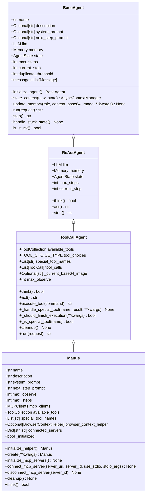
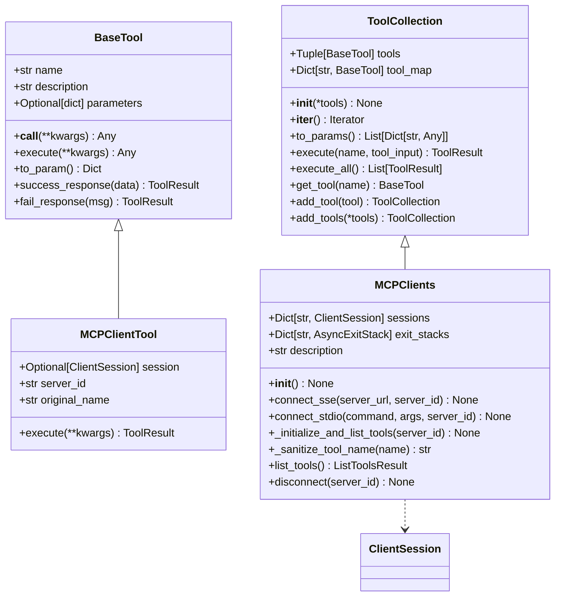
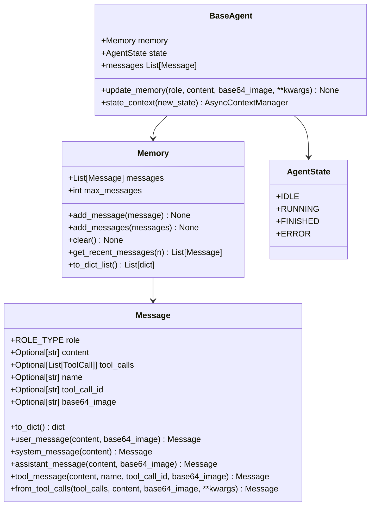
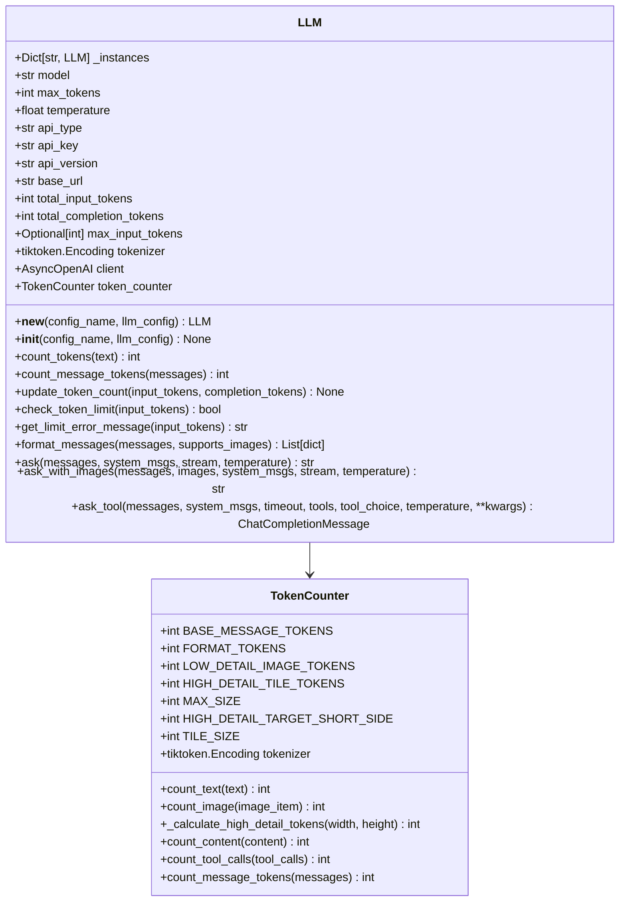
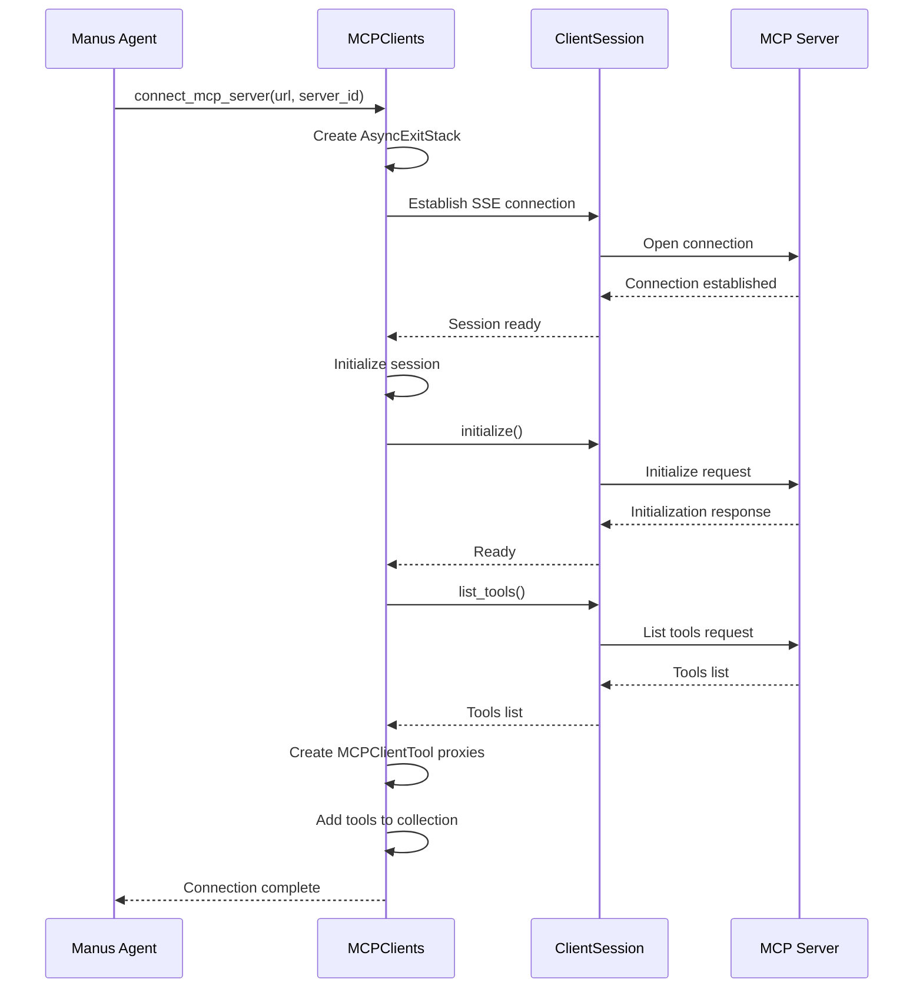
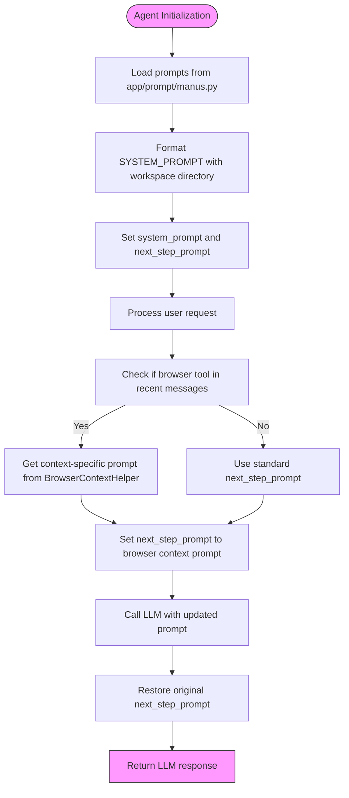

# Core Concepts

<cite>
**Referenced Files in This Document**   
- [manus.py](file://app/agent/manus.py)
- [tool_collection.py](file://app/tool/tool_collection.py)
- [llm.py](file://app/llm.py)
- [mcp.py](file://app/tool/mcp.py)
- [manus.py](file://app/prompt/manus.py)
- [base.py](file://app/agent/base.py)
- [schema.py](file://app/schema.py)
</cite>

## Table of Contents
1. [Agent Architecture](#agent-architecture)
2. [Tool Orchestration with ToolCollection](#tool-orchestration-with-toolcollection)
3. [Memory Management and State Tracking](#memory-management-and-state-tracking)
4. [LLM Integration Patterns](#llm-integration-patterns)
5. [MCP (Model Context Protocol)](#mcp-model-context-protocol)
6. [Prompt Engineering](#prompt-engineering)
7. [Common Issues and Mitigations](#common-issues-and-mitigations)
8. [Performance Optimization](#performance-optimization)

## Agent Architecture

The OpenManus system is built around a central orchestrator agent called Manus, which serves as the primary interface between users and various tools. Manus inherits from ToolCallAgent, which itself extends ReActAgent, forming a hierarchical agent architecture that enables sophisticated reasoning and action capabilities.

Manus acts as a general-purpose agent capable of solving diverse tasks by leveraging both local tools and remote tools accessed via the Model Context Protocol (MCP). The agent's design follows a modular pattern where core functionality is separated into distinct components: tool management, memory handling, LLM interaction, and state control.

The agent initialization process is carefully orchestrated through factory methods and initialization hooks. When a Manus instance is created via the `create()` class method, it automatically initializes connections to configured MCP servers, ensuring that all tools are available before the agent begins processing requests. This initialization sequence prevents race conditions and ensures consistent agent behavior.

**Diagram sources**
- [base.py](file://app/agent/base.py#L32-L196)
- [react.py](file://app/agent/react.py#L17-L38)
- [toolcall.py](file://app/agent/toolcall.py#L17-L249)
- [manus.py](file://app/agent/manus.py#L17-L164)

**Section sources**
- [manus.py](file://app/agent/manus.py#L17-L164)
- [base.py](file://app/agent/base.py#L32-L196)

## Tool Orchestration with ToolCollection

The ToolCollection class serves as the central mechanism for managing and orchestrating tools within the OpenManus system. It acts as a container that holds references to all available tools, providing a unified interface for tool discovery, execution, and lifecycle management.

Each agent instance maintains its own ToolCollection that contains both local tools and remote tools accessed via MCP. The Manus agent, for example, initializes with a set of general-purpose local tools including PythonExecute, BrowserUseTool, StrReplaceEditor, AskHuman, and Terminate. These tools are added to the ToolCollection during agent initialization, making them immediately available for use.

The ToolCollection provides several key methods for tool management:
- `add_tool()` and `add_tools()` for dynamically adding tools to the collection
- `execute()` for executing a specific tool by name with provided arguments
- `to_params()` for converting the collection into a format suitable for LLM function calling
- `get_tool()` for retrieving a specific tool instance

When connecting to MCP servers, the Manus agent dynamically updates its ToolCollection by adding tools exposed by the remote server. The `connect_mcp_server()` method establishes a connection to an MCP server and then adds the server's tools to the available_tools collection. Each remote tool is wrapped in an MCPClientTool proxy that handles the communication with the remote server, making the remote tool appear as a local tool to the agent.

This dynamic tool registration system allows the agent to adapt to changing environments and tool availability. When a connection to an MCP server is terminated via `disconnect_mcp_server()`, the agent rebuilds its ToolCollection to exclude tools from the disconnected server, ensuring that only available tools remain in the collection.

**Diagram sources**
- [tool_collection.py](file://app/tool/tool_collection.py#L8-L70)
- [mcp.py](file://app/tool/mcp.py#L36-L193)
- [base.py](file://app/tool/base.py#L132-L181)

**Section sources**
- [tool_collection.py](file://app/tool/tool_collection.py#L8-L70)
- [manus.py](file://app/agent/manus.py#L33-L41)
- [mcp.py](file://app/tool/mcp.py#L36-L193)

## Memory Management and State Tracking

Memory management in OpenManus is implemented through a combination of message history and state tracking mechanisms that enable agents to maintain context across multiple interactions. The system uses a hierarchical memory structure where each agent maintains its own memory store while also participating in broader conversation contexts.

The Memory class serves as the foundation for message storage, containing a list of Message objects that represent the conversation history. Each Message includes essential metadata such as role (system, user, assistant, or tool), content, tool calls, and identifiers for tool interactions. The memory system supports both individual message addition via `add_message()` and bulk operations through `add_messages()`.

Agents maintain their memory state through the BaseAgent class, which provides the `update_memory()` method for adding messages with appropriate role-based formatting. The memory is tightly integrated with the agent's execution loop, where each step of the agent's processing adds new messages to reflect its thoughts and actions.

State tracking is implemented through the AgentState enum, which defines the possible states an agent can occupy: IDLE, RUNNING, FINISHED, and ERROR. The agent's state is managed through a context manager pattern using the `state_context()` method, which ensures proper state transitions and cleanup in case of errors. This state management system prevents agents from executing in invalid states and provides clear visibility into the agent's current status.

The Manus agent enhances this basic memory system with additional context awareness. In its `think()` method, it examines recent messages to detect if the browser tool is currently in use, and if so, it dynamically adjusts the next_step_prompt to provide more appropriate guidance for browser interactions. This contextual awareness allows the agent to adapt its behavior based on the current task context.

**Diagram sources**
- [schema.py](file://app/schema.py#L100-L187)
- [base.py](file://app/agent/base.py#L32-L196)

**Section sources**
- [schema.py](file://app/schema.py#L100-L187)
- [base.py](file://app/agent/base.py#L32-L196)

## LLM Integration Patterns

The LLM integration in OpenManus is designed to provide robust, flexible, and efficient interaction with language models through the LLM class. This class serves as a wrapper around various LLM providers, abstracting away the differences between APIs while providing consistent interfaces for different types of interactions.

The LLM class supports three primary interaction patterns through dedicated methods:
- `ask()` for standard text generation without tool use
- `ask_with_images()` for multimodal interactions that include image inputs
- `ask_tool()` for function calling scenarios where the LLM should select from available tools

Each of these methods implements comprehensive error handling and retry logic using the tenacity library. The retry configuration uses exponential backoff with randomization (`wait_random_exponential`) and stops after six attempts (`stop_after_attempt(6)`). This retry strategy helps mitigate transient issues like rate limiting and network timeouts while preventing infinite retry loops.

Token management is a critical aspect of the LLM integration, handled by the TokenCounter class. This component calculates token usage for messages, tool calls, and images according to the specific rules of different models. For text, it uses tiktoken to count tokens accurately. For images, it implements the OpenAI vision model token calculation algorithm, which varies based on image detail level and dimensions.

The system also implements input token limits to prevent excessive usage. When `max_input_tokens` is configured, the LLM checks whether adding new messages would exceed this limit before making API calls. This feature helps control costs and prevent performance issues related to extremely long contexts.

**Diagram sources**
- [llm.py](file://app/llm.py#L173-L765)
- [llm.py](file://app/llm.py#L44-L170)

**Section sources**
- [llm.py](file://app/llm.py#L173-L765)

## MCP (Model Context Protocol)

The Model Context Protocol (MCP) implementation in OpenManus enables agents to access remote tools through standardized communication channels. The MCPClients class extends ToolCollection to provide a unified interface for managing connections to multiple MCP servers, whether they use SSE (Server-Sent Events) or stdio transport.

MCP servers are configured through the mcp_config in the system configuration, which specifies server connections via URL (for SSE) or command (for stdio). During agent initialization, the `initialize_mcp_servers()` method iterates through these configurations and establishes connections to each server. The connection process is resilient, with error handling that logs failures but continues attempting to connect to other servers.

When connecting to an MCP server, the system creates an AsyncExitStack to manage the lifecycle of the connection resources. For SSE connections, it establishes a streaming connection to the server URL. For stdio connections, it launches the specified command and communicates through standard input/output streams. Once connected, the client initializes the session and retrieves the list of available tools through `list_tools()`.

Each remote tool is represented locally by an MCPClientTool proxy that handles the communication with the remote server. To avoid naming conflicts, remote tool names are prefixed with "mcp_{server_id}_" and sanitized to ensure they meet naming requirements. The `_sanitize_tool_name()` method replaces invalid characters, removes consecutive underscores, and truncates names to 64 characters if necessary.

The system supports dynamic tool registration and deregistration. When a server connection is established, its tools are added to the local ToolCollection. When a connection is terminated through `disconnect()`, the corresponding tools are removed from the collection. This dynamic management allows the agent to adapt to changing tool availability without requiring restarts.

**Diagram sources**
- [mcp.py](file://app/tool/mcp.py#L36-L193)
- [manus.py](file://app/agent/manus.py#L90-L111)

**Section sources**
- [mcp.py](file://app/tool/mcp.py#L36-L193)

## Prompt Engineering

Prompt engineering in OpenManus plays a crucial role in guiding agent behavior and decision-making. The system uses a combination of system prompts and step prompts to provide context and direction to the LLM.

The Manus agent uses two primary prompts defined in app/prompt/manus.py:
- `SYSTEM_PROMPT`: Provides the foundational context for the agent, establishing its identity as "OpenManus, an all-capable AI assistant" with various tools at its disposal. It also includes the workspace directory context, which helps the agent understand the file system environment.
- `NEXT_STEP_PROMPT`: Guides the agent's decision-making process by instructing it to proactively select appropriate tools, break down complex tasks, explain execution results, and suggest next steps.

These prompts are integrated into the agent through the system_prompt and next_step_prompt fields. The system prompt is formatted with the workspace root directory during initialization, making it dynamic based on the deployment environment.

The agent's `think()` method demonstrates advanced prompt management by dynamically adjusting the next_step_prompt based on context. When the browser tool is in use (detected by examining recent tool calls), the agent replaces the standard next_step_prompt with a context-specific prompt from the BrowserContextHelper. After processing, it restores the original prompt, ensuring that context-specific guidance doesn't persist beyond its relevance.

This contextual prompt adaptation allows the agent to provide more focused and relevant guidance when performing specific types of tasks. For example, when interacting with web content through the browser tool, the agent can provide more detailed instructions about navigation, element selection, and content extraction.

**Diagram sources**
- [manus.py](file://app/agent/manus.py#L139-L164)
- [manus.py](file://app/agent/manus.py#L23-L24)
- [manus.py](file://app/prompt/manus.py#L1-L10)

**Section sources**
- [manus.py](file://app/agent/manus.py#L23-L24)
- [manus.py](file://app/prompt/manus.py#L1-L10)

## Common Issues and Mitigations

The OpenManus system addresses several common issues in agent-based systems through thoughtful design and implementation patterns.

Tool conflicts are mitigated through the ToolCollection's name-based tool management system. When adding tools, the `add_tool()` method checks for name conflicts and skips tools that would overwrite existing ones, logging a warning instead. For MCP tools, the system uses a naming convention that prefixes tool names with "mcp_{server_id}_" to ensure uniqueness across different servers. The `_sanitize_tool_name()` method further ensures compatibility by replacing invalid characters and truncating long names.

Prompt injection risks are addressed through multiple layers of protection. The system uses structured tool calling rather than free-form text generation for tool execution, limiting the LLM's ability to directly control tool parameters. Tool arguments are parsed from JSON and validated against expected schemas before execution. Additionally, the MCPClientTool proxy validates that tool calls are made through proper channels rather than direct LLM output manipulation.

Rate limiting is handled through the LLM class's retry mechanism, which uses exponential backoff to gracefully handle rate limit errors from LLM providers. The retry logic specifically catches RateLimitError exceptions and logs appropriate messages, allowing the system to recover from temporary throttling without failing the entire operation. The token counting system also helps prevent rate limiting by avoiding excessively large requests that might trigger stricter rate limits.

Other common issues are addressed as well:
- Token limit exceeded errors are caught and handled gracefully, with the system providing clear error messages to the user
- Network connectivity issues are mitigated through retry logic and connection cleanup procedures
- Tool execution errors are captured and returned as structured ToolResult objects rather than propagating raw exceptions
- Memory leaks are prevented through proper resource cleanup in the agent's cleanup() method

## Performance Optimization

Several performance optimization strategies are implemented in OpenManus to reduce LLM calls and improve response times.

The token counting system enables proactive management of context length, preventing unnecessary API calls that would fail due to token limits. By calculating token usage before making requests, the system can avoid sending requests that would be rejected, saving both time and cost.

Caching strategies are implicitly supported through the agent's memory system, which retains context across interactions. This reduces the need to reprocess information that has already been discussed, allowing the agent to build on previous conversations rather than starting from scratch each time.

The MCP connection management system optimizes performance by maintaining persistent connections to servers rather than establishing new connections for each tool call. The AsyncExitStack ensures proper resource cleanup while allowing connections to remain open for multiple interactions.

Efficient tool execution is achieved through the ToolCollection's direct execution model. Rather than making multiple API calls, the agent executes tools locally and only calls the LLM when necessary for decision-making. This reduces the round-trip time associated with external API calls.

Additional optimization opportunities include:
- Implementing result caching for expensive tool operations
- Using streaming responses where appropriate to provide faster initial feedback
- Optimizing image token usage by adjusting detail levels based on task requirements
- Parallelizing independent tool calls when possible
- Pre-loading frequently used tools and models

These optimizations work together to create a responsive agent system that minimizes latency and maximizes efficiency in its interactions with both users and external systems.