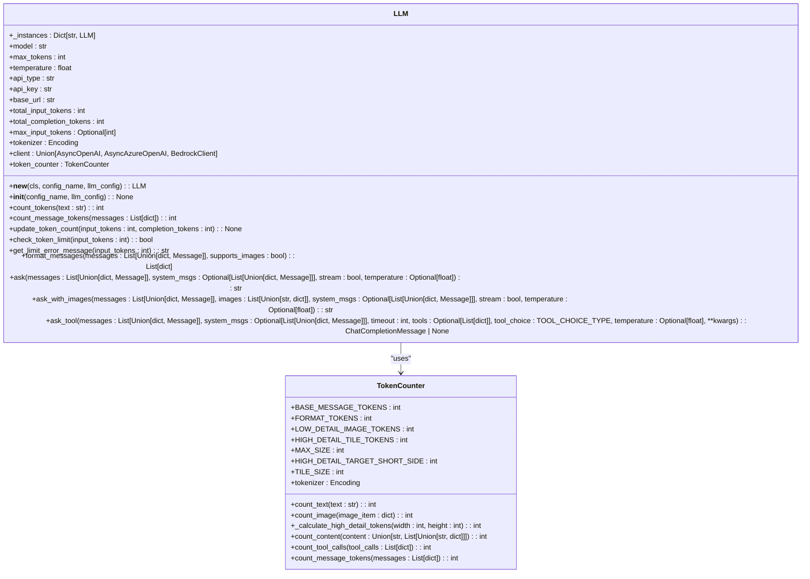
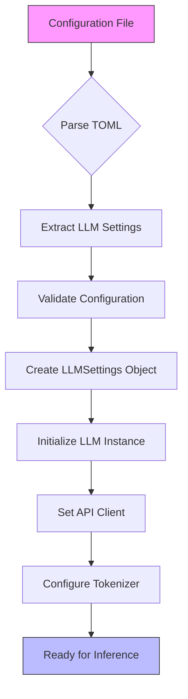
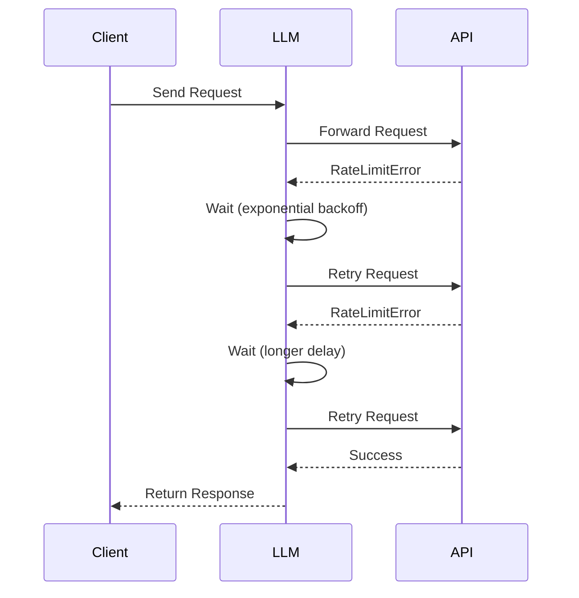
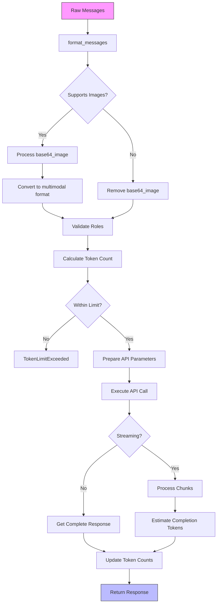
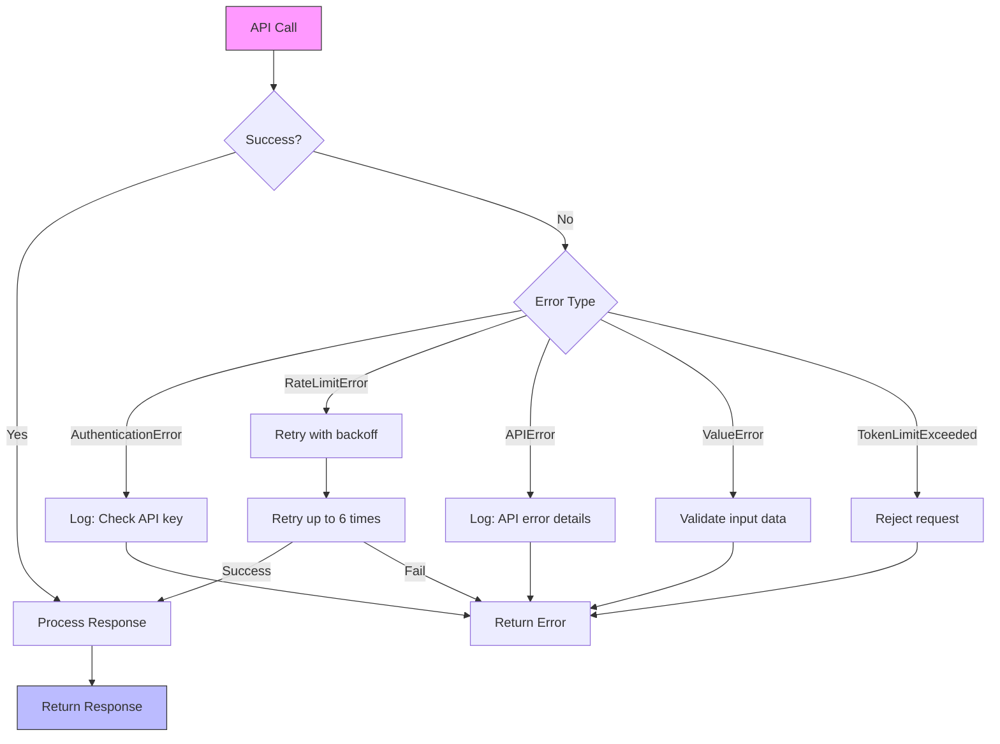
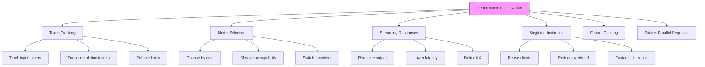

# LLM Integration

<cite>
**Referenced Files in This Document**   
- [llm.py](file://app/llm.py)
- [config.py](file://app/config.py)
- [config.example.toml](file://config/config.example.toml)
- [config.example-model-azure.toml](file://config/config.example-model-azure.toml)
- [config.example-model-anthropic.toml](file://config/config.example-model-anthropic.toml)
- [config.example-model-ollama.toml](file://config/config.example-model-ollama.toml)
</cite>

## Table of Contents
1. [LLM Class Implementation](#llm-class-implementation)
2. [Model Selection and Configuration](#model-selection-and-configuration)
3. [Token Counting Mechanisms](#token-counting-mechanisms)
4. [Retry Logic with Exponential Backoff](#retry-logic-with-exponential-backoff)
5. [Prompt-to-Response Flow](#prompt-to-response-flow)
6. [Error Handling](#error-handling)
7. [Performance Optimization](#performance-optimization)

## LLM Class Implementation

The LLM class in OpenManus serves as the central interface for interacting with various language models. Implemented as a singleton pattern using the `__new__` method, it ensures that only one instance exists per configuration name, promoting resource efficiency and consistent state management across the application.

The class initialization process begins with the `__init__` method, which sets up essential attributes including model configuration, API credentials, and tokenization settings. It supports multiple API types through conditional client instantiation: `AsyncAzureOpenAI` for Azure deployments, `BedrockClient` for AWS services, and `AsyncOpenAI` for standard OpenAI endpoints. This flexible architecture allows seamless integration with different LLM providers while maintaining a consistent interface.



**Diagram sources**
- [llm.py](file://app/llm.py#L173-L765)

**Section sources**
- [llm.py](file://app/llm.py#L173-L226)

## Model Selection and Configuration

OpenManus implements a flexible configuration system for LLM provider selection through TOML settings files. The configuration framework supports multiple providers including OpenAI, Anthropic, Azure, and Ollama, allowing users to switch between different LLM services without code modifications. Configuration is managed through the `LLMSettings` class in `config.py`, which defines essential parameters such as model name, API endpoint, authentication key, token limits, and temperature settings.

The system uses a hierarchical configuration approach with a default configuration that can be overridden by provider-specific settings. Example configuration files demonstrate the setup for various providers:
- **Anthropic**: Uses the `claude-3-7-sonnet-latest` model with Anthropic's API endpoint
- **Azure OpenAI**: Configures `gpt-4o-mini` with Azure-specific deployment parameters
- **Ollama**: Points to a local Ollama server running on `localhost:11434`

Each configuration includes provider-specific fields such as `api_type` to distinguish between service providers and `api_version` for Azure deployments. The system also supports vision-specific configurations through the `[llm.vision]` section, enabling different models for text and image processing tasks. This modular approach allows for easy extension to additional providers by simply adding new configuration templates.



**Diagram sources**
- [config.py](file://app/config.py#L10-L70)
- [config.example.toml](file://config/config.example.toml#L1-L106)
- [config.example-model-azure.toml](file://config/config.example-model-azure.toml#L1-L18)

**Section sources**
- [config.py](file://app/config.py#L10-L70)
- [config.example.toml](file://config/config.example.toml#L1-L106)

## Token Counting Mechanisms

The token counting system in OpenManus is implemented through the `TokenCounter` class, which provides comprehensive token calculation for various message components. The system handles both text and image content, with specialized algorithms for calculating tokens based on content type and detail level. For text content, the system uses `tiktoken` encoding to accurately count tokens according to the specific model's tokenizer.

Image token calculation follows a sophisticated algorithm that accounts for image detail levels and dimensions. The system distinguishes between three detail levels:
- **Low detail**: Fixed cost of 85 tokens regardless of image size
- **Medium detail**: Uses high-detail calculation by default
- **High detail**: Calculates tokens based on image dimensions using a multi-step process

For high-detail images, the token calculation involves:
1. Scaling the image to fit within a 2048x2048 pixel boundary
2. Scaling the shortest side to 768 pixels
3. Dividing the image into 512x512 pixel tiles
4. Assigning 170 tokens per tile plus a base cost of 85 tokens

The system also accounts for structural tokens in message formatting, including 4 base tokens per message and 2 format tokens for the overall message structure. Tool calls are counted by summing the tokens from function names and argument strings. This comprehensive approach ensures accurate token estimation, which is critical for managing API costs and avoiding rate limits.

```mermaid
flowchart TD
A[Input Content] --> B{Content Type?}
B --> |Text| C[Use tiktoken.encode()]
B --> |Image| D{Detail Level?}
D --> |Low| E[85 tokens]
D --> |High/Medium| F[Calculate Dimensions]
F --> G[Scale to 2048x2048]
G --> H[Scale Shortest Side to 768px]
H --> I[Count 512px Tiles]
I --> J[170 tokens per tile + 85 base]
C --> K[Return Token Count]
E --> K
J --> K
style A fill:#f9f,stroke:#333
style K fill:#bbf,stroke:#333
```

**Diagram sources**
- [llm.py](file://app/llm.py#L44-L170)

**Section sources**
- [llm.py](file://app/llm.py#L44-L170)

## Retry Logic with Exponential Backoff

OpenManus implements robust retry logic using the `tenacity` library to handle transient failures and rate limits. The retry mechanism is applied to all LLM interaction methods (`ask`, `ask_with_images`, and `ask_tool`) through the `@retry` decorator, ensuring consistent error handling across the application. The retry configuration uses exponential backoff with a random delay between 1 and 60 seconds, preventing thundering herd problems when multiple requests fail simultaneously.

The retry policy is configured to attempt up to 6 times before giving up, providing a balance between resilience and responsiveness. The system specifically retries on `OpenAIError`, general `Exception`, and `ValueError` types, but excludes `TokenLimitExceeded` from retry attempts since this represents a permanent condition rather than a transient failure. This selective retry approach prevents infinite loops when encountering non-recoverable errors.

When a rate limit error occurs, the system logs a specific message suggesting users consider increasing retry attempts, providing actionable feedback for optimization. Authentication errors are also logged with a clear message to check API keys, helping users quickly diagnose configuration issues. The retry mechanism works in conjunction with the token limit checking system, ensuring that only valid requests are retried and preventing unnecessary API calls that would inevitably fail due to token constraints.



**Diagram sources**
- [llm.py](file://app/llm.py#L360-L765)

**Section sources**
- [llm.py](file://app/llm.py#L360-L765)

## Prompt-to-Response Flow

The prompt-to-response flow in OpenManus follows a structured preprocessing and postprocessing pipeline that ensures consistent message formatting and proper error handling. The flow begins with message preprocessing through the `format_messages` method, which converts various message types (including `Message` objects and dictionaries) into the standardized OpenAI message format. This method handles image content by converting base64-encoded images into data URLs and organizing content into multimodal format when images are present.

For standard text requests, the `ask` method orchestrates the complete flow:
1. Determine if the model supports images based on the model name
2. Format system and user messages with appropriate image handling
3. Calculate input token count using the `TokenCounter`
4. Validate against configured token limits
5. Construct API parameters with model-specific settings
6. Execute the request with streaming or non-streaming options
7. Process the response and update token usage statistics

The system handles both streaming and non-streaming responses differently. For non-streaming requests, it directly accesses the completion tokens from the API response. For streaming responses, it estimates completion tokens by counting tokens in the received text chunks, as streaming responses don't provide usage information. The flow includes comprehensive error handling at each stage, with specific exceptions for token limit violations, validation errors, and API-level issues.



**Diagram sources**
- [llm.py](file://app/llm.py#L266-L351)
- [llm.py](file://app/llm.py#L360-L478)

**Section sources**
- [llm.py](file://app/llm.py#L266-L351)
- [llm.py](file://app/llm.py#L360-L478)

## Error Handling

OpenManus implements comprehensive error handling for common LLM integration issues, with specific strategies for authentication failures, model unavailability, and response parsing errors. The system uses a layered exception handling approach that distinguishes between recoverable and non-recoverable errors, allowing appropriate responses to different failure modes.

Authentication failures are caught through the `AuthenticationError` exception from the OpenAI library. When detected, the system logs a clear error message advising users to check their API key configuration. This immediate feedback helps users quickly resolve credential issues without needing to debug the underlying cause.

Model unavailability and rate limiting are handled through the retry mechanism with exponential backoff. The `RateLimitError` is specifically identified and logged with a suggestion to increase retry attempts, providing users with actionable guidance for optimizing their configuration. For models that don't support certain features (like image processing), the system raises `ValueError` with descriptive messages indicating which models support the requested functionality.

Response parsing errors are addressed through validation checks on the API response structure. The system verifies that responses contain valid choices and message content before returning results. Empty or invalid responses trigger `ValueError` exceptions with descriptive messages. The token limit system prevents requests that would exceed configured limits by raising `TokenLimitExceeded` exceptions, which are not retried since they represent a permanent condition rather than a transient failure.



**Diagram sources**
- [llm.py](file://app/llm.py#L360-L765)

**Section sources**
- [llm.py](file://app/llm.py#L360-L765)

## Performance Optimization

OpenManus incorporates several performance optimization strategies to enhance efficiency and reduce costs in LLM operations. The most significant optimization is the token tracking system, which maintains cumulative counts of input and completion tokens across requests. This allows the system to enforce configurable limits on total token usage, preventing runaway costs from extended conversations or recursive operations.

The system supports cost-effective model selection through its configuration-driven provider system. Users can choose between different models based on their cost-performance trade-offs, with higher-cost models typically offering better reasoning capabilities and lower-cost models suitable for simpler tasks. The configuration system makes it easy to switch between providers based on specific use cases and budget constraints.

While the current implementation doesn't include explicit caching mechanisms, the singleton pattern used in the LLM class reduces initialization overhead by reusing client instances. The streaming response support allows for real-time processing of responses without waiting for complete generation, improving perceived performance for users. The system could be further optimized by implementing response caching for frequently requested information or by adding parallel request handling capabilities to process multiple independent queries simultaneously.



**Diagram sources**
- [llm.py](file://app/llm.py#L173-L765)
- [config.py](file://app/config.py#L10-L70)

**Section sources**
- [llm.py](file://app/llm.py#L173-L765)
- [config.py](file://app/config.py#L10-L70)