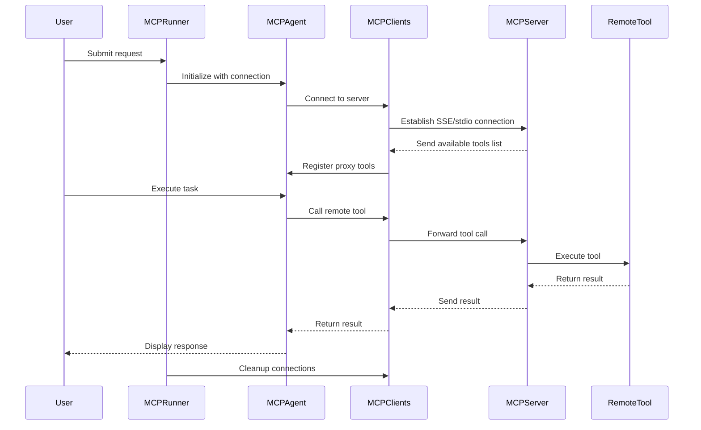

# MCP Protocol

<cite>
**Referenced Files in This Document**   
- [app/tool/mcp.py](file://app/tool/mcp.py)
- [app/mcp/server.py](file://app/mcp/server.py)
- [run_mcp_server.py](file://run_mcp_server.py)
- [run_mcp.py](file://run_mcp.py)
- [config/mcp.example.json](file://config/mcp.example.json)
</cite>

## Table of Contents
1. [Introduction](#introduction)
2. [MCP Client Implementation](#mcp-client-implementation)
3. [MCP Server Implementation](#mcp-server-implementation)
4. [End-to-End Workflow](#end-to-end-workflow)
5. [Configuration Requirements](#configuration-requirements)
6. [Security Considerations](#security-considerations)
7. [Common Issues and Troubleshooting](#common-issues-and-troubleshooting)
8. [Best Practices](#best-practices)

## Introduction
The Model Context Protocol (MCP) serves as a mechanism for remote tool access and dynamic tool registration within the OpenManus framework. MCP enables agents to consume tools hosted on remote servers through standardized communication protocols. The architecture separates tool providers (MCP servers) from tool consumers (MCP clients), allowing for flexible integration of external capabilities. This protocol supports two transport methods: Server-Sent Events (SSE) for HTTP-based communication and stdio for local process communication. The system facilitates dynamic discovery and execution of tools, enabling agents to leverage remote capabilities without direct integration.

## MCP Client Implementation
The MCP client implementation in `app/tool/mcp.py` provides the infrastructure for consuming remote tools through both SSE and stdio transports. The `MCPClients` class acts as a collection manager that establishes connections to MCP servers and dynamically registers available tools. When connecting via SSE, the client uses the `connect_sse` method to establish a persistent HTTP connection to the server's endpoint, while the `connect_stdio` method launches a subprocess and communicates through standard input/output streams.

The client maintains sessions for each connected server, tracking them by server ID. Upon successful connection, the client initializes the session and retrieves the list of available tools through the `list_tools` method. For each remote tool, the client creates a proxy object (`MCPClientTool`) that encapsulates the tool's metadata and execution logic. These proxy tools are integrated into the local tool registry with names prefixed by "mcp_" followed by the server ID and original tool name, ensuring namespace isolation.

Tool execution occurs through the `execute` method of `MCPClientTool`, which forwards the tool call to the remote server via the established session. The client handles connection lifecycle management through the `disconnect` method, which properly closes sessions and removes associated tools from the local registry. The implementation includes robust error handling for connection failures and uses asynchronous context managers to ensure proper resource cleanup.

**Section sources**
- [app/tool/mcp.py](file://app/tool/mcp.py#L36-L193)

## MCP Server Implementation
The MCP server implementation in `app/mcp/server.py` exposes local tools to external agents through the Model Context Protocol. The `MCPServer` class serves as the central component, managing tool registration and handling incoming requests. During initialization, the server creates instances of standard tools including bash execution, browser interaction, text editing, and termination capabilities.

Tool registration occurs through the `register_tool` method, which converts a `BaseTool` instance into a callable function with appropriate metadata. The server builds function signatures and docstrings from the tool's parameter schema, enabling proper type checking and documentation. The `_build_signature` method maps JSON Schema types to Python type annotations, while `_build_docstring` generates human-readable documentation including parameter descriptions and requirements.

The server utilizes the FastMCP framework to handle incoming requests, with the `run` method starting the server in either stdio or HTTP mode. Before shutdown, the server executes cleanup procedures through the `cleanup` method, which currently handles browser resource cleanup. The `register_all_tools` method automatically registers all initialized tools with the server, making them available to connected clients.

**Section sources**
- [app/mcp/server.py](file://app/mcp/server.py#L23-L159)

## End-to-End Workflow
The end-to-end workflow begins with the MCP server startup via `run_mcp_server.py`, which initializes the `MCPServer` instance and starts listening for connections. The server exposes its tools through the configured transport method (stdio by default). External agents connect to this server to access its capabilities.

Agent integration occurs through `run_mcp.py`, which implements the `MCPRunner` class to manage the MCP agent lifecycle. The runner initializes the `MCPAgent` with connection parameters and establishes communication with the MCP server. The agent maintains a reference to the `MCPClients` tool collection, which manages connections to one or more MCP servers.

When a user submits a request, the agent processes it through its `think` method, which periodically refreshes the available tools list to detect changes in the server's tool registry. Tool execution requests are forwarded to the appropriate MCP server, with results returned to the agent for processing. The agent handles special tools like "terminate" to control execution flow and manages multimedia responses through appropriate message formatting.

The workflow concludes with proper cleanup through the `cleanup` method, which disconnects from all MCP servers and releases resources. This end-to-end process enables seamless integration of remote tools into the agent's capabilities, allowing for dynamic expansion of functionality without code changes.

**Diagram sources **
- [run_mcp_server.py](file://run_mcp_server.py#L0-L11)
- [run_mcp.py](file://run_mcp.py#L0-L116)
- [app/mcp/server.py](file://app/mcp/server.py#L23-L159)
- [app/tool/mcp.py](file://app/tool/mcp.py#L36-L193)

**Section sources**
- [run_mcp_server.py](file://run_mcp_server.py#L0-L11)
- [run_mcp.py](file://run_mcp.py#L0-L116)

## Configuration Requirements
Configuration for MCP integration is managed through the `mcp.json` file, with `mcp.example.json` providing a template. The configuration follows a structured format where each MCP server is defined with a unique identifier and connection parameters. The example configuration demonstrates a single server entry with "server1" as the identifier, specifying the connection type as "sse" and providing the server URL.

The configuration schema, defined in `app/config.py`, supports both SSE and stdio connection types. For SSE connections, the URL field specifies the server endpoint, typically pointing to an SSE endpoint on a specific port. For stdio connections, the command and args fields specify the executable and arguments needed to launch the server process.

The MCP settings also include a server_reference field that specifies the Python module path for the MCP server implementation, defaulting to "app.mcp.server". This modular approach allows for customization of the server implementation while maintaining compatibility with the protocol.

Configuration loading occurs at application startup, with the system first checking for a `mcp.json` file in the config directory and falling back to the example file if necessary. The configuration is parsed into `MCPServerConfig` and `MCPSettings` Pydantic models, providing type safety and validation.

**Section sources**
- [config/mcp.example.json](file://config/mcp.example.json#L0-L8)
- [app/config.py](file://app/config.py#L126-L159)

## Security Considerations
Exposing MCP endpoints requires careful security consideration due to the potential for remote code execution and data access. The current implementation lacks built-in authentication mechanisms, making network-level security essential when deploying MCP servers. Servers should be protected by firewalls and access controls to prevent unauthorized access.

The stdio transport method, while convenient for local development, should be used cautiously in production environments as it grants the connected agent access to the server's process environment. For SSE connections, servers should be deployed behind reverse proxies with TLS encryption to protect data in transit.

The server implementation includes potentially powerful tools like bash execution, which could be exploited if accessed by unauthorized parties. Input validation and sandboxing should be implemented to limit the scope of tool execution. The termination tool should be protected to prevent denial-of-service attacks.

Future enhancements should include authentication tokens, rate limiting, and role-based access control to restrict which tools can be accessed by different clients. Logging and monitoring should be implemented to detect suspicious activity and provide audit trails for security investigations.

**Section sources**
- [app/mcp/server.py](file://app/mcp/server.py#L23-L159)
- [app/tool/mcp.py](file://app/tool/mcp.py#L36-L193)

## Common Issues and Troubleshooting
Connection timeouts typically occur when the MCP server is unreachable or overloaded. This can be addressed by verifying network connectivity, checking server status, and ensuring the correct URL or command is specified in the configuration. For SSE connections, firewall rules may need to be adjusted to allow traffic on the specified port.

Schema mismatches often arise when there are version incompatibilities between the MCP client and server implementations. These can be resolved by ensuring both components use compatible versions of the MCP protocol. The client's periodic tool refresh mechanism helps detect and adapt to schema changes during runtime.

Authentication failures are not explicitly handled in the current implementation but would occur if authentication mechanisms are added. When implementing authentication, ensure credentials are properly configured in both client and server environments, and verify that tokens are not expired.

Other common issues include:
- Invalid tool names due to special characters (resolved by the `_sanitize_tool_name` method)
- Missing required arguments in tool calls
- Server process failures when using stdio transport
- Resource leaks from improper connection cleanup

The system includes comprehensive logging to aid troubleshooting, with log messages indicating connection status, tool registration, and execution results. The `disconnect` method includes error handling for cleanup operations, allowing graceful degradation when connections cannot be properly closed.

**Section sources**
- [app/tool/mcp.py](file://app/tool/mcp.py#L154-L193)
- [app/mcp/server.py](file://app/mcp/server.py#L137-L142)

## Best Practices
To secure MCP endpoints, deploy servers in isolated network environments with restricted access. Use TLS encryption for all SSE connections and implement authentication mechanisms when exposing servers to untrusted networks. Regularly audit tool permissions and limit access to sensitive capabilities.

For optimal remote tool performance, minimize network latency by deploying servers close to clients when possible. Implement connection pooling to reduce the overhead of establishing new connections. Optimize tool execution by batching related operations and caching frequently accessed data.

Monitor server performance and set appropriate timeouts to prevent hanging operations. Implement health checks to detect and recover from server failures. Use the periodic tool refresh feature to detect server restarts and re-establish connections as needed.

When designing tools for MCP exposure, follow the principle of least privilege by limiting tool capabilities to only what is necessary. Provide clear documentation through descriptive names, parameters, and help text to facilitate proper usage. Test tools thoroughly in isolated environments before exposing them through MCP.

Regularly update both client and server components to ensure compatibility and security. Maintain backup configurations and implement disaster recovery procedures to handle server failures. Document all MCP integrations and maintain an inventory of exposed tools and their access controls.