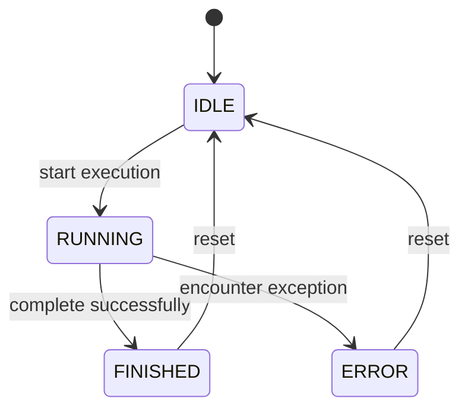
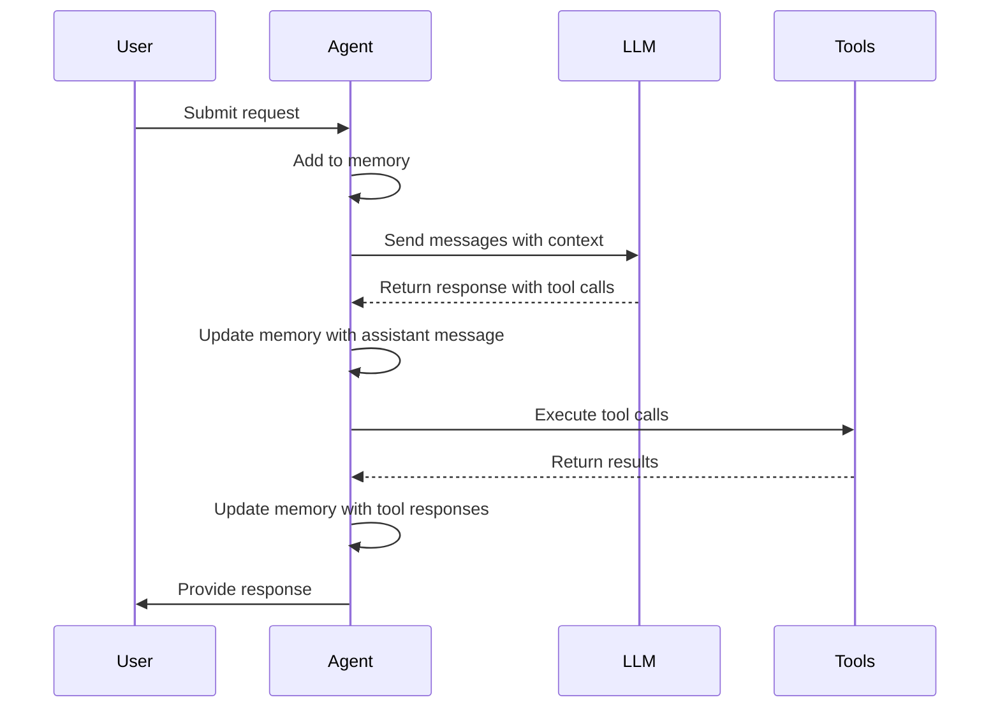
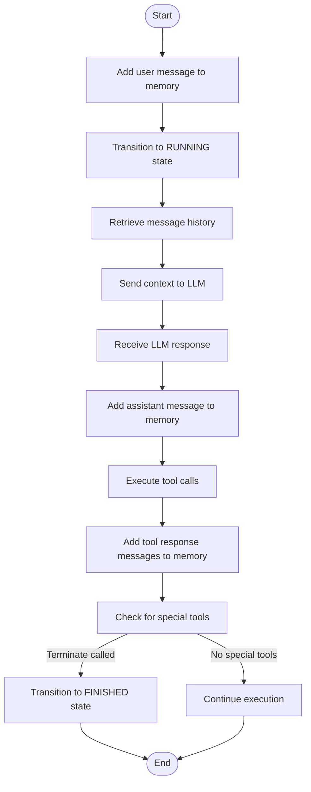

# Memory Management

<cite>
**Referenced Files in This Document**   
- [manus.py](file://app/agent/manus.py)
- [toolcall.py](file://app/agent/toolcall.py)
- [base.py](file://app/agent/base.py)
- [schema.py](file://app/schema.py)
- [prompt/manus.py](file://app/prompt/manus.py)
</cite>

## Table of Contents
1. [Introduction](#introduction)
2. [Memory Architecture](#memory-architecture)
3. [State Management](#state-management)
4. [Message History and Context Preservation](#message-history-and-context-preservation)
5. [Prompt Construction with Historical Context](#prompt-construction-with-historical-context)
6. [LLM Response Processing and State Updates](#llm-response-processing-and-state-updates)
7. [Memory Integration Patterns](#memory-integration-patterns)
8. [Common Memory Issues](#common-memory-issues)
9. [Memory Optimization Best Practices](#memory-optimization-best-practices)
10. [Memory State Transitions](#memory-state-transitions)

## Introduction
The OpenManus agent employs a sophisticated memory management system to maintain conversation history and state across multiple interaction turns. This system enables contextual understanding and coherent multi-step task execution by preserving message history in the AgentState object. The memory architecture integrates seamlessly with prompt engineering and LLM interaction patterns, allowing the agent to maintain context throughout complex workflows. This documentation details how memory is structured, managed, and optimized within the OpenManus framework, with specific examples from the implementation in manus.py and related components.

## Memory Architecture
The memory architecture in OpenManus is built around the Memory class, which stores conversation messages and manages their lifecycle. The Memory class contains a list of Message objects and provides methods for adding, retrieving, and managing messages. Each Message object includes role, content, tool calls, and other metadata necessary for maintaining conversation context. The architecture supports message pruning through the max_messages parameter, which limits the number of messages retained in memory to prevent unbounded growth.

**Section sources**
- [schema.py](file://app/schema.py#L158-L186)
- [base.py](file://app/agent/base.py#L33)

## State Management
Agent state management in OpenManus is implemented through the AgentState enum and state context management. The AgentState enum defines four possible states: IDLE, RUNNING, FINISHED, and ERROR. The state_context method in BaseAgent provides a context manager for safe state transitions, ensuring that the agent reverts to its previous state after execution completes. This mechanism prevents state corruption and enables reliable error handling. When exceptions occur during execution, the agent automatically transitions to the ERROR state, while successful completion transitions to the FINISHED state.

**Diagram sources**
- [schema.py](file://app/schema.py#L31-L37)
- [base.py](file://app/agent/base.py#L58-L81)

**Section sources**
- [schema.py](file://app/schema.py#L31-L37)
- [base.py](file://app/agent/base.py#L58-L81)

## Message History and Context Preservation
Message history in OpenManus is preserved through the Memory class, which maintains a chronological list of all conversation messages. The system adds messages to memory through the update_memory method in BaseAgent, which creates appropriate Message objects based on the sender role (user, system, assistant, or tool). Each message includes content and metadata such as tool calls and base64-encoded images when applicable. The memory system automatically handles message limits by pruning older messages when the max_messages threshold is exceeded, ensuring that the most recent context is preserved while preventing memory overflow.

**Section sources**
- [schema.py](file://app/schema.py#L158-L186)
- [base.py](file://app/agent/base.py#L83-L113)

## Prompt Construction with Historical Context
Prompt construction in OpenManus leverages historical context by incorporating relevant portions of the message history into the LLM request. The system uses the messages property from the agent's memory to provide context for the LLM, including system prompts, user requests, and previous interactions. The think method in ToolCallAgent retrieves the message history and passes it to the LLM's ask_tool method, which constructs the complete prompt with appropriate context. For specific scenarios like browser interactions, the system dynamically modifies the next_step_prompt to provide focused guidance based on recent activity.

**Section sources**
- [toolcall.py](file://app/agent/toolcall.py#L38-L128)
- [manus.py](file://app/agent/manus.py#L145-L164)

## LLM Response Processing and State Updates
LLM response processing in OpenManus involves extracting tool calls and content from the LLM response and updating the agent state accordingly. The think method processes the LLM response by creating an assistant message with tool calls and adding it to memory using Message.from_tool_calls. If the response contains tool calls, these are stored in the tool_calls field and executed in the subsequent act phase. The system handles token limit errors by catching TokenLimitExceeded exceptions and transitioning to the FINISHED state with an appropriate error message. After processing the response, the agent updates its internal state and prepares for the next interaction cycle.

**Section sources**
- [toolcall.py](file://app/agent/toolcall.py#L38-L128)
- [toolcall.py](file://app/agent/toolcall.py#L130-L163)

## Memory Integration Patterns
The integration between memory storage, prompt engineering, and LLM interaction follows a consistent pattern across OpenManus components. The agent retrieves its message history from memory and passes it to the LLM for prompt construction. After receiving the LLM response, the agent updates memory with the assistant's message and any tool responses. This cycle repeats for each interaction step, with the memory serving as the central repository for conversation context. Special tools like Terminate trigger state changes that affect the overall execution flow, demonstrating how memory, state, and tool execution are tightly coupled in the system.

**Diagram sources**
- [toolcall.py](file://app/agent/toolcall.py#L38-L128)
- [toolcall.py](file://app/agent/toolcall.py#L130-L163)

## Common Memory Issues
OpenManus addresses several common memory management issues, including context window overflow, memory leaks, and stale context persistence. Context window overflow is handled by catching TokenLimitExceeded exceptions and terminating execution gracefully. Memory leaks are prevented through the use of message limits in the Memory class and proper cleanup in the agent's cleanup method. Stale context persistence is mitigated by the is_stuck method, which detects duplicate responses and triggers a change in strategy through the handle_stuck_state method. These mechanisms ensure that the agent maintains efficient and effective memory usage throughout its lifecycle.

**Section sources**
- [toolcall.py](file://app/agent/toolcall.py#L38-L128)
- [base.py](file://app/agent/base.py#L169-L185)

## Memory Optimization Best Practices
Memory optimization in OpenManus follows several best practices to ensure efficient operation. Message pruning is implemented through the max_messages parameter in the Memory class, which automatically removes older messages when the limit is exceeded. The system uses the max_observe parameter to limit the length of tool execution results, preventing excessively long observations from consuming memory. Context summarization is achieved through the use of focused prompts that highlight relevant aspects of the conversation history. Additionally, the agent's cleanup method ensures that resources are properly released after execution, preventing memory leaks in long-running processes.

**Section sources**
- [schema.py](file://app/schema.py#L162-L167)
- [toolcall.py](file://app/agent/toolcall.py#L130-L163)
- [toolcall.py](file://app/agent/toolcall.py#L228-L242)

## Memory State Transitions
Memory state transitions in OpenManus occur throughout the agent's execution cycle, as demonstrated in the Manus agent implementation. When a user submits a request, the agent adds a user message to memory and transitions to the RUNNING state. During the think phase, the agent retrieves message history and sends it to the LLM, then adds the assistant's response to memory. In the act phase, the agent executes tool calls and adds tool response messages to memory. If a special tool like Terminate is called, the agent transitions to the FINISHED state. Throughout this process, the memory continuously accumulates messages, providing context for subsequent interactions while respecting configured limits.

**Diagram sources**
- [manus.py](file://app/agent/manus.py#L17-L164)
- [toolcall.py](file://app/agent/toolcall.py#L38-L128)
- [toolcall.py](file://app/agent/toolcall.py#L130-L163)

**Section sources**
- [manus.py](file://app/agent/manus.py#L17-L164)
- [toolcall.py](file://app/agent/toolcall.py#L38-L128)