# Browser Automation

<cite>
**Referenced Files in This Document**   
- [browser_use_tool.py](file://app/tool/browser_use_tool.py)
- [config.py](file://app/config.py)
- [base.py](file://app/tool/base.py)
- [web_search.py](file://app/tool/web_search.py)
- [llm.py](file://app/llm.py)
- [browser.py](file://app/agent/browser.py)
</cite>

## Table of Contents
1. [Introduction](#introduction)
2. [Core Architecture](#core-architecture)
3. [Action Handling Implementation](#action-handling-implementation)
4. [State Management](#state-management)
5. [Content Extraction Workflow](#content-extraction-workflow)
6. [Configuration and Security](#configuration-and-security)
7. [Resource Management](#resource-management)
8. [Integration and Usage](#integration-and-usage)
9. [Error Handling](#error-handling)
10. [Conclusion](#conclusion)

## Introduction
The BrowserUseTool in OpenManus provides comprehensive browser automation capabilities through Playwright integration, enabling agents to interact with web pages programmatically. This tool supports navigation, interaction, content extraction, and tab management operations, allowing AI agents to perform complex web-based tasks. The implementation maintains persistent browser context and DOM service for stateful interactions, with robust dependency validation and LLM-powered information extraction capabilities.

**Section sources**
- [browser_use_tool.py](file://app/tool/browser_use_tool.py#L38-L566)

## Core Architecture
The BrowserUseTool class extends BaseTool and implements a stateful browser automation system with Playwright integration. The architecture is built around several key components:

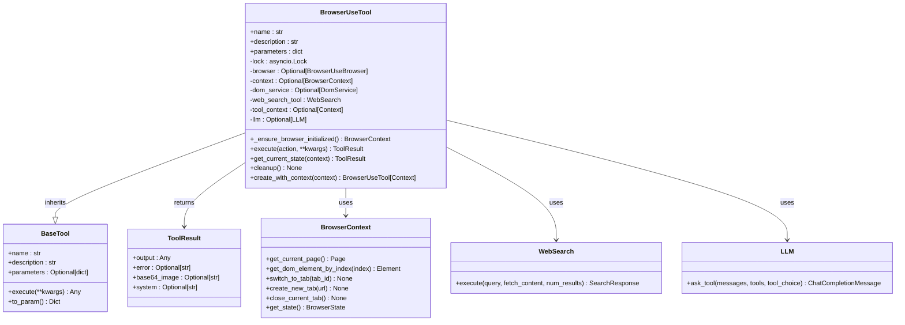
```mermaid
classDiagram
class BrowserUseTool {
+name : str
+description : str
+parameters : dict
-lock : asyncio.Lock
-browser : Optional[BrowserUseBrowser]
-context : Optional[BrowserContext]
-dom_service : Optional[DomService]
-web_search_tool : WebSearch
-tool_context : Optional[Context]
-llm : Optional[LLM]
+_ensure_browser_initialized() BrowserContext
+execute(action, **kwargs) ToolResult
+get_current_state(context) ToolResult
+cleanup() None
+create_with_context(context) BrowserUseTool[Context]
}
class BaseTool {
+name : str
+description : str
+parameters : Optional[dict]
+execute(**kwargs) Any
+to_param() Dict
}
class ToolResult {
+output : Any
+error : Optional[str]
+base64_image : Optional[str]
+system : Optional[str]
}
class BrowserContext {
+get_current_page() Page
+get_dom_element_by_index(index) Element
+switch_to_tab(tab_id) None
+create_new_tab(url) None
+close_current_tab() None
+get_state() BrowserState
}
class WebSearch {
+execute(query, fetch_content, num_results) SearchResponse
}
class LLM {
+ask_tool(messages, tools, tool_choice) ChatCompletionMessage
}
BrowserUseTool --|> BaseTool : inherits
BrowserUseTool --> ToolResult : returns
BrowserUseTool --> BrowserContext : uses
BrowserUseTool --> WebSearch : uses
BrowserUseTool --> LLM : uses
```

**Diagram sources**
- [browser_use_tool.py](file://app/tool/browser_use_tool.py#L38-L566)
- [base.py](file://app/tool/base.py#L77-L172)

## Action Handling Implementation
The BrowserUseTool implements a comprehensive set of browser actions through its execute method, which handles various types of interactions with web pages. The implementation includes navigation, element interaction, scrolling, content extraction, and tab management operations.

### Navigation Actions
The tool supports several navigation actions that allow movement between web pages:

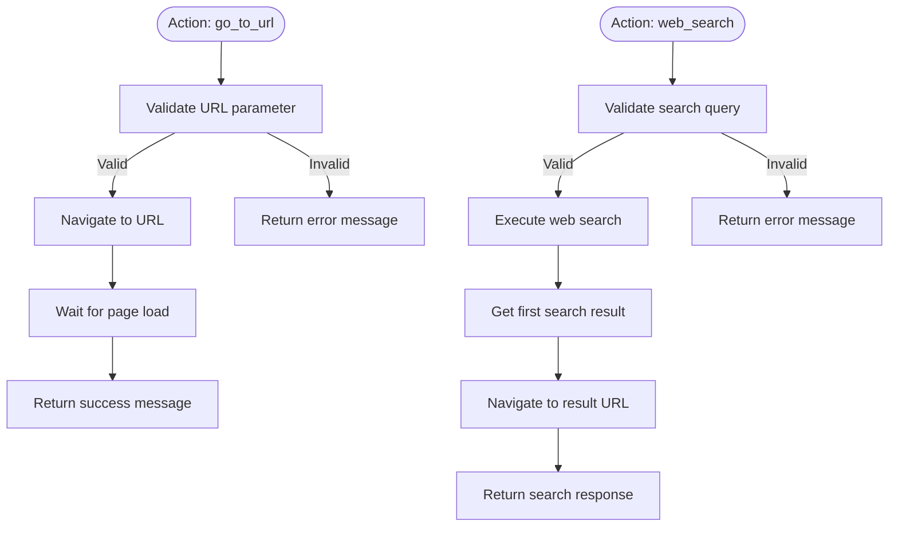
```mermaid
flowchart TD
Start([Action: go_to_url]) --> ValidateURL["Validate URL parameter"]
ValidateURL --> |Valid| Navigate["Navigate to URL"]
Navigate --> Wait["Wait for page load"]
Wait --> Success["Return success message"]
ValidateURL --> |Invalid| Error["Return error message"]
Start2([Action: web_search]) --> ValidateQuery["Validate search query"]
ValidateQuery --> |Valid| ExecuteSearch["Execute web search"]
ExecuteSearch --> GetFirstResult["Get first search result"]
GetFirstResult --> NavigateToResult["Navigate to result URL"]
NavigateToResult --> Success2["Return search response"]
ValidateQuery --> |Invalid| Error2["Return error message"]
```

**Diagram sources**
- [browser_use_tool.py](file://app/tool/browser_use_tool.py#L189-L476)

### Element Interaction Actions
The tool provides methods for interacting with page elements through clicks, text input, and dropdown manipulation:

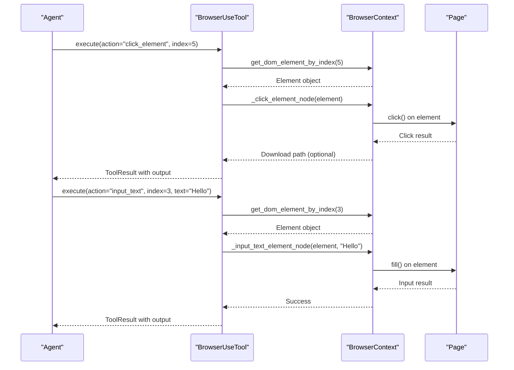
```mermaid
sequenceDiagram
participant Agent as "Agent"
participant Tool as "BrowserUseTool"
participant Context as "BrowserContext"
participant Page as "Page"
Agent->>Tool : execute(action="click_element", index=5)
Tool->>Context : get_dom_element_by_index(5)
Context-->>Tool : Element object
Tool->>Context : _click_element_node(element)
Context->>Page : click() on element
Page-->>Context : Click result
Context-->>Tool : Download path (optional)
Tool-->>Agent : ToolResult with output
Agent->>Tool : execute(action="input_text", index=3, text="Hello")
Tool->>Context : get_dom_element_by_index(3)
Context-->>Tool : Element object
Tool->>Context : _input_text_element_node(element, "Hello")
Context->>Page : fill() on element
Page-->>Context : Input result
Context-->>Tool : Success
Tool-->>Agent : ToolResult with output
```

**Diagram sources**
- [browser_use_tool.py](file://app/tool/browser_use_tool.py#L189-L476)

### Scrolling Operations
The tool implements various scrolling operations to navigate through page content:

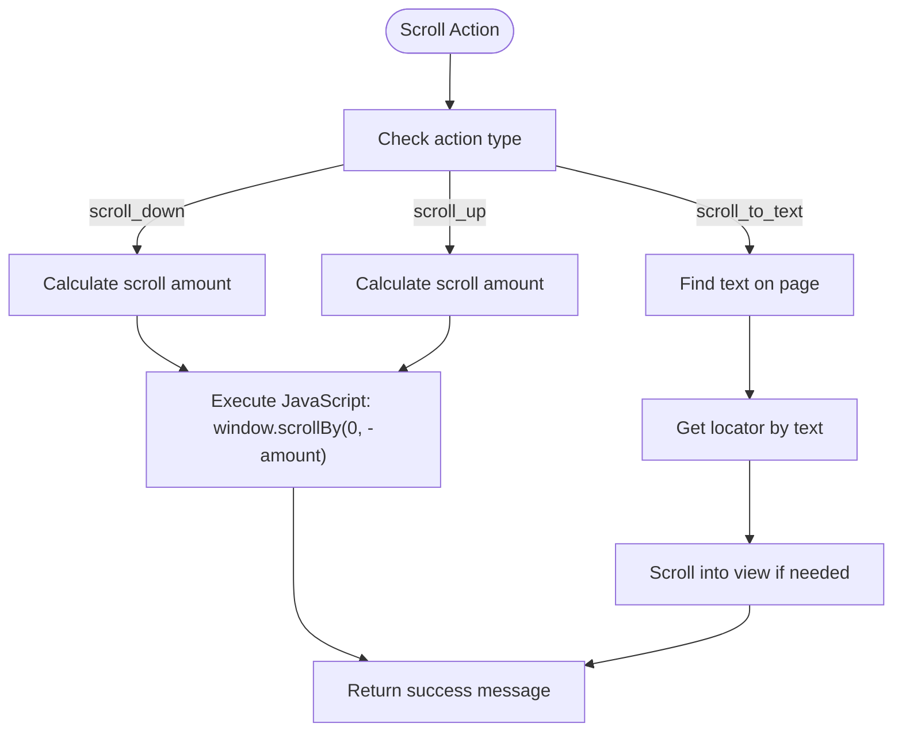
```mermaid
flowchart TD
Start([Scroll Action]) --> CheckAction["Check action type"]
CheckAction --> |scroll_down| ScrollDown["Calculate scroll amount"]
CheckAction --> |scroll_up| ScrollUp["Calculate scroll amount"]
CheckAction --> |scroll_to_text| ScrollToText["Find text on page"]
ScrollDown --> ExecuteJS["Execute JavaScript: window.scrollBy(0, amount)"]
ScrollUp --> ExecuteJS["Execute JavaScript: window.scrollBy(0, -amount)"]
ScrollToText --> FindLocator["Get locator by text"]
FindLocator --> ScrollIntoView["Scroll into view if needed"]
ExecuteJS --> Success["Return success message"]
ScrollIntoView --> Success["Return success message"]
```

**Diagram sources**
- [browser_use_tool.py](file://app/tool/browser_use_tool.py#L189-L476)

## State Management
The BrowserUseTool maintains state across interactions through persistent browser context and DOM service, ensuring continuity in browser sessions.

### Browser Context Initialization
The tool ensures browser and context are initialized before executing actions:

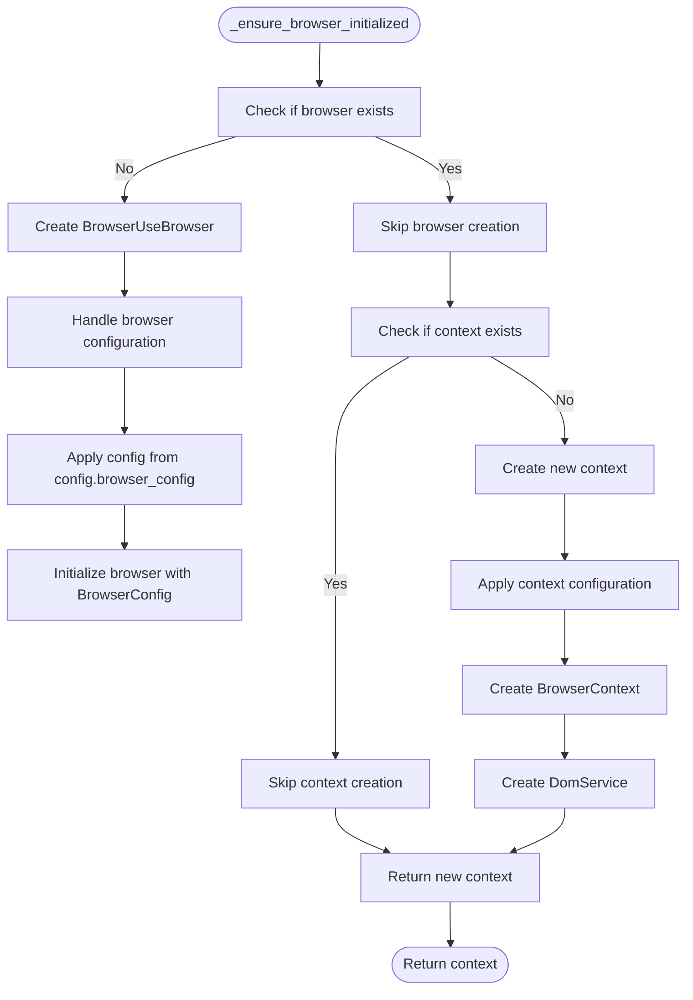
```mermaid
flowchart TD
Start([_ensure_browser_initialized]) --> CheckBrowser["Check if browser exists"]
CheckBrowser --> |No| CreateBrowser["Create BrowserUseBrowser"]
CheckBrowser --> |Yes| SkipBrowser["Skip browser creation"]
CreateBrowser --> HandleConfig["Handle browser configuration"]
HandleConfig --> ApplyConfig["Apply config from config.browser_config"]
ApplyConfig --> InitializeBrowser["Initialize browser with BrowserConfig"]
SkipBrowser --> CheckContext["Check if context exists"]
CheckContext --> |No| CreateContext["Create new context"]
CheckContext --> |Yes| SkipContext["Skip context creation"]
CreateContext --> ApplyContextConfig["Apply context configuration"]
ApplyContextConfig --> CreateContextObject["Create BrowserContext"]
CreateContextObject --> CreateDomService["Create DomService"]
SkipContext --> ReturnContext["Return existing context"]
CreateDomService --> ReturnContext["Return new context"]
ReturnContext --> End([Return context])
```

**Diagram sources**
- [browser_use_tool.py](file://app/tool/browser_use_tool.py#L140-L187)

### State Persistence
The tool maintains state through its class attributes, ensuring persistence across method calls:

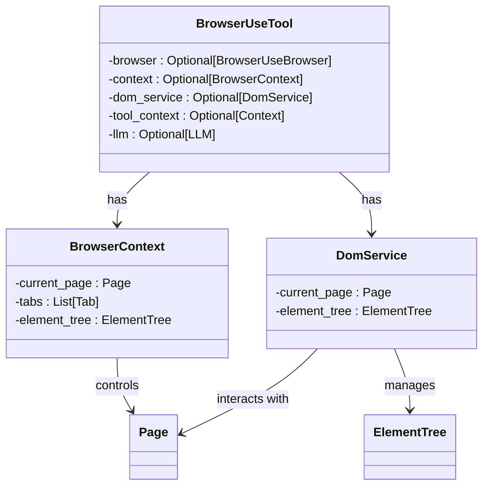
```mermaid
classDiagram
class BrowserUseTool {
-browser : Optional[BrowserUseBrowser]
-context : Optional[BrowserContext]
-dom_service : Optional[DomService]
-tool_context : Optional[Context]
-llm : Optional[LLM]
}
class BrowserContext {
-current_page : Page
-tabs : List[Tab]
-element_tree : ElementTree
}
class DomService {
-current_page : Page
-element_tree : ElementTree
}
BrowserUseTool --> BrowserContext : has
BrowserUseTool --> DomService : has
BrowserContext --> Page : controls
DomService --> Page : interacts with
DomService --> ElementTree : manages
```

**Diagram sources**
- [browser_use_tool.py](file://app/tool/browser_use_tool.py#L38-L566)

## Content Extraction Workflow
The tool implements a sophisticated content extraction workflow that combines page scraping with LLM function calling to extract goal-oriented information.

### Content Extraction Process
The extract_content action follows a multi-step process to extract relevant information:

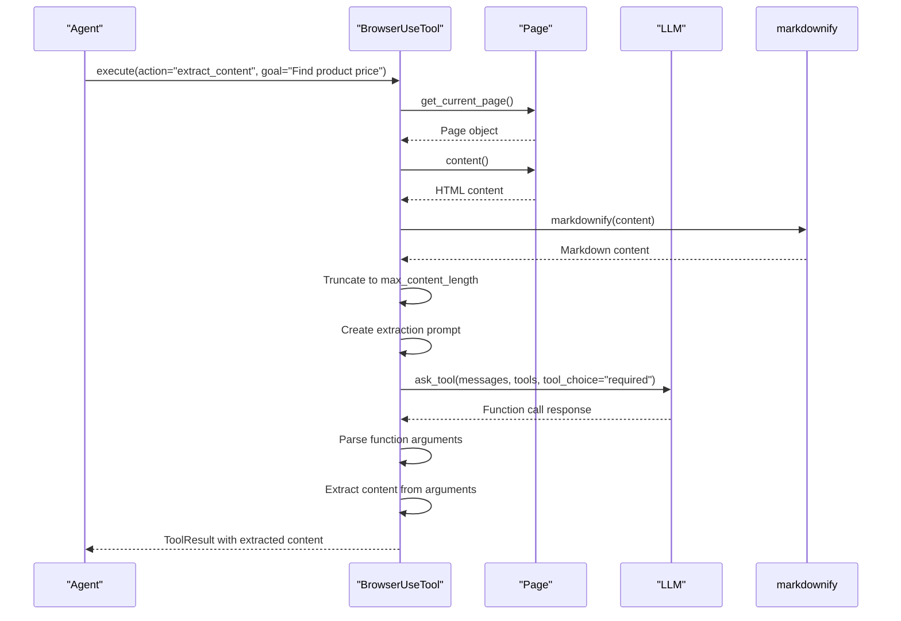
```mermaid
sequenceDiagram
participant Agent as "Agent"
participant Tool as "BrowserUseTool"
participant Page as "Page"
participant LLM as "LLM"
Agent->>Tool : execute(action="extract_content", goal="Find product price")
Tool->>Page : get_current_page()
Page-->>Tool : Page object
Tool->>Page : content()
Page-->>Tool : HTML content
Tool->>markdownify : markdownify(content)
markdownify-->>Tool : Markdown content
Tool->>Tool : Truncate to max_content_length
Tool->>Tool : Create extraction prompt
Tool->>LLM : ask_tool(messages, tools, tool_choice="required")
LLM-->>Tool : Function call response
Tool->>Tool : Parse function arguments
Tool->>Tool : Extract content from arguments
Tool-->>Agent : ToolResult with extracted content
```

**Diagram sources**
- [browser_use_tool.py](file://app/tool/browser_use_tool.py#L189-L476)

### LLM-Powered Extraction
The content extraction leverages LLM function calling to extract structured information:

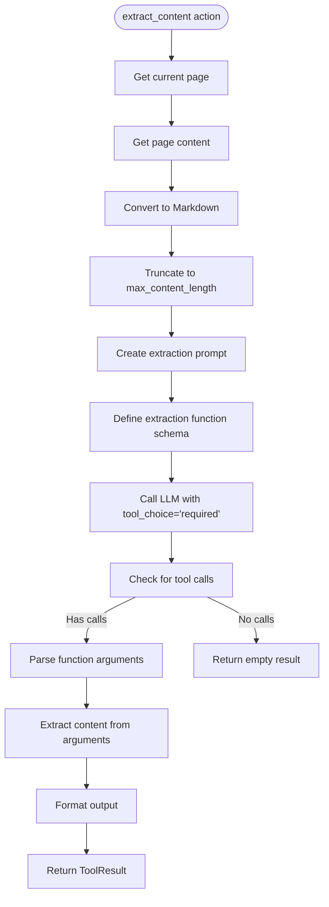
```mermaid
flowchart TD
Start([extract_content action]) --> GetPage["Get current page"]
GetPage --> GetContent["Get page content"]
GetContent --> ConvertMarkdown["Convert to Markdown"]
ConvertMarkdown --> TruncateContent["Truncate to max_content_length"]
TruncateContent --> CreatePrompt["Create extraction prompt"]
CreatePrompt --> DefineFunction["Define extraction function schema"]
DefineFunction --> CallLLM["Call LLM with tool_choice='required'"]
CallLLM --> CheckResponse["Check for tool calls"]
CheckResponse --> |Has calls| ParseArguments["Parse function arguments"]
CheckResponse --> |No calls| ReturnEmpty["Return empty result"]
ParseArguments --> ExtractContent["Extract content from arguments"]
ExtractContent --> FormatOutput["Format output"]
FormatOutput --> ReturnResult["Return ToolResult"]
```

**Diagram sources**
- [browser_use_tool.py](file://app/tool/browser_use_tool.py#L189-L476)
- [llm.py](file://app/llm.py#L500-L550)

## Configuration and Security
The tool supports various configuration options through BrowserConfig and context settings, with specific security considerations.

### Configuration Options
The tool can be configured through the config.browser_config settings:

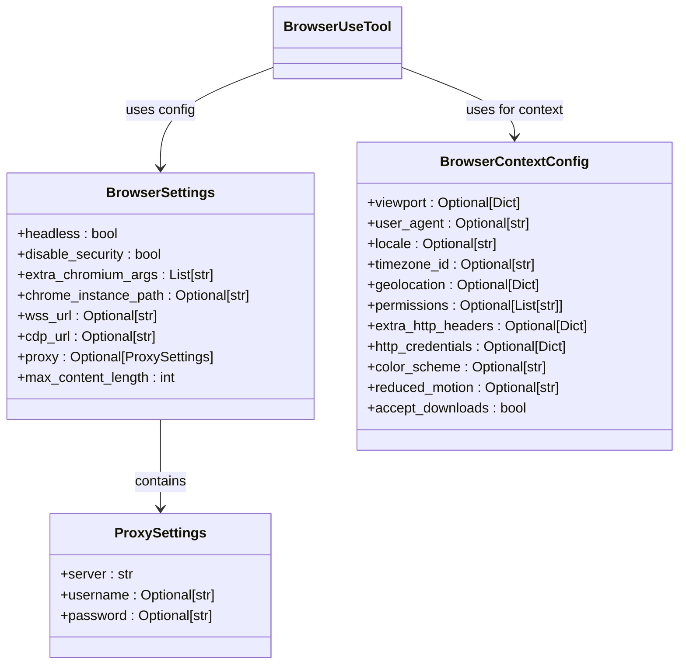
```mermaid
classDiagram
class BrowserSettings {
+headless : bool
+disable_security : bool
+extra_chromium_args : List[str]
+chrome_instance_path : Optional[str]
+wss_url : Optional[str]
+cdp_url : Optional[str]
+proxy : Optional[ProxySettings]
+max_content_length : int
}
class ProxySettings {
+server : str
+username : Optional[str]
+password : Optional[str]
}
class BrowserContextConfig {
+viewport : Optional[Dict]
+user_agent : Optional[str]
+locale : Optional[str]
+timezone_id : Optional[str]
+geolocation : Optional[Dict]
+permissions : Optional[List[str]]
+extra_http_headers : Optional[Dict]
+http_credentials : Optional[Dict]
+color_scheme : Optional[str]
+reduced_motion : Optional[str]
+accept_downloads : bool
}
BrowserUseTool --> BrowserSettings : uses config
BrowserUseTool --> BrowserContextConfig : uses for context
BrowserSettings --> ProxySettings : contains
```

**Diagram sources**
- [config.py](file://app/config.py#L150-L200)
- [browser_use_tool.py](file://app/tool/browser_use_tool.py#L38-L566)

### Security Considerations
The tool includes security-related configuration options:

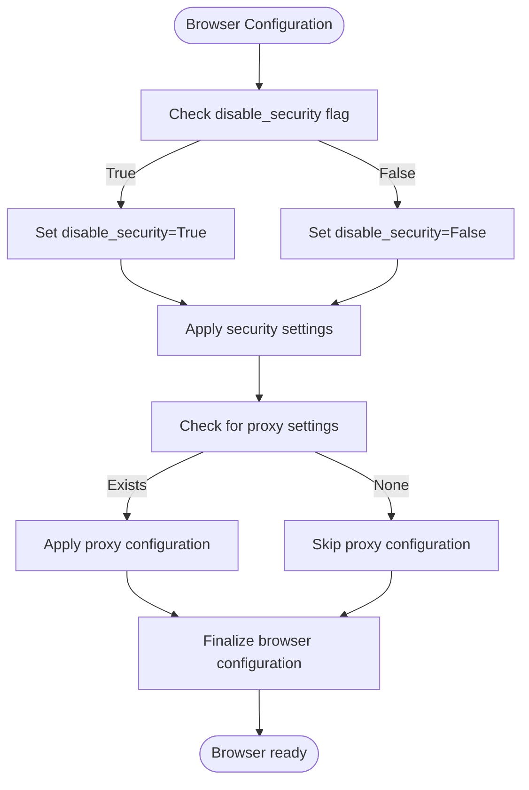
```mermaid
flowchart TD
Start([Browser Configuration]) --> CheckSecurity["Check disable_security flag"]
CheckSecurity --> |True| DisableSecurity["Set disable_security=True"]
CheckSecurity --> |False| EnableSecurity["Set disable_security=False"]
DisableSecurity --> ApplySecurity["Apply security settings"]
EnableSecurity --> ApplySecurity["Apply security settings"]
ApplySecurity --> CheckProxy["Check for proxy settings"]
CheckProxy --> |Exists| ApplyProxy["Apply proxy configuration"]
CheckProxy --> |None| SkipProxy["Skip proxy configuration"]
ApplyProxy --> FinalizeConfig["Finalize browser configuration"]
SkipProxy --> FinalizeConfig["Finalize browser configuration"]
FinalizeConfig --> End([Browser ready])
```

**Diagram sources**
- [browser_use_tool.py](file://app/tool/browser_use_tool.py#L140-L187)

## Resource Management
The tool implements proper resource management to ensure browser resources are cleaned up appropriately.

### Cleanup Process
The cleanup method ensures proper resource deallocation:

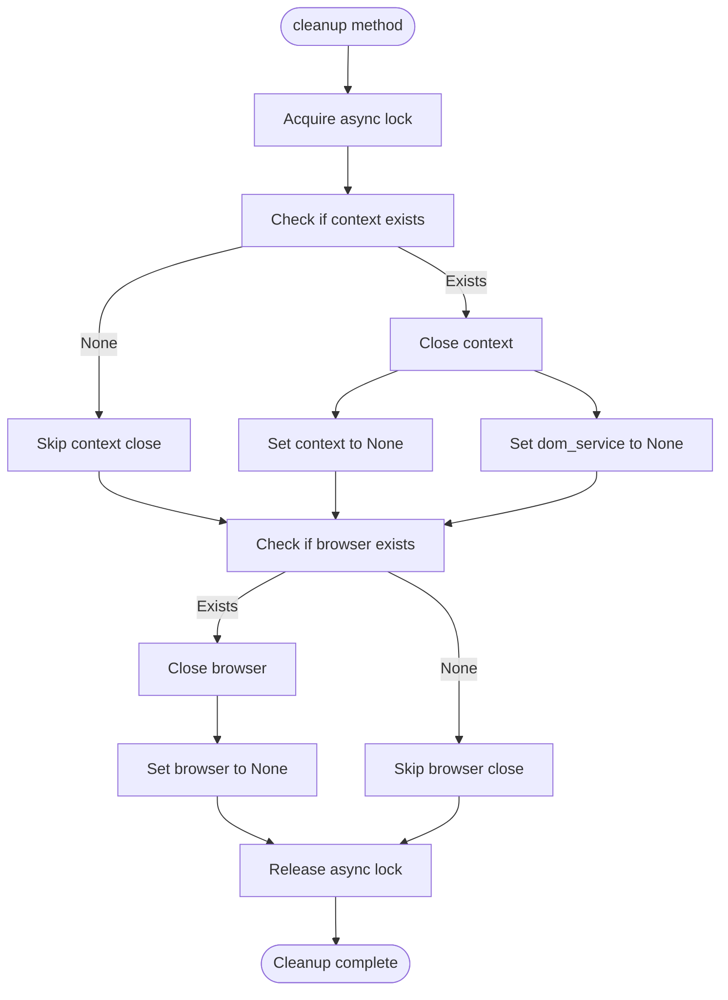
```mermaid
flowchart TD
Start([cleanup method]) --> AcquireLock["Acquire async lock"]
AcquireLock --> CheckContext["Check if context exists"]
CheckContext --> |Exists| CloseContext["Close context"]
CheckContext --> |None| SkipContext["Skip context close"]
CloseContext --> ClearContext["Set context to None"]
CloseContext --> ClearDomService["Set dom_service to None"]
SkipContext --> CheckBrowser["Check if browser exists"]
ClearContext --> CheckBrowser["Check if browser exists"]
ClearDomService --> CheckBrowser["Check if browser exists"]
CheckBrowser --> |Exists| CloseBrowser["Close browser"]
CheckBrowser --> |None| SkipBrowser["Skip browser close"]
CloseBrowser --> ClearBrowser["Set browser to None"]
ClearBrowser --> ReleaseLock["Release async lock"]
SkipBrowser --> ReleaseLock["Release async lock"]
ReleaseLock --> End([Cleanup complete])
```

**Diagram sources**
- [browser_use_tool.py](file://app/tool/browser_use_tool.py#L540-L549)

### Resource Cleanup on Destruction
The tool ensures cleanup when the object is destroyed:

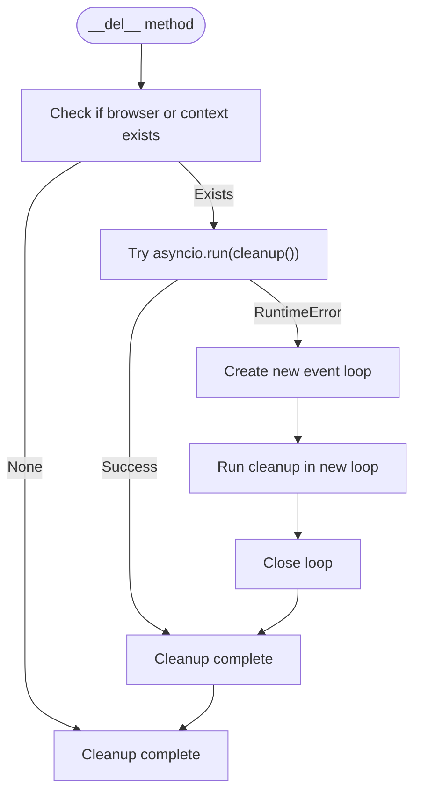
```mermaid
flowchart TD
Start([__del__ method]) --> CheckResources["Check if browser or context exists"]
CheckResources --> |Exists| TryAsyncCleanup["Try asyncio.run(cleanup())"]
CheckResources --> |None| End["No cleanup needed"]
TryAsyncCleanup --> |Success| CleanupComplete["Cleanup complete"]
TryAsyncCleanup --> |RuntimeError| CreateNewLoop["Create new event loop"]
CreateNewLoop --> RunCleanup["Run cleanup in new loop"]
RunCleanup --> CloseLoop["Close loop"]
CloseLoop --> CleanupComplete["Cleanup complete"]
CleanupComplete --> End["Cleanup complete"]
```

**Diagram sources**
- [browser_use_tool.py](file://app/tool/browser_use_tool.py#L551-L559)

## Integration and Usage
The BrowserUseTool integrates with other components in the OpenManus system and can be used in various scenarios.

### Integration with Browser Agent
The tool is integrated with the BrowserAgent for web-based tasks:

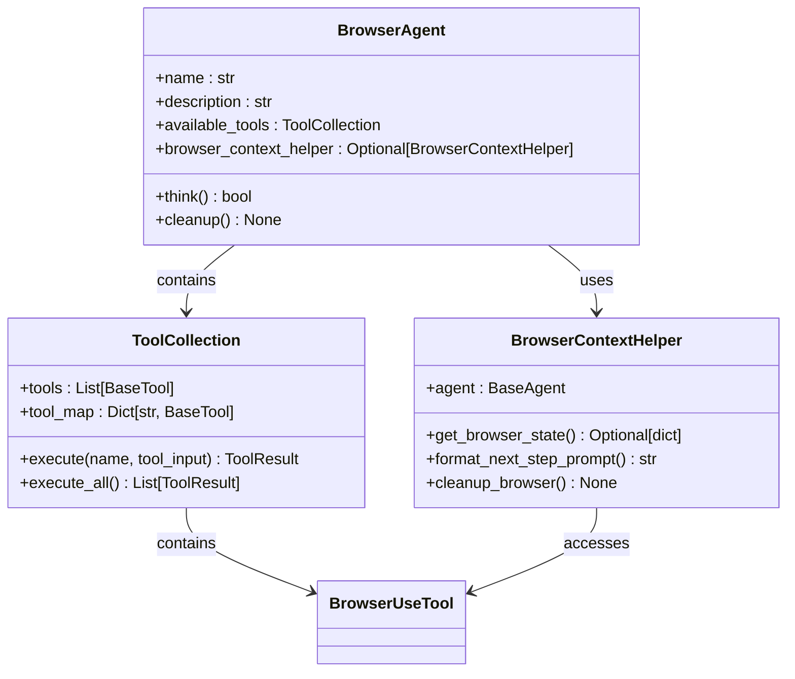
```mermaid
classDiagram
class BrowserAgent {
+name : str
+description : str
+available_tools : ToolCollection
+browser_context_helper : Optional[BrowserContextHelper]
+think() bool
+cleanup() None
}
class BrowserContextHelper {
+agent : BaseAgent
+get_browser_state() Optional[dict]
+format_next_step_prompt() str
+cleanup_browser() None
}
class ToolCollection {
+tools : List[BaseTool]
+tool_map : Dict[str, BaseTool]
+execute(name, tool_input) ToolResult
+execute_all() List[ToolResult]
}
BrowserAgent --> BrowserContextHelper : uses
BrowserAgent --> ToolCollection : contains
ToolCollection --> BrowserUseTool : contains
BrowserContextHelper --> BrowserUseTool : accesses
```

**Diagram sources**
- [browser.py](file://app/agent/browser.py#L104-L129)
- [browser_use_tool.py](file://app/tool/browser_use_tool.py#L38-L566)

### Multi-Step Browser Interactions
The tool supports complex multi-step interactions through sequential action execution:

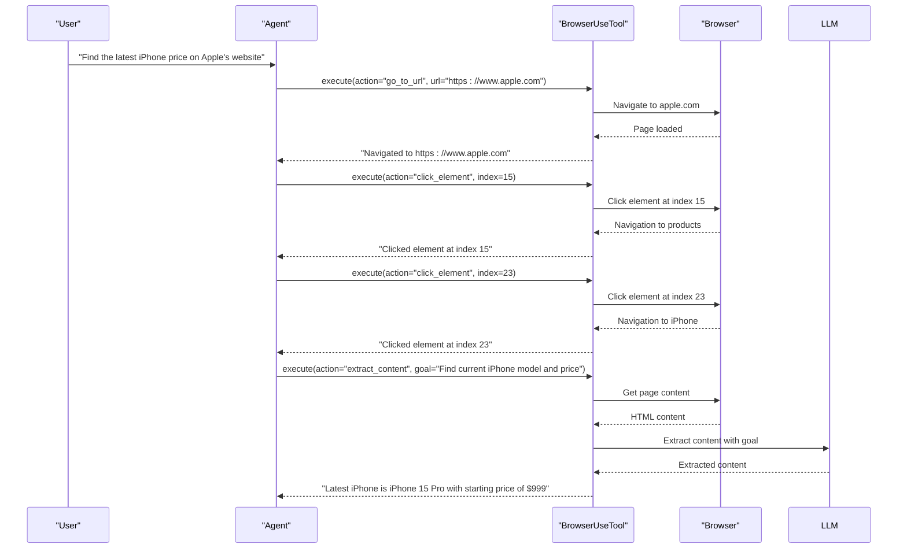
```mermaid
sequenceDiagram
participant User as "User"
participant Agent as "Agent"
participant Tool as "BrowserUseTool"
participant Browser as "Browser"
User->>Agent : "Find the latest iPhone price on Apple's website"
Agent->>Tool : execute(action="go_to_url", url="https : //www.apple.com")
Tool->>Browser : Navigate to apple.com
Browser-->>Tool : Page loaded
Tool-->>Agent : "Navigated to https : //www.apple.com"
Agent->>Tool : execute(action="click_element", index=15)
Tool->>Browser : Click element at index 15
Browser-->>Tool : Navigation to products
Tool-->>Agent : "Clicked element at index 15"
Agent->>Tool : execute(action="click_element", index=23)
Tool->>Browser : Click element at index 23
Browser-->>Tool : Navigation to iPhone
Tool-->>Agent : "Clicked element at index 23"
Agent->>Tool : execute(action="extract_content", goal="Find current iPhone model and price")
Tool->>Browser : Get page content
Browser-->>Tool : HTML content
Tool->>LLM : Extract content with goal
LLM-->>Tool : Extracted content
Tool-->>Agent : "Latest iPhone is iPhone 15 Pro with starting price of $999"
```

**Diagram sources**
- [browser_use_tool.py](file://app/tool/browser_use_tool.py#L189-L476)

## Error Handling
The tool implements comprehensive error handling to manage various failure scenarios.

### Error Handling Strategy
The tool uses a consistent error handling approach across all actions:

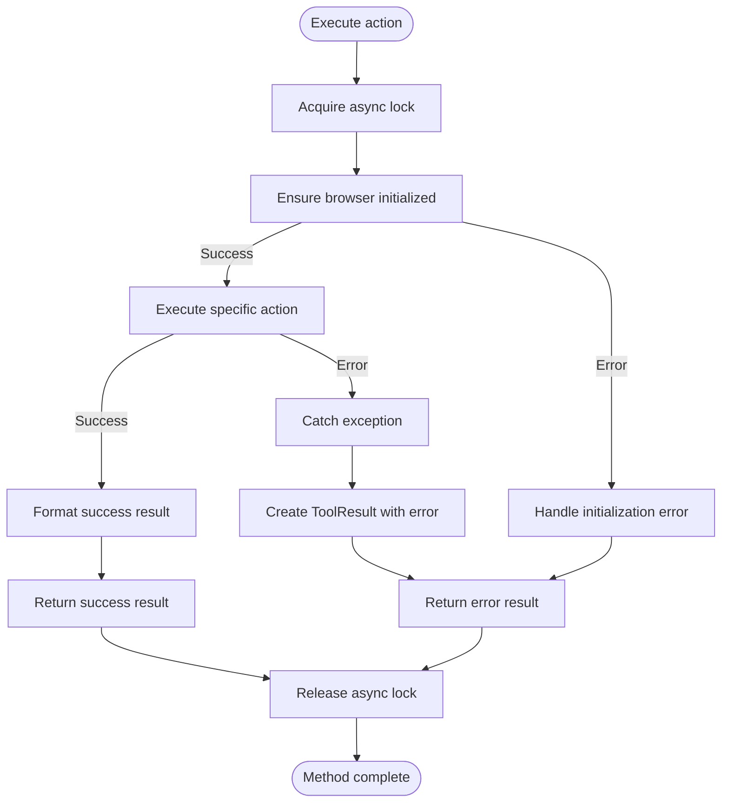
```mermaid
flowchart TD
Start([Execute action]) --> AcquireLock["Acquire async lock"]
AcquireLock --> InitializeBrowser["Ensure browser initialized"]
InitializeBrowser --> |Success| ExecuteAction["Execute specific action"]
InitializeBrowser --> |Error| HandleError["Handle initialization error"]
ExecuteAction --> |Success| FormatSuccess["Format success result"]
ExecuteAction --> |Error| CatchException["Catch exception"]
CatchException --> CreateErrorResult["Create ToolResult with error"]
CreateErrorResult --> ReturnError["Return error result"]
FormatSuccess --> ReturnSuccess["Return success result"]
HandleError --> ReturnError["Return error result"]
ReturnSuccess --> ReleaseLock["Release async lock"]
ReturnError --> ReleaseLock["Release async lock"]
ReleaseLock --> End([Method complete])
```

**Diagram sources**
- [browser_use_tool.py](file://app/tool/browser_use_tool.py#L189-L476)

### Parameter Validation
The tool validates required parameters for each action type:

```mermaid
flowchart TD
Start([Action execution]) --> CheckAction["Check action type"]
CheckAction --> GetDependencies["Get dependencies from parameters"]
GetDependencies --> |action=go_to_url| ValidateURL["Validate URL parameter"]
GetDependencies --> |action=click_element| ValidateIndex["Validate index parameter"]
GetDependencies --> |action=input_text| ValidateIndexText["Validate index and text"]
GetDependencies --> |action=extract_content| ValidateGoal["Validate goal parameter"]
GetDependencies --> |action=switch_tab| ValidateTabId["Validate tab_id parameter"]
GetDependencies --> |action=open_tab| ValidateOpenTab["Validate URL parameter"]
GetDependencies --> |action=scroll_down| ValidateScrollAmount["Validate scroll_amount"]
GetDependencies --> |action=scroll_up| ValidateScrollAmount["Validate scroll_amount"]
GetDependencies --> |action=scroll_to_text| ValidateScrollText["Validate text parameter"]
GetDependencies --> |action=send_keys| ValidateKeys["Validate keys parameter"]
GetDependencies --> |action=get_dropdown_options| ValidateDropdownIndex["Validate index"]
GetDependencies --> |action=select_dropdown_option| ValidateDropdownParams["Validate index and text"]
GetDependencies --> |action=web_search| ValidateQuery["Validate query parameter"]
GetDependencies --> |action=wait| ValidateSeconds["Validate seconds parameter"]
ValidateURL --> |Missing| ReturnError["Return error"]
ValidateIndex --> |Missing| ReturnError["Return error"]
ValidateIndexText --> |Missing| ReturnError["Return error"]
ValidateGoal --> |Missing| ReturnError["Return error"]
ValidateTabId --> |Missing| ReturnError["Return error"]
ValidateOpenTab --> |Missing| ReturnError["Return error"]
ValidateScrollAmount --> |Missing| ReturnError["Return error"]
ValidateScrollText --> |Missing| ReturnError["Return error"]
ValidateKeys --> |Missing| ReturnError["Return error"]
ValidateDropdownIndex --> |Missing| ReturnError["Return error"]
ValidateDropdownParams --> |Missing| ReturnError["Return error"]
ValidateQuery --> |Missing| ReturnError["Return error"]
ValidateSeconds --> |Missing| ReturnError["Return error"]
ValidateURL --> |Present| ExecuteAction["Execute action"]
ValidateIndex --> |Present| ExecuteAction["Execute action"]
ValidateIndexText --> |Present| ExecuteAction["Execute action"]
ValidateGoal --> |Present| ExecuteAction["Execute action"]
ValidateTabId --> |Present| ExecuteAction["Execute action"]
ValidateOpenTab --> |Present| ExecuteAction["Execute action"]
ValidateScrollAmount --> |Present| ExecuteAction["Execute action"]
ValidateScrollText --> |Present| ExecuteAction["Execute action"]
ValidateKeys --> |Present| ExecuteAction["Execute action"]
ValidateDropdownIndex --> |Present| ExecuteAction["Execute action"]
ValidateDropdownParams --> |Present| ExecuteAction["Execute action"]
ValidateQuery --> |Present| ExecuteAction["Execute action"]
ValidateSeconds --> |Present| ExecuteAction["Execute action"]
ExecuteAction --> ReturnResult["Return result"]
```

**Diagram sources**
- [browser_use_tool.py](file://app/tool/browser_use_tool.py#L38-L566)

## Conclusion
The BrowserUseTool in OpenManus provides a comprehensive solution for browser automation through Playwright integration. It enables AI agents to perform complex web interactions including navigation, element interaction, content extraction, and tab management. The tool's stateful nature with persistent browser context and DOM service ensures continuity across interactions, while its dependency validation system ensures proper parameter handling. The content extraction workflow combines page scraping with LLM function calling to extract goal-oriented information, and the tool provides robust configuration options and resource management. This implementation allows for sophisticated multi-step browser interactions with comprehensive error handling, making it a powerful component for web-based AI agent tasks.