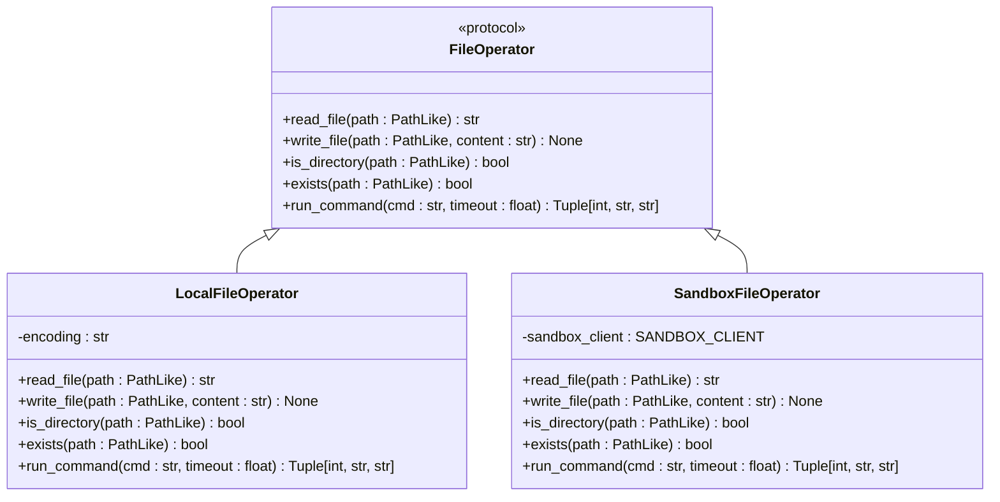
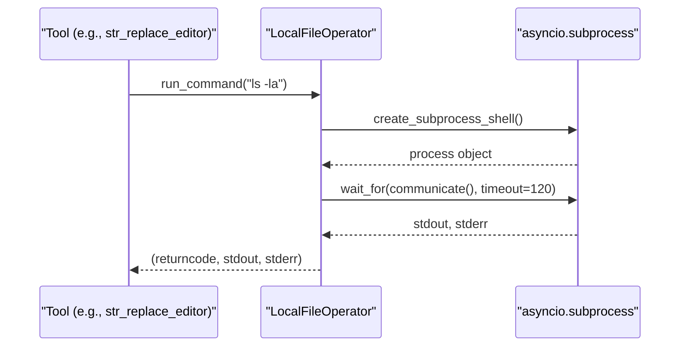
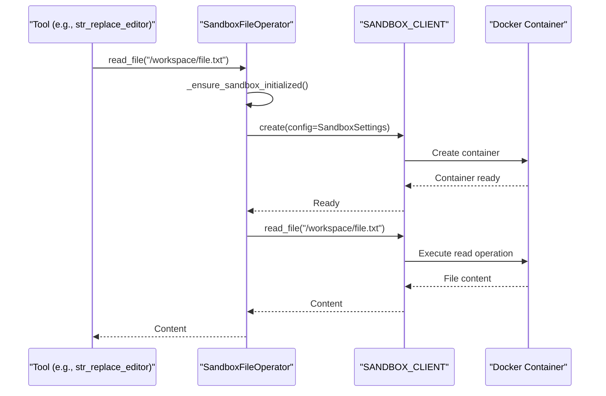
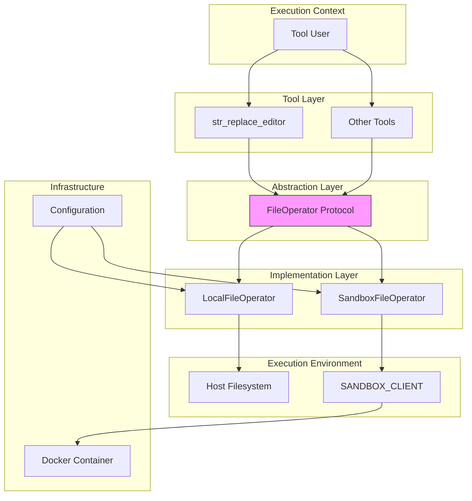

# File Operations

<cite>
**Referenced Files in This Document**   
- [file_operators.py](file://app/tool/file_operators.py)
- [client.py](file://app/sandbox/client.py)
- [str_replace_editor.py](file://app/tool/str_replace_editor.py)
- [config.py](file://app/config.py)
</cite>

## Table of Contents
1. [Introduction](#introduction)
2. [File Operator Protocol](#file-operator-protocol)
3. [Local File Operator](#local-file-operator)
4. [Sandbox File Operator](#sandbox-file-operator)
5. [Path Handling and Type System](#path-handling-and-type-system)
6. [Command Execution Differences](#command-execution-differences)
7. [Security Considerations](#security-considerations)
8. [Integration with Other Tools](#integration-with-other-tools)
9. [Configuration and Dependencies](#configuration-and-dependencies)
10. [Architecture Overview](#architecture-overview)

## Introduction
OpenManus implements a dual file operation system that provides both direct host filesystem access and isolated sandbox environment operations. This architecture enables flexible execution contexts while maintaining security boundaries. The system is built around a protocol-based interface that defines common file operations, with two concrete implementations: LocalFileOperator for direct filesystem access and SandboxFileOperator for containerized operations. This design allows tools to operate transparently across different execution environments while providing appropriate isolation and security controls.

## File Operator Protocol
The FileOperator protocol defines a consistent interface for file operations across different execution environments. This protocol-based approach enables polymorphic behavior where tools can work with either local or sandboxed file systems without knowing the specific implementation details.



**Diagram sources**
- [file_operators.py](file://app/tool/file_operators.py#L15-L38)
- [file_operators.py](file://app/tool/file_operators.py#L41-L92)
- [file_operators.py](file://app/tool/file_operators.py#L95-L157)

**Section sources**
- [file_operators.py](file://app/tool/file_operators.py#L15-L157)

## Local File Operator
The LocalFileOperator provides direct access to the host filesystem with full read/write capabilities. It uses Python's pathlib module for file operations and asyncio subprocess for shell command execution. The implementation includes comprehensive error handling through ToolError exceptions that wrap underlying system errors with contextual information.

For command execution, LocalFileOperator creates subprocesses with captured stdout and stderr streams, enabling complete output collection. The implementation includes timeout handling that properly terminates processes when execution exceeds the specified limit, preventing hanging operations.



**Diagram sources**
- [file_operators.py](file://app/tool/file_operators.py#L68-L92)

**Section sources**
- [file_operators.py](file://app/tool/file_operators.py#L41-L92)

## Sandbox File Operator
The SandboxFileOperator delegates file operations to an isolated containerized environment through the SANDBOX_CLIENT. This implementation ensures that file operations occur within a secure, ephemeral container, preventing direct access to the host filesystem. The operator automatically initializes the sandbox environment when needed, ensuring the container is running before executing any operations.

Unlike the local implementation, the sandbox version uses shell commands to check file and directory existence (via test -e and test -d), as direct filesystem queries are not available through the sandbox client interface. Command execution in the sandbox returns only stdout, with no stderr capture in the current implementation.



**Diagram sources**
- [file_operators.py](file://app/tool/file_operators.py#L95-L157)
- [client.py](file://app/sandbox/client.py#L100-L150)

**Section sources**
- [file_operators.py](file://app/tool/file_operators.py#L95-L157)

## Path Handling and Type System
The file operation system uses a PathLike type union that accepts both string and Path objects, providing flexibility in how file paths are specified. This type is used consistently across all file operation methods, ensuring type safety while accommodating different input formats.

All file operations require absolute paths, which are validated by tools that use the file operators. This requirement prevents path traversal vulnerabilities and ensures operations occur only in intended locations. The Path class from pathlib is used internally for path manipulation and validation.

**Section sources**
- [file_operators.py](file://app/tool/file_operators.py#L11-L11)
- [str_replace_editor.py](file://app/tool/str_replace_editor.py#L165-L193)

## Command Execution Differences
The implementation of run_command differs significantly between local and sandbox environments, reflecting the different capabilities and constraints of each execution context.

| Feature | Local Environment | Sandbox Environment |
|-------|-------------------|---------------------|
| Return Code | Actual process return code | Always 0 (success) |
| stderr Capture | Full stderr output captured | No stderr capture (empty string) |
| Timeout Handling | Process terminated on timeout | Timeout exception raised |
| Command Execution | Direct subprocess creation | Delegated to sandbox client |
| Error Propagation | ToolError for timeouts | Return code 1 with error message |

These differences reflect the sandbox's abstraction layer, which prioritizes simplicity and security over detailed process control. The local implementation provides more comprehensive process information but with greater potential security implications.

**Section sources**
- [file_operators.py](file://app/tool/file_operators.py#L68-L92)
- [file_operators.py](file://app/tool/file_operators.py#L138-L157)

## Security Considerations
The dual implementation approach addresses several security concerns in file system access. The LocalFileOperator requires careful permission management, as it has full access to the host filesystem. In contrast, the SandboxFileOperator provides isolation through containerization, limiting the potential impact of malicious or erroneous operations.

Path traversal risks are mitigated by requiring absolute paths and validating them before operations. The sandbox environment further enhances security by running in a restricted container with limited resources and no network access by default. Permission requirements differ between environments: the local operator needs filesystem permissions equivalent to the running process, while the sandbox operator requires Docker privileges to manage containers.

**Section sources**
- [file_operators.py](file://app/tool/file_operators.py#L41-L92)
- [file_operators.py](file://app/tool/file_operators.py#L95-L157)
- [config.py](file://app/config.py#L93-L104)

## Integration with Other Tools
The file operation system is integrated with various tools in OpenManus, most notably the str_replace_editor. This tool uses the file operators to implement file viewing, creation, and editing functionality with support for both local and sandboxed execution.

The str_replace_editor demonstrates the polymorphic use of file operators, switching between LocalFileOperator and SandboxFileOperator based on configuration. It uses the operators for path validation, file existence checks, and content manipulation, showcasing how higher-level tools can leverage the abstract file operation interface.

```mermaid
flowchart TD
A[str_replace_editor] --> B{_get_operator()}
B --> C[LocalFileOperator]
B --> D[SandboxFileOperator]
C --> E[Host Filesystem]
D --> F[SANDBOX_CLIENT]
F --> G[Docker Container]
A --> H[File Operations]
H --> I[view]
H --> J[create]
H --> K[str_replace]
H --> L[insert]
H --> M[undo_edit]
```

**Diagram sources**
- [str_replace_editor.py](file://app/tool/str_replace_editor.py#L105-L111)
- [str_replace_editor.py](file://app/tool/str_replace_editor.py#L218-L281)

**Section sources**
- [str_replace_editor.py](file://app/tool/str_replace_editor.py#L101-L281)

## Configuration and Dependencies
The file operation system depends on several key components and configurations. The SANDBOX_CLIENT is a global instance created through dependency injection, providing access to the sandbox environment. Configuration is managed through the AppConfig system, with SandboxSettings controlling sandbox parameters like container image, resource limits, and network access.

The system's behavior is controlled by the use_sandbox configuration flag, which determines whether operations occur locally or in the sandbox. This configuration is accessible through the global config object, allowing tools to adapt their behavior based on the execution environment.

**Section sources**
- [client.py](file://app/sandbox/client.py#L200-L200)
- [config.py](file://app/config.py#L93-L104)
- [config.py](file://app/config.py#L350-L372)

## Architecture Overview
The file operation architecture in OpenManus follows a clean separation of concerns, with abstract protocols defining interfaces and concrete implementations providing environment-specific functionality. This design enables flexible execution contexts while maintaining a consistent API for file operations.



**Diagram sources**
- [file_operators.py](file://app/tool/file_operators.py#L15-L157)
- [client.py](file://app/sandbox/client.py#L100-L200)
- [config.py](file://app/config.py#L93-L104)

**Section sources**
- [file_operators.py](file://app/tool/file_operators.py#L15-L157)
- [client.py](file://app/sandbox/client.py#L100-L200)
- [config.py](file://app/config.py#L93-L104)