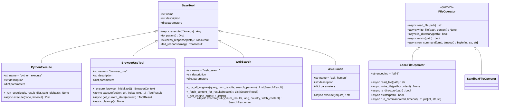
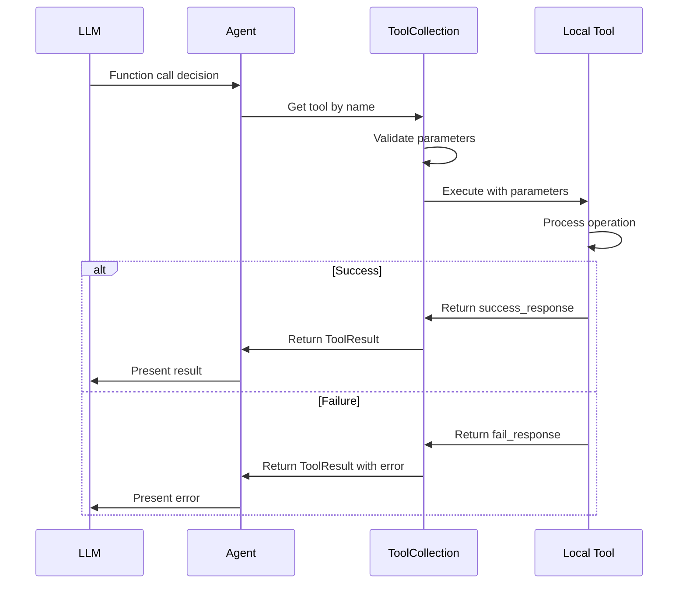
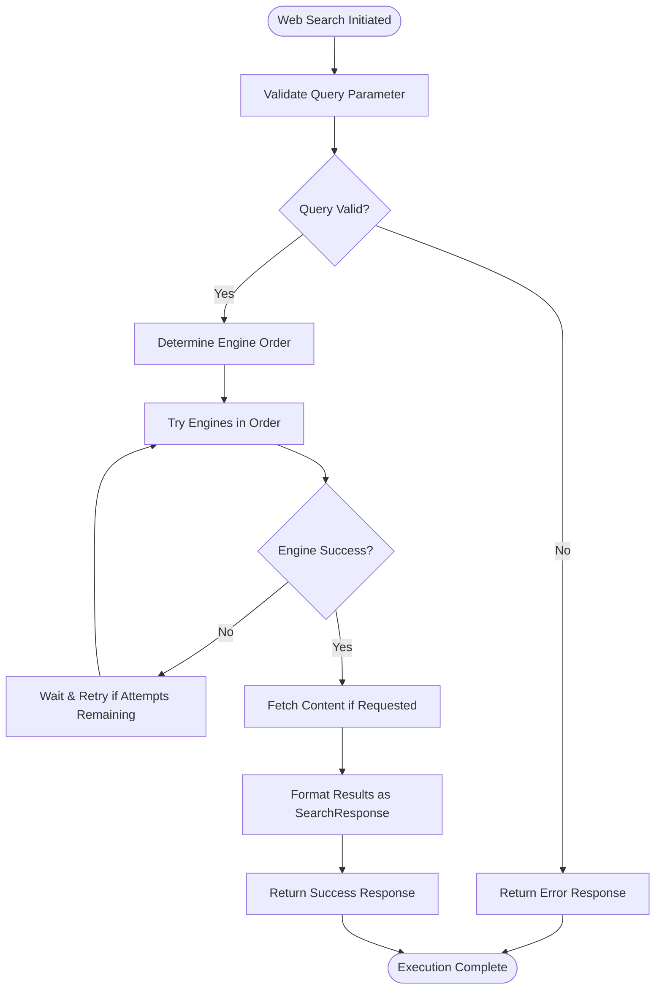

# Local Tools

<cite>
**Referenced Files in This Document**   
- [base.py](file://app/tool/base.py)
- [python_execute.py](file://app/tool/python_execute.py)
- [browser_use_tool.py](file://app/tool/browser_use_tool.py)
- [file_operators.py](file://app/tool/file_operators.py)
- [web_search.py](file://app/tool/web_search.py)
- [ask_human.py](file://app/tool/ask_human.py)
</cite>

## Table of Contents
1. [Introduction](#introduction)
2. [Core Architecture](#core-architecture)
3. [Tool Execution Flow](#tool-execution-flow)
4. [Key Local Tools](#key-local-tools)
   - [Python Execute Tool](#python-execute-tool)
   - [Browser Use Tool](#browser-use-tool)
   - [File Operators Tool](#file-operators-tool)
   - [Web Search Tool](#web-search-tool)
   - [Ask Human Tool](#ask-human-tool)
5. [Security Considerations](#security-considerations)
6. [Error Handling Strategies](#error-handling-strategies)
7. [Extending Local Tools](#extending-local-tools)
8. [Conclusion](#conclusion)

## Introduction
Local Tools in OpenManus provide direct access to system capabilities within the agent's runtime environment. These tools enable the agent to perform various operations such as code execution, browser automation, file system interactions, web searching, and user interaction. Implemented as Python classes inheriting from a common base, these tools follow a standardized interface for seamless integration with the agent's decision-making process. The local tools architecture enables secure, isolated execution of operations while maintaining clear boundaries between the agent's cognitive functions and system-level actions.

## Core Architecture

**Diagram sources**
- [base.py](file://app/tool/base.py#L77-L172)
- [python_execute.py](file://app/tool/python_execute.py#L1-L75)
- [browser_use_tool.py](file://app/tool/browser_use_tool.py#L1-L567)
- [web_search.py](file://app/tool/web_search.py#L1-L418)
- [file_operators.py](file://app/tool/file_operators.py#L1-L158)
- [ask_human.py](file://app/tool/ask_human.py#L1-L21)

**Section sources**
- [base.py](file://app/tool/base.py#L77-L172)

## Tool Execution Flow

**Diagram sources**
- [base.py](file://app/tool/base.py#L77-L172)
- [tool_collection.py](file://app/tool/tool_collection.py)
- [manus.py](file://app/agent/manus.py)

## Key Local Tools

### Python Execute Tool
The PythonExecute tool enables secure execution of Python code within isolated processes. It captures print outputs while preventing access to return values, ensuring safe code evaluation. The tool implements timeout protection and runs code in a restricted global namespace to prevent malicious operations.

**Section sources**
- [python_execute.py](file://app/tool/python_execute.py#L1-L75)

### Browser Use Tool
The BrowserUseTool provides comprehensive browser automation capabilities using Playwright-based technology. It supports various actions including navigation, element interaction, scrolling, content extraction, and tab management. The tool maintains browser state across calls and provides screenshot capabilities for visual feedback.

**Section sources**
- [browser_use_tool.py](file://app/tool/browser_use_tool.py#L1-L567)

### File Operators Tool
The FileOperators module implements file system interactions through the FileOperator protocol. It provides both local and sandboxed file operations, supporting reading, writing, directory checking, existence verification, and command execution. The implementation includes proper error handling and timeout management for all operations.

**Section sources**
- [file_operators.py](file://app/tool/file_operators.py#L1-L158)

### Web Search Tool
The WebSearch tool enables multi-engine web searching with automatic fallback between Google, Bing, DuckDuckGo, and Baidu. It provides structured search results with metadata and supports optional content fetching from result pages. The tool implements retry logic and respects configuration settings for language, country, and search engine preferences.

**Diagram sources**
- [web_search.py](file://app/tool/web_search.py#L1-L418)
- [search/base.py](file://app/tool/search/base.py#L1-L40)
- [search/google_search.py](file://app/tool/search/google_search.py#L1-L33)
- [search/bing_search.py](file://app/tool/search/bing_search.py#L1-L144)
- [search/duckduckgo_search.py](file://app/tool/search/duckduckgo_search.py#L1-L57)
- [search/baidu_search.py](file://app/tool/search/baidu_search.py#L1-L54)

**Section sources**
- [web_search.py](file://app/tool/web_search.py#L1-L418)

### Ask Human Tool
The AskHuman tool facilitates interactive user input by presenting questions directly to the user. It enables the agent to request clarification, confirmation, or additional information when needed. This tool bridges the gap between automated processing and human oversight, allowing for collaborative problem solving.

**Section sources**
- [ask_human.py](file://app/tool/ask_human.py#L1-L21)

## Security Considerations
Local tools implement several security measures to protect the system environment. The PythonExecute tool runs code in isolated processes with restricted global namespaces and timeout enforcement. File operations are validated and errors are properly handled to prevent unauthorized access. Browser automation is configured with security disabled only when explicitly required, and web searches use appropriate headers to mimic legitimate browser requests. All tools follow the principle of least privilege, providing only the necessary capabilities for their intended functions.

**Section sources**
- [python_execute.py](file://app/tool/python_execute.py#L1-L75)
- [file_operators.py](file://app/tool/file_operators.py#L1-L158)
- [browser_use_tool.py](file://app/tool/browser_use_tool.py#L1-L567)

## Error Handling Strategies
Local tools employ consistent error handling patterns through the BaseTool interface. All tools use the fail_response() method to create standardized error responses with descriptive messages. The ToolResult class provides a unified format for both success and error conditions, including optional base64-encoded images for visual feedback. Exceptions are caught and converted to user-friendly error messages, while maintaining sufficient detail for debugging purposes. The WebSearch tool implements retry logic with exponential backoff to handle transient failures.

**Section sources**
- [base.py](file://app/tool/base.py#L77-L172)
- [python_execute.py](file://app/tool/python_execute.py#L1-L75)
- [web_search.py](file://app/tool/web_search.py#L1-L418)

## Extending Local Tools
New local tools can be created by inheriting from the BaseTool class and implementing the execute() method. Custom tools should define clear parameter schemas using JSON Schema format and provide descriptive names and documentation. The standardized interface ensures seamless integration with the agent's function calling capabilities. When extending tools, developers should consider security implications, input validation requirements, and error handling patterns to maintain consistency across the tool ecosystem.

**Section sources**
- [base.py](file://app/tool/base.py#L77-L172)

## Conclusion
Local Tools in OpenManus provide a robust framework for agent-system interaction, enabling secure and reliable execution of various operations. By adhering to a standardized interface and inheritance model, these tools ensure consistency and maintainability across different functionality domains. The architecture supports both immediate execution of simple tasks and complex workflows requiring multiple tool interactions. With proper security measures and error handling, local tools form a critical component of the agent's capability set, bridging the gap between cognitive processing and real-world actions.