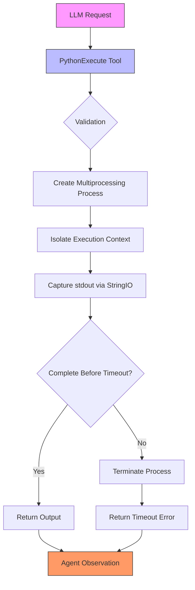
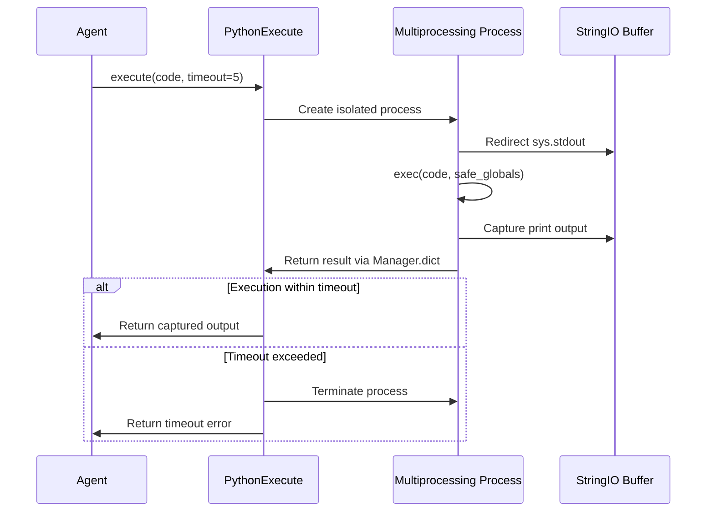
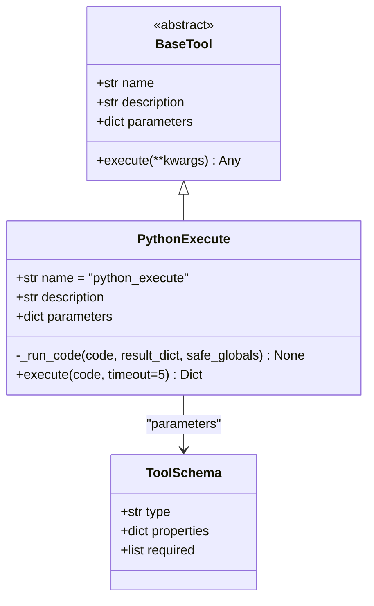
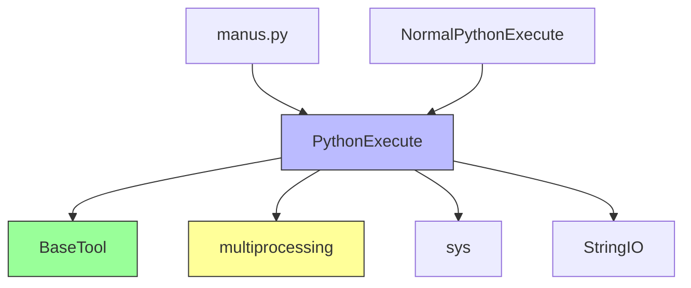

# Python Execute

<cite>
**Referenced Files in This Document**   
- [python_execute.py](file://app/tool/python_execute.py)
- [base.py](file://app/tool/base.py)
- [manus.py](file://app/agent/manus.py)
- [chart_visualization/python_execute.py](file://app/tool/chart_visualization/python_execute.py)
</cite>

## Table of Contents
1. [Introduction](#introduction)
2. [Core Components](#core-components)
3. [Architecture Overview](#architecture-overview)
4. [Detailed Component Analysis](#detailed-component-analysis)
5. [Dependency Analysis](#dependency-analysis)
6. [Performance Considerations](#performance-considerations)
7. [Troubleshooting Guide](#troubleshooting-guide)
8. [Conclusion](#conclusion)

## Introduction
The PythonExecute tool in OpenManus provides a secure mechanism for executing Python code within isolated environments. It enables safe code execution by leveraging multiprocessing isolation, stdout capture, and timeout enforcement. This tool is designed to prevent runtime interference between the main application and executed code while maintaining strict security boundaries. The implementation follows the BaseTool interface for seamless integration with LLM function calling systems, allowing agents to execute code as part of their task-solving capabilities.

**Section sources**
- [python_execute.py](file://app/tool/python_execute.py#L8-L74)

## Core Components

The PythonExecute tool consists of two primary methods that work together to provide secure code execution: the `_run_code` method handles the actual code execution in an isolated context, while the `execute` method manages the process lifecycle with timeout constraints. The tool inherits from BaseTool, ensuring compatibility with the broader tool ecosystem in OpenManus. It captures only print-based output, intentionally not returning function return values to maintain a clear separation between code execution and result observation.

**Section sources**
- [python_execute.py](file://app/tool/python_execute.py#L24-L36)
- [python_execute.py](file://app/tool/python_execute.py#L38-L74)

## Architecture Overview

**Diagram sources**
- [python_execute.py](file://app/tool/python_execute.py#L8-L74)

## Detailed Component Analysis

### PythonExecute Class Analysis
The PythonExecute class implements secure code execution through process isolation and output capture. It restricts access to global variables while allowing safe execution of provided code strings. The tool is specifically designed to capture only print-based output, making it suitable for observational tasks where the primary goal is to see what the code produces rather than capture return values.

#### Execution Flow

**Diagram sources**
- [python_execute.py](file://app/tool/python_execute.py#L38-L74)
- [python_execute.py](file://app/tool/python_execute.py#L24-L36)

### Parameter Schema Definition
The tool adheres to the BaseTool interface with a properly defined parameter schema for LLM function calling. The schema specifies that a code string is required, enabling the LLM to understand the input format needed for successful execution.

**Diagram sources**
- [python_execute.py](file://app/tool/python_execute.py#L11-L22)
- [base.py](file://app/tool/base.py#L77-L172)

## Dependency Analysis

The PythonExecute tool depends on several core components within the OpenManus framework. It inherits from BaseTool, which provides the standardized interface for all tools in the system. The implementation relies on Python's multiprocessing module for process isolation and the StringIO class for output capture. The tool is integrated into the Manus agent through the available_tools collection, making it accessible for general-purpose tasks.

**Diagram sources**
- [python_execute.py](file://app/tool/python_execute.py#L8-L74)
- [base.py](file://app/tool/base.py#L77-L172)
- [manus.py](file://app/agent/manus.py#L33-L41)

## Performance Considerations
The tool creates a new multiprocessing process for each execution, which incurs overhead but ensures complete isolation. The default timeout of 5 seconds prevents long-running or infinite loops from consuming resources indefinitely. The use of multiprocessing.Manager for result sharing adds minimal overhead while providing thread-safe communication between processes. For high-frequency execution scenarios, consider the performance implications of process creation and teardown.

**Section sources**
- [python_execute.py](file://app/tool/python_execute.py#L38-L74)

## Troubleshooting Guide
Common issues with the PythonExecute tool include syntax errors in the provided code, runtime exceptions, and timeout scenarios. The tool captures and returns these errors as part of the observation field, allowing agents to understand what went wrong. When extending the tool, ensure that any modifications maintain the security boundaries and isolation properties. For debugging, examine the returned observation field which contains either the print output or error message.

**Section sources**
- [python_execute.py](file://app/tool/python_execute.py#L24-L36)
- [python_execute.py](file://app/tool/python_execute.py#L38-L74)

## Conclusion
The PythonExecute tool provides a robust solution for secure code execution within the OpenManus framework. By leveraging multiprocessing isolation and strict output capture, it enables agents to execute Python code safely while preventing runtime interference and resource exhaustion. The tool's adherence to the BaseTool interface ensures seamless integration with LLM function calling systems, making it a reliable component for code execution tasks. Proper configuration of timeout values and careful input validation are essential for maintaining system stability and security.