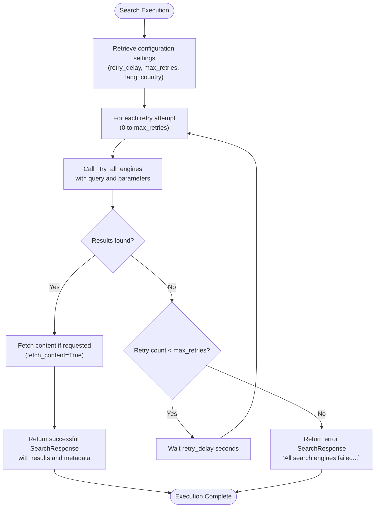
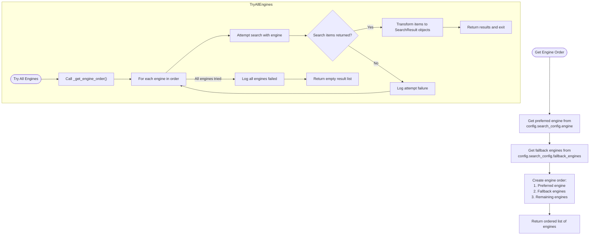
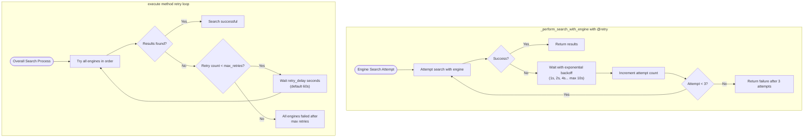
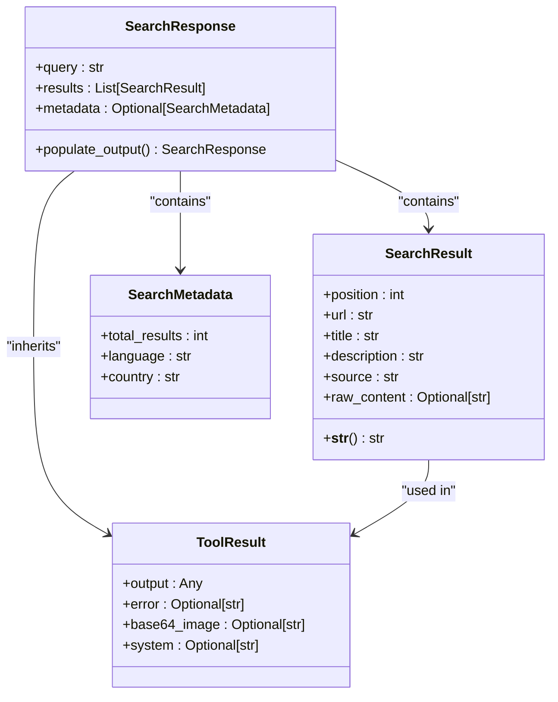
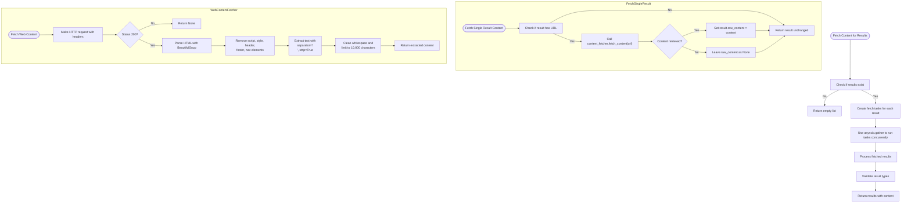
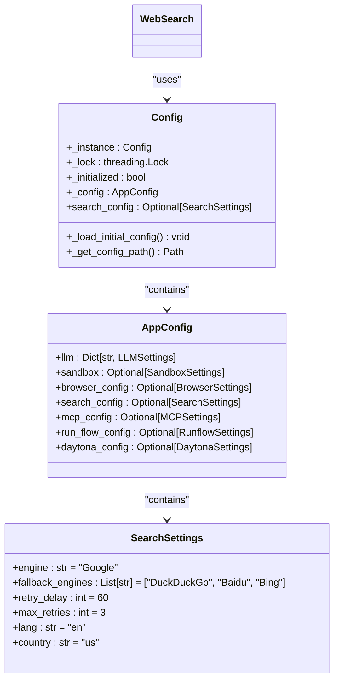
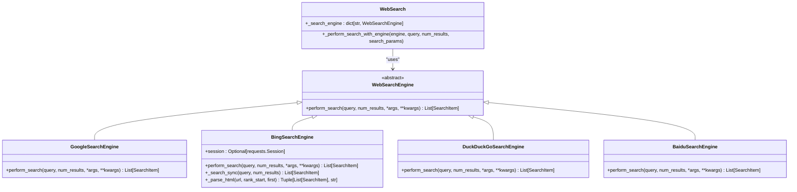

# Web Search

<cite>
**Referenced Files in This Document**   
- [web_search.py](file://app/tool/web_search.py)
- [config.py](file://app/config.py)
- [base.py](file://app/tool/search/base.py)
- [google_search.py](file://app/tool/search/google_search.py)
- [bing_search.py](file://app/tool/search/bing_search.py)
- [duckduckgo_search.py](file://app/tool/search/duckduckgo_search.py)
- [baidu_search.py](file://app/tool/search/baidu_search.py)
</cite>

## Table of Contents
1. [Introduction](#introduction)
2. [Core Components](#core-components)
3. [Search Execution Flow](#search-execution-flow)
4. [Engine Selection and Fallback Strategy](#engine-selection-and-fallback-strategy)
5. [Retry Mechanism with Exponential Backoff](#retry-mechanism-with-exponential-backoff)
6. [Search Response Structure](#search-response-structure)
7. [Content Fetching Pipeline](#content-fetching-pipeline)
8. [Configuration Management](#configuration-management)
9. [Integration with Search Engine Implementations](#integration-with-search-engine-implementations)
10. [Error Handling and Failure Scenarios](#error-handling-and-failure-scenarios)

## Introduction
The WebSearch tool in OpenManus provides a robust multi-engine search capability that enables real-time information retrieval from various search engines including Google, Bing, DuckDuckGo, and Baidu. This documentation details the implementation of the search functionality, focusing on the automatic fallback mechanisms, retry logic with exponential backoff, content fetching pipeline, and configuration-driven behavior. The tool is designed to ensure reliable search results even when primary engines fail, by systematically trying alternative engines and implementing sophisticated error recovery strategies.

## Core Components

The WebSearch tool is built around several key components that work together to provide comprehensive search capabilities. The main `WebSearch` class inherits from `BaseTool` and implements the search functionality through a series of coordinated components. The tool maintains a registry of search engines in the `_search_engine` dictionary, which includes instances of `GoogleSearchEngine`, `BaiduSearchEngine`, `DuckDuckGoSearchEngine`, and `BingSearchEngine`. Each engine implements the `WebSearchEngine` interface, ensuring consistent behavior across different search providers. The `WebContentFetcher` utility is responsible for retrieving and parsing web content from search result pages, while the `SearchResponse` model structures the results with comprehensive metadata. The tool also integrates with the configuration system through `config.search_config` to respect user preferences and default settings.

**Section sources**
- [web_search.py](file://app/tool/web_search.py#L155-L407)
- [base.py](file://app/tool/search/base.py#L19-L39)

## Search Execution Flow

The search execution process begins with the `execute` method of the `WebSearch` class, which serves as the entry point for search operations. The method first retrieves configuration settings for retry delay and maximum retries from `config.search_config`, defaulting to 60 seconds and 3 attempts if not specified. It then determines the language and country parameters, using configuration defaults when not explicitly provided in the search request. The core of the execution flow involves repeatedly calling the `_try_all_engines` method until successful results are obtained or the maximum retry count is reached. When results are successfully retrieved, the tool optionally fetches full content from result pages if the `fetch_content` parameter is set to true. The process concludes by returning a structured `SearchResponse` object containing the search results and metadata, or an error response if all search attempts fail.

**Diagram sources**
- [web_search.py](file://app/tool/web_search.py#L200-L287)

## Engine Selection and Fallback Strategy

The engine selection and fallback strategy is implemented through the `_get_engine_order` and `_try_all_engines` methods. The `_get_engine_order` method determines the priority sequence for attempting search engines based on configuration preferences. It first checks the preferred engine specified in `config.search_config.engine`, defaulting to "google" if not set. The method then incorporates any fallback engines defined in `config.search_config.fallback_engines`, maintaining the specified order. Any remaining engines not explicitly listed are appended to the end of the sequence. This creates a comprehensive ordered list that ensures the preferred engine is tried first, followed by configured fallbacks, and finally any additional available engines.

The `_try_all_engines` method iterates through this ordered list, attempting each engine in sequence until successful results are obtained. For each engine, it logs an informational message indicating the attempt and calls `_perform_search_with_engine` to execute the search. If an engine returns results, the method immediately transforms the raw search items into structured `SearchResult` objects and returns them, terminating the search process. If all engines in the current attempt fail, the method logs an error message listing all failed engines before returning an empty result set, which triggers the retry mechanism in the main execution flow.

**Diagram sources**
- [web_search.py](file://app/tool/web_search.py#L359-L384)
- [web_search.py](file://app/tool/web_search.py#L289-L326)

## Retry Mechanism with Exponential Backoff

The WebSearch tool implements a sophisticated retry mechanism that combines multiple layers of failure recovery. At the engine level, the `_perform_search_with_engine` method is decorated with the `@retry` decorator from the tenacity library, which applies exponential backoff for transient failures within individual engine calls. This retry configuration uses `stop_after_attempt(3)` to limit attempts to three and `wait_exponential(multiplier=1, min=1, max=10)` to implement exponential backoff with a minimum wait of 1 second and maximum of 10 seconds between attempts. This handles temporary issues such as network glitches or rate limiting at the engine level.

At the overall search level, the main `execute` method implements a higher-level retry strategy that activates when all configured search engines fail to return results. This outer retry loop, controlled by the `max_retries` parameter from configuration, waits for a configurable `retry_delay` (default 60 seconds) between full cycles of attempting all engines. This two-tiered approach ensures that transient failures are handled gracefully at both the individual engine level and the overall search process level. The combination of exponential backoff for immediate retries and fixed delays for complete restarts provides robust resilience against various types of search failures.

**Diagram sources**
- [web_search.py](file://app/tool/web_search.py#L389-L407)
- [web_search.py](file://app/tool/web_search.py#L200-L287)

## Search Response Structure

The search results are structured using the `SearchResponse` model, which inherits from `ToolResult` and provides a comprehensive representation of the search outcome. The response includes the original search query, a list of `SearchResult` objects, and optional `SearchMetadata`. Each `SearchResult` contains essential information such as position in the results, URL, title, description, source engine, and optionally the raw content of the page. The `SearchMetadata` includes details about the total number of results, the language code used, and the country code applied during the search.

The `SearchResponse` class implements a `model_validator` that automatically populates the output field with a formatted text representation of the results. This formatted output includes the search query, each result with its title, URL, description, and content preview (if available), followed by metadata when present. The content preview is truncated to 1000 characters with an ellipsis for longer content, ensuring the output remains readable while providing substantial information. This structured approach allows both programmatic access to the raw data and human-readable presentation of the results.

**Diagram sources**
- [web_search.py](file://app/tool/web_search.py#L52-L102)
- [web_search.py](file://app/tool/web_search.py#L21-L39)
- [web_search.py](file://app/tool/web_search.py#L42-L49)

## Content Fetching Pipeline

The content fetching pipeline is implemented through the `WebContentFetcher` utility class and related methods in the `WebSearch` class. The pipeline begins when the `execute` method calls `_fetch_content_for_results` with the list of search results, but only if the `fetch_content` parameter is set to true. This method creates asynchronous tasks for each result by calling `_fetch_single_result_content`, which in turn invokes the `fetch_content` method of the `WebContentFetcher` instance.

The `WebContentFetcher.fetch_content` method uses the requests library to retrieve the web page content, with a configurable timeout (default 10 seconds). After successful retrieval, it employs BeautifulSoup to parse the HTML and extract the main content while removing boilerplate elements such as scripts, styles, headers, footers, and navigation elements. The text is then cleaned by normalizing whitespace and limited to 10,000 characters to prevent excessive memory usage. The extracted content is stored in the `raw_content` field of the corresponding `SearchResult` object, enriching the search results with the actual page content rather than just metadata.

**Diagram sources**
- [web_search.py](file://app/tool/web_search.py#L328-L357)
- [web_search.py](file://app/tool/web_search.py#L351-L357)
- [web_search.py](file://app/tool/web_search.py#L105-L152)

## Configuration Management

Configuration management for the WebSearch tool is handled through the `SearchSettings` class and the global `config` object. The `SearchSettings` model defines all configurable parameters including the primary search engine, fallback engines, retry delay, maximum retries, language code, and country code. These settings are loaded from the configuration file (config.toml or config.example.toml) during application initialization and made available through `config.search_config`.

The tool respects these configuration settings throughout its operation. The preferred engine and fallback engines from configuration determine the search order in `_get_engine_order`. The retry_delay and max_retries values control the outer retry loop in the `execute` method. Language and country settings provide defaults when not specified in individual search requests. This configuration-driven approach allows users to customize the search behavior without modifying code, enabling adaptation to different environments, rate limits, and regional preferences. The configuration system also supports environment-specific overrides, allowing different settings for development, testing, and production environments.

**Diagram sources**
- [config.py](file://app/config.py#L38-L59)
- [config.py](file://app/config.py#L196-L368)

## Integration with Search Engine Implementations

The WebSearch tool integrates with individual search engine implementations through a consistent interface defined by the `WebSearchEngine` base class. Each engine (Google, Bing, DuckDuckGo, Baidu) implements the `perform_search` method, which returns a list of `SearchItem` objects. The `WebSearch` class maintains instances of these engine classes in the `_search_engine` dictionary, keyed by their respective names. This design enables polymorphic behavior where the same method call can be dispatched to different engine implementations based on the current search target.

The integration is facilitated by the `_perform_search_with_engine` method, which acts as an adapter between the asynchronous execution model of the WebSearch tool and the synchronous nature of the underlying search engine APIs. This method uses `asyncio.get_event_loop().run_in_executor` to run the synchronous `perform_search` calls in a thread pool, preventing the blocking operations from interfering with the event loop. The method extracts language and country parameters from the search_params dictionary and passes them to the engine's perform_search method, ensuring that configuration settings are properly applied to each search request.

**Diagram sources**
- [web_search.py](file://app/tool/web_search.py#L192-L197)
- [web_search.py](file://app/tool/web_search.py#L389-L407)
- [base.py](file://app/tool/search/base.py#L19-L39)
- [google_search.py](file://app/tool/search/google_search.py#L7-L32)
- [bing_search.py](file://app/tool/search/bing_search.py#L37-L143)
- [duckduckgo_search.py](file://app/tool/search/duckduckgo_search.py#L7-L56)
- [baidu_search.py](file://app/tool/search/baidu_search.py#L7-L53)

## Error Handling and Failure Scenarios

The WebSearch tool implements comprehensive error handling to manage various failure scenarios gracefully. At the individual engine level, each search engine implementation includes try-catch blocks to handle exceptions during HTTP requests and HTML parsing. For example, the `BingSearchEngine._parse_html` method catches exceptions during HTML parsing and returns empty results rather than propagating errors. Similarly, the `WebContentFetcher.fetch_content` method handles network errors, HTTP status errors, and parsing exceptions, returning None when content cannot be retrieved.

At the orchestration level, the tool implements a multi-layered failure recovery strategy. The inner retry mechanism with exponential backoff handles transient failures of individual engine calls. When all engines fail in a single attempt, the outer retry loop waits for a configurable delay before trying all engines again. This handles scenarios where search engines might be temporarily unavailable or rate-limited. If all engines fail after the maximum number of retries, the tool returns a structured error response rather than raising an exception, ensuring that the calling code can handle the failure gracefully. The error handling also includes comprehensive logging at different levels (info, warning, error) to aid in debugging and monitoring.

```mermaid
flowchart TD
subgraph EngineLevelErrorHandling
EStart([Engine perform_search]) --> Try["Try to execute search"]
Try --> Success{"Success?"}
Success --> |Yes| ReturnResults["Return results"]
Success --> |No| Catch["Catch exception"]
Catch --> Log["Log warning/error"]
Log --> ReturnEmpty["Return empty results"]
end
subgraph ContentFetcherErrorHandling
CStart([fetch_content]) --> Request["Make HTTP request"]
Request --> Status{"Status 200?"}
Status --> |No| LogError["Log warning: HTTP error"]
Status --> |Yes| Parse["Parse HTML"]
Parse --> ParseSuccess{"Parse successful?"}
ParseSuccess --> |No| LogParseError["Log warning: Parse error"]
ParseSuccess --> |Yes| Extract["Extract content"]
Extract --> Size{"Content within limits?"}
Size --> |No| Truncate["Truncate content"]
LogError --> ReturnNone["Return None"]
LogParseError --> ReturnNone
Truncate --> ReturnContent
Extract --> |Yes| ReturnContent["Return content"]
ReturnNone --> End
ReturnContent --> End
end
subgraph OrchestrationLevelErrorHandling
OStart([execute method]) --> Engines["Try all engines"]
Engines --> Results{"Results found?"}
Results --> |No| Retry{"Retry count < max_retries?"}
Retry --> |Yes| Wait["Wait retry_delay"]
Wait --> Engines
Retry --> |No| FinalError["Log error: All engines failed"]
FinalError --> ReturnErrorResponse["Return error SearchResponse"]
end
```

**Diagram sources**
- [web_search.py](file://app/tool/web_search.py#L200-L287)
- [web_search.py](file://app/tool/web_search.py#L105-L152)
- [bing_search.py](file://app/tool/search/bing_search.py#L37-L143)