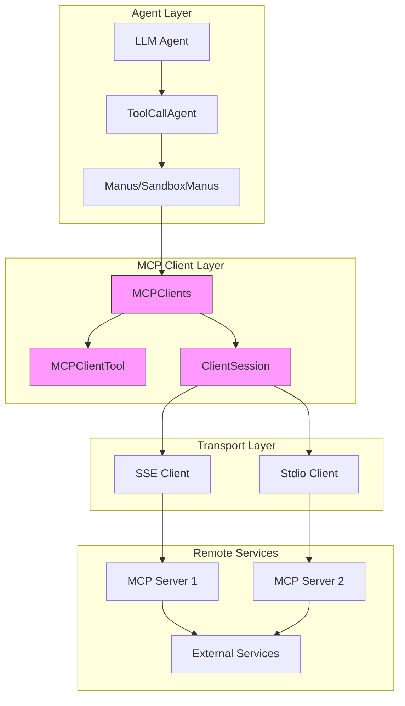
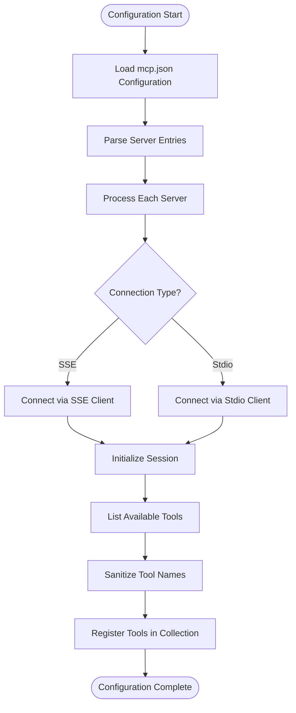
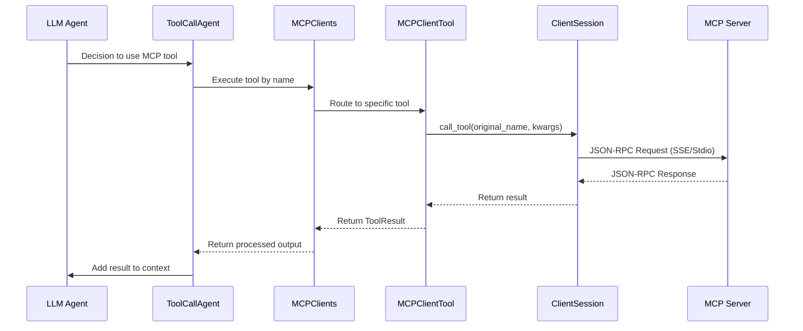

# MCP Tools

<cite>
**Referenced Files in This Document**   
- [mcp.py](file://app/tool/mcp.py)
- [mcp.example.json](file://config/mcp.example.json)
- [config.py](file://app/config.py)
- [manus.py](file://app/agent/manus.py)
- [sandbox_agent.py](file://app/agent/sandbox_agent.py)
- [tool_collection.py](file://app/tool/tool_collection.py)
- [base.py](file://app/tool/base.py)
</cite>

## Table of Contents
1. [Introduction](#introduction)
2. [Core Components](#core-components)
3. [Architecture Overview](#architecture-overview)
4. [Configuration and Initialization](#configuration-and-initialization)
5. [End-to-End Workflow](#end-to-end-workflow)
6. [Common Usage Patterns](#common-usage-patterns)
7. [Troubleshooting Guide](#troubleshooting-guide)
8. [Performance Optimization](#performance-optimization)

## Introduction
The MCP (Model Context Protocol) Tools in OpenManus enable remote procedure calls to external services through standardized protocol interfaces. This system allows agents to interact with various MCP servers using either Server-Sent Events (SSE) or stdio transport mechanisms. The implementation centers around the `MCPClients` class that manages connections to multiple MCP servers and exposes their tools to the agent framework. These tools are integrated into the ToolCollection system, allowing seamless invocation from LLM-driven agents. The protocol follows a JSON-RPC style request/response pattern, enabling remote execution of tools and processing of results within the agent workflow.

## Core Components

The MCP Tools system consists of several key components that work together to enable remote tool execution. The `MCPClientTool` class serves as a proxy for individual tools available on remote MCP servers, handling the execution of remote calls through the established session. Each `MCPClientTool` instance maintains a reference to its parent session, server identifier, and original tool name, enabling proper routing of requests.

The `MCPClients` class extends `ToolCollection` to manage multiple MCP server connections simultaneously. It maintains separate sessions for each server, handles connection lifecycle management, and dynamically populates available tools based on what's exposed by each server. This class provides methods for connecting via both SSE and stdio transports, ensuring flexibility in deployment scenarios.

The integration with the agent system occurs through the `available_tools` property in agent classes like `Manus` and `SandboxManus`, which incorporates MCP tools alongside local tools in a unified interface. This allows agents to seamlessly use both local and remote capabilities without distinguishing between them in their decision-making process.

**Section sources**
- [mcp.py](file://app/tool/mcp.py#L13-L193)
- [manus.py](file://app/agent/manus.py#L30-L30)
- [sandbox_agent.py](file://app/agent/sandbox_agent.py#L33-L33)
- [tool_collection.py](file://app/tool/tool_collection.py#L8-L70)
- [base.py](file://app/tool/base.py#L77-L172)

## Architecture Overview

**Diagram sources**
- [mcp.py](file://app/tool/mcp.py#L13-L193)
- [manus.py](file://app/agent/manus.py#L30-L30)

## Configuration and Initialization

MCP server configurations are defined in a JSON file following the structure specified in `mcp.example.json`. The configuration supports multiple servers with different connection types (SSE or stdio). Each server entry includes a unique identifier, connection type, and transport-specific parameters such as URL for SSE connections or command/arguments for stdio connections.

The configuration system loads these settings through the `MCPSettings` class in `config.py`, which parses the JSON configuration and creates appropriate `MCPServerConfig` instances. During agent initialization, as seen in the `initialize_mcp_servers` method of both `Manus` and `SandboxManus` agents, the system iterates through all configured servers and establishes connections based on their type.

For SSE connections, the system uses the `connect_sse` method with the server URL, while stdio connections use `connect_stdio` with the specified command and arguments. The `server_id` parameter allows for logical identification of servers beyond their connection details, enabling better organization when multiple servers provide similar capabilities.

**Diagram sources**
- [mcp.example.json](file://config/mcp.example.json#L1-L9)
- [config.py](file://app/config.py#L126-L159)
- [manus.py](file://app/agent/manus.py#L66-L88)
- [mcp.py](file://app/tool/mcp.py#L49-L68)

## End-to-End Workflow

The end-to-end workflow of MCP tool execution follows a clear sequence from LLM decision to result processing. When an LLM determines that a task requires external capabilities, it selects an appropriate MCP tool from the available options. The agent framework then initiates the tool call through the `execute` method of the corresponding `MCPClientTool` instance.

The execution process begins with validation of the session state, ensuring that the connection to the MCP server is active. If valid, the system makes a remote call using the `call_tool` method of the `ClientSession`, passing the original tool name and parameters. This triggers a JSON-RPC style request over the established transport channel (SSE or stdio) to the remote MCP server.

Upon receiving the response, the client processes the result content, extracting text elements from the response payload. The system handles various content types through the `TextContent` check, concatenating multiple text elements if present. The processed result is wrapped in a `ToolResult` object and returned to the agent for further processing.

The agent then incorporates this result into its memory and continues the reasoning process, potentially making additional tool calls or generating a final response based on the accumulated information.

**Diagram sources**
- [mcp.py](file://app/tool/mcp.py#L20-L33)
- [mcp.py](file://app/tool/mcp.py#L96-L125)
- [toolcall.py](file://app/agent/toolcall.py#L150-L190)

## Common Usage Patterns

Common MCP tool usage patterns include connecting to local development servers via SSE for testing and development purposes, as shown in the example configuration with a localhost URL. Production deployments often use stdio transport to connect to containerized or isolated MCP server processes, providing better security and resource isolation.

Configuration options allow for flexible server identification through the `server_id` parameter, which can be explicitly set or defaults to the URL or command. This enables multiple connections to the same physical server with different logical identities, useful for separating concerns or managing different tool sets.

Authentication and security settings are typically handled at the transport level, with SSE connections potentially using standard HTTP authentication mechanisms and stdio connections relying on process-level security. Timeout settings and connection retry logic are managed through the underlying MCP client library rather than the OpenManus wrapper.

The tool naming system automatically prefixes remote tools with "mcp_" followed by the server ID and original tool name, ensuring global uniqueness within the agent's tool namespace. The `_sanitize_tool_name` method ensures compatibility with tool calling systems by replacing invalid characters and truncating long names.

**Section sources**
- [mcp.example.json](file://config/mcp.example.json#L1-L9)
- [mcp.py](file://app/tool/mcp.py#L127-L144)
- [mcp.py](file://app/tool/mcp.py#L49-L68)
- [mcp.py](file://app/tool/mcp.py#L70-L94)

## Troubleshooting Guide

Common issues with MCP communications include network connectivity problems, protocol version mismatches, and payload size limitations. Network issues can be diagnosed by verifying the accessibility of SSE endpoints or the executability of stdio commands. The system logs connection attempts and errors through the logger, providing visibility into connection failures.

Protocol version mismatches typically manifest as initialization failures or unexpected response formats. These can be addressed by ensuring compatibility between the client library version and the MCP server implementation. The `initialize()` call during connection setup serves as an early validation point for protocol compatibility.

Payload size limitations may cause truncation or connection resets, particularly with SSE transport. Large responses should be chunked or summarized at the server level to prevent transmission issues. The system handles partial content by joining available text elements, but extremely large payloads may exceed memory or processing limits.

Debugging MCP communications can be facilitated by enabling verbose logging, which captures the sequence of connection, initialization, tool listing, and execution calls. The structured error handling in the `execute` method provides specific error messages that can help identify whether issues originate from connection problems, serialization errors, or remote execution failures.

**Section sources**
- [mcp.py](file://app/tool/mcp.py#L20-L33)
- [mcp.py](file://app/tool/mcp.py#L154-L193)
- [config.py](file://app/config.py#L157-L199)

## Performance Optimization

Performance optimization for MCP tools focuses on reducing latency in remote tool calls through connection pooling, efficient serialization, and strategic caching. The `MCPClients` class maintains persistent connections to servers, eliminating the overhead of establishing new connections for each tool call.

The use of asynchronous context managers (`AsyncExitStack`) ensures efficient resource management while maintaining connection state across multiple operations. This approach minimizes the overhead of connection setup and teardown, particularly important for stdio-based transports that involve process creation.

To reduce latency, applications should establish connections during agent initialization rather than on-demand, ensuring that remote tools are immediately available when needed. The periodic tool refresh mechanism in agents like `MCPAgent` can be tuned to balance between freshness of tool availability and network overhead.

For high-frequency tool usage patterns, consider implementing client-side caching of frequent responses or batching multiple tool calls when supported by the application logic. The modular design of the MCP client system allows for potential extensions to support these optimization strategies without modifying the core agent framework.

**Section sources**
- [mcp.py](file://app/tool/mcp.py#L41-L42)
- [mcp.py](file://app/tool/mcp.py#L49-L68)
- [mcp.py](file://app/tool/mcp.py#L96-L125)