# Tool Collection

<cite>
**Referenced Files in This Document**  
- [tool_collection.py](file://app/tool/tool_collection.py)
- [base.py](file://app/tool/base.py)
- [mcp.py](file://app/tool/mcp.py)
- [exceptions.py](file://app/exceptions.py)
</cite>

## Table of Contents
1. [Introduction](#introduction)
2. [Core Components](#core-components)
3. [Architecture Overview](#architecture-overview)
4. [Detailed Component Analysis](#detailed-component-analysis)
5. [Dependency Analysis](#dependency-analysis)
6. [Performance Considerations](#performance-considerations)
7. [Troubleshooting Guide](#troubleshooting-guide)
8. [Conclusion](#conclusion)

## Introduction
The ToolCollection class in OpenManus serves as the central registry for managing both local and MCP (Model Context Protocol) tools. It provides a unified interface for tool registration, execution, and conversion to LLM-consumable formats. This document details the implementation and usage patterns of the ToolCollection class, focusing on its role in orchestrating tool-based workflows within the OpenManus framework.

**Section sources**
- [tool_collection.py](file://app/tool/tool_collection.py#L8-L70)

## Core Components
The ToolCollection class is the primary component for managing tool collections in OpenManus. It maintains tools in a name-indexed dictionary (tool_map) for O(1) lookup performance and provides methods for tool registration, execution, and parameter conversion. The class works in conjunction with BaseTool, ToolResult, and ToolFailure classes to provide a complete tool management system.

**Section sources**
- [tool_collection.py](file://app/tool/tool_collection.py#L8-L70)
- [base.py](file://app/tool/base.py#L1-L181)
- [exceptions.py](file://app/exceptions.py#L1-L13)

## Architecture Overview
The ToolCollection class implements a registry pattern for tool management, with a focus on performance and extensibility. Tools are stored in a name-indexed dictionary (tool_map) that enables constant-time lookups during execution. The architecture supports both local tools and remote MCP tools through inheritance, with MCPClients extending ToolCollection to handle server connections and dynamic tool registration.


**Diagram sources**
- [tool_collection.py](file://app/tool/tool_collection.py#L8-L70)
- [base.py](file://app/tool/base.py#L1-L181)
- [mcp.py](file://app/tool/mcp.py#L36-L193)

## Detailed Component Analysis

### ToolCollection Class Analysis
The ToolCollection class serves as the central registry for managing tools in OpenManus. It provides efficient storage and retrieval mechanisms for both local and remote tools, enabling seamless integration with LLM-based agents.

#### Initialization and Tool Registration
The ToolCollection class is initialized with an optional set of tools passed as arguments. During initialization, it creates a tuple of tools and a name-indexed dictionary (tool_map) for O(1) lookup performance. This dual storage approach allows for both ordered iteration through tools and efficient name-based lookups.

```mermaid
flowchart TD
Start([ToolCollection Initialization]) --> InitParams["Extract tools from *args"]
InitParams --> CreateTuple["Create self.tools tuple"]
CreateTuple --> CreateMap["Create self.tool_map dictionary"]
CreateMap --> MapTools["Map tool.name → tool for each tool"]
MapTools --> Complete([Initialization Complete])
```



**Diagram sources**
- [tool_collection.py](file://app/tool/tool_collection.py#L14-L16)

#### Tool Storage and Lookup Mechanism
The ToolCollection class employs a dual-storage strategy using both a tuple (self.tools) and a dictionary (self.tool_map). The tuple preserves the order of tool registration and enables sequential processing, while the dictionary provides O(1) name-based lookup performance. This design optimizes both iteration and random access patterns common in tool orchestration workflows.

**Section sources**
- [tool_collection.py](file://app/tool/tool_collection.py#L14-L16)

#### Parameter Conversion for LLM Consumption
The to_params() method converts all registered tools into OpenAI-compatible function calling format, enabling LLMs to understand and invoke available tools. This method iterates through all tools and calls their to_param() method, which returns a standardized dictionary structure containing the tool's name, description, and parameter schema.


**Diagram sources**
- [tool_collection.py](file://app/tool/tool_collection.py#L21-L22)
- [base.py](file://app/tool/base.py#L142-L150)

#### Tool Execution Workflow
The execute() method implements a robust workflow for tool invocation with comprehensive error handling. It first performs a name-based lookup in the tool_map dictionary, returning a ToolFailure response if the tool is not found. Upon successful lookup, it attempts asynchronous execution of the tool with the provided parameters, catching ToolError exceptions and converting them to ToolFailure responses.

```mermaid
flowchart TD
Start([execute()]) --> Lookup["tool = self.tool_map.get(name)"]
Lookup --> Found{"Tool Found?"}
Found --> |No| ReturnInvalid["Return ToolFailure: Tool invalid"]
Found --> |Yes| TryExecute["Try: result = await tool(**tool_input)"]
TryExecute --> Success["Return result"]
TryExecute --> |Exception| CatchError["Catch ToolError"]
CatchError --> ReturnFailure["Return ToolFailure: error.message"]
```

**Diagram sources**
- [tool_collection.py](file://app/tool/tool_collection.py#L24-L34)
- [exceptions.py](file://app/exceptions.py#L1-L5)

#### Dynamic Tool Registration
The ToolCollection class supports dynamic tool registration through add_tool() and add_tools() methods. These methods enable runtime addition of tools to the collection, with built-in conflict resolution for duplicate tool names. When a tool with an existing name is added, a warning is logged and the operation is skipped, preserving the integrity of the tool registry.


**Diagram sources**
- [tool_collection.py](file://app/tool/tool_collection.py#L50-L70)

## Dependency Analysis
The ToolCollection class has well-defined dependencies on several core components of the OpenManus framework. It depends on BaseTool for the tool interface, ToolResult and ToolFailure for standardized response handling, and logger for diagnostic output. The MCPClients class extends ToolCollection to provide MCP-specific functionality, demonstrating the extensibility of the base design.

```mermaid
graph TD
ToolCollection --> BaseTool : "manages"
ToolCollection --> ToolResult : "returns"
ToolCollection --> ToolFailure : "returns"
ToolCollection --> logger : "logs warnings"
MCPClients --> ToolCollection : "extends"
MCPClientTool --> BaseTool : "extends"
```

**Diagram sources**
- [tool_collection.py](file://app/tool/tool_collection.py#L8-L70)
- [base.py](file://app/tool/base.py#L1-L181)
- [mcp.py](file://app/tool/mcp.py#L36-L193)

## Performance Considerations
The ToolCollection class is designed with performance in mind, particularly for large tool collections. The use of a dictionary (tool_map) for name-based lookups ensures O(1) time complexity for tool retrieval operations. For very large collections, consider implementing lazy loading strategies where tools are only instantiated when first accessed. Pre-validation of tool inputs can also improve performance by catching errors before execution, reducing the overhead of exception handling during tool invocation.

## Troubleshooting Guide
Common issues with the ToolCollection class include tool name collisions, execution timeouts, and improper parameter formatting. When duplicate tool names are added, the system logs a warning but does not overwrite existing tools, which may lead to unexpected behavior. For execution timeouts, ensure that asynchronous tools properly handle cancellation signals. Parameter formatting issues can be mitigated by validating inputs against the tool's parameter schema before execution.

**Section sources**
- [tool_collection.py](file://app/tool/tool_collection.py#L50-L70)
- [base.py](file://app/tool/base.py#L162-L180)
- [exceptions.py](file://app/exceptions.py#L1-L5)

## Conclusion
The ToolCollection class provides a robust foundation for tool management in OpenManus, offering efficient storage, retrieval, and execution capabilities. Its design supports both static and dynamic tool registration, with comprehensive error handling and LLM-compatible parameter conversion. The extensible architecture enables integration with remote tool systems like MCP while maintaining a consistent interface for local tools. By following best practices for tool naming, input validation, and error handling, developers can create reliable and performant tool-based workflows within the OpenManus framework.