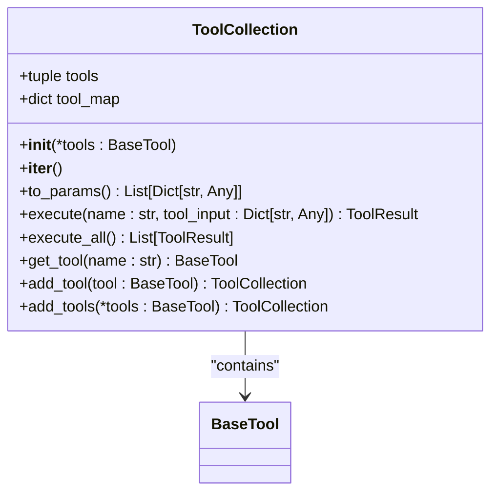
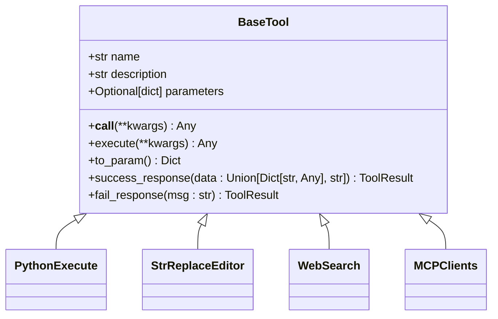
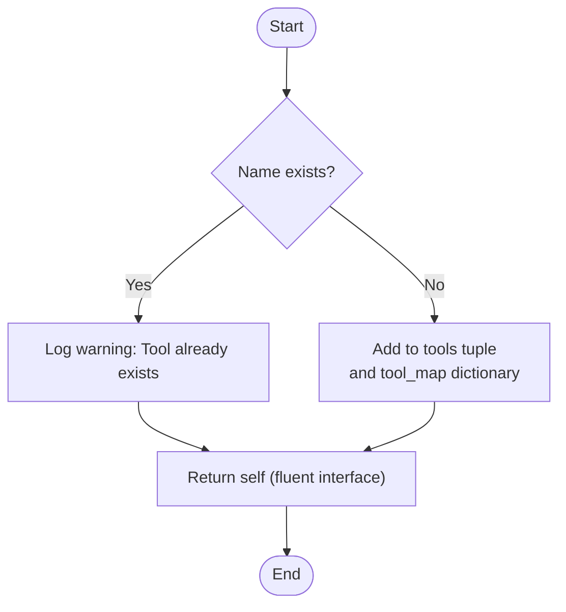
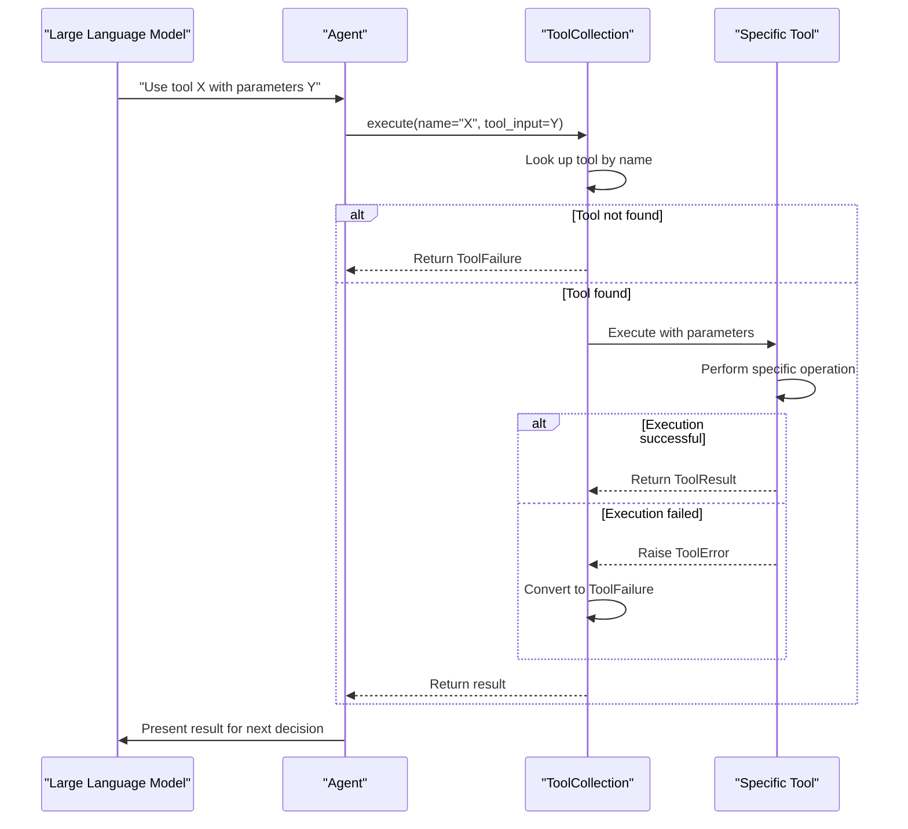
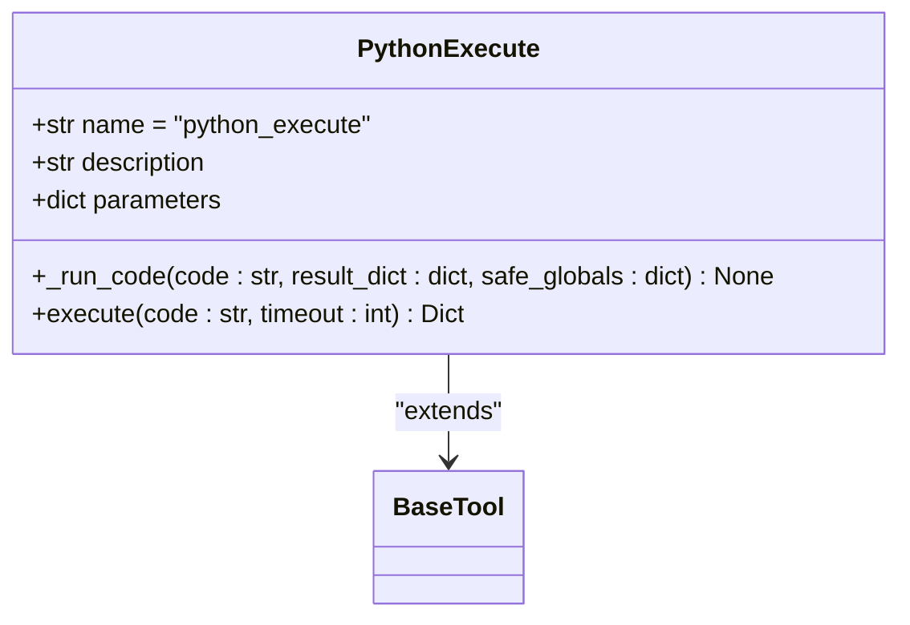
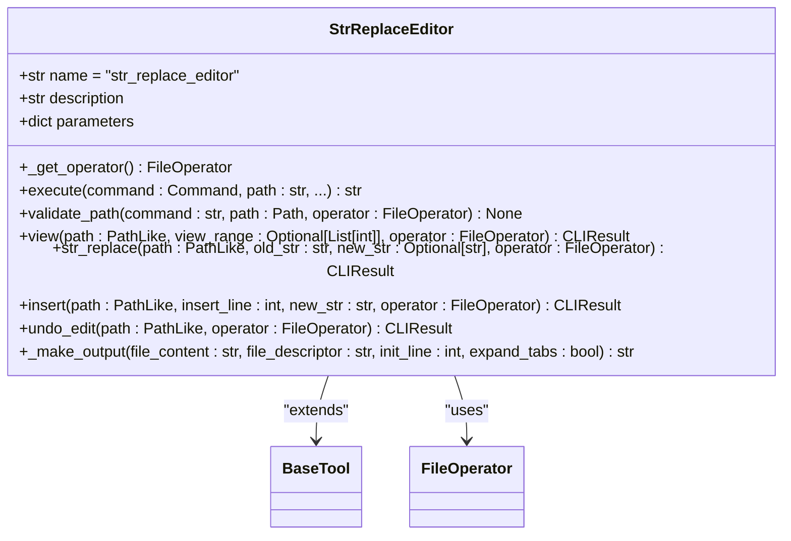
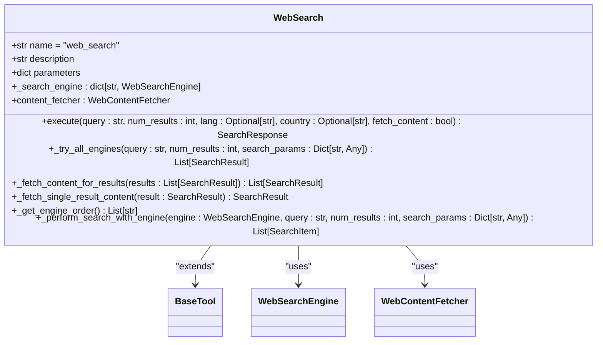

# Tool System

<cite>
**Referenced Files in This Document**   
- [tool_collection.py](file://app/tool/tool_collection.py)
- [base.py](file://app/tool/base.py)
- [python_execute.py](file://app/tool/python_execute.py)
- [file_operators.py](file://app/tool/file_operators.py)
- [web_search.py](file://app/tool/web_search.py)
- [str_replace_editor.py](file://app/tool/str_replace_editor.py)
</cite>

## Table of Contents
1. [Introduction](#introduction)
2. [ToolCollection Class](#toolcollection-class)
3. [BaseTool Interface](#basetool-interface)
4. [Tool Registration and Management](#tool-registration-and-management)
5. [Tool Execution Flow](#tool-execution-flow)
6. [Core Tool Implementations](#core-tool-implementations)
7. [Error Handling and Validation](#error-handling-and-validation)
8. [Performance Optimization](#performance-optimization)
9. [Conclusion](#conclusion)

## Introduction

The Tool System in OpenManus provides a comprehensive framework for managing and executing various tools that extend the capabilities of AI agents. At its core, the system revolves around the `ToolCollection` class, which serves as a central registry for both local and MCP (Model Context Protocol) tools. This document details the architecture, implementation, and usage patterns of the tool system, focusing on how tools are registered, executed, and managed throughout their lifecycle.

The system enables AI agents to perform complex operations beyond basic language processing, including code execution, file manipulation, web search, and browser automation. By providing a standardized interface through the `BaseTool` class, the system ensures consistent behavior across different tool types while allowing for specialized implementations.

**Section sources**
- [tool_collection.py](file://app/tool/tool_collection.py#L8-L70)
- [base.py](file://app/tool/base.py#L77-L172)

## ToolCollection Class

The `ToolCollection` class serves as the central registry for managing tools within the OpenManus system. It provides a structured way to organize, access, and execute various tools that extend the capabilities of AI agents. The class maintains two primary data structures: a tuple of tools and a dictionary mapping tool names to their instances, enabling efficient lookup and iteration.

**Diagram sources**
- [tool_collection.py](file://app/tool/tool_collection.py#L8-L70)

The `ToolCollection` class implements several key methods for tool management. The constructor initializes the collection with a variable number of tools, creating both a tuple for iteration and a dictionary for fast name-based lookup. This dual structure optimizes both sequential processing and random access patterns.

**Section sources**
- [tool_collection.py](file://app/tool/tool_collection.py#L14-L16)
- [tool_collection.py](file://app/tool/tool_collection.py#L15-L15)
- [tool_collection.py](file://app/tool/tool_collection.py#L16-L16)

## BaseTool Interface

The `BaseTool` class defines the foundational interface for all tools in the OpenManus system. As an abstract base class that inherits from Pydantic's `BaseModel`, it provides a standardized structure for tool implementation while ensuring data validation and type safety. The interface establishes a consistent contract that all concrete tool implementations must follow.

**Diagram sources**
- [base.py](file://app/tool/base.py#L77-L172)

The `BaseTool` interface includes several essential components. The `name`, `description`, and `parameters` fields provide metadata about the tool, with `parameters` defining the JSON schema for valid inputs. The abstract `execute` method must be implemented by all subclasses, defining the core functionality of the tool. The `__call__` method delegates to `execute`, enabling tools to be invoked like functions.

**Section sources**
- [base.py](file://app/tool/base.py#L93-L95)
- [base.py](file://app/tool/base.py#L120-L121)
- [base.py](file://app/tool/base.py#L115-L117)

## Tool Registration and Management

The tool registration system in OpenManus provides flexible mechanisms for adding tools to a `ToolCollection`. The primary methods are `add_tool()` for single tool registration and `add_tools()` for batch registration. These methods ensure that tools are properly indexed by name while handling potential conflicts through warning messages rather than exceptions.

**Diagram sources**
- [tool_collection.py](file://app/tool/tool_collection.py#L50-L61)
- [tool_collection.py](file://app/tool/tool_collection.py#L63-L70)

The `add_tool()` method first checks if a tool with the same name already exists in the collection. If a conflict is detected, a warning is logged and the method returns without adding the duplicate tool. This approach prevents accidental overwrites while allowing the system to continue operating. When no conflict exists, the tool is added to both the `tools` tuple and the `tool_map` dictionary, maintaining consistency between the two data structures.

The `add_tools()` method provides a convenient way to register multiple tools at once by iterating through the provided tools and calling `add_tool()` for each one. This implementation leverages the existing single-tool registration logic, ensuring consistent behavior across both methods. The fluent interface pattern is used throughout, with both methods returning `self` to enable method chaining.

**Section sources**
- [tool_collection.py](file://app/tool/tool_collection.py#L50-L61)
- [tool_collection.py](file://app/tool/tool_collection.py#L63-L70)

## Tool Execution Flow

The tool execution flow in OpenManus follows a well-defined sequence from LLM decision to result handling. When an LLM determines that a tool should be used, it generates a tool call specifying the tool name and input parameters. This call is then processed by the `ToolCollection`'s `execute()` method, which performs the actual execution and returns a structured result.

**Diagram sources**
- [tool_collection.py](file://app/tool/tool_collection.py#L24-L34)
- [tool_collection.py](file://app/tool/tool_collection.py#L8-L70)

The `execute()` method begins by looking up the requested tool in the `tool_map` dictionary using the provided name. If the tool is not found, a `ToolFailure` object is returned immediately with an appropriate error message. This fail-fast approach prevents unnecessary processing when invalid tool names are specified.

When the tool is found, the method attempts to execute it by calling the tool instance with the provided input parameters. This invokes the tool's `__call__` method, which in turn calls the `execute` method implemented by the specific tool subclass. The execution is wrapped in a try-except block to catch any `ToolError` exceptions that may be raised during processing.

**Section sources**
- [tool_collection.py](file://app/tool/tool_collection.py#L24-L34)
- [tool_collection.py](file://app/tool/tool_collection.py#L115-L117)

## Core Tool Implementations

OpenManus includes several core tool implementations that demonstrate the flexibility of the `BaseTool` interface. These tools cover a range of functionality from code execution to file manipulation and web search, each implementing the abstract `execute` method to provide specialized behavior.

### Python Execution Tool

The `PythonExecute` tool enables safe execution of Python code within a sandboxed environment. It uses multiprocessing to isolate code execution, preventing potentially harmful operations from affecting the main process. The tool captures both stdout and stderr output, returning it as part of the execution result.

**Diagram sources**
- [python_execute.py](file://app/tool/python_execute.py#L8-L74)

The implementation uses a separate process to execute the provided code, with a configurable timeout to prevent infinite loops. The `safe_globals` dictionary restricts access to built-in functions, enhancing security. If the execution exceeds the timeout, the process is terminated and a timeout error is returned.

**Section sources**
- [python_execute.py](file://app/tool/python_execute.py#L8-L74)

### File Operations Tool

The `StrReplaceEditor` tool provides comprehensive file manipulation capabilities, including viewing, creating, editing, and undoing changes. It supports both local and sandboxed environments through the `FileOperator` interface, allowing it to work seamlessly across different execution contexts.

**Diagram sources**
- [str_replace_editor.py](file://app/tool/str_replace_editor.py#L59-L431)

The tool implements several commands: `view` for displaying file or directory contents, `create` for creating new files, `str_replace` for replacing text, `insert` for inserting text at a specific line, and `undo_edit` for reverting the last change. Each command includes comprehensive validation to ensure safe operation.

**Section sources**
- [str_replace_editor.py](file://app/tool/str_replace_editor.py#L59-L431)

### Web Search Tool

The `WebSearch` tool provides internet search capabilities through multiple search engines including Google, Baidu, Bing, and DuckDuckGo. It implements a fallback strategy, attempting to use the configured primary engine first and falling back to alternatives if the primary fails.

**Diagram sources**
- [web_search.py](file://app/tool/web_search.py#L155-L407)

The search functionality includes configurable parameters for the number of results, language, country, and whether to fetch full content from result pages. The tool implements retry logic with exponential backoff to handle temporary failures, and automatically sanitizes input to prevent injection attacks.

**Section sources**
- [web_search.py](file://app/tool/web_search.py#L155-L407)

## Error Handling and Validation

The tool system implements comprehensive error handling and validation mechanisms to ensure robust operation. Each tool is responsible for validating its input parameters and handling execution errors, while the `ToolCollection` provides a consistent error reporting interface.

When a tool encounters an error during execution, it raises a `ToolError` exception with a descriptive message. The `ToolCollection`'s `execute()` method catches these exceptions and converts them into `ToolFailure` objects, which are then returned to the calling agent. This separation of concerns allows tools to focus on their specific error conditions while maintaining a uniform error reporting format.

Input validation is performed at multiple levels. The `BaseTool` interface leverages Pydantic's validation capabilities to ensure that required parameters are present and of the correct type. Individual tools may implement additional validation logic in their `execute` methods, such as checking file paths for validity or ensuring that search queries meet length requirements.

For tools that modify state, such as the `StrReplaceEditor`, additional safeguards are implemented. The tool maintains a history of file changes, allowing users to undo edits if needed. Before performing operations like file creation or text replacement, the tool validates that the requested operation is safe and makes sense in the current context.

**Section sources**
- [tool_collection.py](file://app/tool/tool_collection.py#L24-L34)
- [base.py](file://app/tool/base.py#L162-L172)
- [str_replace_editor.py](file://app/tool/str_replace_editor.py#L59-L431)

## Performance Optimization

The tool system includes several performance optimization strategies to ensure efficient operation, particularly when dealing with multiple tool executions or resource-intensive operations.

For batch tool execution, the `execute_all()` method provides a way to run all tools in a collection sequentially. While this method processes tools one at a time, it could be enhanced with parallel execution using `asyncio.gather()` to improve throughput when tools are independent of each other.

The `ToolCollection` class optimizes tool lookup by maintaining a dictionary (`tool_map`) that provides O(1) access to tools by name. This is particularly important in high-throughput scenarios where the same tools may be called repeatedly. The use of tuples for storing the tools list also provides memory efficiency and immutability benefits.

For resource-intensive operations like code execution or web search, the system implements timeout mechanisms to prevent hanging operations. The `PythonExecute` tool uses multiprocessing with configurable timeouts, while the `WebSearch` tool implements retry logic with exponential backoff to handle temporary network issues without overwhelming external services.

Caching strategies could be implemented at the tool level to avoid redundant operations. For example, web search results could be cached for a configurable period to reduce API calls and improve response times for repeated queries. Similarly, file contents could be cached when multiple operations are performed on the same file within a short time period.

**Section sources**
- [tool_collection.py](file://app/tool/tool_collection.py#L36-L45)
- [python_execute.py](file://app/tool/python_execute.py#L46-L74)
- [web_search.py](file://app/tool/web_search.py#L155-L407)

## Conclusion

The Tool System in OpenManus provides a robust and extensible framework for managing AI agent capabilities. The `ToolCollection` class serves as a central registry that efficiently manages tool registration, lookup, and execution. Through the `BaseTool` interface, the system ensures consistent behavior across diverse tool types while allowing for specialized implementations.

The architecture supports both local tools and MCP tools, enabling integration with external services and distributed systems. The comprehensive error handling and validation mechanisms ensure reliable operation, while the performance optimizations address common bottlenecks in tool execution.

Future enhancements could include support for parallel tool execution, more sophisticated caching mechanisms, and enhanced security features for code execution tools. The modular design of the system makes it well-suited for these and other extensions, ensuring that OpenManus can continue to evolve with the needs of its users.