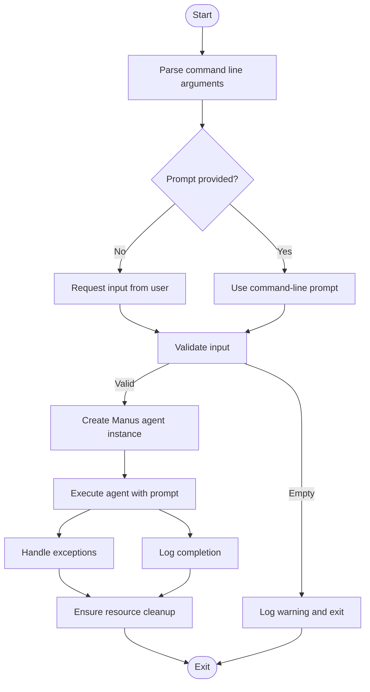
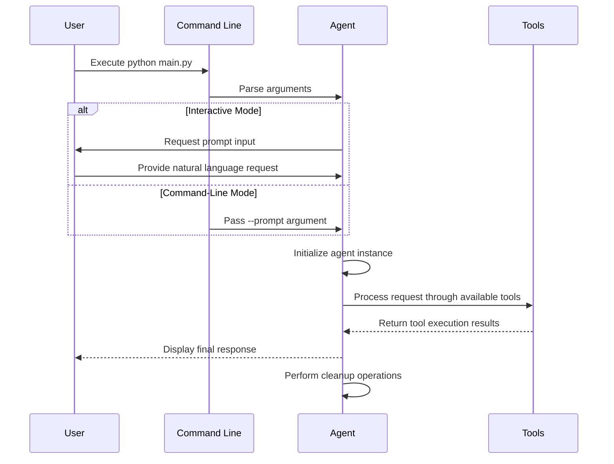
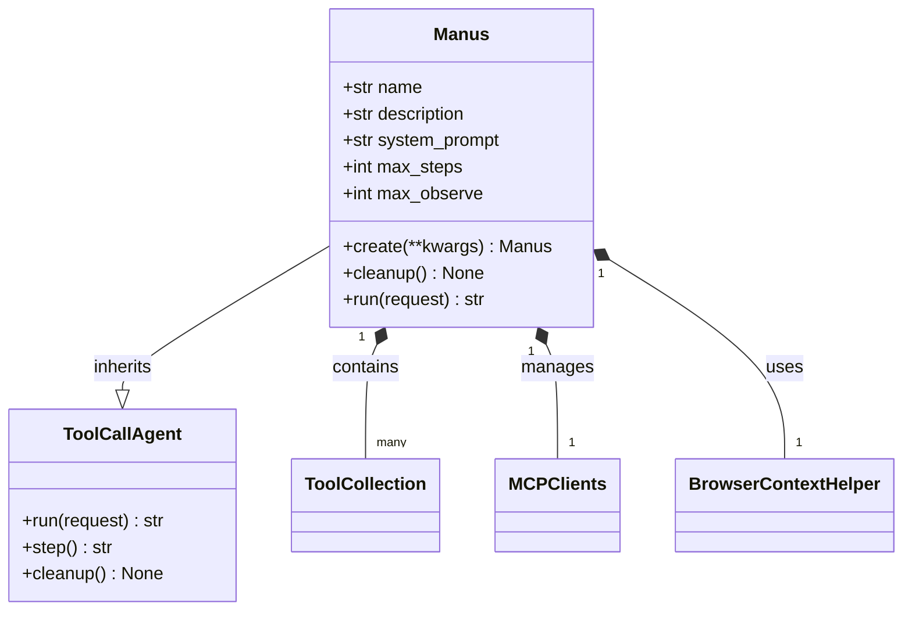

# Basic Examples

<cite>
**Referenced Files in This Document**   
- [main.py](file://main.py)
- [run_mcp.py](file://run_mcp.py)
- [sandbox_main.py](file://sandbox_main.py)
- [app/agent/manus.py](file://app/agent/manus.py)
- [app/agent/sandbox_agent.py](file://app/agent/sandbox_agent.py)
</cite>

## Table of Contents
1. [Standard Entry Point](#standard-entry-point)
2. [Running the Manus Agent](#running-the-manus-agent)
3. [Execution Flow and Resource Management](#execution-flow-and-resource-management)
4. [Common Usage Patterns](#common-usage-patterns)
5. [Troubleshooting Tips](#troubleshooting-tips)

## Standard Entry Point

The primary entry point for the OpenManus framework is defined in `main.py`, which serves as the standard interface for executing the Manus agent. This script follows a clean asynchronous pattern using Python's `asyncio` library and provides a simple command-line interface for user interaction.

The entry point begins by importing essential modules including `argparse` for command-line argument parsing and `asyncio` for asynchronous execution. It then defines an asynchronous `main()` function that orchestrates the agent lifecycle from initialization to cleanup.



**Diagram sources**
- [main.py](file://main.py#L0-L36)

**Section sources**
- [main.py](file://main.py#L0-L36)

## Running the Manus Agent

OpenManus provides multiple execution scripts to run the Manus agent with different configurations and capabilities. The most common way to start the agent is through the `main.py` script, which can be executed in two distinct modes: interactive input and command-line prompts.

### Interactive Mode Execution

When no command-line arguments are provided, the agent runs in interactive mode, prompting the user to enter their request:

```bash
python main.py
```

This command will display:
```
Enter your prompt: 
```

Users can then type their query and press Enter to submit it to the agent for processing.

### Command-Line Prompt Mode

For automated or scripted usage, users can provide the prompt directly as a command-line argument:

```bash
python main.py --prompt "What is the capital of France?"
```

This approach bypasses the interactive input and immediately processes the specified prompt.

### Alternative Execution Scripts

OpenManus also includes specialized execution scripts for different use cases:

- **MCP Agent**: Run with `python run_mcp.py` for agents utilizing MCP (Modular Cognitive Processing) tools
- **Sandbox Agent**: Run with `python sandbox_main.py` for agents operating within isolated sandbox environments

Each of these scripts follows the same execution pattern as `main.py` but initializes different agent types with specialized capabilities.



**Diagram sources**
- [main.py](file://main.py#L0-L36)
- [run_mcp.py](file://run_mcp.py#L0-L116)
- [sandbox_main.py](file://sandbox_main.py#L0-L36)

**Section sources**
- [main.py](file://main.py#L0-L36)
- [run_mcp.py](file://run_mcp.py#L0-L116)
- [sandbox_main.py](file://sandbox_main.py#L0-L36)

## Execution Flow and Resource Management

The OpenManus framework employs an asynchronous execution model that ensures efficient resource utilization and proper cleanup of resources. This section details the execution flow and resource management patterns implemented in the system.

### Asynchronous Execution Model

The entire agent execution process is built around Python's `asyncio` framework, allowing for non-blocking operations and efficient handling of I/O-bound tasks. The entry point uses `asyncio.run(main())` to launch the event loop, which manages the asynchronous execution of the agent's operations.

Key components of the execution model include:

- **Argument parsing**: Uses `argparse.ArgumentParser` to handle command-line inputs
- **Agent initialization**: Calls `Manus.create()` as an asynchronous factory method
- **Request processing**: Executes the agent's `run()` method asynchronously
- **Resource cleanup**: Ensures proper cleanup through try-finally blocks

### Agent Initialization and Cleanup

The Manus agent follows a well-defined lifecycle with proper initialization and cleanup procedures. The `create()` class method serves as an asynchronous factory that properly initializes the agent instance:



**Diagram sources**
- [app/agent/manus.py](file://app/agent/manus.py#L17-L164)
- [app/agent/toolcall.py](file://app/agent/toolcall.py)

The cleanup process is particularly important and is guaranteed to execute through the `finally` block in the main function. This ensures that resources such as browser instances, MCP server connections, and sandbox environments are properly released even if an error occurs during execution.

### Resource Management Best Practices

The framework implements several best practices for resource management:

1. **Guaranteed cleanup**: Uses try-finally blocks to ensure cleanup operations always execute
2. **Asynchronous cleanup**: All cleanup operations are implemented as coroutines to maintain non-blocking behavior
3. **Error resilience**: Catches and logs exceptions during cleanup to prevent cascading failures
4. **Proper shutdown**: Handles keyboard interrupts gracefully to allow for clean shutdown

**Section sources**
- [main.py](file://main.py#L0-L36)
- [app/agent/manus.py](file://app/agent/manus.py#L130-L137)
- [app/agent/sandbox_agent.py](file://app/agent/sandbox_agent.py#L187-L195)

## Common Usage Patterns

This section documents the most common usage patterns for executing the Manus agent, including simple tasks such as asking general questions and performing basic web queries.

### General Question Answering

To ask a general knowledge question, simply provide the question as a command-line argument:

```bash
python main.py --prompt "Explain the theory of relativity in simple terms"
```

Or use interactive mode by running `python main.py` and entering your question when prompted.

### Web Query Execution

For web-based queries, the agent can utilize its browser tool to search for information online:

```bash
python main.py --prompt "Search for recent developments in renewable energy and summarize the top three findings"
```

The agent will automatically use its web browsing capabilities to find relevant information and provide a synthesized response.

### Data Analysis Tasks

When configured with the DataAnalysis agent, users can perform data analysis tasks:

```bash
python run_flow.py --prompt "Analyze the sales data in the provided CSV file and create a visualization"
```

This requires proper configuration in the `config.toml` file to enable the data analysis agent.

### Expected Output Format

When the agent successfully processes a request, users can expect output similar to:

```
Processing your request...
Request processing completed.
```

The actual response content will be displayed as the agent generates it through its various steps and tool interactions.

**Section sources**
- [main.py](file://main.py#L0-L36)
- [run_mcp.py](file://run_mcp.py#L0-L116)
- [app/agent/manus.py](file://app/agent/manus.py#L17-L164)

## Troubleshooting Tips

This section provides guidance for diagnosing and resolving common issues that may occur when running the Manus agent.

### Failed Executions

If the agent fails to execute properly, consider the following troubleshooting steps:

1. **Check configuration**: Ensure that `config.toml` is properly configured with valid API keys
2. **Verify dependencies**: Confirm that all required packages are installed via `pip install -r requirements.txt`
3. **Validate environment**: Ensure Python 3.12 is being used as specified in the installation instructions

### Empty Prompt Handling

The system includes built-in protection against empty prompts:

```python
if not prompt.strip():
    logger.warning("Empty prompt provided.")
    return
```

If you encounter this warning, ensure your prompt contains valid text input.

### Keyboard Interrupts

The agent gracefully handles keyboard interrupts (Ctrl+C):

```python
except KeyboardInterrupt:
    logger.warning("Operation interrupted.")
```

This allows users to stop long-running processes without crashing the application.

### Connection Issues

For MCP-related connection problems:

1. Verify that MCP servers are properly configured in `config.toml`
2. Check network connectivity if using remote servers
3. Ensure required services are running for local MCP servers

### Logging and Debugging

The framework uses Python's logging module to provide visibility into the execution process. Key log messages include:

- `"Processing your request..."` - Indicates the agent has started processing
- `"Request processing completed."` - Confirms successful completion
- `"Operation interrupted."` - Signals user interruption
- Various debug messages from individual tools and components

Enable debug logging in the configuration for more detailed troubleshooting information.

**Section sources**
- [main.py](file://main.py#L0-L36)
- [run_mcp.py](file://run_mcp.py#L0-L116)
- [app/agent/manus.py](file://app/agent/manus.py#L17-L164)
- [app/agent/base.py](file://app/agent/base.py#L115-L153)