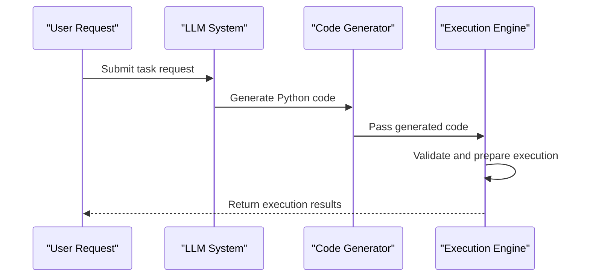
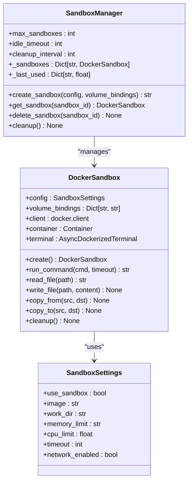
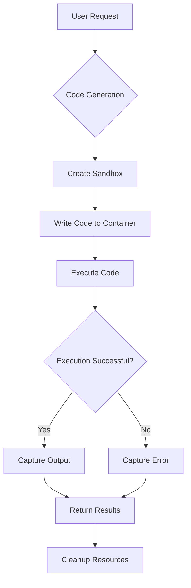
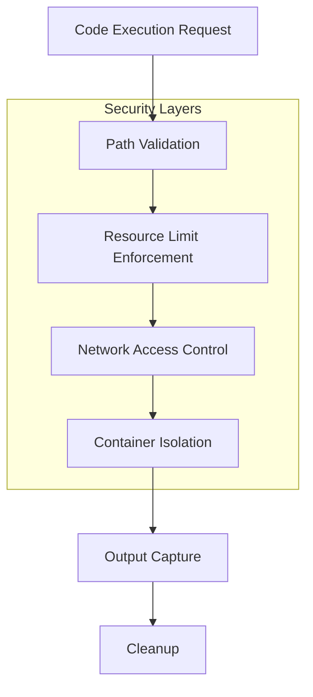
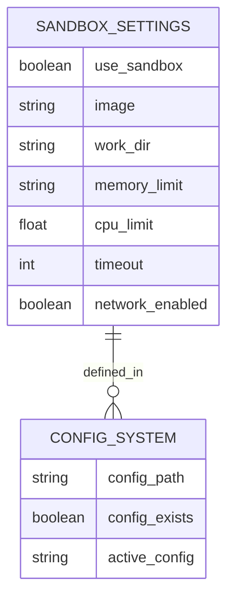
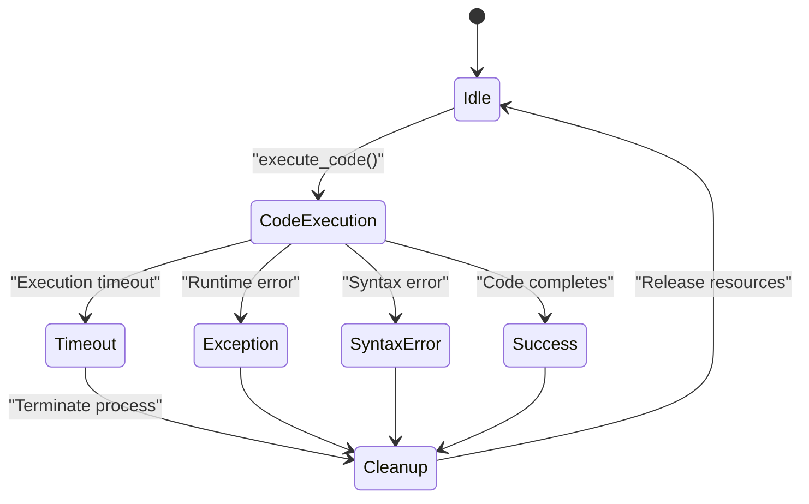
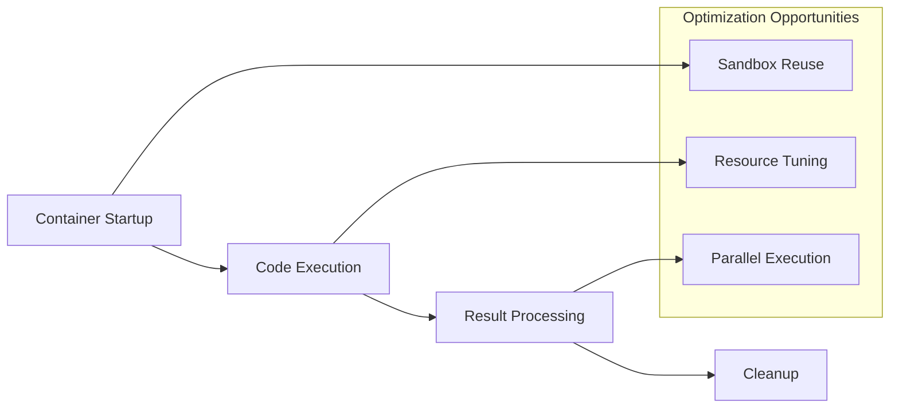
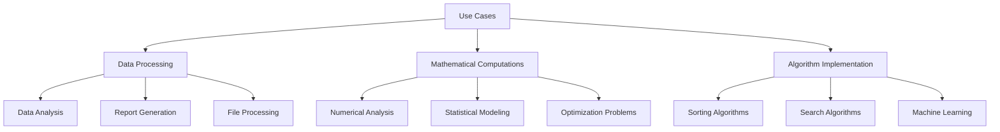

# Code Generation and Execution

<cite>
**Referenced Files in This Document**   
- [python_execute.py](file://app/tool/python_execute.py)
- [sandbox.py](file://app/sandbox/core/sandbox.py)
- [manager.py](file://app/sandbox/core/manager.py)
- [sb_shell_tool.py](file://app/tool/sandbox/sb_shell_tool.py)
- [sandbox.py](file://app/daytona/sandbox.py)
- [config.py](file://app/config.py)
</cite>

## Table of Contents
1. [Introduction](#introduction)
2. [Code Generation Process](#code-generation-process)
3. [Sandbox Architecture](#sandbox-architecture)
4. [Execution Workflow](#execution-workflow)
5. [Security and Isolation](#security-and-isolation)
6. [Configuration Options](#configuration-options)
7. [Error Handling](#error-handling)
8. [Performance Considerations](#performance-considerations)
9. [Use Cases](#use-cases)
10. [Conclusion](#conclusion)

## Introduction
OpenManus provides a secure code generation and execution system that leverages Large Language Models (LLMs) to generate Python code and executes it within isolated Docker containers. This system enables safe execution of data processing scripts, mathematical computations, and algorithm implementations while maintaining strict security boundaries and resource limitations. The architecture combines LLM-powered code generation with a robust sandbox environment to ensure reliable and secure code execution.

## Code Generation Process
The code generation process in OpenManus begins with prompt processing through the LLM system, which generates Python code based on user requests. The generated code is then prepared for execution through various specialized tools that handle different types of computational tasks.

The `PythonExecute` class serves as the foundation for code execution, providing a safe environment for running Python code with timeout protection and output capture. This tool captures only print outputs, requiring users to use print statements to observe results. For more specialized use cases, the `NormalPythonExecute` class extends the base functionality with specific requirements for data analysis and reporting tasks, mandating that code generates comprehensive text-based reports with proper output formatting.

**Diagram sources**
- [python_execute.py](file://app/tool/python_execute.py#L1-L75)
- [config.py](file://app/config.py#L300-L372)

**Section sources**
- [python_execute.py](file://app/tool/python_execute.py#L1-L75)
- [config.py](file://app/config.py#L300-L372)

## Sandbox Architecture
The sandbox architecture in OpenManus is built around Docker containerization, providing isolated execution environments for code execution. The core component is the `DockerSandbox` class, which manages container lifecycle, file operations, and command execution within a secure environment.

The sandbox system is managed by the `SandboxManager` class, which oversees multiple sandbox instances, enforcing resource limits and managing lifecycle operations. This manager implements automatic cleanup mechanisms, idle timeout detection, and concurrency control to ensure efficient resource utilization and prevent resource exhaustion.

**Diagram sources**
- [sandbox.py](file://app/sandbox/core/sandbox.py#L17-L461)
- [manager.py](file://app/sandbox/core/manager.py#L13-L312)
- [config.py](file://app/config.py#L200-L250)

**Section sources**
- [sandbox.py](file://app/sandbox/core/sandbox.py#L17-L461)
- [manager.py](file://app/sandbox/core/manager.py#L13-L312)
- [config.py](file://app/config.py#L200-L250)

## Execution Workflow
The complete workflow from prompt to execution result involves several coordinated steps that ensure secure and reliable code execution. When a code execution request is initiated, the system first creates or retrieves an appropriate sandbox environment, then executes the code within this isolated container, and finally returns the results to the user.

The execution process begins with the creation of a Docker container configured with specific resource limits and security settings. The `DockerSandbox.create()` method handles container initialization, setting up memory and CPU limits, network configuration, and volume bindings. Once the container is running, the system uses the terminal interface to execute commands and manage file operations.

For Python code execution, the system writes the generated code to a file within the container's workspace directory and then executes it using the Python interpreter. The output is captured and returned to the user, while any files created during execution are preserved for subsequent operations.

**Diagram sources**
- [sandbox.py](file://app/sandbox/core/sandbox.py#L48-L102)
- [python_execute.py](file://app/tool/python_execute.py#L50-L75)
- [sb_shell_tool.py](file://app/tool/sandbox/sb_shell_tool.py#L137-L255)

**Section sources**
- [sandbox.py](file://app/sandbox/core/sandbox.py#L48-L102)
- [python_execute.py](file://app/tool/python_execute.py#L50-L75)
- [sb_shell_tool.py](file://app/tool/sandbox/sb_shell_tool.py#L137-L255)

## Security and Isolation
Security and isolation are fundamental principles in the OpenManus execution system. The sandbox environment implements multiple layers of protection to prevent malicious code execution and system compromise.

The system employs path traversal prevention through the `_safe_resolve_path` method, which validates file paths to prevent access to directories outside the designated workspace. This method specifically checks for ".." patterns in paths and resolves relative paths safely within the configured working directory.

Resource limitations are enforced at the container level, with configurable memory and CPU constraints. The `SandboxSettings` class defines these limits, including memory allocation (e.g., "512m"), CPU quotas, and execution timeouts. Network access can be disabled entirely by setting `network_enabled` to false, isolating the container from external connections.

Process isolation is achieved through Docker containerization, ensuring that code execution occurs in a separate environment from the host system. The container runs with minimal privileges and restricted system access, preventing privilege escalation and system modification.

**Diagram sources**
- [sandbox.py](file://app/sandbox/core/sandbox.py#L231-L252)
- [config.py](file://app/config.py#L200-L250)
- [sandbox.py](file://app/sandbox/core/sandbox.py#L45-L45)

**Section sources**
- [sandbox.py](file://app/sandbox/core/sandbox.py#L231-L252)
- [config.py](file://app/config.py#L200-L250)

## Configuration Options
OpenManus provides extensive configuration options for customizing the sandbox environment to meet specific requirements. These options are defined in the `SandboxSettings` class and can be modified through the configuration system.

Key configuration parameters include:
- **Image**: The base Docker image for the sandbox (default: "python:3.12-slim")
- **Work Directory**: The container's working directory (default: "/workspace")
- **Memory Limit**: Maximum memory allocation (default: "512m")
- **CPU Limit**: CPU resource allocation (default: 1.0)
- **Timeout**: Default command execution timeout in seconds (default: 300)
- **Network Enabled**: Whether network access is allowed (default: false)

The configuration system supports multiple configuration files, with settings loaded from `config.toml` or `config.example.toml` if the primary configuration file is not present. This allows for easy environment-specific configuration and deployment.

**Diagram sources**
- [config.py](file://app/config.py#L200-L250)
- [sandbox.py](file://app/sandbox/core/sandbox.py#L31-L46)

**Section sources**
- [config.py](file://app/config.py#L200-L250)

## Error Handling
The system implements comprehensive error handling to manage various failure scenarios during code execution. This includes handling invalid code, infinite loops, dependency issues, and resource limitations.

For code execution errors, the `PythonExecute._run_code` method captures exceptions and returns them as part of the execution result, allowing the system to gracefully handle syntax errors, runtime exceptions, and other Python errors. Timeout handling is implemented through multiprocessing, where a separate process executes the code and is terminated if it exceeds the specified timeout period.

The sandbox system also handles container-level errors, such as failed container creation, missing images, and resource exhaustion. The `SandboxManager` class includes robust error handling for these scenarios, with automatic cleanup procedures to ensure resources are properly released even when errors occur.

**Diagram sources**
- [python_execute.py](file://app/tool/python_execute.py#L25-L45)
- [sandbox.py](file://app/sandbox/core/sandbox.py#L424-L453)
- [exceptions.py](file://app/sandbox/core/exceptions.py#L1-L17)

**Section sources**
- [python_execute.py](file://app/tool/python_execute.py#L25-L45)
- [sandbox.py](file://app/sandbox/core/sandbox.py#L424-L453)
- [exceptions.py](file://app/sandbox/core/exceptions.py#L1-L17)

## Performance Considerations
The performance of the code execution system is influenced by several factors, including container startup times, resource allocation, and execution efficiency. Container initialization represents a significant portion of the total execution time, particularly for short-running tasks.

To optimize performance, the system implements a sandbox manager that can reuse existing containers for subsequent executions, reducing the overhead of container creation. The manager maintains a pool of active sandboxes and automatically cleans up idle instances after a configurable timeout period.

Resource allocation should be balanced to ensure adequate performance while preventing resource exhaustion. The default configuration provides 1 CPU core and 512MB of memory, which is sufficient for most computational tasks. For more intensive operations, these limits can be adjusted based on the specific requirements.

**Diagram sources**
- [manager.py](file://app/sandbox/core/manager.py#L113-L156)
- [sandbox.py](file://app/sandbox/core/sandbox.py#L48-L102)
- [config.py](file://app/config.py#L200-L250)

**Section sources**
- [manager.py](file://app/sandbox/core/manager.py#L113-L156)
- [sandbox.py](file://app/sandbox/core/sandbox.py#L48-L102)

## Use Cases
The OpenManus execution system supports various use cases, including data processing scripts, mathematical computations, and algorithm implementations. Each use case leverages the secure sandbox environment to perform computations while maintaining system integrity.

For data processing tasks, the system enables execution of Python scripts that analyze datasets, generate reports, and create visualizations. The workspace directory serves as a shared location for input data, processing scripts, and output files, facilitating multi-step workflows.

Mathematical computations benefit from the isolated environment, allowing complex calculations to be performed without affecting the host system. The system can handle numerical analysis, statistical modeling, and other computational mathematics tasks.

Algorithm implementations can be tested and executed within the sandbox, providing a safe environment for developing and evaluating algorithms. This includes sorting algorithms, search algorithms, machine learning models, and other computational procedures.

**Diagram sources**
- [python_execute.py](file://app/tool/python_execute.py#L1-L75)
- [sb_shell_tool.py](file://app/tool/sandbox/sb_shell_tool.py#L20-L418)
- [config.py](file://app/config.py#L300-L372)

**Section sources**
- [python_execute.py](file://app/tool/python_execute.py#L1-L75)
- [sb_shell_tool.py](file://app/tool/sandbox/sb_shell_tool.py#L20-L418)

## Conclusion
The code generation and execution system in OpenManus provides a secure, isolated environment for running Python code generated by LLMs. By leveraging Docker containerization and comprehensive resource management, the system enables safe execution of various computational tasks while maintaining strict security boundaries. The architecture balances performance, security, and usability, making it suitable for a wide range of applications from data analysis to algorithm development. Through careful configuration and error handling, the system ensures reliable operation and protects the host environment from potential risks associated with code execution.