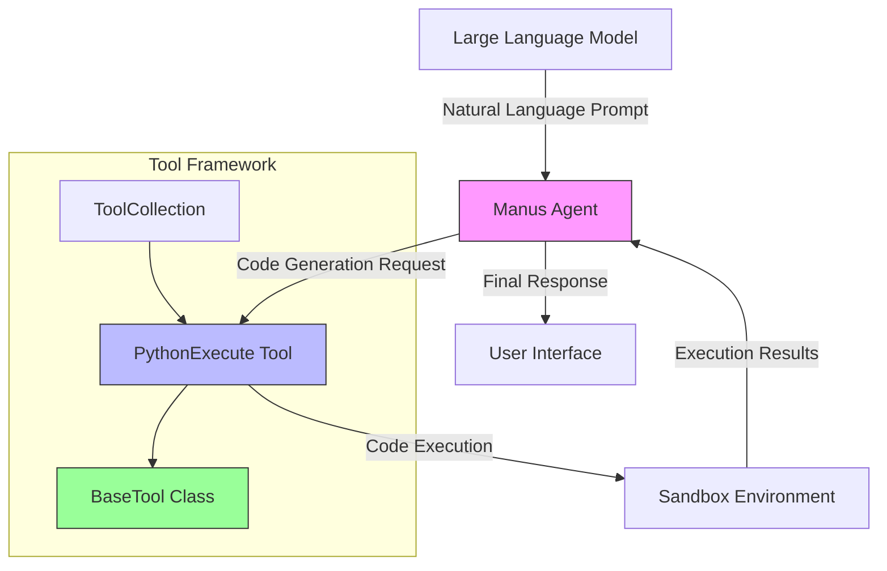
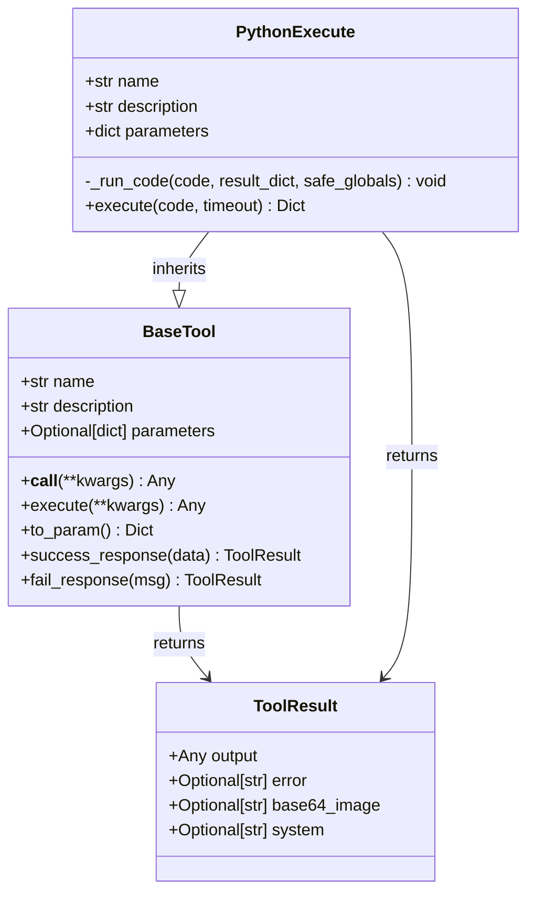
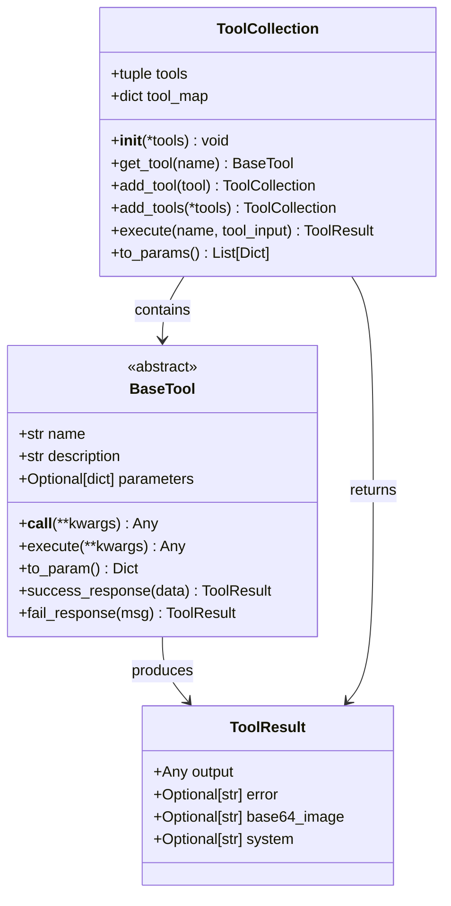
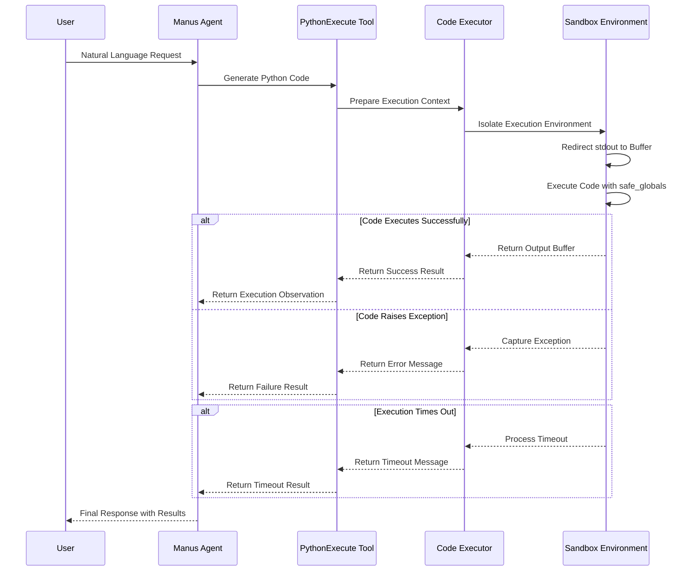
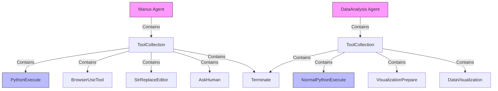

# Code Generation

<cite>
**Referenced Files in This Document**   
- [python_execute.py](file://app/tool/python_execute.py)
- [base.py](file://app/tool/base.py)
- [tool_collection.py](file://app/tool/tool_collection.py)
- [manus.py](file://app/agent/manus.py)
- [chart_visualization/python_execute.py](file://app/tool/chart_visualization/python_execute.py)
- [data_analysis.py](file://app/agent/data_analysis.py)
</cite>

## Table of Contents
1. [Introduction](#introduction)
2. [Code Generation Architecture](#code-generation-architecture)
3. [PythonExecute Tool Implementation](#pythonexecute-tool-implementation)
4. [BaseTool Class and Tool Registration](#basetool-class-and-tool-registration)
5. [Code Execution Process](#code-execution-process)
6. [Configuration and Safety Parameters](#configuration-and-safety-parameters)
7. [Output Handling and Limitations](#output-handling-and-limitations)
8. [Practical Examples](#practical-examples)
9. [Error Handling and Debugging](#error-handling-and-debugging)
10. [Agent Integration](#agent-integration)

## Introduction
OpenManus leverages Large Language Models (LLMs) to generate Python code from natural language prompts through its integrated Manus agent and PythonExecute tool. This system enables users to perform complex programming tasks by simply describing their requirements in plain language. The architecture combines LLM-powered code generation with secure execution environments, allowing for the creation of data processing scripts, mathematical functions, and algorithm implementations. The system is designed with safety and reliability in mind, incorporating timeout mechanisms, restricted execution environments, and comprehensive error handling to ensure robust code generation and execution.

## Code Generation Architecture

**Diagram sources**
- [manus.py](file://app/agent/manus.py#L33-L41)
- [python_execute.py](file://app/tool/python_execute.py#L8-L74)
- [base.py](file://app/tool/base.py#L77-L172)
- [tool_collection.py](file://app/tool/tool_collection.py#L8-L70)

**Section sources**
- [manus.py](file://app/agent/manus.py#L33-L41)
- [python_execute.py](file://app/tool/python_execute.py#L8-L74)

## PythonExecute Tool Implementation

The PythonExecute tool is the core component responsible for executing generated Python code within OpenManus. It inherits from the BaseTool class and implements secure code execution with timeout protection and safety restrictions. The tool captures all print outputs while explicitly noting that function return values are not captured in the execution results. This design ensures that users must use print statements to make their code outputs visible.

**Diagram sources**
- [python_execute.py](file://app/tool/python_execute.py#L8-L74)
- [base.py](file://app/tool/base.py#L77-L172)

**Section sources**
- [python_execute.py](file://app/tool/python_execute.py#L8-L74)

## BaseTool Class and Tool Registration

The BaseTool class serves as the foundation for all tools within the OpenManus framework, providing standardized interfaces for tool execution, parameter handling, and result formatting. It implements the Abstract Base Class (ABC) pattern combined with Pydantic's BaseModel for validation. The class defines essential methods like execute, to_param, success_response, and fail_response that ensure consistent behavior across all tools. Tool registration is managed through the ToolCollection class, which maintains a mapping of tool names to their instances, allowing for dynamic tool discovery and execution within the agent framework.

**Diagram sources**
- [base.py](file://app/tool/base.py#L77-L172)
- [tool_collection.py](file://app/tool/tool_collection.py#L8-L70)

**Section sources**
- [base.py](file://app/tool/base.py#L77-L172)
- [tool_collection.py](file://app/tool/tool_collection.py#L8-L70)

## Code Execution Process

**Diagram sources**
- [python_execute.py](file://app/tool/python_execute.py#L24-L74)
- [manus.py](file://app/agent/manus.py#L33-L41)

**Section sources**
- [python_execute.py](file://app/tool/python_execute.py#L24-L74)

## Configuration and Safety Parameters

The PythonExecute tool incorporates several configuration parameters to ensure safe and reliable code execution. The primary safety mechanism is the execution timeout, which defaults to 5 seconds but can be adjusted based on requirements. Code execution occurs in a separate multiprocessing process to isolate it from the main application, preventing potential crashes or resource exhaustion. The tool uses a restricted global namespace (safe_globals) that limits access to built-in functions, reducing the risk of malicious code execution. Additionally, all standard output is captured in a StringIO buffer, allowing for controlled output handling without direct console access.

**Configuration Parameters**
- **timeout**: Integer value specifying execution timeout in seconds (default: 5)
- **safe_globals**: Restricted global namespace limiting access to built-in functions
- **multiprocessing**: Isolated process execution to prevent application crashes
- **output_buffer**: StringIO buffer capturing all print statements
- **exception_handling**: Comprehensive try-catch block for error capture

**Section sources**
- [python_execute.py](file://app/tool/python_execute.py#L38-L74)

## Output Handling and Limitations

The PythonExecute tool has specific limitations regarding output visibility that users must understand. Only print statements produce visible output in the execution results; function return values are not captured or returned to the calling agent. This design choice ensures that users explicitly output their results using print statements. The tool captures all stdout output in a buffer and returns it as part of the observation field in the result dictionary. Error messages from exceptions are also captured and returned, providing feedback on code execution failures. This output model encourages users to structure their code with explicit print statements for all desired outputs, including intermediate results and final conclusions.

**Output Rules**
- **Print Statements**: All outputs must use print() to be visible
- **Return Values**: Function return values are not captured
- **Exception Output**: Error messages are captured and returned
- **Buffered Output**: All stdout is captured in memory buffer
- **Result Structure**: Output returned in "observation" field of result dictionary

**Section sources**
- [python_execute.py](file://app/tool/python_execute.py#L12-L12)
- [python_execute.py](file://app/tool/python_execute.py#L24-L36)

## Practical Examples

### Data Processing Script
When generating data processing scripts, users should structure their code to explicitly print all relevant information. For example, when analyzing a dataset, the code should print summary statistics, data quality assessments, and any derived insights. The NormalPythonExecute variant used in the DataAnalysis agent provides additional guidance for creating comprehensive text-based reports with dataset overviews, column details, basic statistics, and key insights.

### Mathematical Functions
For mathematical function implementations, users should print both intermediate calculations and final results. This approach allows the agent to verify the correctness of the computation process and provide meaningful feedback. Functions should be designed with clear print statements that label each output value appropriately.

### Algorithm Implementations
When implementing algorithms, users should include print statements at key decision points and for final outputs. This practice enables the agent to trace the algorithm's execution path and understand its behavior. For iterative algorithms, printing progress or intermediate states can be particularly valuable for debugging and verification purposes.

**Section sources**
- [chart_visualization/python_execute.py](file://app/tool/chart_visualization/python_execute.py#L4-L35)
- [data_analysis.py](file://app/agent/data_analysis.py#L29-L36)

## Error Handling and Debugging

The PythonExecute tool implements comprehensive error handling to manage common issues that may arise during code execution. Syntax errors are caught and returned as exception messages, allowing users to identify and fix coding mistakes. Infinite loops are prevented through the timeout mechanism, which terminates execution if it exceeds the specified duration. Missing dependencies are handled by the restricted execution environment, which limits available modules to a safe subset. When errors occur, the tool returns detailed error messages that can be used for debugging, including the specific exception type and message. Users should examine these error messages carefully to understand the root cause of execution failures and modify their code accordingly.

**Common Issues and Solutions**
- **Syntax Errors**: Check code for proper Python syntax and indentation
- **Infinite Loops**: Ensure loops have proper exit conditions; rely on timeout protection
- **Missing Dependencies**: Use only standard library modules or explicitly import available packages
- **Variable Scope Issues**: Declare variables properly and avoid referencing undefined variables
- **Type Errors**: Ensure proper data types are used in operations and function calls

**Section sources**
- [python_execute.py](file://app/tool/python_execute.py#L24-L36)
- [python_execute.py](file://app/tool/python_execute.py#L38-L74)

## Agent Integration

The integration between the Manus agent and the PythonExecute tool is facilitated through the ToolCollection framework. The Manus agent includes PythonExecute in its available_tools collection, allowing it to invoke code execution as part of its problem-solving workflow. When the agent determines that code generation is needed to address a user request, it formulates a natural language prompt that is processed by the LLM to generate appropriate Python code. This code is then executed through the PythonExecute tool, and the results are incorporated into the agent's response. The DataAnalysis agent demonstrates a specialized implementation with the NormalPythonExecute tool, which includes additional guidance for data analysis tasks and report generation.

**Diagram sources**
- [manus.py](file://app/agent/manus.py#L33-L41)
- [data_analysis.py](file://app/agent/data_analysis.py#L29-L36)

**Section sources**
- [manus.py](file://app/agent/manus.py#L33-L41)
- [data_analysis.py](file://app/agent/data_analysis.py#L29-L36)