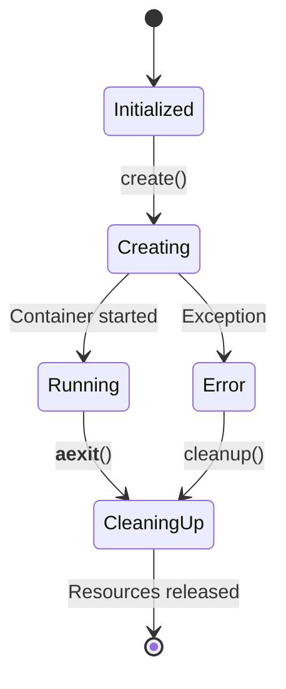
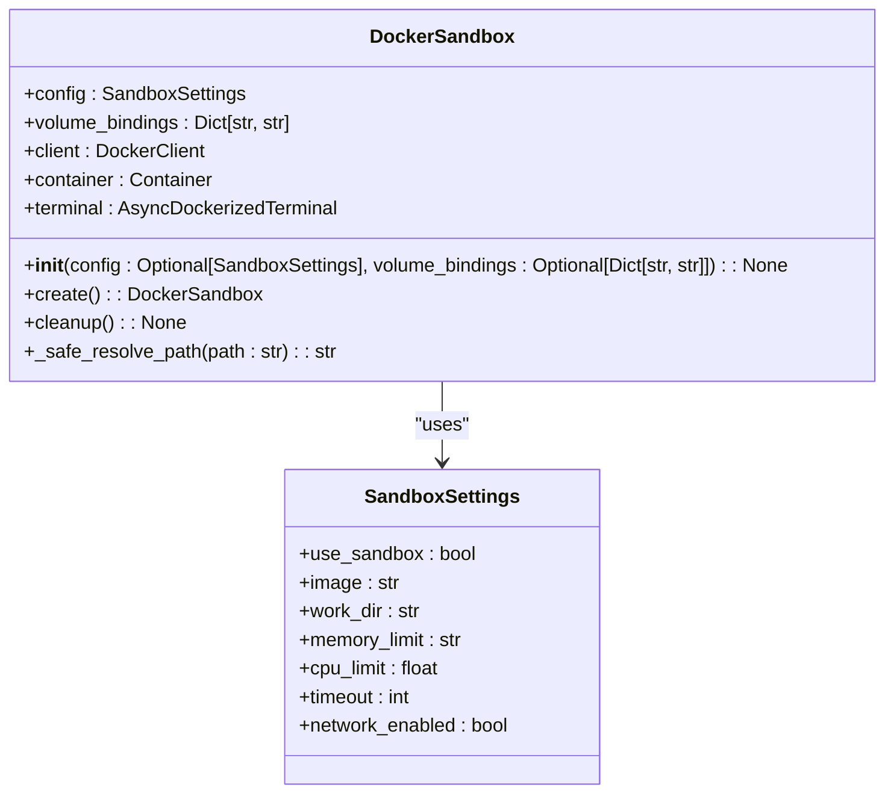
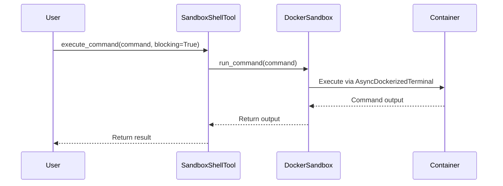
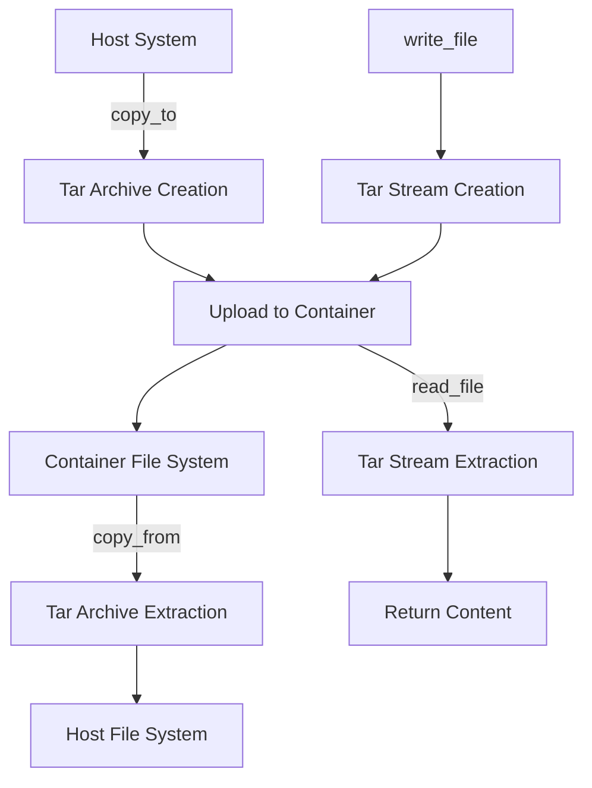
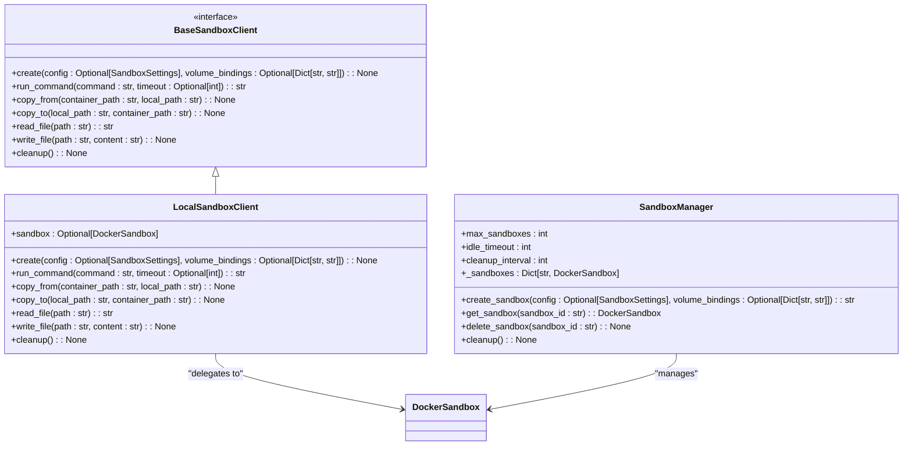

# Sandbox Execution

<cite>
**Referenced Files in This Document**   
- [DockerSandbox](file://app/sandbox/core/sandbox.py)
- [AsyncDockerizedTerminal](file://app/sandbox/core/terminal.py)
- [SandboxSettings](file://app/config.py)
- [sandbox_main.py](file://sandbox_main.py)
- [LocalSandboxClient](file://app/sandbox/client.py)
- [SandboxShellTool](file://app/tool/sandbox/sb_shell_tool.py)
- [SandboxFilesTool](file://app/tool/sandbox/sb_files_tool.py)
- [SandboxManager](file://app/sandbox/core/manager.py)
- [SandboxTimeoutError](file://app/sandbox/core/exceptions.py)
</cite>

## Table of Contents
1. [Introduction](#introduction)
2. [Sandbox Lifecycle Management](#sandbox-lifecycle-management)
3. [Container Configuration and Resource Limitation](#container-configuration-and-resource-limitation)
4. [Command Execution and Interactive Terminal](#command-execution-and-interactive-terminal)
5. [File Operations and Data Transfer](#file-operations-and-data-transfer)
6. [Sandbox Client and Tool Integration](#sandbox-client-and-tool-integration)
7. [Error Handling and Cleanup Procedures](#error-handling-and-cleanup-procedures)
8. [Performance Considerations](#performance-considerations)
9. [Usage Examples](#usage-examples)

## Introduction
OpenManus executes generated code in secure, isolated Docker containers through its sandbox execution system. This mechanism ensures that all code execution occurs in a controlled environment with strict resource limitations and security boundaries. The core component, DockerSandbox, provides a containerized execution environment that supports command execution, file operations, and resource constraints. The system leverages Docker's containerization technology to create isolated environments where code can be safely executed without affecting the host system. This approach enables safe execution of untrusted code while maintaining performance and reliability.

## Sandbox Lifecycle Management
The DockerSandbox class manages the complete lifecycle of a sandbox instance from creation to cleanup. The lifecycle begins with initialization through the `__init__` method, which sets up the sandbox configuration, volume bindings, and Docker client connection. The `create` method then handles container creation and startup, generating a unique container name with the "sandbox_" prefix and configuring the container with specified resource limits. During creation, the sandbox establishes a terminal interface through AsyncDockerizedTerminal for command execution.

The lifecycle follows an async context manager pattern, with `__aenter__` and `__aexit__` methods providing automatic resource management. When the context is exited, the `cleanup` method ensures proper termination of all sandbox resources, including stopping and removing the container and closing the terminal session. The cleanup process is designed to be robust, capturing and logging any errors that occur during resource cleanup without preventing the completion of other cleanup steps.



**Diagram sources**
- [DockerSandbox](file://app/sandbox/core/sandbox.py#L31-L46)
- [DockerSandbox](file://app/sandbox/core/sandbox.py#L48-L102)
- [DockerSandbox](file://app/sandbox/core/sandbox.py#L424-L453)

**Section sources**
- [DockerSandbox](file://app/sandbox/core/sandbox.py#L31-L46)
- [DockerSandbox](file://app/sandbox/core/sandbox.py#L48-L102)
- [DockerSandbox](file://app/sandbox/core/sandbox.py#L424-L453)

## Container Configuration and Resource Limitation
The DockerSandbox implementation configures containers with strict resource limitations to prevent abuse and ensure system stability. Resource constraints are applied through Docker's host configuration, including memory limits, CPU quotas, and network access control. The `create` method configures these limits using the sandbox's configuration settings, with memory limits specified as strings (e.g., "512m") and CPU limits applied as a percentage of available CPU time.

Network access is controlled through the `network_enabled` configuration parameter, with network access disabled by default for enhanced security. When network access is disabled, the container operates in network isolation mode. The working directory is set to "/workspace" by default, providing a consistent execution environment. Volume bindings are configured to map host directories to container paths, enabling persistent storage and file sharing between the host and container.

Container security is further enhanced through path traversal prevention in the `_safe_resolve_path` method, which validates all file paths to prevent access to directories outside the designated workspace. The method checks for ".." patterns in paths and raises a ValueError if potentially unsafe patterns are detected, ensuring that all file operations remain within the sandboxed environment.



**Diagram sources**
- [DockerSandbox](file://app/sandbox/core/sandbox.py#L42-L45)
- [SandboxSettings](file://app/config.py#L93-L104)
- [DockerSandbox](file://app/sandbox/core/sandbox.py#L231-L252)

**Section sources**
- [DockerSandbox](file://app/sandbox/core/sandbox.py#L48-L79)
- [SandboxSettings](file://app/config.py#L93-L104)
- [DockerSandbox](file://app/sandbox/core/sandbox.py#L231-L252)

## Command Execution and Interactive Terminal
Command execution in the sandbox is facilitated by the AsyncDockerizedTerminal class, which provides an asynchronous interface for running shell commands in the container. The terminal establishes an interactive bash session within the container, allowing for command execution with proper environment setup and working directory configuration. The terminal session is created with a customized prompt and environment settings to ensure consistent behavior.

The `run_command` method in DockerSandbox delegates command execution to the terminal, applying timeout constraints from the sandbox configuration. Commands are executed with a default timeout that can be overridden for specific operations. The terminal implementation includes command sanitization to prevent shell injection attacks, checking for potentially dangerous commands like "rm -rf /" and raising ValueError if detected.

Interactive command execution is supported through tmux sessions in the SandboxShellTool, which allows for both blocking and non-blocking command execution. Non-blocking execution runs commands in background tmux sessions, enabling long-running processes like servers or build operations. The tool provides methods to check command output, terminate running commands, and list active sessions, offering comprehensive process management capabilities.



**Diagram sources**
- [DockerSandbox](file://app/sandbox/core/sandbox.py#L139-L163)
- [AsyncDockerizedTerminal](file://app/sandbox/core/terminal.py#L315-L331)
- [SandboxShellTool](file://app/tool/sandbox/sb_shell_tool.py#L200-L419)

**Section sources**
- [DockerSandbox](file://app/sandbox/core/sandbox.py#L139-L163)
- [AsyncDockerizedTerminal](file://app/sandbox/core/terminal.py#L250-L345)
- [SandboxShellTool](file://app/tool/sandbox/sb_shell_tool.py#L200-L419)

## File Operations and Data Transfer
File operations in the sandbox are implemented through tar archive-based data transfer between the host and container. The `read_file`, `write_file`, `copy_from`, and `copy_to` methods handle file operations using Docker's archive functionality. When reading a file, the system retrieves a tar archive from the container and extracts the file content. When writing a file, the system creates a tar archive containing the file data and uploads it to the container.

The `_create_tar_stream` and `_read_from_tar` helper methods manage the tar archive creation and extraction process, ensuring proper formatting and error handling. These methods use temporary files and directories to safely handle the archive data, preventing resource leaks. The `copy_from` and `copy_to` methods support both file and directory operations, preserving directory structure when copying entire directories.

Path resolution is handled securely through the `_safe_resolve_path` method, which ensures all file operations occur within the sandbox's working directory. The method converts relative paths to absolute paths within the workspace and validates that no path traversal attempts are present. This security measure prevents access to files outside the designated workspace directory.



**Diagram sources**
- [DockerSandbox](file://app/sandbox/core/sandbox.py#L165-L195)
- [DockerSandbox](file://app/sandbox/core/sandbox.py#L197-L229)
- [DockerSandbox](file://app/sandbox/core/sandbox.py#L254-L312)
- [DockerSandbox](file://app/sandbox/core/sandbox.py#L314-L374)

**Section sources**
- [DockerSandbox](file://app/sandbox/core/sandbox.py#L165-L195)
- [DockerSandbox](file://app/sandbox/core/sandbox.py#L197-L229)
- [DockerSandbox](file://app/sandbox/core/sandbox.py#L254-L312)
- [DockerSandbox](file://app/sandbox/core/sandbox.py#L314-L374)

## Sandbox Client and Tool Integration
The sandbox system is accessed through the LocalSandboxClient, which provides a high-level interface for sandbox operations. The client implements the BaseSandboxClient abstract class, offering methods for creating sandboxes, running commands, and performing file operations. The client maintains a reference to a DockerSandbox instance and delegates operations to it, handling initialization and error checking.

The SANDBOX_CLIENT singleton provides global access to the sandbox functionality, allowing various components of the system to execute code in the sandbox environment. The SandboxFilesTool and SandboxShellTool integrate with the sandbox to provide file system and shell command capabilities to agents. These tools use the sandbox client to perform operations, translating high-level actions into appropriate sandbox method calls.

The SandboxManager class provides centralized management of multiple sandbox instances, handling resource allocation, idle timeout cleanup, and concurrency control. It enforces limits on the number of active sandboxes and automatically cleans up idle instances to conserve system resources. The manager uses asyncio locks to ensure thread-safe access to sandbox instances during operations.



**Diagram sources**
- [LocalSandboxClient](file://app/sandbox/client.py#L100-L201)
- [SandboxManager](file://app/sandbox/core/manager.py#L158-L171)
- [BaseSandboxClient](file://app/sandbox/client.py#L50-L99)

**Section sources**
- [LocalSandboxClient](file://app/sandbox/client.py#L100-L201)
- [SandboxManager](file://app/sandbox/core/manager.py#L158-L171)
- [BaseSandboxClient](file://app/sandbox/client.py#L50-L99)

## Error Handling and Cleanup Procedures
The sandbox system implements comprehensive error handling to ensure reliability and resource cleanup. The `create` method includes a try-except block that calls `cleanup` if container creation fails, preventing resource leaks from partially created sandboxes. Various exceptions are raised for specific error conditions, including RuntimeError for general failures, docker.errors.APIError for Docker API issues, and custom exceptions like SandboxTimeoutError for timeout conditions.

The `cleanup` method is designed to be robust and idempotent, handling errors that may occur during resource cleanup without preventing the cleanup of other resources. It attempts to close the terminal session and stop/remove the container, capturing any errors in a list that is logged as a warning at the end of the cleanup process. This approach ensures that as many resources as possible are cleaned up even if some operations fail.

File operations include specific exception handling for common error conditions, raising FileNotFoundError when files do not exist and RuntimeError for other operation failures. The terminal implementation includes socket error handling with retry logic for non-blocking socket operations, ensuring reliable communication with the container's shell session.

```mermaid
flowchart TD
A[Operation Start] --> B{Success?}
B --> |Yes| C[Return Result]
B --> |No| D[Handle Exception]
D --> E{Cleanup Needed?}
E --> |Yes| F[Execute cleanup()]
F --> G[Re-raise Exception]
E --> |No| G
G --> H[Error Propagation]
I[cleanup()] --> J{Resource Exists?}
J --> |Yes| K[Attempt Cleanup]
K --> L{Success?}
L --> |No| M[Log Warning]
L --> |Yes| N[Continue]
M --> O[Proceed to Next Resource]
N --> O
O --> P{More Resources?}
P --> |Yes| J
P --> |No| Q[Complete]
```

**Diagram sources**
- [DockerSandbox](file://app/sandbox/core/sandbox.py#L424-L453)
- [DockerSandbox](file://app/sandbox/core/sandbox.py#L48-L102)
- [SandboxTimeoutError](file://app/sandbox/core/exceptions.py#L11-L12)

**Section sources**
- [DockerSandbox](file://app/sandbox/core/sandbox.py#L424-L453)
- [DockerSandbox](file://app/sandbox/core/sandbox.py#L48-L102)
- [SandboxTimeoutError](file://app/sandbox/core/exceptions.py#L11-L12)

## Performance Considerations
The sandbox system includes several performance optimizations to minimize overhead and improve execution efficiency. Container initialization overhead is reduced by using lightweight base images like "python:3.12-slim" and minimizing the number of startup operations. The AsyncDockerizedTerminal establishes a persistent shell session, eliminating the need to start a new shell process for each command execution.

For repeated executions, the system can reuse existing sandbox instances rather than creating new ones, reducing container creation and startup time. The SandboxManager's idle timeout cleanup helps conserve system resources by removing unused sandboxes, ensuring that system performance is maintained even with multiple concurrent sandboxes.

Network overhead is minimized by using direct Docker API calls through docker-py rather than HTTP requests to the Docker daemon. File operations are optimized by using tar archives for bulk data transfer, reducing the number of API calls needed for directory operations. The system also uses asyncio and async/await patterns throughout to ensure non-blocking operations and efficient resource utilization.

Strategies for optimizing repeated executions include reusing sandbox instances for related tasks, pre-warming containers during system startup, and using volume bindings for persistent data storage to avoid repeated file transfers. The tmux-based command execution in SandboxShellTool allows long-running processes to continue in the background while other operations proceed, improving overall throughput.

## Usage Examples
The sandbox system can be used through the sandbox_main.py script, which provides a command-line interface for running the SandboxManus agent. When executed, the script creates a sandbox instance and runs the agent with a specified prompt or interactive input. The agent can then use sandbox tools to execute code, manipulate files, and perform other operations within the isolated environment.

To execute Python code in the sandbox, the system uses the SandboxFilesTool to write code to a file and the SandboxShellTool to execute it with Python. For example, creating a Python script and running it would involve writing the code to a .py file using write_file or copy_to, then executing "python script.py" using run_command. The output is captured and returned to the calling component.

The system can handle timeouts and resource violations through the configured timeout parameter and resource limits. If a command exceeds the timeout limit, a SandboxTimeoutError is raised. If a process attempts to exceed memory or CPU limits, Docker terminates the process, and the sandbox system captures this as an execution failure. These mechanisms ensure that no single operation can monopolize system resources or run indefinitely.

**Section sources**
- [sandbox_main.py](file://sandbox_main.py#L1-L36)
- [SandboxManus](file://app/agent/sandbox_agent.py#L1-L223)
- [DockerSandbox](file://app/sandbox/core/sandbox.py#L139-L163)