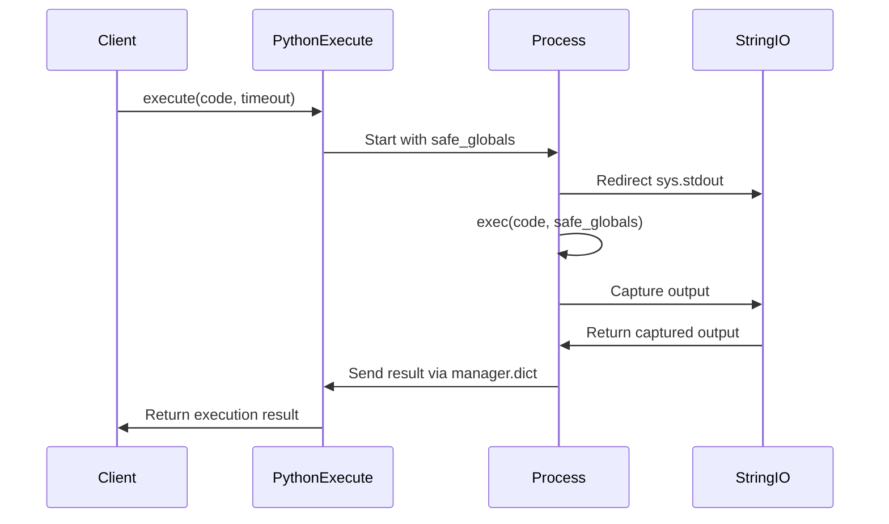
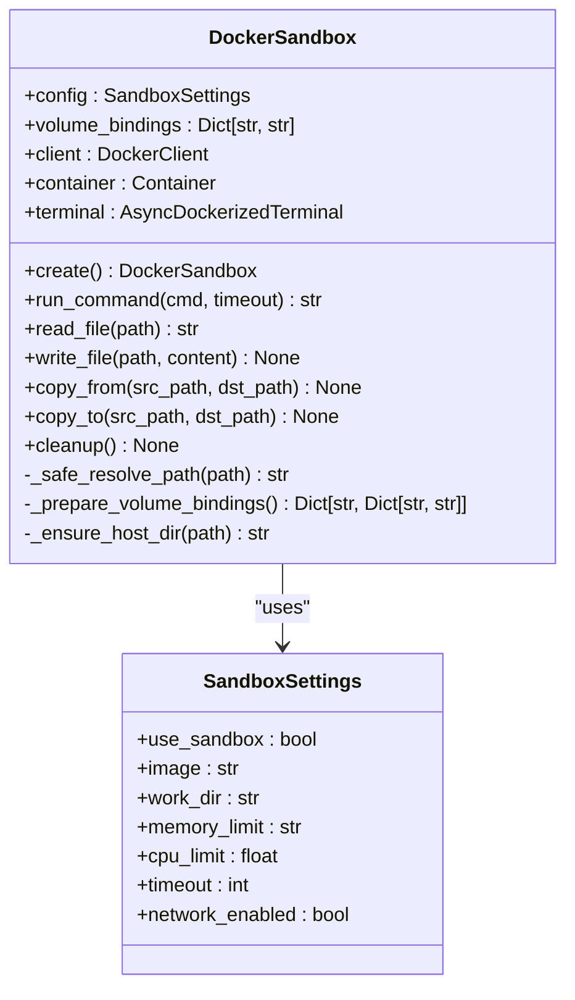
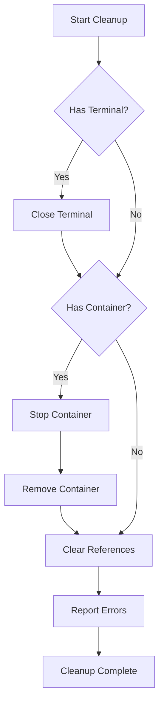

# Security Management

<cite>
**Referenced Files in This Document**   
- [app/tool/python_execute.py](file://app/tool/python_execute.py)
- [app/sandbox/core/sandbox.py](file://app/sandbox/core/sandbox.py)
- [app/sandbox/core/manager.py](file://app/sandbox/core/manager.py)
- [app/config.py](file://app/config.py)
</cite>

## Table of Contents
1. [Multi-Layered Security Model](#multi-layered-security-model)
2. [Python Execution Isolation](#python-execution-isolation)
3. [Docker-Level Security Features](#docker-level-security-features)
4. [Principle of Least Privilege](#principle-of-least-privilege)
5. [Resource Cleanup Mechanisms](#resource-cleanup-mechanisms)
6. [Security Enforcement Examples](#security-enforcement-examples)
7. [Potential Vulnerabilities and Mitigation Strategies](#potential-vulnerabilities-and-mitigation-strategies)

## Multi-Layered Security Model

OpenManus implements a comprehensive multi-layered security model designed to protect against malicious code execution while enabling safe and isolated execution of untrusted code. The architecture combines process-level isolation, containerization, and strict access controls to create a defense-in-depth approach. This model ensures that even if one layer is compromised, additional barriers prevent escalation to the host system or unauthorized access to sensitive resources.

The security framework operates across multiple levels: application-level sandboxing through multiprocessing, container-level isolation via Docker, and system-level configuration through secure defaults and resource constraints. Each layer contributes to the overall security posture by limiting the attack surface and enforcing strict boundaries on code execution.

**Section sources**
- [app/tool/python_execute.py](file://app/tool/python_execute.py#L8-L74)
- [app/sandbox/core/sandbox.py](file://app/sandbox/core/sandbox.py#L17-L461)

## Python Execution Isolation

The PythonExecute tool provides a secure environment for executing Python code through multiprocessing-based isolation. This approach prevents direct access to the host environment by running code in a separate process with restricted global namespace and controlled output capture.

The isolation mechanism uses `multiprocessing.Process` to execute code in a child process, ensuring that any modifications to the global state remain confined to that process. The parent process maintains control through a `multiprocessing.Manager` that coordinates result sharing. This design prevents memory leaks and state corruption between executions.

A critical component of this isolation is the `safe_globals` dictionary, which limits the built-in functions and modules available during execution. By default, only essential built-ins are exposed, preventing access to dangerous operations like file system manipulation or network requests through Python's standard library.

Output capturing is implemented using `StringIO` to intercept `sys.stdout`. This ensures that only printed output is visible to the calling system, while return values from functions remain inaccessible. This design choice enhances security by preventing data exfiltration through return values and ensures consistent output handling.

**Diagram sources**
- [app/tool/python_execute.py](file://app/tool/python_execute.py#L8-L74)

**Section sources**
- [app/tool/python_execute.py](file://app/tool/python_execute.py#L8-L74)

## Docker-Level Security Features

The DockerSandbox implementation provides container-level security features that complement the process isolation with additional layers of protection. This containerized execution environment enforces network isolation, resource limits, and path traversal prevention to create a robust security boundary.

Network isolation is configured through the `network_mode` setting in the container configuration. By default, containers run with `"none"` network mode when `network_enabled` is set to `False` in the SandboxSettings. This configuration completely disables network interfaces within the container, preventing any outbound or inbound network communication that could be used for data exfiltration or external attacks.

Resource limits are enforced through Docker's built-in resource management capabilities. The system configures memory limits using `mem_limit` (default: "512m") and CPU limits using `cpu_period` and `cpu_quota` (default: 1.0 CPU). These constraints prevent denial-of-service attacks through resource exhaustion and ensure fair resource allocation across multiple concurrent executions.

Path traversal prevention is implemented through the `_safe_resolve_path` method, which validates all file paths before use. The method explicitly checks for ".." patterns in path components and raises a `ValueError` if detected. This prevents directory traversal attacks that could otherwise allow access to files outside the designated workspace directory.

**Diagram sources**
- [app/sandbox/core/sandbox.py](file://app/sandbox/core/sandbox.py#L17-L461)

**Section sources**
- [app/sandbox/core/sandbox.py](file://app/sandbox/core/sandbox.py#L17-L461)
- [app/config.py](file://app/config.py#L93-L104)

## Principle of Least Privilege

OpenManus applies the principle of least privilege in its container configuration by restricting capabilities and access to only what is necessary for legitimate operations. This minimizes the potential impact of any security breach by ensuring that even if an attacker gains control of the container, their actions are severely limited.

Container configuration enforces minimal privileges through several mechanisms. The default base image (`python:3.12-slim`) is a minimal Python distribution that excludes unnecessary packages and tools that could be exploited. The container runs without elevated privileges and cannot access host system resources beyond the explicitly mounted volumes.

File system access is restricted to the designated working directory (`/workspace` by default). All file operations are routed through the `_safe_resolve_path` method, which ensures that paths are resolved relative to the work directory and prevents escape attempts. This creates a chroot-like environment where the container cannot access files outside its designated workspace.

The execution environment also limits available system calls and capabilities. By running with default Docker security settings and without privileged mode, the container cannot perform operations like loading kernel modules, accessing raw devices, or modifying network configurations. This reduces the attack surface and prevents privilege escalation attempts.

**Section sources**
- [app/sandbox/core/sandbox.py](file://app/sandbox/core/sandbox.py#L17-L461)
- [app/config.py](file://app/config.py#L93-L104)

## Resource Cleanup Mechanisms

OpenManus implements comprehensive resource cleanup mechanisms to ensure proper release of system resources after execution. These mechanisms prevent resource leaks and ensure that temporary files, containers, and processes are properly terminated and removed.

The cleanup process is implemented in the `cleanup()` method of the DockerSandbox class, which systematically terminates and removes container resources. The method first closes the terminal connection, then stops the container with a 5-second timeout, and finally removes the container with `force=True` to ensure removal even if the container is in an error state. Any errors during cleanup are collected and reported as warnings rather than failing the entire cleanup operation.

The SandboxManager class provides additional cleanup functionality through automatic idle sandbox termination. The manager maintains a cleanup task that periodically checks for sandboxes that have been idle beyond the configured `idle_timeout` (default: 3600 seconds). Idle sandboxes are automatically deleted to free up system resources and prevent accumulation of unused containers.

The cleanup process is designed to be resilient and comprehensive. It uses asyncio tasks to concurrently clean up multiple sandboxes during shutdown, with a 30-second timeout to prevent indefinite waiting. The manager also implements safe deletion with operation tracking, ensuring that sandboxes with active operations are not prematurely terminated.

**Diagram sources**
- [app/sandbox/core/sandbox.py](file://app/sandbox/core/sandbox.py#L424-L453)
- [app/sandbox/core/manager.py](file://app/sandbox/core/manager.py#L205-L241)

**Section sources**
- [app/sandbox/core/sandbox.py](file://app/sandbox/core/sandbox.py#L424-L453)
- [app/sandbox/core/manager.py](file://app/sandbox/core/manager.py#L205-L241)

## Security Enforcement Examples

OpenManus demonstrates several concrete examples of security enforcement that protect against common attack vectors and misuse scenarios. These enforcement mechanisms operate automatically as part of the execution pipeline, requiring no additional configuration from users.

Infinite loop termination is implemented through the timeout mechanism in both the PythonExecute tool and DockerSandbox. The PythonExecute tool uses a multiprocessing join timeout to terminate processes that exceed the specified execution time (default: 5 seconds). Similarly, the DockerSandbox enforces command timeouts (default: 300 seconds) through its run_command method, which raises a SandboxTimeoutError when execution exceeds the limit.

Unauthorized file system access is prevented through multiple layers of protection. The `_safe_resolve_path` method blocks any path containing ".." components, preventing directory traversal attacks. File operations are restricted to the container's working directory, and all file access must go through the sandbox's read_file, write_file, copy_from, and copy_to methods, which perform additional validation.

The system also prevents unauthorized network access by default. With `network_enabled` set to `False` in the SandboxSettings, containers run in network-isolated mode, making all network operations fail. This default configuration ensures that even if malicious code attempts to establish network connections, it will be unable to communicate with external systems.

**Section sources**
- [app/tool/python_execute.py](file://app/tool/python_execute.py#L38-L74)
- [app/sandbox/core/sandbox.py](file://app/sandbox/core/sandbox.py#L139-L163)
- [app/sandbox/core/sandbox.py](file://app/sandbox/core/sandbox.py#L231-L252)

## Potential Vulnerabilities and Mitigation Strategies

Despite its robust security model, OpenManus acknowledges potential vulnerabilities and implements specific mitigation strategies to address them. These strategies focus on input validation, sandbox escape prevention, and secure dependency management to maintain a high security posture.

Input validation is enforced at multiple levels. The PythonExecute tool validates that code input is a string and required parameters are present. The DockerSandbox validates file paths through `_safe_resolve_path` and ensures that source files exist before copying operations. These validations prevent injection attacks and malformed input from causing unexpected behavior.

Sandbox escape prevention is implemented through defense-in-depth. The combination of multiprocessing isolation and Docker containerization creates multiple barriers that an attacker must overcome. Even if code executes within the container, the lack of network access, restricted file system access, and resource limits prevent meaningful damage. The use of minimal base images reduces the attack surface by eliminating unnecessary tools and services.

Secure dependency management is ensured through the use of official, minimal Docker images and pinned versions. The default `python:3.12-slim` image is regularly updated and maintained by the Docker team, reducing the risk of vulnerabilities in the base system. The SandboxManager automatically ensures that required images are available and can pull them from trusted registries when necessary.

Additional mitigation strategies include logging of security-relevant events, automatic cleanup of resources, and monitoring of sandbox usage patterns. These measures help detect and respond to potential abuse while maintaining system stability and security.

**Section sources**
- [app/tool/python_execute.py](file://app/tool/python_execute.py#L8-L74)
- [app/sandbox/core/sandbox.py](file://app/sandbox/core/sandbox.py#L17-L461)
- [app/sandbox/core/manager.py](file://app/sandbox/core/manager.py#L64-L85)