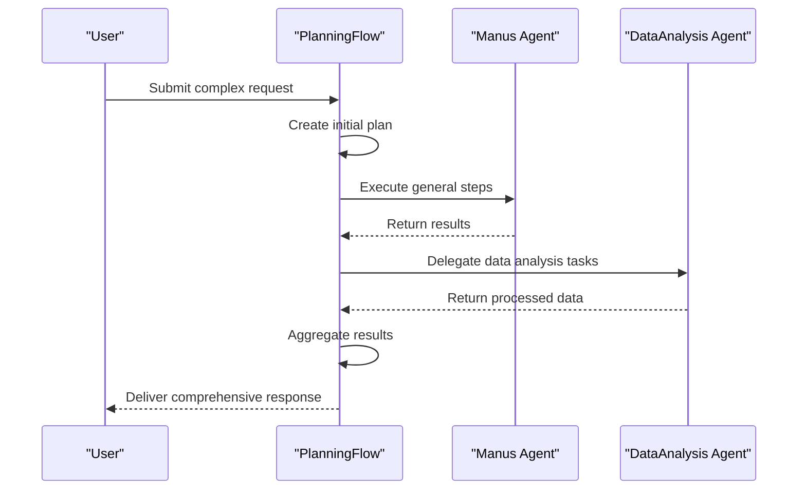

# Complex Workflows

<cite>
**Referenced Files in This Document**   
- [run_flow.py](file://run_flow.py)
- [flow_factory.py](file://app/flow/flow_factory.py)
- [planning.py](file://app/flow/planning.py)
- [manus.py](file://app/agent/manus.py)
- [data_analysis.py](file://app/agent/data_analysis.py)
- [config.example.toml](file://config/config.example.toml)
</cite>

## Table of Contents
1. [Workflow Orchestration with FlowFactory](#workflow-orchestration-with-flowfactory)
2. [Agent Integration and Task Decomposition](#agent-integration-and-task-decomposition)
3. [Configuration and Execution Settings](#configuration-and-execution-settings)
4. [Execution Flow and Error Handling](#execution-flow-and-error-handling)
5. [Performance Monitoring and Logging](#performance-monitoring-and-logging)

## Workflow Orchestration with FlowFactory

The `run_flow.py` script serves as the entry point for orchestrating complex multi-agent workflows through the `FlowFactory` pattern. This factory pattern enables dynamic creation of different workflow types, with the current implementation focusing on the `PLANNING` flow type. The `FlowFactory.create_flow()` method accepts a flow type and agent configuration to instantiate the appropriate workflow controller, allowing for extensible workflow architectures.

The system follows a modular design where the `FlowFactory` acts as a central coordinator, decoupling workflow creation from execution logic. This separation enables easy addition of new flow types in the future while maintaining backward compatibility with existing agent implementations. The factory pattern ensures consistent initialization and configuration of workflow components across different execution contexts.

**Section sources**
- [run_flow.py](file://run_flow.py#L1-L52)
- [flow_factory.py](file://app/flow/flow_factory.py#L12-L29)

## Agent Integration and Task Decomposition

The integration between Manus and DataAnalysis agents enables sophisticated compound task solving through coordinated specialization. The Manus agent serves as a general-purpose executor with broad capabilities including web browsing, file operations, and Python execution, while the DataAnalysis agent specializes in data processing, visualization, and statistical analysis tasks.

Task decomposition occurs through the `PlanningFlow` mechanism, which breaks down complex requests into sequential steps that can be assigned to appropriate agents based on their capabilities. When a request requires data analysis, the planning system automatically routes relevant steps to the DataAnalysis agent, while general coordination and follow-up tasks remain with the Manus agent. This handoff process maintains context continuity through shared memory and state management systems.

The result aggregation process combines outputs from multiple agents into a cohesive response, preserving the provenance of each contribution. This approach enables the system to handle compound tasks that require both general reasoning and specialized data processing capabilities, such as analyzing web-scraped data and generating visual reports.

**Diagram sources**
- [planning.py](file://app/flow/planning.py#L10-L442)
- [manus.py](file://app/agent/manus.py#L17-L164)
- [data_analysis.py](file://app/agent/data_analysis.py#L11-L36)

**Section sources**
- [planning.py](file://app/flow/planning.py#L10-L442)
- [manus.py](file://app/agent/manus.py#L17-L164)
- [data_analysis.py](file://app/agent/data_analysis.py#L11-L36)

## Configuration and Execution Settings

The system provides flexible configuration options through the `config.toml` file, allowing users to enable specific agent combinations and adjust execution parameters. The `[runflow]` section contains the `use_data_analysis_agent` boolean flag that controls whether the DataAnalysis agent is included in the workflow. When set to `true`, the agent is instantiated and made available for task delegation.

Timeout settings are configured at the workflow level, with the `run_flow.py` script implementing a 3600-second (1 hour) timeout for the entire execution process. This safeguard prevents runaway processes and ensures resource availability. The configuration system follows a hierarchical approach where global settings can be overridden by flow-specific parameters, enabling fine-grained control over agent behavior and resource allocation.

For specialized use cases, the system supports both sequential and parallel agent execution patterns. Sequential execution is the default mode, ensuring proper dependency resolution and context preservation. Parallel execution can be enabled for independent tasks through configuration directives, improving throughput for certain workload patterns.

**Section sources**
- [config.example.toml](file://config/config.example.toml#L100-L105)
- [run_flow.py](file://run_flow.py#L1-L52)

## Execution Flow and Error Handling

The execution flow follows a structured progression from input processing to result delivery, with comprehensive error handling at each stage. The `PlanningFlow.execute()` method orchestrates the entire process, beginning with plan creation and proceeding through step-by-step execution. Each step is monitored for progress, with automatic detection of stalled or looping behavior.

Error recovery strategies include automatic retry mechanisms, alternative agent selection, and graceful degradation of functionality when specific agents are unavailable. The system maintains detailed execution context across agent handoffs, preserving conversation history, intermediate results, and state information. This context management enables seamless transitions between agents while maintaining task coherence.

For long-running workflows, the system implements checkpointing and state persistence mechanisms that allow recovery from interruptions. If an execution is terminated prematurely, the system can resume from the last completed step rather than restarting from the beginning, conserving computational resources and user time.

**Section sources**
- [planning.py](file://app/flow/planning.py#L10-L442)
- [run_flow.py](file://run_flow.py#L1-L52)

## Performance Monitoring and Logging

The system incorporates comprehensive performance monitoring and logging practices to support debugging and optimization of complex executions. Detailed logs are generated at each stage of the workflow, capturing agent decisions, tool usage, and execution metrics. The logging system follows a structured format that enables easy filtering and analysis of execution data.

Performance metrics include execution time per step, resource utilization, and success/failure rates for different operation types. These metrics are used to identify bottlenecks and optimize agent selection strategies. The monitoring system also tracks plan progression, providing real-time visibility into workflow status and estimated completion times.

For debugging complex executions, the system provides detailed trace information that reconstructs the decision path taken by agents. This includes the rationale for agent selection, tool choices, and any error recovery actions taken during execution. The logging infrastructure supports multiple verbosity levels, allowing users to adjust the detail of output based on their needs.

**Section sources**
- [planning.py](file://app/flow/planning.py#L10-L442)
- [run_flow.py](file://run_flow.py#L1-L52)
- [manus.py](file://app/agent/manus.py#L17-L164)