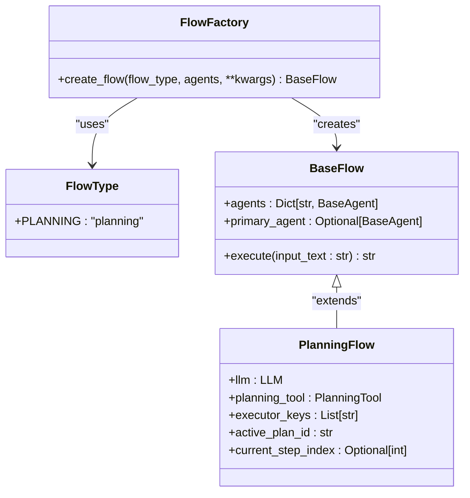
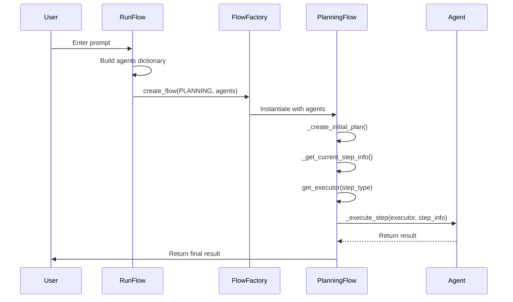
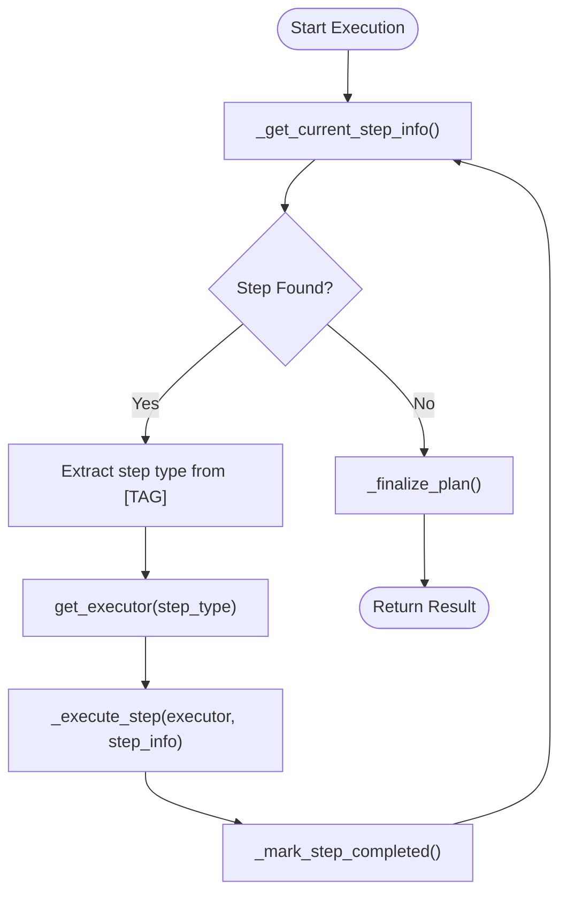
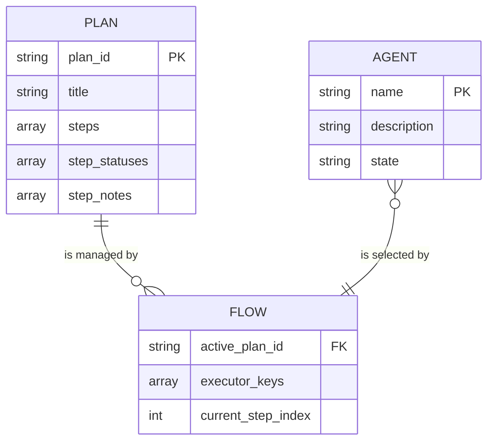

# Multi-Agent Coordination

<cite>
**Referenced Files in This Document**   
- [run_flow.py](file://run_flow.py)
- [flow_factory.py](file://app/flow/flow_factory.py)
- [planning.py](file://app/flow/planning.py)
- [manus.py](file://app/agent/manus.py)
- [data_analysis.py](file://app/agent/data_analysis.py)
- [config.py](file://app/config.py)
</cite>

## Table of Contents
1. [FlowFactory and Dynamic Flow Creation](#flowfactory-and-dynamic-flow-creation)
2. [Agent Registration and Executor Selection](#agent-registration-and-executor-selection)
3. [Agent Handoff Mechanisms](#agent-handoff-mechanisms)
4. [Configuration-Driven Agent Coordination](#configuration-driven-agent-coordination)
5. [Shared Context Management](#shared-context-management)
6. [Error Handling and Workflow Resilience](#error-handling-and-workflow-resilience)
7. [Monitoring and Diagnostics](#monitoring-and-diagnostics)

## FlowFactory and Dynamic Flow Creation

The FlowFactory pattern enables dynamic instantiation of flow types based on runtime requirements. The system supports the PlanningFlow type through the FlowType enumeration, which serves as a registry for available flow implementations. When a flow is requested, the factory resolves the appropriate class (e.g., PlanningFlow) and instantiates it with the provided agents and configuration parameters. This decoupling allows for future extension with additional flow types without modifying the core orchestration logic.

The factory accepts agents in multiple formats—single agent, list of agents, or dictionary of keyed agents—and normalizes them into a consistent dictionary structure. This flexibility supports various deployment scenarios while maintaining a uniform interface for flow execution.

**Diagram sources**
- [flow_factory.py](file://app/flow/flow_factory.py#L0-L29)
- [planning.py](file://app/flow/planning.py#L47-L74)

**Section sources**
- [flow_factory.py](file://app/flow/flow_factory.py#L0-L29)
- [planning.py](file://app/flow/planning.py#L47-L74)

## Agent Registration and Executor Selection

Agents are registered through a dictionary-based configuration in run_flow.py, where each agent is assigned a unique key. The Manus agent is always registered under the "manus" key, while the DataAnalysis agent is conditionally registered based on the run_flow_config.use_data_analysis_agent flag. This pattern allows for dynamic composition of agent teams based on configuration.

During execution, the PlanningFlow determines the appropriate executor for each step by first checking if a step type (extracted via regex from step text in the format [TYPE]) matches an available agent key. If no match is found, it falls back to the first agent in the executor_keys list or the primary agent. This selection mechanism enables both explicit agent assignment through planning and default delegation.

**Diagram sources**
- [run_flow.py](file://run_flow.py#L0-L51)
- [planning.py](file://app/flow/planning.py#L110-L137)

**Section sources**
- [run_flow.py](file://run_flow.py#L0-L51)
- [planning.py](file://app/flow/planning.py#L110-L137)

## Agent Handoff Mechanisms

The system implements a sophisticated handoff mechanism where tasks are delegated based on step type annotations in the plan. When the LLM generates a plan using the PlanningTool, it can specify agent assignments by including agent names in square brackets (e.g., [data_analysis]). The PlanningFlow extracts this type information through regex pattern matching on step text and routes execution accordingly.

This handoff process occurs in the _get_current_step_info method, which parses each step to identify its type, and the get_executor method, which selects the appropriate agent. The workflow proceeds iteratively: retrieve next active step, select executor, execute step, mark completion, and repeat until all steps are completed. This ensures that specialized agents handle tasks within their domain expertise while maintaining overall workflow progression.

**Diagram sources**
- [planning.py](file://app/flow/planning.py#L237-L266)
- [planning.py](file://app/flow/planning.py#L75-L95)

**Section sources**
- [planning.py](file://app/flow/planning.py#L237-L266)

## Configuration-Driven Agent Coordination

Agent availability and coordination behavior are controlled through configuration options in config.run_flow_config. The use_data_analysis_agent boolean flag determines whether the DataAnalysis agent is instantiated and added to the agents dictionary. This configuration-driven approach allows users to enable or disable specialized agents based on their requirements and available resources.

Additional configuration parameters could extend this system to control agent capabilities, timeout values, and resource allocation. The current implementation demonstrates a clean separation between configuration and code, enabling non-programmatic control over the agent ecosystem. This pattern supports different deployment profiles (e.g., lightweight vs. full-featured) through configuration alone.

**Section sources**
- [run_flow.py](file://run_flow.py#L0-L51)
- [config.py](file://app/config.py)

## Shared Context Management

Shared context across agents is maintained through the PlanningTool, which serves as a centralized state management system. The tool stores plans in a dictionary (plans) indexed by plan_id, with each plan containing steps, step_statuses, and step_notes. All agents access this shared state through the PlanningFlow's planning_tool field, ensuring consistency.

LLM-driven state synchronization occurs when the initial plan is created: the LLM receives a system message describing available agents and is instructed to specify agent assignments in step text. During execution, the current plan status is included in each agent's prompt, providing context about progress and completed work. This shared view prevents redundant work and enables coherent handoffs.

**Diagram sources**
- [planning.py](file://app/flow/planning.py#L47-L74)
- [tool/planning.py](file://app/tool/planning.py#L54-L98)

**Section sources**
- [planning.py](file://app/flow/planning.py#L47-L74)

## Error Handling and Workflow Resilience

The system addresses common coordination issues through several mechanisms. Agent deadlocks are prevented by the step-based execution model, where each step must complete before the next begins. Inconsistent state is mitigated by atomic updates to step status through the PlanningTool's mark_step command, with fallback direct manipulation of plan data if the tool fails.

Timeout handling is implemented at the workflow level with a 60-minute asyncio.wait_for wrapper around flow.execute, preventing infinite hangs. Individual steps inherit this protection through the overall flow timeout. The system also handles partial failures by continuing execution after logging errors, marking problematic steps as blocked when appropriate, and attempting to complete remaining steps.

**Section sources**
- [run_flow.py](file://run_flow.py#L0-L51)
- [planning.py](file://app/flow/planning.py#L110-L137)

## Monitoring and Diagnostics

Comprehensive logging practices enable diagnosis of coordination bottlenecks. The system logs key events including flow initialization, plan creation, step execution, and completion metrics. Performance monitoring is facilitated by timing the entire request processing duration and logging it upon completion.

Each step transition is logged with appropriate severity: informational messages for progress, warnings for recoverable issues (e.g., plan creation fallback), and errors for failures. This layered approach allows operators to trace workflow progression, identify slow steps, and diagnose coordination problems. The structured logging output serves as a timeline for analyzing agent interactions and optimizing performance.

**Section sources**
- [run_flow.py](file://run_flow.py#L0-L51)
- [planning.py](file://app/flow/planning.py#L110-L137)