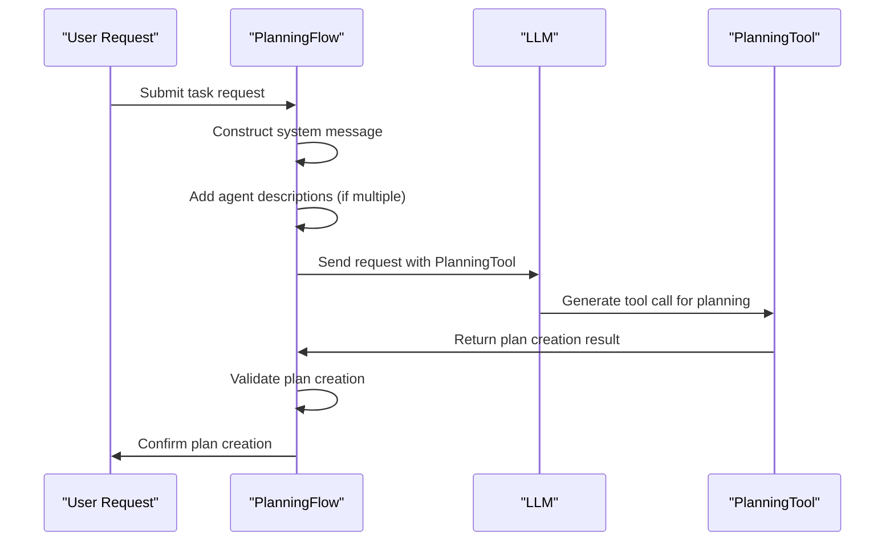
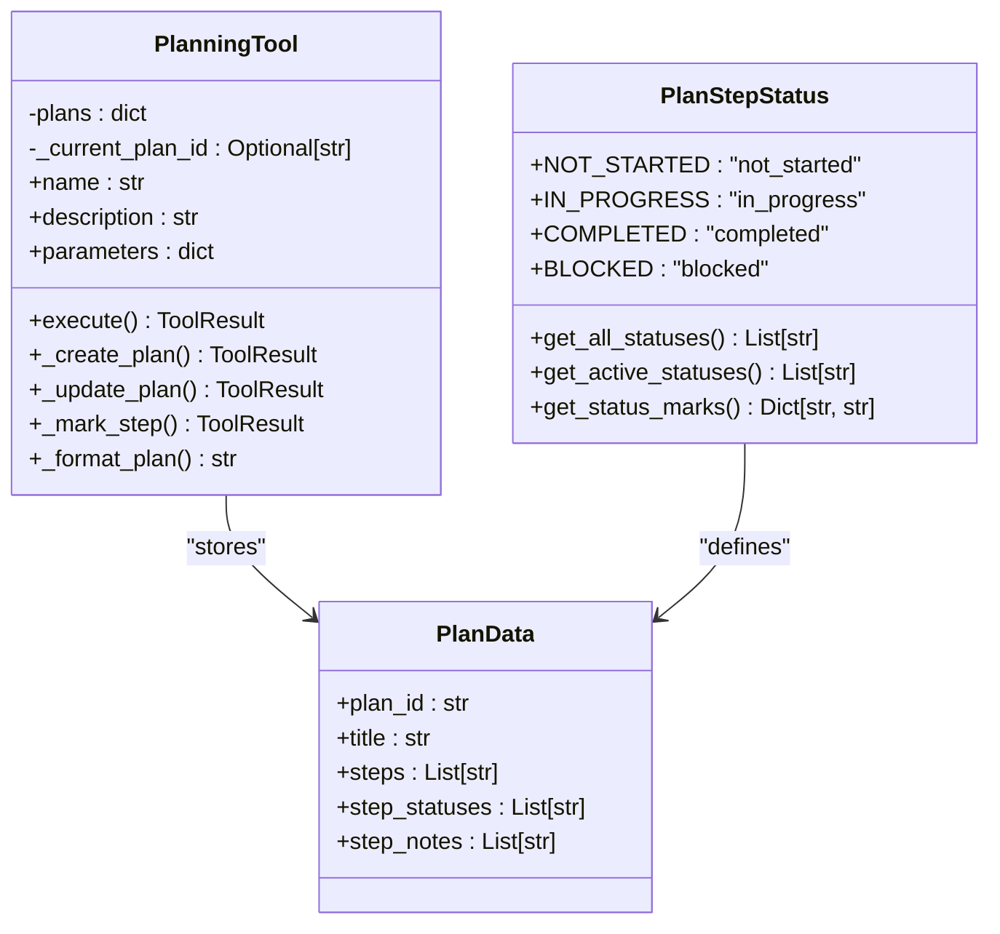
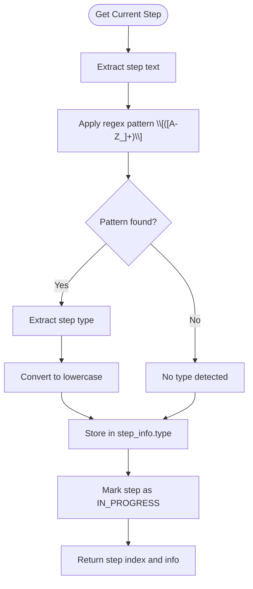
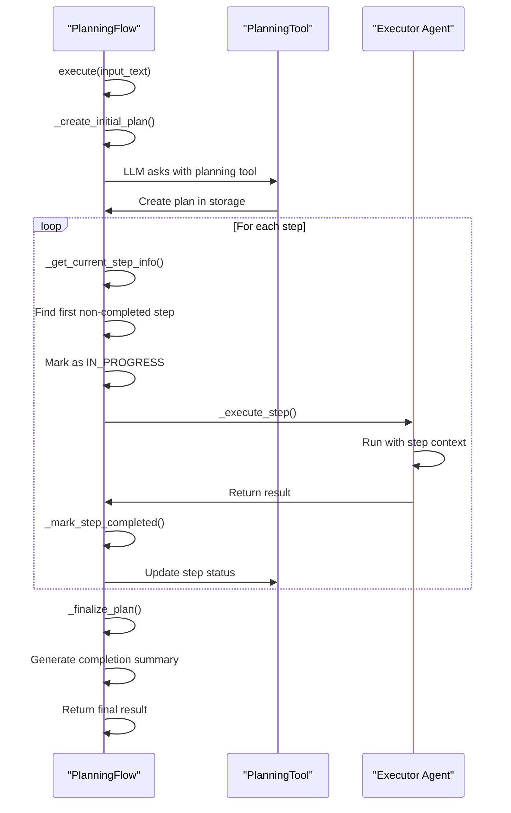
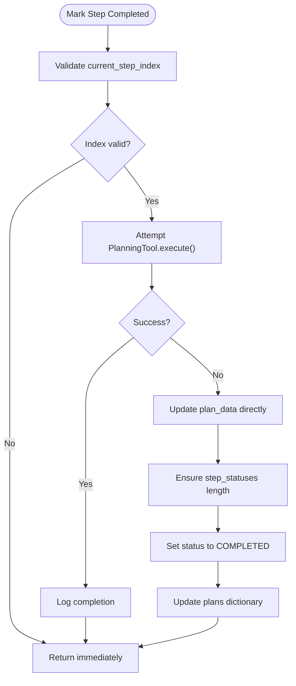
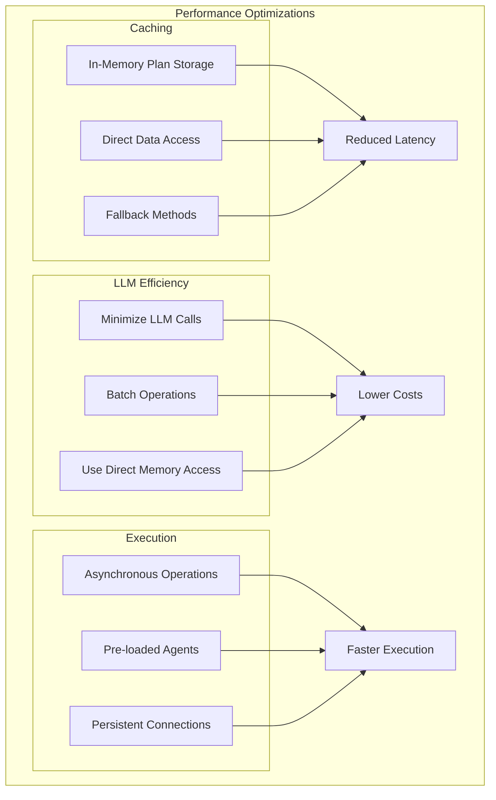

# Task Decomposition and Execution

<cite>
**Referenced Files in This Document**   
- [app/flow/planning.py](file://app/flow/planning.py)
- [app/tool/planning.py](file://app/tool/planning.py)
- [app/prompt/planning.py](file://app/prompt/planning.py)
</cite>

## Table of Contents
1. [Introduction](#introduction)
2. [Plan Creation and System Message Design](#plan-creation-and-system-message-design)
3. [Plan Step Structure and Status Management](#plan-step-structure-and-status-management)
4. [Step Type Detection and Agent Routing](#step-type-detection-and-agent-routing)
5. [Execution Flow Orchestration](#execution-flow-orchestration)
6. [Error Recovery and Step Status Updates](#error-recovery-and-step-status-updates)
7. [Performance Considerations and Optimization](#performance-considerations-and-optimization)

## Introduction
The Task Decomposition and Execution system in OpenManus enables intelligent breakdown of user requests into actionable steps through a structured planning process. This system leverages a PlanningFlow that utilizes an LLM with a PlanningTool to create, manage, and execute plans. The architecture supports dynamic step-by-step execution with proper status tracking, error recovery, and performance optimization. This document details the complete workflow from initial plan creation to final execution, covering the mechanisms for task decomposition, step management, agent routing, and system resilience.

## Plan Creation and System Message Design

The PlanningFlow initiates task decomposition through the `_create_initial_plan` method, which orchestrates the creation of a structured plan using the LLM and PlanningTool. The system message is carefully designed to guide the LLM in generating concise, actionable plans with clear steps while optimizing for clarity and efficiency.

The system message content is constructed to:
- Establish the LLM's role as a planning assistant
- Emphasize the need for concise, actionable plans with clear milestones
- Provide information about available executor agents when multiple agents are present
- Guide the LLM to specify agent names in the format '[agent_name]' when creating steps

When multiple executor agents are available, the system message dynamically incorporates agent descriptions, enabling the LLM to make informed decisions about which agent should handle specific steps. This design ensures that the generated plan is not only logically structured but also optimized for the available execution resources.

**Diagram sources**
- [app/flow/planning.py](file://app/flow/planning.py#L135-L210)
- [app/prompt/planning.py](file://app/prompt/planning.py#L1-L27)

**Section sources**
- [app/flow/planning.py](file://app/flow/planning.py#L135-L210)
- [app/prompt/planning.py](file://app/prompt/planning.py#L1-L27)

## Plan Step Structure and Status Management

The system implements a comprehensive plan step management system with four distinct status states that track the lifecycle of each step. The `PlanStepStatus` enum defines these states:

- **NOT_STARTED**: Initial state for steps that have not yet been processed
- **IN_PROGRESS**: Active state for steps currently being executed
- **COMPLETED**: Final state for successfully finished steps
- **BLOCKED**: State for steps that cannot proceed due to dependencies or errors

Each plan is stored as a structured dictionary containing:
- `plan_id`: Unique identifier for the plan
- `title`: Descriptive title of the plan
- `steps`: List of step descriptions
- `step_statuses`: List of status values corresponding to each step
- `step_notes`: List of additional notes for each step

The PlanningTool maintains all plans in memory through its `plans` dictionary, with the `_current_plan_id` field tracking the active plan. This in-memory storage enables efficient access and modification of plan data during execution.

The system provides comprehensive status tracking with visual indicators:
- [ ] for NOT_STARTED steps
- [→] for IN_PROGRESS steps  
- [✓] for COMPLETED steps
- [!] for BLOCKED steps

Progress metrics are automatically calculated, showing the count and percentage of completed steps, providing clear visibility into plan advancement.

**Diagram sources**
- [app/flow/planning.py](file://app/flow/planning.py#L15-L41)
- [app/tool/planning.py](file://app/tool/planning.py#L13-L362)

**Section sources**
- [app/flow/planning.py](file://app/flow/planning.py#L15-L41)
- [app/tool/planning.py](file://app/tool/planning.py#L13-L362)

## Step Type Detection and Agent Routing

The system employs regex pattern matching to detect step types and route tasks to appropriate agents. This enables intelligent delegation of work based on the nature of each step. The detection mechanism uses the pattern `\[\([A-Z_]+\)\]` to identify step type markers in the step text.

Common step type patterns include:
- [SEARCH]: Indicates a search-related task
- [CODE]: Indicates a coding or programming task  
- [AGENT_NAME]: Specifies a particular agent to execute the step

The `_get_current_step_info` method extracts the step type from the text and includes it in the step_info dictionary. This type information is then used by the `get_executor` method to determine the appropriate agent for execution.

The agent routing logic follows a priority-based approach:
1. If a step type matches an agent key, that agent is selected
2. Otherwise, the first available executor from the executor_keys list is used
3. As a fallback, the primary agent handles the step

This flexible routing system allows for specialized agents to handle specific task types while maintaining a default execution path for general tasks.

**Diagram sources**
- [app/flow/planning.py](file://app/flow/planning.py#L212-L274)
- [app/tool/planning.py](file://app/tool/planning.py#L256-L303)

**Section sources**
- [app/flow/planning.py](file://app/flow/planning.py#L212-L274)
- [app/tool/planning.py](file://app/tool/planning.py#L256-L303)

## Execution Flow Orchestration

The PlanningFlow orchestrates the complete execution process through a well-defined sequence of methods that coordinate plan creation, step identification, and step execution. The main `execute` method serves as the central controller, managing the overall workflow.

The execution flow follows these key stages:

1. **Plan Initialization**: The `_create_initial_plan` method generates the initial plan structure
2. **Step Identification**: The `_get_current_step_info` method finds the next actionable step
3. **Step Execution**: The `_execute_step` method carries out the identified step
4. **Status Update**: The `_mark_step_completed` method updates the step status upon completion
5. **Finalization**: The `_finalize_plan` method generates a summary when all steps are complete

The `_execute_step` method prepares a contextual prompt for the executing agent, including the current plan status and specific instructions for the current step. This ensures that agents have complete context for their tasks while focusing on the immediate step.

The system maintains the current step index in the `current_step_index` field, enabling accurate tracking of execution progress. The loop continues until no more active steps are found, at which point the plan is finalized.

**Diagram sources**
- [app/flow/planning.py](file://app/flow/planning.py#L93-L133)
- [app/flow/planning.py](file://app/flow/planning.py#L276-L303)

**Section sources**
- [app/flow/planning.py](file://app/flow/planning.py#L93-L133)
- [app/flow/planning.py](file://app/flow/planning.py#L276-L303)

## Error Recovery and Step Status Updates

The system implements robust error recovery mechanisms to handle failures during step execution and ensure reliable status tracking. These mechanisms provide resilience against various failure scenarios while maintaining data integrity.

For step status updates, the system employs a dual-layer approach:
1. **Primary Method**: Use the PlanningTool's `mark_step` command through the execute method
2. **Fallback Method**: Directly update the plan data in memory if the tool execution fails

This fallback mechanism ensures that step status updates are not lost due to transient errors. When marking a step as completed, the system first attempts to use the PlanningTool's execute method. If this fails, it directly modifies the step_statuses list in the plan data, ensuring the status is properly recorded.

Error handling is implemented at multiple levels:
- **Step Execution**: The `_execute_step` method catches exceptions and returns error messages
- **Status Updates**: The `_mark_step_completed` method includes exception handling for status updates
- **Plan Retrieval**: The `_get_plan_text` method has a fallback to `_generate_plan_text_from_storage`
- **Plan Creation**: A default plan is created if the LLM fails to generate one

The system also includes validation checks to prevent invalid state transitions, such as ensuring step indices are within bounds and verifying that plan IDs exist before operations.

**Diagram sources**
- [app/flow/planning.py](file://app/flow/planning.py#L305-L334)
- [app/flow/planning.py](file://app/flow/planning.py#L347-L403)

**Section sources**
- [app/flow/planning.py](file://app/flow/planning.py#L305-L334)
- [app/flow/planning.py](file://app/flow/planning.py#L347-L403)

## Performance Considerations and Optimization

The system incorporates several performance optimizations to minimize latency and improve execution efficiency. These optimizations address both plan parsing and execution aspects of the workflow.

Key performance considerations include:
- **LLM Call Minimization**: The system reduces the number of LLM calls by batching operations and using direct memory access when possible
- **Caching Mechanisms**: Plan states are maintained in memory through the PlanningTool's plans dictionary, eliminating the need for repeated plan retrieval
- **Efficient Data Access**: Direct access to plan data in memory avoids unnecessary tool calls for status checks
- **Parallel Processing**: The architecture supports concurrent execution when multiple agents are available

The system optimizes plan parsing by:
- Using direct dictionary access to retrieve plan data
- Implementing fallback methods that generate plan text from storage without additional tool calls
- Minimizing string operations through efficient formatting

Execution latency is reduced by:
- Pre-loading agent configurations
- Maintaining persistent connections to external services
- Using asynchronous operations for I/O-bound tasks
- Implementing efficient regex pattern matching for step type detection

The PlanningTool's in-memory storage of plans (`plans` dictionary) serves as a built-in caching mechanism, ensuring that plan data is readily available without requiring repeated database queries or file operations.

**Diagram sources**
- [app/tool/planning.py](file://app/tool/planning.py#L68-L68)
- [app/flow/planning.py](file://app/flow/planning.py#L48-L48)

**Section sources**
- [app/tool/planning.py](file://app/tool/planning.py#L68-L68)
- [app/flow/planning.py](file://app/flow/planning.py#L48-L48)