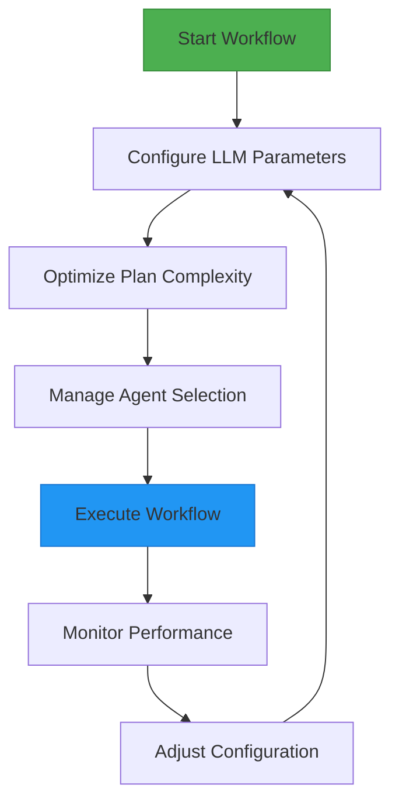
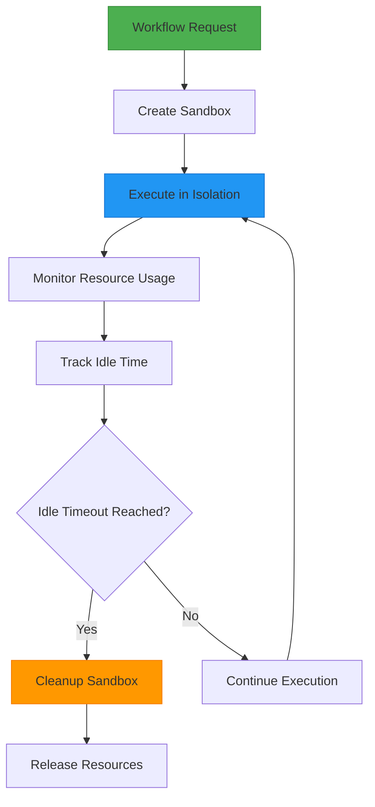

# Workflow Configuration and Optimization

<cite>
**Referenced Files in This Document**   
- [run_flow.py](file://run_flow.py)
- [config.example.toml](file://config/config.example.toml)
- [app/config.py](file://app/config.py)
- [app/flow/planning.py](file://app/flow/planning.py)
- [app/logger.py](file://app/logger.py)
- [app/sandbox/core/manager.py](file://app/sandbox/core/manager.py)
</cite>

## Table of Contents
1. [Timeout Configuration and Execution Reliability](#timeout-configuration-and-execution-reliability)
2. [Conditional Agent Loading via Configuration](#conditional-agent-loading-via-configuration)
3. [Performance Optimization Strategies](#performance-optimization-strategies)
4. [Logging and Monitoring for Long-Running Workflows](#logging-and-monitoring-for-long-running-workflows)
5. [Workflow Scaling and Resource Management](#workflow-scaling-and-resource-management)
6. [Common Configuration Pitfalls and Debugging](#common-configuration-pitfalls-and-debugging)

## Timeout Configuration and Execution Reliability

The workflow execution timeout is configured in `run_flow.py` with a default value of 3600 seconds (60 minutes). This timeout setting is implemented using `asyncio.wait_for()` to prevent indefinite execution of long-running tasks. The timeout serves as a critical reliability mechanism that ensures system stability by terminating workflows that exceed expected execution duration.

The timeout configuration balances responsiveness with execution reliability by allowing sufficient time for complex operations while preventing resource exhaustion. When the timeout threshold is reached, the system logs an error message and provides user guidance to simplify the request. This graceful degradation approach maintains system availability while informing users of execution limits.

Adjusting the timeout value requires careful consideration of use cases. For workflows involving extensive data processing or external API calls with variable response times, increasing the timeout may be necessary. Conversely, for interactive applications requiring quick responses, reducing the timeout improves user experience at the cost of potentially terminating valid long-running operations.

**Section sources**
- [run_flow.py](file://run_flow.py#L25-L35)

## Conditional Agent Loading via Configuration

The configuration system enables conditional agent loading through the `run_flow_config.use_data_analysis_agent` parameter in the TOML configuration files. This boolean flag controls whether the DataAnalysis agent is instantiated and added to the workflow's agent collection during initialization. When set to `true`, the agent is loaded and available for task execution; when `false`, it is omitted from the workflow.

This configuration-driven approach provides flexibility in workflow composition, allowing users to enable specialized agents based on specific task requirements. The conditional loading mechanism is implemented in `run_flow.py` where the configuration is checked before agent instantiation. This pattern supports modular workflow design, where different agent combinations can be activated for different types of tasks without code changes.

The configuration system follows a hierarchical structure where default values are defined in the configuration classes, and specific overrides can be provided in configuration files. This allows for environment-specific configurations while maintaining sensible defaults. The configuration is loaded at application startup and made globally available through the singleton `config` instance.

**Section sources**
- [config.example.toml](file://config/config.example.toml#L104-L105)
- [app/config.py](file://app/config.py#L19-L372)
- [run_flow.py](file://run_flow.py#L10-L15)

## Performance Optimization Strategies

Workflow performance can be optimized through several strategies targeting different aspects of the execution pipeline. LLM parameter tuning represents a primary optimization vector, with parameters such as `temperature`, `max_tokens`, and model selection directly impacting response quality and processing time. Lower temperature values produce more deterministic outputs that may require fewer refinement iterations, while appropriate max_tokens settings prevent unnecessary computation.

Plan complexity reduction is another effective optimization technique. The PlanningFlow component creates execution plans that can be optimized by focusing on key milestones rather than detailed sub-steps. This approach reduces cognitive load on the LLM and minimizes the number of required execution steps. The system encourages concise, actionable plans that prioritize clarity and efficiency in the planning phase.

Agent concurrency management provides additional performance benefits by enabling parallel execution of independent tasks. While the current implementation primarily follows a sequential execution pattern, the architecture supports multiple agents that could potentially execute in parallel for independent tasks. The executor selection mechanism in PlanningFlow allows for routing steps to appropriate agents based on step type, enabling specialized processing that can improve overall efficiency.

**Diagram sources**
- [app/flow/planning.py](file://app/flow/planning.py#L0-L441)
- [app/config.py](file://app/config.py#L19-L372)

**Section sources**
- [app/flow/planning.py](file://app/flow/planning.py#L0-L441)
- [app/config.py](file://app/config.py#L19-L372)

## Logging and Monitoring for Long-Running Workflows

The system implements comprehensive logging and monitoring capabilities for long-running workflows through the built-in logger and elapsed time tracking. The logger provides structured output with different severity levels (INFO, WARNING, ERROR, DEBUG) that help track workflow progress and identify issues. Log messages include timestamps and contextual information that facilitate debugging and performance analysis.

Elapsed time tracking is implemented in `run_flow.py` using Python's `time.time()` function to measure the total execution duration. The start time is captured before workflow execution begins, and the elapsed time is calculated upon completion. This timing information is logged at the INFO level, providing visibility into workflow performance over time.

The logging system is configurable through the `define_log_level` function in `app/logger.py`, which allows adjustment of log levels for console output and file logging independently. This flexibility enables detailed debugging information to be captured in log files while maintaining concise console output. Log files are timestamped and stored in a dedicated logs directory, facilitating historical analysis of workflow performance.

Monitoring long-running workflows benefits from the combination of periodic status logging and final execution metrics. The system logs progress messages at key stages, such as when processing begins and when execution completes. For timed-out workflows, specific error messages guide users toward simplifying their requests, creating a feedback loop that improves subsequent workflow performance.

**Section sources**
- [run_flow.py](file://run_flow.py#L30-L33)
- [app/logger.py](file://app/logger.py#L0-L42)

## Workflow Scaling and Resource Management

Workflow scaling is supported through several mechanisms, including sandbox isolation, resource limits, and automatic cleanup. The sandbox system provides isolated execution environments for agent operations, ensuring that each workflow runs in a controlled environment with defined resource boundaries. This isolation prevents resource contention between concurrent workflows and enhances security by containing potentially harmful operations.

Resource management is configured through the SandboxSettings class, which defines parameters such as memory limits, CPU allocation, and network access. These settings can be adjusted based on available system resources and workload requirements. The default configuration provides moderate resource limits that balance performance with system stability, but these can be customized for specific deployment scenarios.

The SandboxManager implements automatic cleanup of idle sandboxes based on configurable timeout settings. This ensures that resources are reclaimed when workflows are inactive, preventing resource exhaustion during prolonged operation. The cleanup process runs on a configurable interval and removes sandboxes that have been idle beyond the specified threshold, maintaining optimal resource utilization.

**Diagram sources**
- [app/sandbox/core/manager.py](file://app/sandbox/core/manager.py#L0-L313)
- [app/config.py](file://app/config.py#L19-L372)

**Section sources**
- [app/sandbox/core/manager.py](file://app/sandbox/core/manager.py#L0-L313)
- [app/config.py](file://app/config.py#L19-L372)

## Common Configuration Pitfalls and Debugging

Several common configuration pitfalls can lead to failed or slow workflows. Incorrect API key configuration is a frequent issue that prevents LLM integration, resulting in authentication failures. Users should verify that the `api_key` parameter in the configuration matches their service provider's requirements and has appropriate permissions.

Misconfigured sandbox settings can cause execution failures or performance issues. Setting memory or CPU limits too low may result in resource exhaustion during complex operations, while overly permissive network settings could create security vulnerabilities. The default sandbox configuration provides a balanced starting point that can be adjusted based on specific requirements.

Debugging slow workflows requires systematic analysis of potential bottlenecks. The logging system provides valuable insights into execution duration at different stages, helping identify where delays occur. For workflows that consistently time out, reducing plan complexity or breaking large tasks into smaller, sequential operations often resolves performance issues.

Configuration inheritance and override mechanisms can sometimes lead to unexpected behavior. The system loads configuration from multiple sources, with specific files taking precedence over defaults. Users should verify which configuration file is being loaded and ensure that intended settings are not being overridden by other configuration layers.

**Section sources**
- [config.example.toml](file://config/config.example.toml#L0-L105)
- [app/config.py](file://app/config.py#L19-L372)
- [run_flow.py](file://run_flow.py#L0-L52)