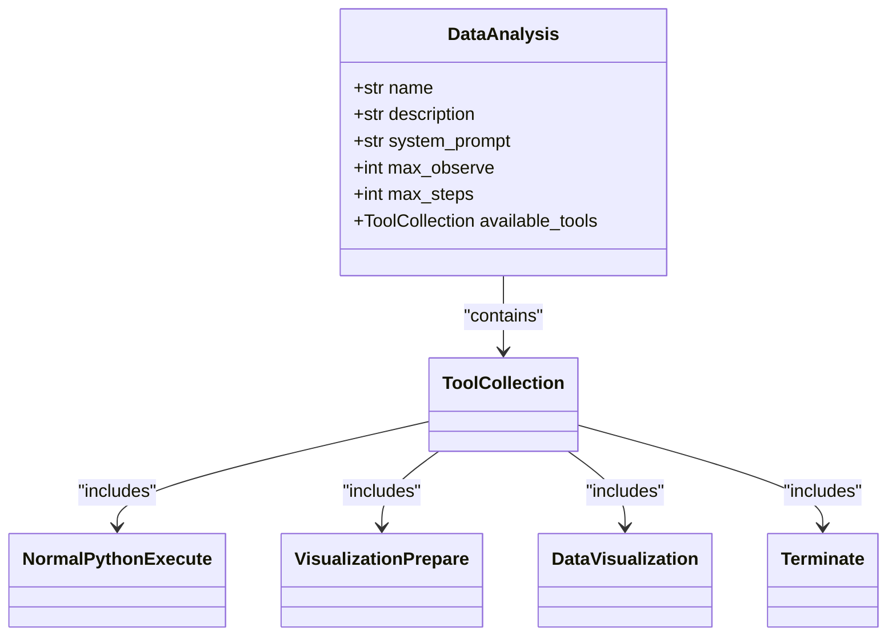
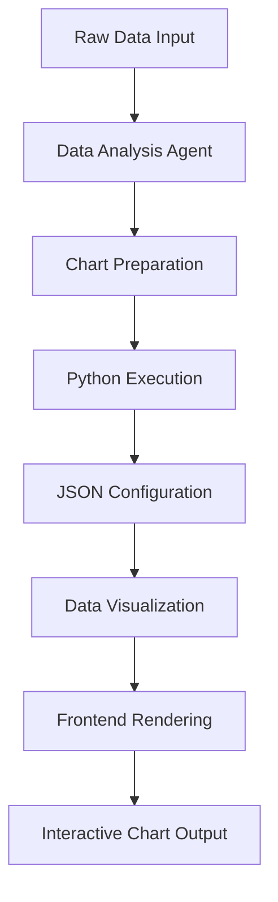
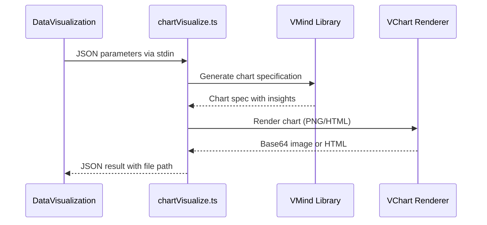

# Data Analysis Workflows

<cite>
**Referenced Files in This Document**   
- [data_analysis.py](file://app/agent/data_analysis.py)
- [chart_prepare.py](file://app/tool/chart_visualization/chart_prepare.py)
- [python_execute.py](file://app/tool/chart_visualization/python_execute.py)
- [data_visualization.py](file://app/tool/chart_visualization/data_visualization.py)
- [chartVisualize.ts](file://app/tool/chart_visualization/src/chartVisualize.ts)
- [sandbox.py](file://app/sandbox/core/sandbox.py)
- [config.py](file://app/config.py)
</cite>

## Table of Contents
1. [Introduction](#introduction)
2. [Data Analysis Agent Overview](#data-analysis-agent-overview)
3. [Data Processing Pipeline](#data-processing-pipeline)
4. [Chart Preparation Phase](#chart-preparation-phase)
5. [Python Execution Environment](#python-execution-environment)
6. [Visualization Generation Process](#visualization-generation-process)
7. [Frontend Rendering with chartVisualize.ts](#frontend-rendering-with-chartvisualizets)
8. [Sandbox Security and Isolation](#sandbox-security-and-isolation)
9. [Configuration and Output Options](#configuration-and-output-options)
10. [Performance Considerations](#performance-considerations)
11. [Troubleshooting and Debugging](#troubleshooting-and-debugging)

## Introduction
The Data Analysis Workflows system provides a comprehensive pipeline for transforming raw numerical data into interactive visualizations through a secure, multi-stage process. This document details the complete workflow from data input to chart rendering, covering the integration between Python-based data processing, secure sandbox execution, and frontend visualization components. The system is designed to handle complex analytical tasks while maintaining security through containerized execution environments.

## Data Analysis Agent Overview
The DataAnalysis agent orchestrates the entire data analysis workflow by coordinating multiple specialized tools. It extends the ToolCallAgent class with a specific set of capabilities tailored for data analysis tasks, including Python execution, chart preparation, and visualization generation. The agent operates within defined constraints, with a maximum of 20 processing steps and an observation limit of 15,000 characters to ensure efficient execution.



**Diagram sources**
- [data_analysis.py](file://app/agent/data_analysis.py#L11-L36)

**Section sources**
- [data_analysis.py](file://app/agent/data_analysis.py#L11-L36)

## Data Processing Pipeline
The data analysis workflow follows a structured pipeline that transforms raw data into meaningful visualizations through sequential processing stages. The pipeline begins with data ingestion and preparation, proceeds through secure code execution, and concludes with visualization rendering. Each stage passes structured data to the next, ensuring consistency and traceability throughout the process.



**Diagram sources**
- [data_analysis.py](file://app/agent/data_analysis.py#L11-L36)
- [chart_prepare.py](file://app/tool/chart_visualization/chart_prepare.py#L3-L37)
- [data_visualization.py](file://app/tool/chart_visualization/data_visualization.py#L14-L262)

## Chart Preparation Phase
The chart preparation phase is responsible for transforming raw data into structured formats suitable for visualization. The VisualizationPrepare tool executes Python code to extract relevant data subsets, clean and transform them as needed, and generate metadata for the visualization process. This phase produces JSON configuration files that specify both the data source (CSV file path) and the intended visualization parameters.

```mermaid
classDiagram
class VisualizationPrepare {
+str name
+str description
+dict parameters
}
VisualizationPrepare --> NormalPythonExecute : "extends"
VisualizationPrepare --> "CSV Files" : "generates"
VisualizationPrepare --> "JSON Config" : "outputs"
```

**Diagram sources**
- [chart_prepare.py](file://app/tool/chart_visualization/chart_prepare.py#L3-L37)

**Section sources**
- [chart_prepare.py](file://app/tool/chart_visualization/chart_prepare.py#L3-L37)

## Python Execution Environment
Python code execution occurs within a secure environment that balances functionality with safety constraints. The NormalPythonExecute tool handles general data analysis tasks, including data processing, report generation, and intermediate analysis steps. Code execution is subject to timeout restrictions and runs in a sandboxed environment to prevent resource exhaustion and ensure system stability.

```mermaid
classDiagram
class NormalPythonExecute {
+str name
+str description
+dict parameters
+async execute()
}
NormalPythonExecute --> PythonExecute : "extends"
NormalPythonExecute --> "Workspace Directory" : "writes to"
NormalPythonExecute --> "Sandbox" : "executes in"
```

**Diagram sources**
- [python_execute.py](file://app/tool/chart_visualization/python_execute.py#L4-L35)

**Section sources**
- [python_execute.py](file://app/tool/chart_visualization/python_execute.py#L4-L35)

## Visualization Generation Process
The visualization generation process converts prepared data and configuration into visual charts through the DataVisualization tool. This component reads JSON configuration files produced by the preparation phase, processes the referenced CSV data, and invokes the VMind library to generate appropriate chart specifications. The process supports both initial visualization and subsequent enhancement with data insights.

```mermaid
classDiagram
class DataVisualization {
+str name
+str description
+dict parameters
+LLM llm
+async execute()
+async data_visualization()
+async add_insighs()
+async invoke_vmind()
}
DataVisualization --> BaseTool : "extends"
DataVisualization --> "JSON Input" : "reads"
DataVisualization --> "CSV Data" : "processes"
DataVisualization --> "VMind" : "invokes"
DataVisualization --> "Chart Output" : "produces"
```

**Diagram sources**
- [data_visualization.py](file://app/tool/chart_visualization/data_visualization.py#L14-L262)

**Section sources**
- [data_visualization.py](file://app/tool/chart_visualization/data_visualization.py#L14-L262)

## Frontend Rendering with chartVisualize.ts
The frontend rendering component, implemented in chartVisualize.ts, handles the final visualization generation using Node.js and the VChart library. This script receives configuration parameters via stdin, generates chart specifications using the VMind AI engine, and produces either PNG images or interactive HTML outputs. The rendering process includes automatic insight generation and supports both visualization creation and enhancement with selected insights.



**Diagram sources**
- [chartVisualize.ts](file://app/tool/chart_visualization/src/chartVisualize.ts#L0-L372)

**Section sources**
- [chartVisualize.ts](file://app/tool/chart_visualization/src/chartVisualize.ts#L0-L372)

## Sandbox Security and Isolation
All code execution occurs within a Docker-based sandbox environment that provides resource isolation and security enforcement. The DockerSandbox class creates containerized execution environments with controlled memory and CPU limits, network access restrictions, and secure file operations. This ensures that potentially untrusted code cannot compromise the host system or consume excessive resources.

```mermaid
classDiagram
class DockerSandbox {
+SandboxSettings config
+dict volume_bindings
+docker client
+Container container
+AsyncDockerizedTerminal terminal
+async create()
+async run_command()
+async read_file()
+async write_file()
+async copy_from()
+async copy_to()
+async cleanup()
}
DockerSandbox --> "Docker Engine" : "connects to"
DockerSandbox --> "Container" : "manages"
DockerSandbox --> "File System" : "isolates"
DockerSandbox --> "Resource Limits" : "enforces"
```

**Diagram sources**
- [sandbox.py](file://app/sandbox/core/sandbox.py#L17-L461)

**Section sources**
- [sandbox.py](file://app/sandbox/core/sandbox.py#L17-L461)

## Configuration and Output Options
The visualization system supports configurable output formats and styling options through both code-level parameters and configuration files. Users can specify whether to generate static PNG images or interactive HTML charts, choose between English and Chinese language output, and configure various visualization parameters. The system defaults to HTML output for interactive capabilities but can produce PNG files for static embedding requirements.

**Configuration Options**
- **Output Type**: html (interactive) or png (static)
- **Language**: en (English) or zh (Chinese)
- **Chart Dimensions**: Configurable width and height
- **Theme**: Light theme by default, with potential for customization
- **Sandbox Settings**: Memory limit, CPU limit, timeout, network access

**Section sources**
- [config.py](file://app/config.py#L0-L372)
- [data_visualization.py](file://app/tool/chart_visualization/data_visualization.py#L14-L262)

## Performance Considerations
When handling large datasets, several performance considerations come into play. The system processes data in chunks to avoid memory exhaustion, with configurable limits on observation size and execution time. For optimal performance with large datasets, it is recommended to preprocess data to extract only relevant subsets before visualization, use efficient data formats like Parquet when possible, and leverage the sandbox's resource limits to prevent system overload.

The asynchronous architecture allows for concurrent processing of multiple visualization tasks, but resource contention should be monitored when running parallel analyses. The 512MB memory limit and 1.0 CPU limit per sandbox container provide a balance between performance and system stability.

**Section sources**
- [config.py](file://app/config.py#L0-L372)
- [sandbox.py](file://app/sandbox/core/sandbox.py#L17-L461)

## Troubleshooting and Debugging
Common issues in the data analysis workflow typically involve data formatting problems, code execution errors, or visualization generation failures. When debugging failed visualizations, check that CSV files are properly formatted with UTF-8 encoding and that JSON configuration files contain valid paths and parameters. Execution errors are often related to Python code syntax or missing data dependencies.

For debugging purposes, the system provides detailed error messages from both Python execution and Node.js rendering stages. The sandbox environment captures stdout and stderr outputs, which can be inspected to diagnose issues. When encountering persistent problems, verify that the workspace directory is accessible and that the required Node.js and Python dependencies are properly installed according to the README documentation.

**Section sources**
- [data_analysis.py](file://app/agent/data_analysis.py#L11-L36)
- [python_execute.py](file://app/tool/chart_visualization/python_execute.py#L4-L35)
- [data_visualization.py](file://app/tool/chart_visualization/data_visualization.py#L14-L262)
- [chartVisualize.ts](file://app/tool/chart_visualization/src/chartVisualize.ts#L0-L372)