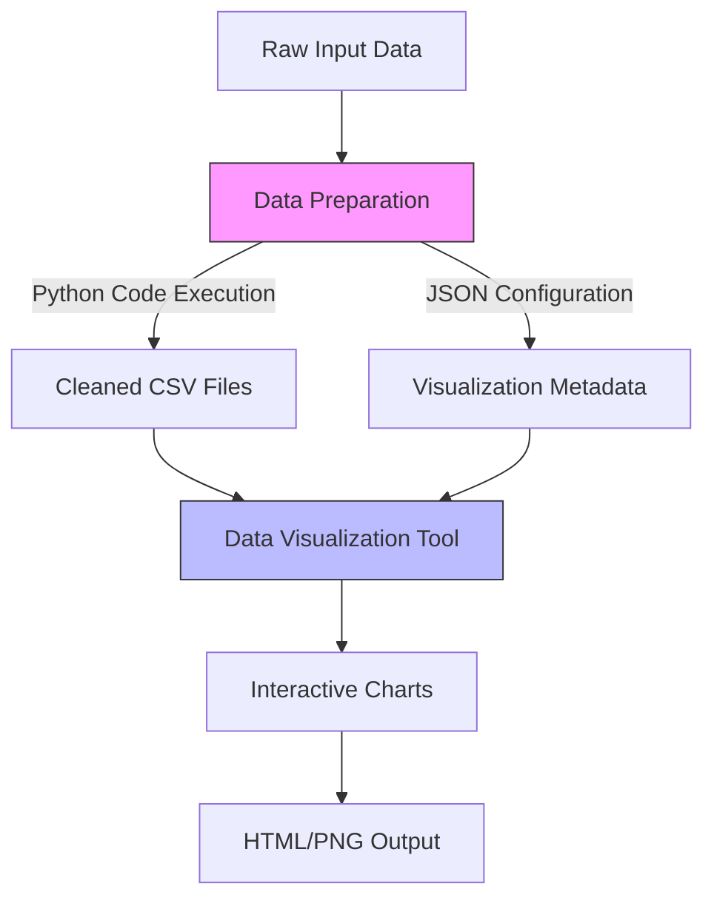
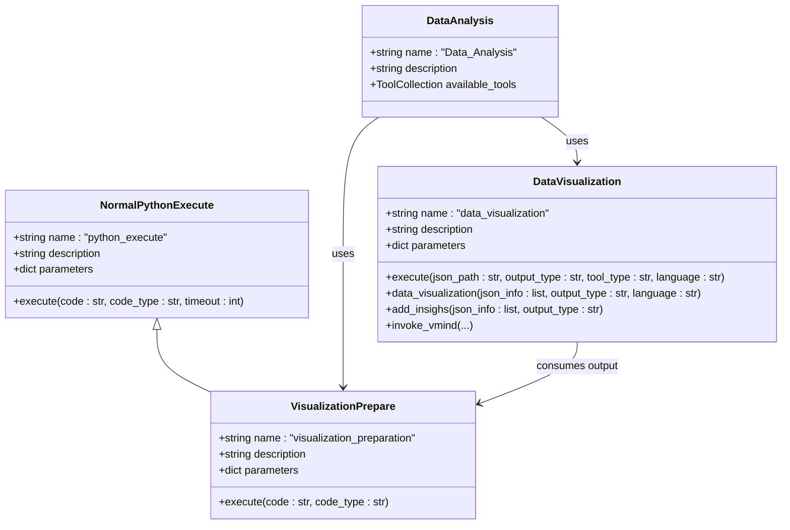
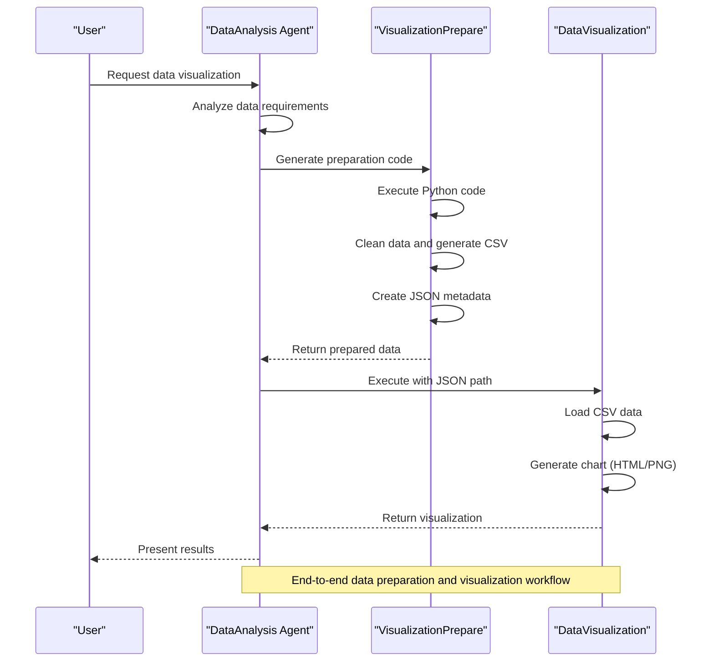

# Data Preparation

<cite>
**Referenced Files in This Document**   
- [chart_prepare.py](file://app/tool/chart_visualization/chart_prepare.py)
- [data_visualization.py](file://app/tool/chart_visualization/data_visualization.py)
- [python_execute.py](file://app/tool/chart_visualization/python_execute.py)
- [DataAnalysis](file://app/agent/data_analysis.py)
- [chart_demo.py](file://app/tool/chart_visualization/test/chart_demo.py)
- [README.md](file://app/tool/chart_visualization/README.md)
</cite>

## Table of Contents
1. [Introduction](#introduction)
2. [Data Preparation Workflow](#data-preparation-workflow)
3. [Core Components](#core-components)
4. [Data Sources and Parsing Strategies](#data-sources-and-parsing-strategies)
5. [Data Transformation and Normalization](#data-transformation-and-normalization)
6. [Integration with DataAnalysis Agent](#integration-with-dataanalysis-agent)
7. [Data Validation and Error Handling](#data-validation-and-error-handling)
8. [Performance Considerations](#performance-considerations)
9. [Debugging Common Data Parsing Issues](#debugging-common-data-parsing-issues)
10. [Code Examples](#code-examples)

## Introduction

The Data Preparation sub-feature in OpenManus is designed to transform raw input data into structured formats suitable for visualization. This process involves several key stages: data loading, type inference, missing value handling, data normalization, and metadata generation. The system leverages Python code execution to prepare data for visualization, creating cleaned CSV files and JSON configuration files that contain chart descriptions and file paths.

The data preparation workflow is orchestrated through the `VisualizationPrepare` class, which extends the `NormalPythonExecute` functionality to specifically handle visualization preparation tasks. This component works in conjunction with the `DataVisualization` tool to generate charts from prepared data. The entire process is designed to be flexible, supporting various data sources and transformation requirements while maintaining data integrity and structure.

**Section sources**
- [chart_prepare.py](file://app/tool/chart_visualization/chart_prepare.py#L1-L38)
- [data_visualization.py](file://app/tool/chart_visualization/data_visualization.py#L1-L50)

## Data Preparation Workflow

The data preparation workflow follows a structured process that transforms raw data into visualization-ready formats. The workflow begins with the `VisualizationPrepare` tool receiving input data and processing requirements. This tool executes Python code to perform data cleaning, transformation, and preparation tasks, ultimately generating two key outputs: cleaned CSV data files and a JSON configuration file containing metadata for visualization.

The workflow can be categorized into two primary modes based on the `code_type` parameter: "visualization" and "insight". In visualization mode, the system processes raw data to extract the necessary information for analysis, creates cleaned CSV files, and generates corresponding visualization descriptions. In insight mode, the system works with existing charts and data insights, selecting specific insights to add to charts as data annotations.

The prepared data and metadata are then passed to the `DataVisualization` tool, which uses the VMind library to generate actual visualizations. This separation of concerns allows for flexible data preparation independent of the visualization generation process, enabling reuse of prepared data for different visualization types or purposes.

**Diagram sources**
- [chart_prepare.py](file://app/tool/chart_visualization/chart_prepare.py#L1-L38)
- [data_visualization.py](file://app/tool/chart_visualization/data_visualization.py#L1-L50)

**Section sources**
- [chart_prepare.py](file://app/tool/chart_visualization/chart_prepare.py#L1-L38)
- [data_visualization.py](file://app/tool/chart_visualization/data_visualization.py#L1-L50)

## Core Components

The data preparation functionality is built around several core components that work together to transform raw data into visualization-ready formats. The primary component is the `VisualizationPrepare` class, which serves as the main interface for data preparation tasks. This class inherits from `NormalPythonExecute` and specializes in generating metadata for the data visualization tool.

The `VisualizationPrepare` component accepts Python code as input, which contains the logic for data loading, cleaning, transformation, and metadata generation. It outputs two primary artifacts: JSON information containing chart metadata and optionally cleaned CSV data files. The JSON output follows a specific format with fields like `csvFilePath` and `chartTitle` that are used by the subsequent visualization tool.

Complementing this is the `DataVisualization` component, which consumes the prepared data and metadata to generate actual visualizations. This component reads the JSON configuration file, loads the referenced CSV data, and invokes the VMind library to create charts in either HTML (interactive) or PNG (static) formats. The integration between these components is seamless, with the output of the preparation phase directly serving as input for the visualization phase.

**Diagram sources**
- [chart_prepare.py](file://app/tool/chart_visualization/chart_prepare.py#L1-L38)
- [data_visualization.py](file://app/tool/chart_visualization/data_visualization.py#L1-L264)
- [DataAnalysis](file://app/agent/data_analysis.py#L11-L36)

**Section sources**
- [chart_prepare.py](file://app/tool/chart_visualization/chart_prepare.py#L1-L38)
- [data_visualization.py](file://app/tool/chart_visualization/data_visualization.py#L1-L264)
- [python_execute.py](file://app/tool/chart_visualization/python_execute.py#L1-L37)

## Data Sources and Parsing Strategies

The data preparation system supports multiple data sources through flexible parsing strategies implemented in Python code. While the core framework doesn't directly specify data source types, it enables processing of various formats through the Python execution capability. The primary supported data sources include CSV files, JSON data, and Python variables, with the flexibility to handle other formats through custom code.

For CSV data, the system relies on pandas' `read_csv` function with UTF-8 encoding, as evidenced in the `data_visualization.py` file. This approach handles various CSV parsing requirements, including different delimiters, header configurations, and data type inference. The system processes CSV data by first loading it into a pandas DataFrame, then converting it to object type and handling null values by replacing them with None.

JSON data is processed through standard Python JSON libraries, with the system using `json.load` to parse configuration files and `json.dumps` to generate output. The data preparation phase can transform JSON data into tabular formats suitable for visualization by extracting relevant fields and structuring them appropriately.

Python variables and data structures can be directly processed within the execution environment, allowing for in-memory data manipulation and transformation. This capability enables the system to work with data from various sources, including database queries, API responses, and computational results.

The parsing strategy follows a consistent pattern: load the raw data, perform necessary cleaning and transformation operations, save the cleaned data to CSV format, and generate a JSON configuration file with metadata. This approach ensures that data is properly structured and validated before visualization, while maintaining a clear separation between data preparation and visualization concerns.

**Section sources**
- [data_visualization.py](file://app/tool/chart_visualization/data_visualization.py#L81-L123)
- [chart_prepare.py](file://app/tool/chart_visualization/chart_prepare.py#L1-L38)
- [README.md](file://app/tool/chart_visualization/README.md#L65-L105)

## Data Transformation and Normalization

Data transformation and normalization are critical aspects of the preparation process, ensuring that raw data is converted into formats suitable for effective visualization. The system implements several key transformation operations through Python code execution, including type inference, missing value handling, and data normalization.

Type inference is handled automatically by pandas when loading CSV data, with the system preserving the inferred types while ensuring consistency across the dataset. The code in `data_visualization.py` shows that data frames are explicitly converted to object type using `df.astype(object)`, which provides flexibility in handling mixed data types while maintaining data integrity.

Missing value handling is implemented through the `df.where(pd.notnull(df), None)` operation, which replaces null values with Python None objects. This approach ensures consistent handling of missing data across different visualization types and prevents potential issues with null value representation in charts. The transformation preserves the original data structure while making missing values explicit and manageable.

Data normalization processes include various cleaning and transformation operations that are defined in the Python code provided to the `VisualizationPrepare` tool. These operations can include scaling numerical values, encoding categorical variables, aggregating data, and reshaping data structures to better suit specific visualization requirements. The system allows for multiple CSV files to be generated from a single input, enabling different normalization strategies for different visualization needs.

The transformation process also includes metadata generation, where chart descriptions are created to provide context for the visualization. These descriptions should be concise and clear, following examples like "Product sales distribution" or "Monthly revenue trend". The metadata is saved in a JSON file with UTF-8 encoding, ensuring compatibility with international characters and special symbols.

**Section sources**
- [data_visualization.py](file://app/tool/chart_visualization/data_visualization.py#L81-L123)
- [chart_prepare.py](file://app/tool/chart_visualization/chart_prepare.py#L1-L38)

## Integration with DataAnalysis Agent

The data preparation functionality is tightly integrated with the DataAnalysis agent, which orchestrates the entire data analysis and visualization workflow. The DataAnalysis agent serves as the central coordinator, managing the interaction between data preparation, visualization, and other analytical tools.

In the agent's configuration, the `VisualizationPrepare` tool is included in the `available_tools` collection alongside other essential tools like `NormalPythonExecute`, `DataVisualization`, and `Terminate`. This integration allows the agent to seamlessly transition between data processing, preparation, and visualization phases based on the task requirements.

The workflow begins when the DataAnalysis agent receives a request that involves data visualization. The agent first uses general data processing tools to analyze and understand the data, then invokes the `VisualizationPrepare` tool to generate the necessary preparation code. This code is executed to produce cleaned CSV files and JSON metadata, which are then passed to the `DataVisualization` tool for chart generation.

The integration is demonstrated in the `chart_demo.py` test file, where the DataAnalysis agent is instantiated and used to process multiple visualization tasks. Each task provides a data description and raw data, which the agent processes through the preparation and visualization pipeline. This end-to-end integration enables automated data analysis workflows that can handle complex visualization requirements with minimal user intervention.

The agent's design follows a modular approach, allowing for easy extension and modification of the data preparation pipeline. New data sources, transformation operations, or visualization types can be incorporated by extending the existing components or adding new tools to the agent's toolkit.

**Diagram sources**
- [DataAnalysis](file://app/agent/data_analysis.py#L11-L36)
- [chart_prepare.py](file://app/tool/chart_visualization/chart_prepare.py#L1-L38)
- [data_visualization.py](file://app/tool/chart_visualization/data_visualization.py#L1-L50)
- [chart_demo.py](file://app/tool/chart_visualization/test/chart_demo.py#L1-L192)

**Section sources**
- [DataAnalysis](file://app/agent/data_analysis.py#L11-L36)
- [chart_demo.py](file://app/tool/chart_visualization/test/chart_demo.py#L1-L192)

## Data Validation and Error Handling

The data preparation system implements comprehensive validation and error handling mechanisms to ensure data integrity and provide meaningful feedback when issues occur. The error handling strategy is distributed across multiple components, with each layer responsible for validating its inputs and handling potential failures.

In the `DataVisualization` component, input validation begins with attempting to open and parse the JSON configuration file. If the file cannot be read or contains invalid JSON, an exception is caught and returned as an error observation. This early validation prevents downstream processing of corrupted or missing configuration data.

During data loading, the system uses pandas' `read_csv` function with explicit UTF-8 encoding, which helps prevent encoding-related errors. The code includes error handling for file not found scenarios, raising an exception if the specified CSV file does not exist in either the provided path or the workspace root directory.

The visualization execution process implements asynchronous error handling through try-catch blocks that capture exceptions during chart generation. When errors occur, they are collected in an `error_list` and returned alongside any successful results, allowing partial success in cases where some charts can be generated while others fail.

The system distinguishes between different types of errors, providing specific error messages for Node.js subprocess failures, JSON parsing errors, and general exceptions. This granular error reporting helps users diagnose and resolve issues more effectively. Error messages include context such as the affected file path, making it easier to identify the source of problems.

For data validation, the system relies on the structure of the JSON configuration file, which must contain required fields like `csvFilePath` and `chartTitle`. While the code doesn't implement extensive schema validation, the expected format is well-documented, and deviations typically result in clear error messages during processing.

**Section sources**
- [data_visualization.py](file://app/tool/chart_visualization/data_visualization.py#L195-L214)
- [data_visualization.py](file://app/tool/chart_visualization/data_visualization.py#L125-L145)
- [data_visualization.py](file://app/tool/chart_visualization/data_visualization.py#L145-L193)

## Performance Considerations

The data preparation system incorporates several performance considerations to handle datasets of varying sizes efficiently. For large datasets, the system leverages pandas' optimized data processing capabilities and asynchronous execution patterns to maximize performance.

The data loading process uses pandas' `read_csv` function, which is optimized for reading large CSV files efficiently. The system processes data in chunks when necessary, allowing for memory-efficient handling of datasets that exceed available RAM. The use of `df.astype(object)` and `df.where(pd.notnull(df), None)` operations are designed to be vectorized, minimizing processing time for large datasets.

Memory efficiency is further enhanced by the separation of data preparation and visualization phases. By generating cleaned CSV files during preparation, the system can release memory used for intermediate processing steps before moving to visualization. This approach prevents memory accumulation across multiple processing stages.

The visualization phase implements asynchronous processing through `asyncio.gather`, allowing multiple charts to be generated concurrently. This parallel processing capability significantly improves performance when generating multiple visualizations from prepared data. The use of subprocess execution for the VMind library also isolates memory usage, preventing potential memory leaks from affecting the main application.

For extremely large datasets, users can implement additional optimization strategies in their preparation code, such as data sampling, aggregation, or filtering to reduce dataset size before visualization. The system's flexibility allows for custom memory management techniques to be incorporated directly into the preparation logic.

The default output dimensions (1000x1000 pixels for PNG) are optimized for readability while maintaining reasonable file sizes. For web-based HTML output, charts fill the available space, adapting to different display contexts without requiring additional processing.

**Section sources**
- [data_visualization.py](file://app/tool/chart_visualization/data_visualization.py#L81-L123)
- [data_visualization.py](file://app/tool/chart_visualization/data_visualization.py#L125-L145)
- [README.md](file://app/tool/chart_visualization/README.md#L122-L147)

## Debugging Common Data Parsing Issues

When encountering data parsing issues in the preparation pipeline, several common problems and their solutions should be considered. These debugging tips address the most frequent challenges users may face when preparing data for visualization.

**Encoding Errors**: When processing CSV files with special characters or international text, ensure UTF-8 encoding is explicitly specified. The system defaults to UTF-8 encoding in the `read_csv` function, but source data with different encodings may require preprocessing to convert to UTF-8 before preparation.

**Schema Mismatches**: Ensure that the JSON configuration file matches the expected schema with required fields like `csvFilePath` and `chartTitle`. Schema issues often arise when the preparation code generates output in an incorrect format. Verify that the JSON file is properly structured and contains all required fields.

**Incorrect Data Typing**: Pandas automatically infers data types, but sometimes incorrect types are assigned (e.g., numeric data treated as strings). In the preparation code, explicitly specify data types using pandas' type conversion methods or use the `dtype` parameter in `read_csv` to ensure correct typing from the start.

**Missing Value Handling**: When null values cause issues in visualization, verify that the data preparation code properly handles missing values. The system replaces nulls with None, but additional preprocessing may be needed to impute or remove missing values depending on the visualization requirements.

**File Path Issues**: Ensure that file paths in the JSON configuration are correct and accessible. Relative paths should be relative to the workspace root, and absolute paths should be valid. The system checks both the provided path and the path relative to the workspace root to locate CSV files.

**Large Dataset Performance**: For very large datasets, consider implementing data sampling, aggregation, or filtering in the preparation code to reduce data volume before visualization. Extremely large datasets may exceed memory limits or cause performance issues during rendering.

**Python Code Errors**: Since data preparation relies on executing Python code, syntax errors or logical issues in the preparation code will prevent successful data processing. Test preparation code independently before integrating it into the visualization pipeline.

By addressing these common issues, users can ensure smooth data preparation and successful visualization generation.

**Section sources**
- [data_visualization.py](file://app/tool/chart_visualization/data_visualization.py#L81-L123)
- [chart_prepare.py](file://app/tool/chart_visualization/chart_prepare.py#L1-L38)
- [README.md](file://app/tool/chart_visualization/README.md#L65-L105)

## Code Examples

The system provides several code examples that demonstrate how to transform real-world datasets into visualization-ready formats. These examples illustrate the complete workflow from raw data to generated charts.

The `chart_demo.py` file contains multiple test cases that showcase different visualization scenarios. Each example follows the same pattern: defining raw data as a CSV string, creating a prompt for the desired visualization, and processing the data through the DataAnalysis agent. The examples cover various chart types including bar charts, line charts, scatter plots, and specialized visualizations like Sankey diagrams and radar charts.

For instance, one example demonstrates sales data visualization across different products and regions, while another shows market share comparison with multiple metrics. The examples also include time series data, keyword popularity, and performance metrics, illustrating the system's versatility in handling different data structures and visualization requirements.

These examples serve as templates for creating custom visualizations, showing how to structure data, write effective chart descriptions, and integrate the preparation and visualization tools. The test cases can be executed directly using the provided commands, making it easy to verify the system's functionality and adapt the examples for specific use cases.

**Section sources**
- [chart_demo.py](file://app/tool/chart_visualization/test/chart_demo.py#L1-L192)
- [README.md](file://app/tool/chart_visualization/README.md#L122-L147)