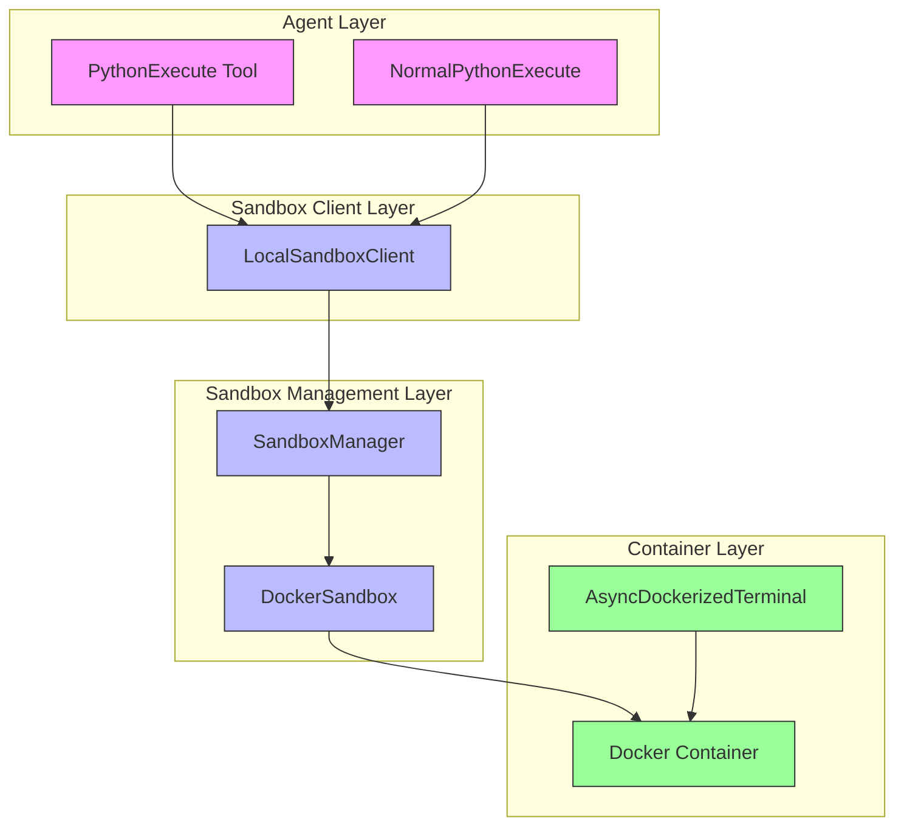
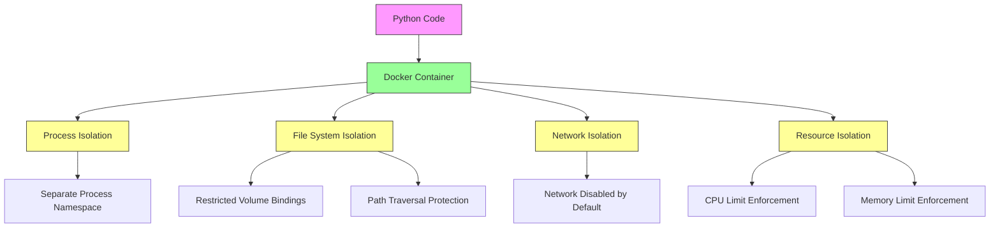
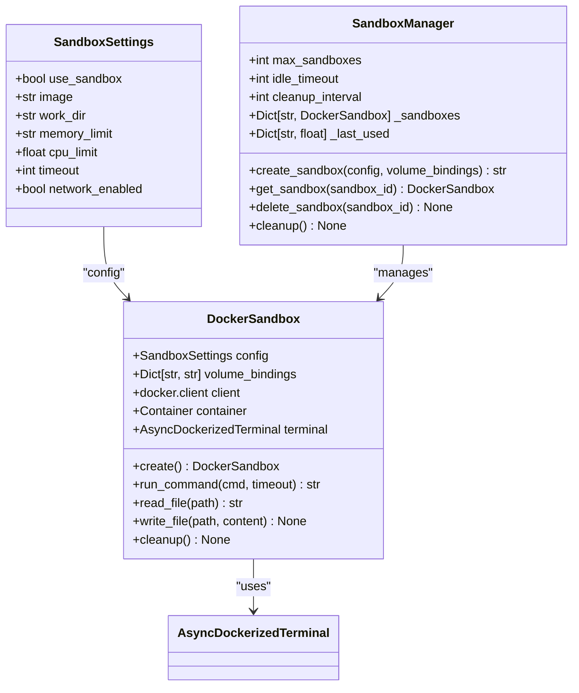
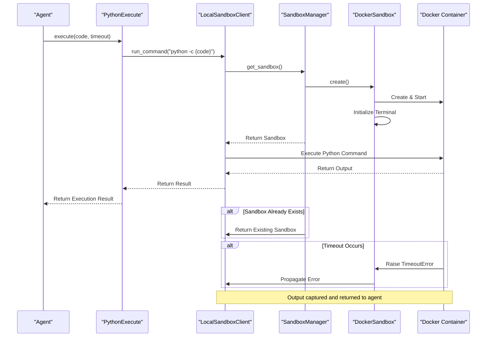
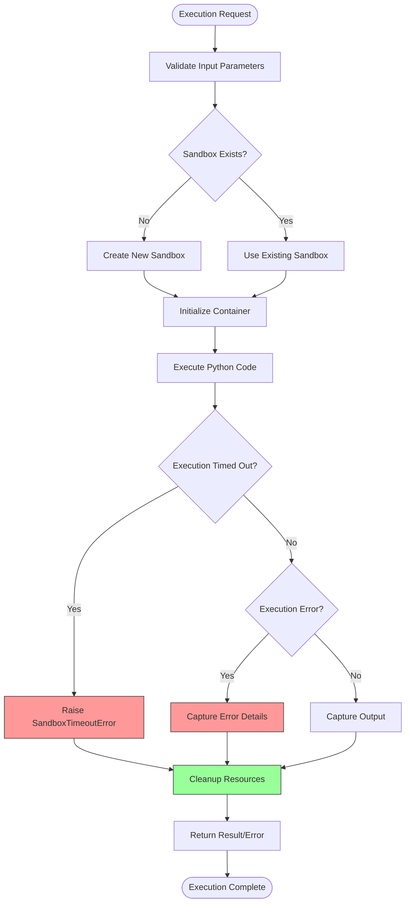

# Sandboxed Code Execution

<cite>
**Referenced Files in This Document**   
- [python_execute.py](file://app/tool/python_execute.py)
- [NormalPythonExecute.py](file://app/tool/chart_visualization/python_execute.py)
- [DockerSandbox.py](file://app/sandbox/core/sandbox.py)
- [SandboxManager.py](file://app/sandbox/core/manager.py)
- [SandboxSettings.py](file://app/config.py)
- [LocalSandboxClient.py](file://app/sandbox/client.py)
- [AsyncDockerizedTerminal.py](file://app/sandbox/core/terminal.py)
- [SandboxError.py](file://app/sandbox/core/exceptions.py)
</cite>

## Table of Contents
1. [Introduction](#introduction)
2. [Architecture Overview](#architecture-overview)
3. [Core Components](#core-components)
4. [Isolation Mechanisms](#isolation-mechanisms)
5. [Resource Limits and Configuration](#resource-limits-and-configuration)
6. [Execution Flow](#execution-flow)
7. [Error Handling and Timeout Management](#error-handling-and-timeout-management)
8. [Dependency Management](#dependency-management)
9. [Best Practices for Sandbox-Compatible Code](#best-practices-for-sandbox-compatible-code)
10. [Performance Trade-offs](#performance-trade-offs)
11. [Troubleshooting Guide](#troubleshooting-guide)

## Introduction
The Sandboxed Code Execution system provides a secure environment for running data analysis scripts through the `python_execute.py` tool. This system leverages Docker containerization to isolate code execution, preventing potential security risks while allowing controlled execution of Python scripts for data analysis tasks. The sandbox ensures that all code runs in a restricted environment with defined resource limits, network policies, and file system access controls. This documentation details the architecture, security mechanisms, configuration options, and best practices for using this secure execution environment.

## Architecture Overview
The sandboxed code execution system follows a layered architecture that separates the execution tool from the underlying container management infrastructure. The system uses Docker containers to provide process and file system isolation, with a manager component handling lifecycle operations and resource allocation.

**Diagram sources**
- [python_execute.py](file://app/tool/python_execute.py)
- [LocalSandboxClient.py](file://app/sandbox/client.py)
- [SandboxManager.py](file://app/sandbox/core/manager.py)
- [DockerSandbox.py](file://app/sandbox/core/sandbox.py)

**Section sources**
- [python_execute.py](file://app/tool/python_execute.py)
- [SandboxManager.py](file://app/sandbox/core/manager.py)

## Core Components
The sandboxed execution system consists of several interconnected components that work together to provide secure code execution. The `PythonExecute` tool serves as the entry point for executing Python code, while the `DockerSandbox` class manages the containerized execution environment. The `SandboxManager` handles multiple sandbox instances and their lifecycle, ensuring proper resource management and cleanup.

The `LocalSandboxClient` acts as an interface between the execution tool and the sandbox manager, abstracting the underlying container operations. The `AsyncDockerizedTerminal` provides an asynchronous interface for executing commands within the container, while the `SandboxSettings` configuration class defines the security and resource parameters for the sandbox environment.

**Section sources**
- [python_execute.py](file://app/tool/python_execute.py)
- [DockerSandbox.py](file://app/sandbox/core/sandbox.py)
- [SandboxManager.py](file://app/sandbox/core/manager.py)
- [LocalSandboxClient.py](file://app/sandbox/client.py)
- [SandboxSettings.py](file://app/config.py)

## Isolation Mechanisms
The sandbox system implements multiple layers of isolation to ensure secure code execution. Each Python script runs within a dedicated Docker container based on the `python:3.12-slim` image, providing process and file system isolation from the host system. The container runs with a restricted set of capabilities and cannot access the host file system except through explicitly defined volume bindings.

Network isolation is enforced by default, with containers running in a network-isolated mode (`network_mode="none"`). This prevents executed code from making external network connections unless explicitly enabled in the configuration. The file system access is further restricted through path resolution validation that prevents directory traversal attacks by checking for ".." patterns in file paths.

Process isolation is maintained through Docker's containerization technology, ensuring that any processes spawned by the executed code remain confined within the container boundary. The sandbox also implements resource-based isolation by limiting CPU and memory usage, preventing any single execution from consuming excessive system resources.

**Diagram sources**
- [DockerSandbox.py](file://app/sandbox/core/sandbox.py#L48-L102)
- [SandboxSettings.py](file://app/config.py#L120-L135)

## Resource Limits and Configuration
The sandbox system provides configurable resource limits to control the execution environment. These limits are defined in the `SandboxSettings` class and can be customized through the application configuration. The default configuration establishes reasonable limits to balance security and functionality.

CPU and memory limits are enforced at the container level using Docker's resource constraint mechanisms. The CPU limit is specified as a floating-point value representing the proportion of a single CPU core available to the container, while the memory limit is defined as a string with units (e.g., "512m" for 512 megabytes). These limits prevent resource exhaustion attacks and ensure fair resource distribution among concurrent executions.

The system also enforces execution timeouts, with a default timeout of 300 seconds (5 minutes) for command execution. This timeout can be overridden for specific operations but provides a safety net against infinite loops or long-running processes. The sandbox manager additionally enforces an idle timeout of 3600 seconds (1 hour), after which inactive sandboxes are automatically cleaned up.

**Diagram sources**
- [SandboxSettings.py](file://app/config.py#L120-L135)
- [DockerSandbox.py](file://app/sandbox/core/sandbox.py)
- [SandboxManager.py](file://app/sandbox/core/manager.py)

**Section sources**
- [SandboxSettings.py](file://app/config.py#L120-L135)
- [DockerSandbox.py](file://app/sandbox/core/sandbox.py#L48-L102)
- [SandboxManager.py](file://app/sandbox/core/manager.py#L13-L312)

## Execution Flow
The code execution process follows a well-defined sequence of operations that ensures proper sandbox initialization, code execution, and resource cleanup. When a Python script execution is requested, the system first ensures that a sandbox environment is available, creating one if necessary through the `SandboxManager`.

**Diagram sources**
- [python_execute.py](file://app/tool/python_execute.py#L45-L75)
- [LocalSandboxClient.py](file://app/sandbox/client.py#L100-L145)
- [DockerSandbox.py](file://app/sandbox/core/sandbox.py#L48-L102)

**Section sources**
- [python_execute.py](file://app/tool/python_execute.py#L45-L75)
- [LocalSandboxClient.py](file://app/sandbox/client.py#L100-L145)

## Error Handling and Timeout Management
The sandbox system implements comprehensive error handling and timeout management to ensure reliable execution and proper resource cleanup. When a Python script execution exceeds the specified timeout, the system raises a `SandboxTimeoutError` which is propagated back to the calling agent. This timeout mechanism prevents infinite loops and long-running processes from consuming system resources indefinitely.

The error handling system distinguishes between different types of failures, including execution errors, resource limitations, and system-level issues. All exceptions are caught and wrapped in appropriate exception types that provide meaningful error messages while maintaining system stability. The `SandboxError` hierarchy includes specific exception types for different failure modes, allowing for targeted error handling.

Resource cleanup is a critical aspect of error handling, with the system ensuring that all sandbox resources are properly released even when errors occur. The `cleanup()` method is called in a finally block to guarantee execution, removing containers, closing network connections, and releasing other resources regardless of whether the operation succeeded or failed.

**Diagram sources**
- [DockerSandbox.py](file://app/sandbox/core/sandbox.py#L139-L163)
- [exceptions.py](file://app/sandbox/core/exceptions.py)
- [python_execute.py](file://app/tool/python_execute.py#L45-L75)

**Section sources**
- [DockerSandbox.py](file://app/sandbox/core/sandbox.py#L139-L163)
- [exceptions.py](file://app/sandbox/core/exceptions.py)
- [python_execute.py](file://app/tool/python_execute.py#L45-L75)

## Dependency Management
The sandbox system handles dependencies through the underlying Docker container environment. Since each sandbox runs in a container based on the `python:3.12-slim` image, it includes Python 3.12 and pip by default, allowing for package installation during execution. However, any installed packages are ephemeral and do not persist beyond the lifecycle of the container.

For data analysis tasks, the system supports installing required packages using pip within the execution environment. The `NormalPythonExecute` class, which extends the base `PythonExecute` tool, is specifically designed for data analysis tasks and can handle package installation as needed. However, network access must be enabled in the sandbox configuration for package installation to succeed, as pip requires internet connectivity to download packages.

The system does not support persistent dependency management across executions, as each sandbox is isolated and typically short-lived. For applications requiring consistent dependency environments, it is recommended to use a custom Docker image with pre-installed packages rather than installing them during execution. This approach improves performance and ensures consistency across executions.

**Section sources**
- [python_execute.py](file://app/tool/python_execute.py)
- [NormalPythonExecute.py](file://app/tool/chart_visualization/python_execute.py)
- [SandboxSettings.py](file://app/config.py#L120-L135)

## Best Practices for Sandbox-Compatible Code
To ensure successful execution within the sandbox environment, code should follow several best practices. First, all output should be directed to stdout using print statements, as the sandbox captures only stdout output and does not return function return values. This is particularly important for data analysis scripts that need to display results or intermediate calculations.

Code should be designed to complete within the execution timeout limit, typically 5 minutes by default. Long-running operations should be broken into smaller steps, and progress should be reported regularly through print statements. When file operations are needed, code should use the designated workspace directory and avoid hardcoded paths that might not exist in the container environment.

Network-dependent operations should be avoided unless network access is explicitly enabled in the sandbox configuration. For data analysis tasks, it's recommended to upload required data files to the workspace before execution rather than attempting to download them during execution. Additionally, code should handle potential resource limitations gracefully, avoiding memory-intensive operations that might exceed the configured memory limits.

**Section sources**
- [python_execute.py](file://app/tool/python_execute.py)
- [NormalPythonExecute.py](file://app/tool/chart_visualization/python_execute.py)
- [DockerSandbox.py](file://app/sandbox/core/sandbox.py)

## Performance Trade-offs
The sandboxed execution system involves several performance trade-offs between security and execution speed. The containerization overhead adds latency to the execution process, as each execution requires container creation, initialization, and cleanup. This overhead is most noticeable for short-running scripts, where the container management time may exceed the actual code execution time.

Resource limits, while essential for security, can impact performance by restricting CPU and memory availability. The CPU limit of 1.0 by default means that a script can use at most one full CPU core, which may slow down CPU-intensive data analysis operations. Similarly, the 512MB memory limit constrains the size of datasets that can be processed in memory.

Network isolation improves security but prevents direct internet access, requiring data to be pre-loaded into the workspace. This adds setup time but eliminates the risk of unauthorized network communications. The trade-off between security and convenience is managed through configurable settings that allow administrators to adjust limits based on their specific requirements and risk tolerance.

**Section sources**
- [SandboxSettings.py](file://app/config.py#L120-L135)
- [DockerSandbox.py](file://app/sandbox/core/sandbox.py#L48-L102)
- [SandboxManager.py](file://app/sandbox/core/manager.py#L13-L312)

## Troubleshooting Guide
When encountering issues with sandboxed code execution, several common problems should be checked. Timeout errors typically indicate that a script is running longer than the allowed 300-second limit and should be optimized or broken into smaller steps. File not found errors may result from incorrect paths or missing file uploads to the workspace directory.

Permission errors are unlikely in the sandbox environment due to the root user execution context, but could occur if attempting to access restricted system directories. Network-related errors will occur if network access is disabled in the sandbox configuration and the code attempts to make external connections. In such cases, either enable network access in the configuration or modify the code to work with locally available data.

Resource exhaustion errors may occur if a script exceeds the configured memory limit of 512MB. This can be addressed by optimizing memory usage, processing data in chunks, or increasing the memory limit in the configuration. If container creation fails, it may indicate Docker daemon issues or insufficient system resources, requiring system-level troubleshooting.

**Section sources**
- [DockerSandbox.py](file://app/sandbox/core/sandbox.py)
- [exceptions.py](file://app/sandbox/core/exceptions.py)
- [python_execute.py](file://app/tool/python_execute.py)