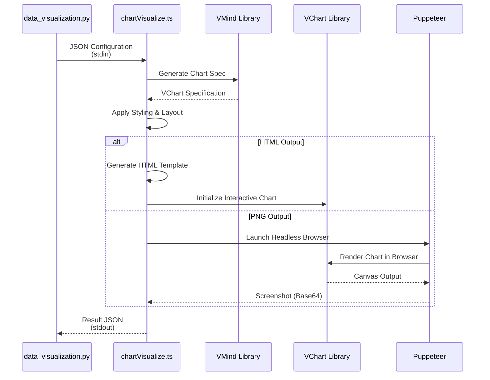

# Visualization Rendering

<cite>
**Referenced Files in This Document**   
- [data_visualization.py](file://app/tool/chart_visualization/data_visualization.py)
- [chartVisualize.ts](file://app/tool/chart_visualization/src/chartVisualize.ts)
- [chart_prepare.py](file://app/tool/chart_visualization/chart_prepare.py)
- [package.json](file://app/tool/chart_visualization/package.json)
</cite>

## Table of Contents
1. [Introduction](#introduction)
2. [Data Flow Overview](#data-flow-overview)
3. [Backend: Data Visualization Configuration Generation](#backend-data-visualization-configuration-generation)
4. [Frontend: Interactive Chart Rendering](#frontend-interactive-chart-rendering)
5. [Supported Chart Types and Features](#supported-chart-types-and-features)
6. [Styling and Responsive Design](#styling-and-responsive-design)
7. [Multi-Series and Custom Visualizations](#multi-series-and-custom-visualizations)
8. [Data Serialization and Event Handling](#data-serialization-and-event-handling)
9. [Accessibility and Cross-Platform Compatibility](#accessibility-and-cross-platform-compatibility)
10. [Troubleshooting and Performance Optimization](#troubleshooting-and-performance-optimization)

## Introduction
The Visualization Rendering sub-feature enables dynamic generation and interactive display of data visualizations through a coordinated backend (Python) and frontend (TypeScript) system. The architecture leverages the `data_visualization.py` module to generate chart configurations and `chartVisualize.ts` to render interactive visualizations using the VisActor VChart and VMind libraries. This system supports multiple output formats (PNG and HTML), provides automated insights, and enables rich interactive experiences for data exploration.

## Data Flow Overview
The visualization pipeline follows a structured workflow from data preparation to final rendering. First, the `visualization_preparation` tool processes raw data and generates JSON configuration files. Then, the `DataVisualization` class in `data_visualization.py` orchestrates the chart generation process by invoking the TypeScript-based `chartVisualize.ts` script through a subprocess. The generated charts are saved in the visualization directory with appropriate metadata and insights.

```mermaid
flowchart TD
A[Raw Data] --> B[visualization_preparation]
B --> C[JSON Configuration]
C --> D[data_visualization.py]
D --> E[chartVisualize.ts]
E --> F[Chart Output<br>(PNG/HTML)]
E --> G[Insights Markdown]
F --> H[Frontend Display]
G --> I[Analysis Integration]
```

**Diagram sources**
- [data_visualization.py](file://app/tool/chart_visualization/data_visualization.py)
- [chartVisualize.ts](file://app/tool/chart_visualization/src/chartVisualize.ts)
- [chart_prepare.py](file://app/tool/chart_visualization/chart_prepare.py)

## Backend: Data Visualization Configuration Generation

The `DataVisualization` class in `data_visualization.py` serves as the primary interface for chart generation. It accepts JSON configuration files containing data paths and visualization parameters, processes CSV data using pandas, and converts it to JSON format for transmission to the frontend rendering engine. The class supports two primary modes: "visualization" for generating new charts and "insight" for enhancing existing charts with analytical insights.

The backend handles file path resolution, data validation, and error management throughout the visualization pipeline. It uses asynchronous processing to handle multiple chart generation tasks concurrently, improving overall system performance. The `invoke_vmind` method establishes communication with the TypeScript rendering engine through stdin/stdout, passing configuration parameters in JSON format.

**Section sources**
- [data_visualization.py](file://app/tool/chart_visualization/data_visualization.py#L14-L262)

## Frontend: Interactive Chart Rendering

The `chartVisualize.ts` script implements the frontend rendering logic using the VisActor VChart and VMind libraries. It receives configuration data through stdin, processes it to generate appropriate chart specifications, and renders the final visualization using Puppeteer for PNG output or direct HTML embedding for interactive charts.

The rendering process involves several key steps: parsing input configuration, generating chart specifications through VMind, applying styling and layout parameters, and saving the output in the requested format. For HTML output, the script generates a complete HTML document with embedded JavaScript to initialize and render the VChart instance. For PNG output, it uses Puppeteer to capture screenshots of the rendered chart.



**Diagram sources**
- [chartVisualize.ts](file://app/tool/chart_visualization/src/chartVisualize.ts#L171-L369)

## Supported Chart Types and Features

The visualization system supports a comprehensive range of chart types through the underlying VChart library, including:

- Bar charts (single, grouped, stacked)
- Line charts (single, multi-series, area)
- Pie and donut charts
- Scatter plots
- Dual-axis charts
- Radar charts
- Sankey diagrams
- Flow charts

The system automatically selects appropriate chart types based on the data structure and user prompt through the VMind intelligence layer. For time-series data, line charts are preferred, while categorical comparisons typically generate bar charts. The system also supports automatic insight generation for compatible chart types, including trend detection, correlation analysis, outlier identification, and statistical summaries.

**Section sources**
- [chartVisualize.ts](file://app/tool/chart_visualization/src/chartVisualize.ts#L171-L285)

## Styling and Responsive Design

The visualization system implements responsive design principles to ensure optimal display across different devices and screen sizes. Charts automatically adapt to their container dimensions, with HTML outputs filling the available space by default. The system supports custom width and height parameters for precise control over chart dimensions.

Styling follows a consistent theme-based approach with the default "light" theme. The VChart library provides extensive styling options that can be configured through the chart specification, including color schemes, font settings, axis styling, and legend positioning. The system preserves these styling options through the serialization process, ensuring consistent appearance across different output formats.

For mobile responsiveness, the system implements touch-friendly interactions and optimized layouts that prioritize readability on smaller screens. Interactive elements are sized appropriately for touch input, and navigation controls are positioned for easy access.

**Section sources**
- [chartVisualize.ts](file://app/tool/chart_visualization/src/chartVisualize.ts#L171-L285)

## Multi-Series and Custom Visualizations

The system supports complex multi-series charts through proper data formatting and configuration. When multiple data series are present in the input data, the system automatically generates appropriate chart types that can display comparative information. The data structure expects records in JSON format with consistent field names across all series.

Custom visual properties such as colors, labels, and tooltips can be specified through the VMind configuration parameters. The system allows customization of:

- Color palettes for different data series
- Axis labels and formatting
- Tooltip content and styling
- Legend appearance and position
- Title and subtitle text
- Grid lines and background styling

These customizations are applied during the chart specification generation phase and preserved through the rendering process.

**Section sources**
- [data_visualization.py](file://app/tool/chart_visualization/data_visualization.py#L14-L262)
- [chartVisualize.ts](file://app/tool/chart_visualization/src/chartVisualize.ts#L171-L285)

## Data Serialization and Event Handling

The communication between Python backend and TypeScript frontend occurs through JSON serialization over standard input/output streams. The `data_visualization.py` module serializes configuration parameters into JSON format and passes them to the `chartVisualize.ts` script via stdin. The response is captured from stdout and parsed back into Python data structures.

The serialization process handles complex data types including:
- Dataset arrays in JSON format
- Configuration objects with nested properties
- Function serialization through string representation
- Binary data (Base64-encoded images)

For interactive HTML charts, the system implements event handling through the VChart library's built-in event system. Users can interact with charts through mouse and touch events, including:
- Data point selection and highlighting
- Tooltip display on hover
- Zoom and pan navigation
- Legend item toggling
- Drill-down capabilities

These interactions are handled client-side within the generated HTML, providing responsive feedback without requiring server communication.

**Section sources**
- [data_visualization.py](file://app/tool/chart_visualization/data_visualization.py#L247-L262)
- [chartVisualize.ts](file://app/tool/chart_visualization/src/chartVisualize.ts#L323-L369)

## Accessibility and Cross-Platform Compatibility

The visualization system prioritizes accessibility and cross-browser compatibility. HTML outputs are designed to work across modern browsers including Chrome, Firefox, Safari, and Edge. The system uses standard web technologies (HTML5, CSS3, JavaScript) to ensure broad compatibility.

Accessibility features include:
- Semantic HTML structure for screen readers
- Keyboard navigation support
- Sufficient color contrast
- Alternative text for visual elements
- ARIA labels for interactive components

The system also supports multiple languages (English and Chinese) through the language parameter, enabling internationalization of chart labels and insights. The responsive design ensures usability on mobile devices, tablets, and desktop computers.

**Section sources**
- [data_visualization.py](file://app/tool/chart_visualization/data_visualization.py#L20-L25)
- [chartVisualize.ts](file://app/tool/chart_visualization/src/chartVisualize.ts#L246-L246)

## Troubleshooting and Performance Optimization

Common issues and their solutions:

1. **Missing Dependencies**: Ensure Node.js (>=18) and required npm packages are installed. Run `npm install` in the chart_visualization directory.

2. **File Path Errors**: Verify that JSON configuration files and CSV data files exist at the specified paths. The system checks both absolute paths and paths relative to the workspace root.

3. **Rendering Failures**: Check the stderr output from the Node.js subprocess for detailed error messages. Common causes include invalid JSON input or network issues with LLM services.

4. **Performance Issues**: For large datasets, consider sampling the data or using aggregation to reduce the number of data points. The system may experience delays with very large datasets due to the LLM processing requirements.

Performance optimization strategies include:
- Caching frequently used charts
- Using PNG output for static visualizations instead of interactive HTML
- Limiting the number of concurrent visualization tasks
- Pre-processing large datasets to reduce complexity
- Implementing lazy loading for multiple charts on a single page

The system logs detailed information about each visualization attempt, including success/failure status and error messages, which can be used for debugging and performance monitoring.

**Section sources**
- [data_visualization.py](file://app/tool/chart_visualization/data_visualization.py#L14-L262)
- [chartVisualize.ts](file://app/tool/chart_visualization/src/chartVisualize.ts#L171-L369)