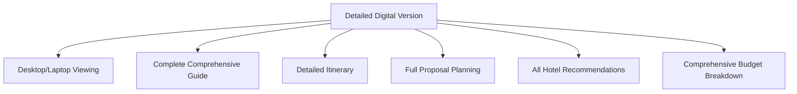
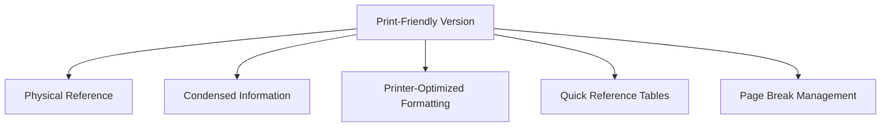
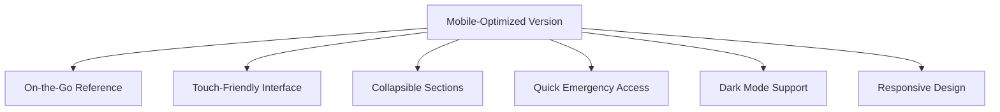
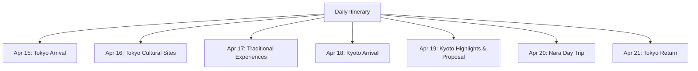
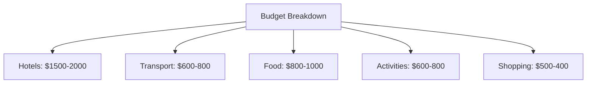
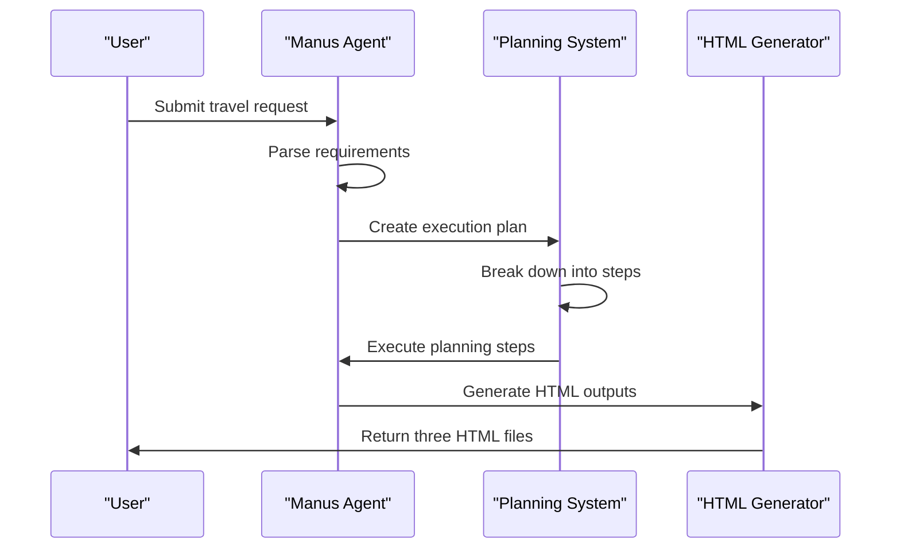

# Japan Travel Planning Example

<cite>
**Referenced Files in This Document**   
- [japan_travel_guide_instructions.txt](file://examples/use_case/japan-travel-plan/japan_travel_guide_instructions.txt)
- [japan_travel_handbook.html](file://examples/use_case/japan-travel-plan/japan_travel_handbook.html)
- [japan_travel_handbook_mobile.html](file://examples/use_case/japan-travel-plan/japan_travel_handbook_mobile.html)
- [japan_travel_handbook_print.html](file://examples/use_case/japan-travel-plan/japan_travel_handbook_print.html)
- [readme.md](file://examples/use_case/readme.md)
- [manus.py](file://app/agent/manus.py)
- [planning.py](file://app/flow/planning.py)
</cite>

## Table of Contents
1. [Introduction](#introduction)
2. [Multi-Format Travel Handbook Generation](#multi-format-travel-handbook-generation)
3. [Content Structure and Components](#content-structure-and-components)
4. [Workflow from Prompt to HTML Output](#workflow-from-prompt-to-html-output)
5. [Best Practices for Travel Planning Requests](#best-practices-for-travel-planning-requests)
6. [Customization Options](#customization-options)
7. [Troubleshooting Guide](#troubleshooting-guide)

## Introduction

The Japan Travel Planning Example demonstrates a comprehensive system for generating multi-format travel handbooks for a trip to Japan from April 15-23, 2024. The system creates three distinct versions of the travel handbook tailored for different usage scenarios: a detailed digital version, a print-friendly version, and a mobile-optimized version. This documentation explains how the system produces these versions, detailing the content structure, workflow, and best practices for creating effective travel planning requests.

The system is designed to provide travelers with comprehensive information including itinerary planning, hotel recommendations, budget breakdown, and emergency information. The example showcases how a single travel planning request can be transformed into multiple output formats, each optimized for specific use cases and devices.

**Section sources**
- [japan_travel_guide_instructions.txt](file://examples/use_case/japan-travel-plan/japan_travel_guide_instructions.txt)
- [readme.md](file://examples/use_case/readme.md)

## Multi-Format Travel Handbook Generation

The system generates three distinct versions of the travel handbook, each optimized for different usage scenarios and devices. This multi-format approach ensures that travelers have access to the information they need in the most appropriate format for their current situation.

### Detailed Digital Version

The detailed digital version (japan_travel_handbook.html) is designed for desktop and laptop viewing, providing a comprehensive guide with complete information. This version includes:

- Complete itinerary with detailed descriptions
- Full proposal planning section with security considerations
- All hotel recommendations with detailed information
- Comprehensive budget breakdown
- Extensive travel tips and cultural information

This version is intended for in-depth trip planning and detailed reference before and during the trip. It contains the most comprehensive information of all three versions, making it ideal for thorough preparation.

**Diagram sources**
- [japan_travel_handbook.html](file://examples/use_case/japan-travel-plan/japan_travel_handbook.html)

### Print-Friendly Version

The print-friendly version (japan_travel_handbook_print.html) is optimized for physical reference during travel. This version features:

- Condensed essential information
- Printer-friendly formatting with appropriate margins and font sizes
- Clear, easy-to-read tables for quick reference
- Page break markers to ensure logical content separation
- Avoidance of background colors and images that would waste ink

This version is designed to be printed and kept with travel documents, providing a reliable backup when digital devices are unavailable or impractical to use. The formatting prioritizes readability and efficient use of paper.

**Diagram sources**
- [japan_travel_handbook_print.html](file://examples/use_case/japan-travel-plan/japan_travel_handbook_print.html)

### Mobile-Optimized Version

The mobile-optimized version (japan_travel_handbook_mobile.html) is designed for on-the-go reference during the trip. This version includes:

- Touch-friendly interface with appropriately sized buttons and links
- Collapsible sections to conserve screen space
- Quick access emergency buttons for immediate access to critical information
- Dark mode support for better visibility in low-light conditions
- Responsive design that adapts to different screen sizes
- Horizontal scrolling for tables to accommodate narrow screens

This version is intended to be saved to a phone's browser bookmarks for quick access throughout the trip. The design prioritizes ease of use and quick information retrieval in various travel situations.

**Diagram sources**
- [japan_travel_handbook_mobile.html](file://examples/use_case/japan-travel-plan/japan_travel_handbook_mobile.html)

**Section sources**
- [japan_travel_guide_instructions.txt](file://examples/use_case/japan-travel-plan/japan_travel_guide_instructions.txt)
- [japan_travel_handbook.html](file://examples/use_case/japan-travel-plan/japan_travel_handbook.html)
- [japan_travel_handbook_mobile.html](file://examples/use_case/japan-travel-plan/japan_travel_handbook_mobile.html)
- [japan_travel_handbook_print.html](file://examples/use_case/japan-travel-plan/japan_travel_handbook_print.html)

## Content Structure and Components

The travel handbook contains several key components that provide comprehensive information for the trip. Each component is present across all three versions, though the level of detail and presentation format varies according to the target medium.

### Itinerary Planning

The itinerary covers the 7-day trip from April 15-23, 2024, with a detailed day-by-day breakdown of activities. The itinerary includes:

- **April 15**: Arrival in Tokyo, Shinjuku area exploration
- **April 16**: Meiji Shrine, Harajuku, Senso-ji, Skytree
- **April 17**: Tea Ceremony, Budokan, Yanaka Ginza
- **April 18**: Travel to Kyoto, Kinkaku-ji, Gion
- **April 19**: Fushimi Inari, Arashiyama, Evening Proposal
- **April 20**: Nara Park day trip, deer feeding
- **April 21**: Return to Tokyo, bay cruise

The itinerary is presented in table format in the print and mobile versions for quick reference, while the digital version includes more detailed descriptions of each activity.

**Diagram sources**
- [japan_travel_handbook_print.html](file://examples/use_case/japan-travel-plan/japan_travel_handbook_print.html#L95-L109)
- [japan_travel_handbook_mobile.html](file://examples/use_case/japan-travel-plan/japan_travel_handbook_mobile.html#L160-L174)

### Hotel Recommendations

The handbook includes recommendations for accommodations in both Tokyo and Kyoto, with considerations for proximity to key attractions and transportation hubs. The digital version provides more detailed information about each hotel, including amenities, room types, and guest reviews, while the print and mobile versions focus on essential information such as location, price range, and contact details.

### Budget Breakdown

The budget breakdown covers the $2500-5000 budget range for two people, with allocations for:

- Hotels: $1500-2000
- Transport: $600-800 (including JR Pass)
- Food: $800-1000 (~$60/person/day)
- Activities: $600-800 (including tea ceremony)
- Shopping: $500-400 (souvenirs/gifts)

The budget is presented in table format across all versions, with the digital version including additional tips for saving money and finding value.

**Diagram sources**
- [japan_travel_handbook_print.html](file://examples/use_case/japan-travel-plan/japan_travel_handbook_print.html#L145-L158)
- [japan_travel_handbook_mobile.html](file://examples/use_case/japan-travel-plan/japan_travel_handbook_mobile.html#L215-L229)

### Emergency Information

All versions include critical emergency information:

- Emergency in Japan: 119 (Ambulance/Fire) / 110 (Police)
- US Embassy Tokyo: +81-3-3224-5000
- Tourist Information Hotline: 03-3201-3331
- Travel insurance contact information

The mobile version features quick-access emergency buttons for immediate access to this information, while the print version ensures this information is readily available even without battery or connectivity.

### Proposal Planning

A special section is dedicated to planning the marriage proposal, including:

- Ring security and transport tips
- Airport security considerations
- Specific location recommendations (Maruyama Park as primary, Gion Shirakawa as backup)
- Detailed timeline for April 19
- Celebration dinner options (Kikunoi Roan, The Sodoh)
- Backup plans for inclement weather

This section is particularly detailed in the digital version, which includes comprehensive advice on maintaining the surprise and handling potential complications.

**Section sources**
- [japan_travel_handbook.html](file://examples/use_case/japan-travel-plan/japan_travel_handbook.html)
- [japan_travel_handbook_mobile.html](file://examples/use_case/japan-travel-plan/japan_travel_handbook_mobile.html)
- [japan_travel_handbook_print.html](file://examples/use_case/japan-travel-plan/japan_travel_handbook_print.html)

## Workflow from Prompt to HTML Output

The system follows a structured workflow from the initial user prompt to the generation of HTML output in multiple formats. This workflow leverages the Manus agent and planning system to process the travel request and generate the appropriate outputs.

### Initial Prompt Processing

The workflow begins with a user prompt that specifies the travel requirements. The example prompt requests a 7-day Japan itinerary from April 15-23 from Seattle, with a $2500-5000 budget for two people. The prompt specifies interests in historical sites, hidden gems, and Japanese culture (kendo, tea ceremonies, Zen meditation), seeing Nara's deer, exploring cities on foot, and planning a marriage proposal with a special location recommendation.

The system processes this prompt through the Manus agent, which is configured to handle various tasks using multiple tools. The agent analyzes the prompt to extract key requirements and constraints.

**Diagram sources**
- [manus.py](file://app/agent/manus.py)
- [planning.py](file://app/flow/planning.py)

### Planning and Execution

The Manus agent creates a concise, actionable plan with clear steps, focusing on key milestones rather than detailed sub-steps. The planning system optimizes for clarity and efficiency, creating a reasonable plan to accomplish the task specified in the prompt.

The agent leverages its available tools, including Python execution, browser use, string replacement editing, and human interaction capabilities. The system manages agent memory to maintain context throughout the planning process, ensuring consistent output across the different handbook versions.

### HTML Output Generation

The system generates three HTML files with different formatting for each target medium:

1. **Digital version**: Uses standard web styling with a maximum width of 1000px for optimal desktop viewing
2. **Print version**: Includes print-specific CSS with appropriate margins, font sizes, and page break controls
3. **Mobile version**: Implements responsive design with touch-friendly elements, collapsible sections, and dark mode support

Each version shares the same core content but applies different styling and layout optimizations appropriate for its intended use case.

**Section sources**
- [manus.py](file://app/agent/manus.py#L17-L164)
- [planning.py](file://app/flow/planning.py#L139-L167)
- [japan_travel_handbook.html](file://examples/use_case/japan-travel-plan/japan_travel_handbook.html)
- [japan_travel_handbook_mobile.html](file://examples/use_case/japan-travel-plan/japan_travel_handbook_mobile.html)
- [japan_travel_handbook_print.html](file://examples/use_case/japan-travel-plan/japan_travel_handbook_print.html)

## Best Practices for Travel Planning Requests

To achieve optimal results when using the travel planning system, follow these best practices for structuring travel planning requests:

### Comprehensive Prompt Structure

Create detailed prompts that include all relevant information:

- **Trip duration and dates**: Specify exact dates (e.g., April 15-23, 2024)
- **Origin and destination**: Include departure city (e.g., Seattle) and destination (Japan)
- **Budget constraints**: Provide a clear budget range (e.g., $2500-5000 for two people)
- **Travelers**: Specify the number of travelers and any special considerations
- **Interests and preferences**: Detail specific interests (historical sites, cultural experiences, food, etc.)
- **Special requirements**: Mention any special events (proposals, anniversaries) or accessibility needs
- **Must-see attractions**: List specific places the travelers want to visit (e.g., Nara's deer)

### Leveraging Agent Memory

The system uses agent memory to maintain context throughout the planning process. To leverage this effectively:

- **Provide all information in a single request** when possible, rather than spreading it across multiple interactions
- **Be specific about priorities** to help the agent allocate resources appropriately
- **Include constraints** such as mobility limitations, dietary restrictions, or fear of heights
- **Specify format preferences** if you have particular needs for the output format

### Example Optimal Prompt

An effective travel planning request might look like:

"I need a 7-day Japan itinerary for April 15-23 from Seattle, with a $2500-5000 budget for my fiancée and me. We love historical sites, hidden gems, and Japanese culture (kendo, tea ceremonies, Zen meditation). We want to see Nara's deer and explore cities on foot. I plan to propose during this trip and need a special location recommendation. Please provide a detailed itinerary and a simple HTML travel handbook with maps, attraction descriptions, essential Japanese phrases, and travel tips we can reference throughout our journey."

This prompt includes all the necessary elements for the system to generate a comprehensive travel plan.

**Section sources**
- [readme.md](file://examples/use_case/readme.md#L8-L16)
- [manus.py](file://app/agent/manus.py)

## Customization Options

The travel planning system supports customization for different destinations and trip durations beyond the Japan example.

### Destination Customization

The system can be adapted for any destination by modifying the prompt to specify the desired location. The agent will then research and incorporate destination-specific information such as:

- Local transportation options
- Cultural norms and etiquette
- Weather considerations
- Visa requirements
- Currency and payment methods
- Language basics
- Safety information

### Trip Duration Flexibility

The system can handle various trip durations by adjusting the itinerary planning accordingly:

- **Short trips (1-3 days)**: Focus on highlights and efficient routing
- **Medium trips (4-7 days)**: Include a balanced mix of popular attractions and hidden gems
- **Extended trips (8+ days)**: Incorporate regional exploration and deeper cultural experiences

The planning system automatically adjusts the pacing and content density based on the specified duration.

### Special Event Integration

The system can accommodate special events beyond marriage proposals, such as:

- Anniversaries
- Birthdays
- Honeymoons
- Family reunions
- Business trips with leisure components

When planning for special events, include specific requirements such as venue preferences, guest list considerations, and celebration logistics.

**Section sources**
- [readme.md](file://examples/use_case/readme.md)
- [manus.py](file://app/agent/manus.py)

## Troubleshooting Guide

When using the travel planning system, certain issues may arise. This section provides guidance for addressing common problems.

### Formatting Issues

If the output formatting appears incorrect:

- **Check CSS media queries**: Ensure print and mobile styles are properly defined
- **Verify responsive design**: Test the mobile version on different screen sizes
- **Inspect table rendering**: Ensure tables are properly formatted for horizontal scrolling on mobile
- **Validate print styles**: Confirm that print-specific CSS is being applied correctly

For the print version, ensure that page breaks are appropriately placed to avoid splitting content across pages.

### Content Completeness Verification

To verify that the generated handbook contains complete information:

1. **Cross-reference all versions**: Compare the digital, print, and mobile versions to ensure consistency
2. **Check for missing components**: Verify that all expected sections (itinerary, budget, emergency info, etc.) are present
3. **Validate dates and times**: Ensure all dates in the itinerary are correct and sequential
4. **Confirm contact information**: Check that emergency numbers and important contacts are accurate
5. **Review budget calculations**: Verify that the total budget aligns with the specified range

### System Performance Issues

If the system takes too long to generate output:

- **Simplify the request**: Break complex requests into smaller, more focused queries
- **Check network connectivity**: Ensure stable internet connection for research tasks
- **Verify tool availability**: Confirm that required tools (browser, Python execution, etc.) are properly configured
- **Monitor resource usage**: Check system resources to ensure adequate memory and processing power

The system has a 60-minute timeout for execution, so extremely complex requests may need to be simplified.

**Section sources**
- [japan_travel_handbook.html](file://examples/use_case/japan-travel-plan/japan_travel_handbook.html)
- [japan_travel_handbook_mobile.html](file://examples/use_case/japan-travel-plan/japan_travel_handbook_mobile.html)
- [japan_travel_handbook_print.html](file://examples/use_case/japan-travel-plan/japan_travel_handbook_print.html)
- [run_flow.py](file://run_flow.py)