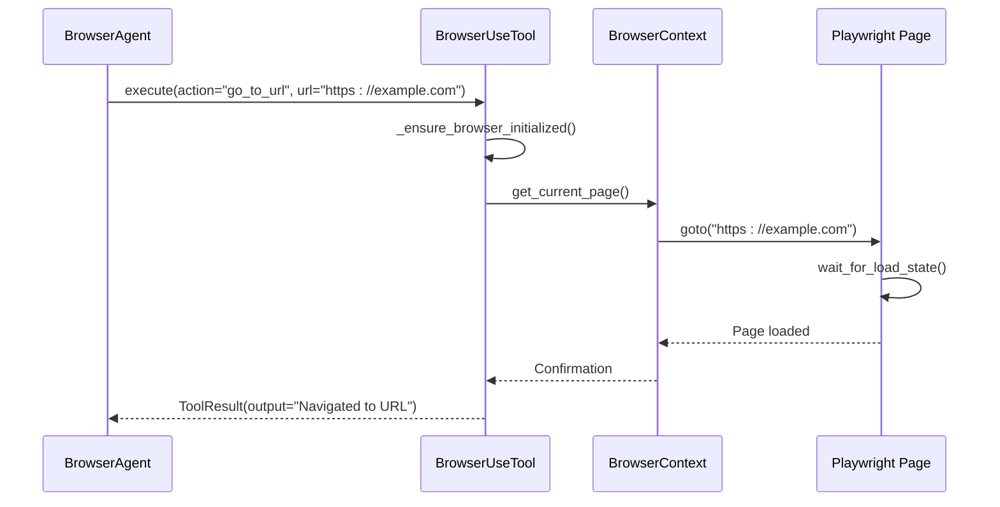
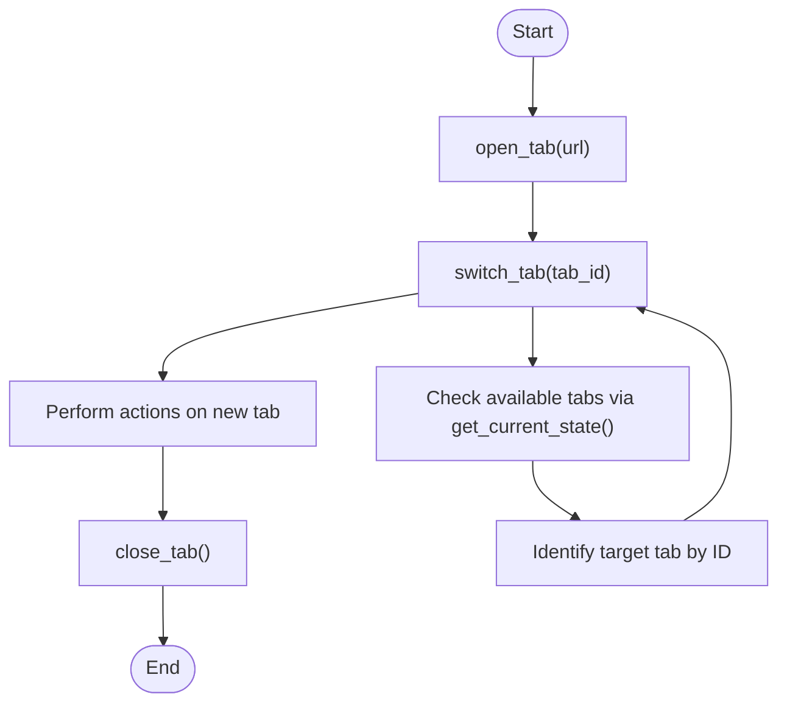
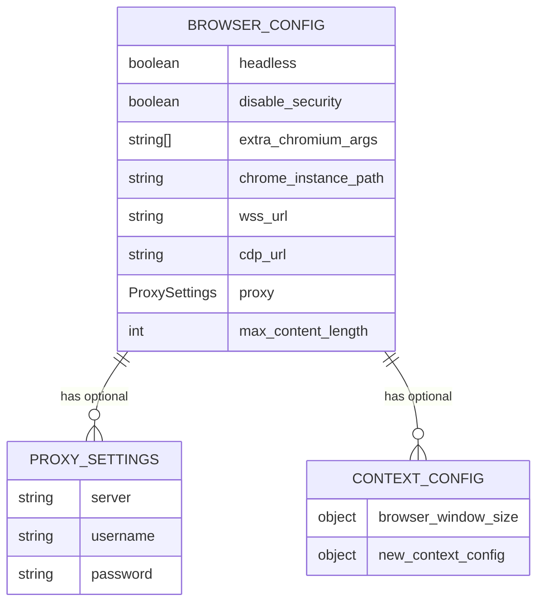

# Browser Navigation

<cite>
**Referenced Files in This Document**   
- [browser_use_tool.py](file://app/tool/browser_use_tool.py)
- [browser.py](file://app/agent/browser.py)
- [config.py](file://app/config.py)
</cite>

## Table of Contents
1. [Introduction](#introduction)
2. [Core Components](#core-components)
3. [Navigation Actions](#navigation-actions)
4. [Tab Management](#tab-management)
5. [Configuration and Settings](#configuration-and-settings)
6. [State Management](#state-management)
7. [Error Handling and Common Issues](#error-handling-and-common-issues)
8. [Security Considerations](#security-considerations)

## Introduction
The OpenManus framework provides robust browser navigation capabilities through its BrowserUseTool and BrowserAgent classes. These components enable automated agents to interact with web pages, perform navigation tasks, manage browser tabs, and extract content programmatically. Built on top of the Playwright-based browser_use library, this system offers a comprehensive interface for web automation with support for complex workflows involving multiple pages, dynamic content, and session persistence.

**Section sources**
- [browser_use_tool.py](file://app/tool/browser_use_tool.py#L1-L567)
- [browser.py](file://app/agent/browser.py#L1-L129)

## Core Components

The browser navigation system in OpenManus consists of two primary components: the BrowserUseTool which handles low-level browser interactions, and the BrowserAgent that orchestrates higher-level navigation strategies. The BrowserUseTool serves as the interface between the agent and the underlying Playwright browser instance, exposing a set of actionable methods for controlling browser behavior.

The integration with Playwright is achieved through the browser_use library, which abstracts away the complexities of direct Playwright usage while maintaining full access to browser functionality. This includes page navigation, element interaction, content extraction, and tab management—all accessible through a consistent tool interface.

```mermaid
classDiagram
class BrowserUseTool {
+name : str
+description : str
+execute(action : str, ...) ToolResult
+get_current_state() ToolResult
+cleanup() None
-_ensure_browser_initialized() BrowserContext
}
class BrowserAgent {
+name : str
+description : str
+available_tools : ToolCollection
+browser_context_helper : BrowserContextHelper
+think() bool
+cleanup() None
}
class BrowserContextHelper {
+agent : BaseAgent
+get_browser_state() dict
+format_next_step_prompt() str
+cleanup_browser() None
}
BrowserAgent --> BrowserContextHelper : "uses"
BrowserAgent --> BrowserUseTool : "includes in tools"
BrowserUseTool --> "Playwright" : "integrates via browser_use"
```

**Diagram sources**
- [browser_use_tool.py](file://app/tool/browser_use_tool.py#L38-L566)
- [browser.py](file://app/agent/browser.py#L86-L128)

**Section sources**
- [browser_use_tool.py](file://app/tool/browser_use_tool.py#L38-L566)
- [browser.py](file://app/agent/browser.py#L86-L128)

## Navigation Actions

The BrowserUseTool provides several navigation actions that allow agents to control browser behavior programmatically. The primary navigation method is `go_to_url`, which directs the browser to load a specified URL. This action waits for the page to fully load before returning control, ensuring subsequent operations occur on a completely rendered page.

Additional navigation capabilities include `go_back` for returning to the previous page in the browsing history, and `refresh` for reloading the current page. The `web_search` action combines search functionality with navigation by executing a query and automatically navigating to the top result. Each navigation action returns a ToolResult containing either success confirmation or error details.



**Diagram sources**
- [browser_use_tool.py](file://app/tool/browser_use_tool.py#L250-L264)
- [browser_use_tool.py](file://app/tool/browser_use_tool.py#L266-L270)

**Section sources**
- [browser_use_tool.py](file://app/tool/browser_use_tool.py#L250-L278)

## Tab Management

Tab management in OpenManus allows agents to work with multiple browser tabs simultaneously. The system supports three primary tab operations: `open_tab` for creating new tabs with a specified URL, `switch_tab` for changing focus between existing tabs, and `close_tab` for closing the current tab.

Each tab maintains its own browsing context and history, enabling independent navigation across different websites or sections of the same site. When switching tabs, the system automatically waits for the target page to load completely before proceeding. Tab identifiers are managed internally by the BrowserContext, ensuring reliable tab switching even as the tab collection changes during execution.



**Diagram sources**
- [browser_use_tool.py](file://app/tool/browser_use_tool.py#L470-L491)
- [browser_use_tool.py](file://app/tool/browser_use_tool.py#L456-L468)

**Section sources**
- [browser_use_tool.py](file://app/tool/browser_use_tool.py#L456-L491)

## Configuration and Settings

Browser behavior in OpenManus can be customized through configuration options defined in config.browser_config. Key settings include `headless` mode control, proxy configuration, and window sizing parameters. These configurations are applied when initializing the browser instance and affect all subsequent navigation operations.

The system supports various browser configuration options including proxy settings with authentication, custom Chromium arguments, and connections to existing browser instances via WebSocket or CDP URLs. Window size can be configured through the browser_window_size parameter, which affects screenshot capture and viewport-based operations.



**Diagram sources**
- [config.py](file://app/config.py#L100-L140)
- [browser_use_tool.py](file://app/tool/browser_use_tool.py#L145-L174)

**Section sources**
- [config.py](file://app/config.py#L100-L140)
- [browser_use_tool.py](file://app/tool/browser_use_tool.py#L145-L174)

## State Management

State management in the browser navigation system is handled through the BrowserContextHelper class, which acts as an intermediary between the BrowserAgent and the underlying browser tools. This component is responsible for retrieving and formatting browser state information, including current URL, page title, tab collection, and scroll position.

The helper also manages screenshot capture and integrates visual context into the agent's decision-making process by adding screenshots to the conversation memory. This enables vision-capable models to understand the current browser state and make informed navigation decisions. The state information includes metadata about visible and hidden content, helping agents determine when scrolling is necessary to access additional elements.

**Section sources**
- [browser.py](file://app/agent/browser.py#L18-L83)

## Error Handling and Common Issues

The browser navigation system implements comprehensive error handling for common issues encountered during web automation. Navigation errors such as failed page loads or timeouts are captured and returned as ToolResult objects with descriptive error messages. The system handles dynamic SPAs by waiting for page load states and provides mechanisms for dealing with asynchronous content loading.

Common issues addressed include page load timeouts, navigation to invalid URLs, attempts to interact with non-existent elements, and tab management errors. The system also handles Playwright-specific exceptions and ensures proper cleanup of browser resources even when errors occur. For SPAs, the combination of wait_for_load_state() and JavaScript execution provides reliable interaction with dynamically loaded content.

**Section sources**
- [browser_use_tool.py](file://app/tool/browser_use_tool.py#L520-L538)
- [browser_use_tool.py](file://app/tool/browser_use_tool.py#L250-L264)

## Security Considerations

Security is a critical aspect of browser navigation, particularly when interacting with untrusted sites. The system includes several security features, including the ability to run in headless mode and disable certain browser security features when necessary. Proxy support allows for traffic monitoring and filtering, while sandboxed execution environments can isolate potentially dangerous operations.

Best practices for secure navigation include validating URLs before navigation, limiting the scope of allowed domains, and implementing proper resource cleanup after operations complete. The system's design ensures that browser instances are properly closed even if errors occur, preventing resource leaks and potential security vulnerabilities from lingering processes.

**Section sources**
- [config.py](file://app/config.py#L100-L140)
- [browser_use_tool.py](file://app/tool/browser_use_tool.py#L145-L174)
- [browser_use_tool.py](file://app/tool/browser_use_tool.py#L540-L566)