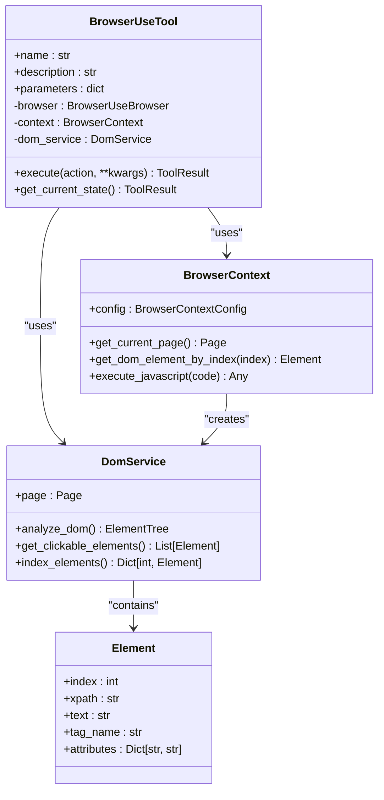
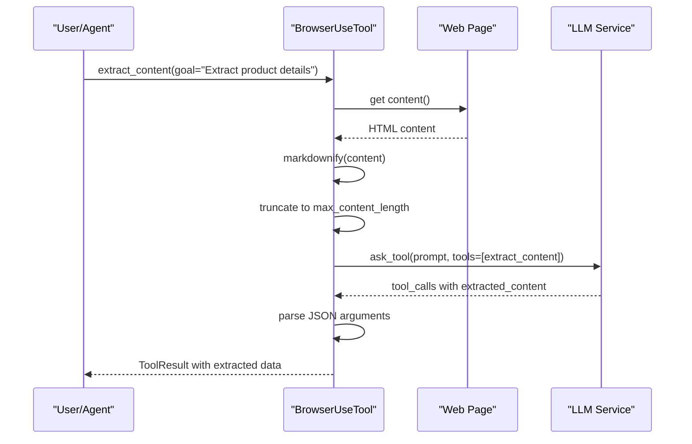
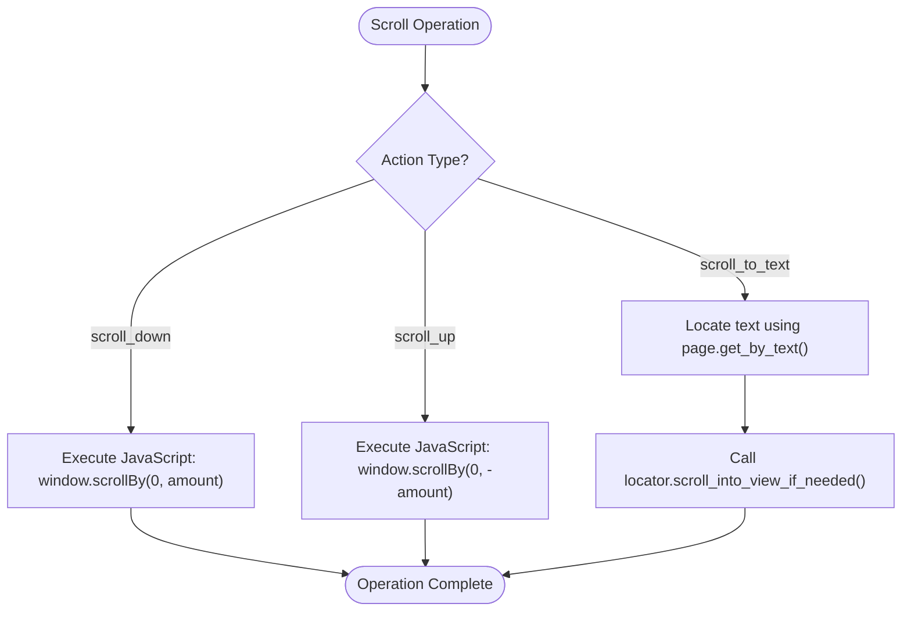

# Content Extraction

<cite>
**Referenced Files in This Document**   
- [browser_use_tool.py](file://app/tool/browser_use_tool.py)
- [config.example.toml](file://config/config.example.toml)
- [crawl4ai.py](file://app/tool/crawl4ai.py)
- [browser.py](file://app/agent/browser.py)
</cite>

## Table of Contents
1. [Introduction](#introduction)
2. [DOM Analysis and Element Indexing](#dom-analysis-and-element-indexing)
3. [LLM-Powered Content Extraction](#llm-powered-content-extraction)
4. [Scrolling Mechanisms](#scrolling-mechanisms)
5. [Content Extraction Examples](#content-extraction-examples)
6. [Configuration and Performance](#configuration-and-performance)
7. [Handling Complex Web Pages](#handling-complex-web-pages)
8. [Best Practices](#best-practices)

## Introduction

OpenManus provides a sophisticated content extraction system through its `extract_content` action in the `BrowserUseTool`. This system enables the extraction of structured data from web pages by combining DOM analysis, element indexing, and LLM-powered processing. The framework is designed to handle various content types including product information, article text, and tabular data from complex websites. The extraction process is enhanced by scrolling mechanisms that allow access to off-screen content, ensuring comprehensive data collection.

**Section sources**
- [browser_use_tool.py](file://app/tool/browser_use_tool.py#L38-L566)

## DOM Analysis and Element Indexing

The content extraction process begins with comprehensive DOM analysis and element indexing. When a web page is loaded, OpenManus analyzes the Document Object Model (DOM) to identify and index interactive elements. This indexing system assigns numerical identifiers to clickable elements, form inputs, and other interactive components, enabling precise targeting during extraction operations.

The DOM analysis is performed through the `DomService` component, which processes the page structure and creates a hierarchical representation of elements. This service works in conjunction with the `BrowserContext` to maintain state across interactions and ensure consistent element identification. The indexing system supports various element types including buttons, links, input fields, dropdowns, and form controls, each assigned a unique index for reference in subsequent actions.



**Diagram sources**
- [browser_use_tool.py](file://app/tool/browser_use_tool.py#L38-L566)

**Section sources**
- [browser_use_tool.py](file://app/tool/browser_use_tool.py#L173-L204)

## LLM-Powered Content Extraction

The core of OpenManus's content extraction capability lies in its LLM-powered processing pipeline. When the `extract_content` action is invoked, the system follows a multi-step process to extract structured information based on a specified goal. The process begins with converting the HTML content to Markdown format using the `markdownify` library, which preserves the semantic structure while removing presentation-specific markup.

The extracted Markdown content is then processed through a function-calling mechanism with the configured LLM. The system constructs a prompt that includes the extraction goal and the page content, limited by the `max_content_length` parameter. The LLM is instructed to use the `extract_content` function, which has a predefined schema requiring structured output with text content and metadata.



**Diagram sources**
- [browser_use_tool.py](file://app/tool/browser_use_tool.py#L359-L454)

**Section sources**
- [browser_use_tool.py](file://app/tool/browser_use_tool.py#L359-L454)

## Scrolling Mechanisms

To access content that may be initially off-screen due to pagination, infinite scrolling, or large page layouts, OpenManus implements three scrolling mechanisms: `scroll_to_text`, `scroll_up`, and `scroll_down`. These actions enable comprehensive content extraction by allowing the system to navigate through different sections of a web page.

The `scroll_down` and `scroll_up` actions scroll the page by a specified pixel amount, with the default scroll amount being the height of the browser window. This ensures that each scroll operation reveals a full viewport of new content. The `scroll_to_text` action uses Playwright's locator system to find text content anywhere on the page and scroll it into view, which is particularly useful for navigating to specific sections or headings.



**Diagram sources**
- [browser_use_tool.py](file://app/tool/browser_use_tool.py#L284-L331)

**Section sources**
- [browser_use_tool.py](file://app/tool/browser_use_tool.py#L284-L331)

## Content Extraction Examples

OpenManus can extract various types of content from web pages, with specific approaches for different data structures. For product information extraction, the system can identify and extract key details such as product name, price, description, specifications, and customer reviews. When extracting article text, the framework focuses on main content areas while filtering out navigation elements, advertisements, and related articles.

For tabular data extraction, OpenManus processes HTML tables and converts them into structured formats that can be easily consumed by downstream applications. The LLM-powered extraction ensures that even complex tables with merged cells, nested structures, or irregular formatting are accurately represented in the output.

The extraction process can be demonstrated through specific use cases:
- **Product Information**: Extracting e-commerce product details including name, price, availability, and specifications
- **Article Text**: Capturing the main body of news articles or blog posts while excluding headers, footers, and sidebar content
- **Tabular Data**: Converting HTML tables into structured JSON with proper column and row identification
- **Contact Information**: Identifying and extracting business contact details, addresses, and phone numbers

**Section sources**
- [browser_use_tool.py](file://app/tool/browser_use_tool.py#L359-L454)

## Configuration and Performance

The content extraction process is configurable through the `browser_config` settings, with the `max_content_length` parameter playing a crucial role in extraction quality. This parameter, which defaults to 2000 characters, limits the amount of page content sent to the LLM for processing. While this helps manage token usage and processing time, it may result in incomplete extraction when dealing with lengthy content.

The configuration is defined in the TOML configuration files, where users can adjust various browser-related settings. The `max_content_length` parameter can be increased to accommodate larger content extraction needs, though this should be balanced against increased processing time and potential rate limiting from the LLM provider.

```toml
# Example configuration for browser settings
[browser]
# Maximum length of content to send to LLM for extraction
max_content_length = 2000

# Whether to run browser in headless mode (default: false)
headless = false

# Disable browser security features (default: true)
disable_security = true
```

**Diagram sources**
- [config.example.toml](file://config/config.example.toml#L70-L105)

**Section sources**
- [config.example.toml](file://config/config.example.toml#L70-L105)
- [browser_use_tool.py](file://app/tool/browser_use_tool.py#L375-L378)

## Handling Complex Web Pages

OpenManus faces several challenges when extracting content from modern, complex web pages. JavaScript-heavy pages that dynamically load content through AJAX calls or client-side rendering frameworks require special handling to ensure all content is available before extraction. The system addresses this through built-in wait mechanisms and the ability to trigger interactions that reveal hidden content.

Lazy loading presents another challenge, where images, videos, or content blocks are only loaded when they enter the viewport. The scrolling mechanisms help mitigate this issue by programmatically navigating through the page, triggering the loading of off-screen content. For CAPTCHA-protected content, the system currently cannot bypass these security measures, requiring human intervention or alternative approaches.

The `Crawl4aiTool` provides an alternative approach for handling complex web pages, using a dedicated web crawler optimized for AI processing. This tool can handle JavaScript-heavy sites and dynamic content more effectively than the standard browser automation, making it suitable for research and content analysis tasks.

```mermaid
graph TD
A[Complex Web Page] --> B{Page Type}
B --> |JavaScript-heavy| C[Use wait_for_load_state()]
B --> |Lazy loading| D[Use scroll_down to trigger loading]
B --> |CAPTCHA-protected| E[Manual intervention required]
B --> |Single Page Application| F[Monitor network requests]
C --> G[Extract content]
D --> G
F --> G
G --> H[Process with LLM]
```

**Diagram sources**
- [crawl4ai.py](file://app/tool/crawl4ai.py#L1-L270)

**Section sources**
- [crawl4ai.py](file://app/tool/crawl4ai.py#L1-L270)
- [browser_use_tool.py](file://app/tool/browser_use_tool.py#L284-L331)

## Best Practices

To achieve optimal results when using OpenManus for content extraction, several best practices should be followed. First, crafting effective extraction goals is essential for guiding the LLM to produce relevant and structured output. Goals should be specific and clearly define the type of information to extract, such as "Extract all product details including name, price, and specifications" rather than vague requests like "Get product information."

When dealing with incomplete or malformed content, the system should implement retry mechanisms with different scrolling patterns or interaction sequences to ensure comprehensive coverage. For pages with pagination, the extraction process should include navigation between pages to collect all relevant data.

Performance considerations include balancing the `max_content_length` parameter with processing requirements, using appropriate scrolling strategies to minimize unnecessary operations, and implementing error handling for cases where content cannot be extracted due to technical limitations or access restrictions.

**Section sources**
- [browser_use_tool.py](file://app/tool/browser_use_tool.py#L359-L454)
- [config.example.toml](file://config/config.example.toml#L70-L105)