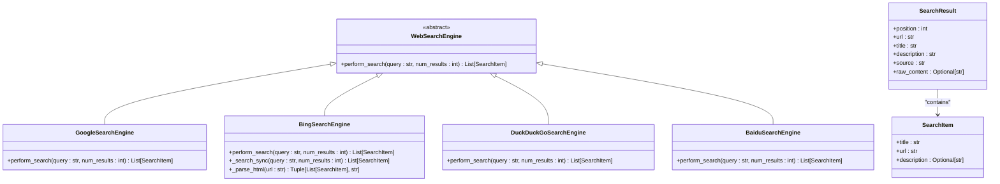
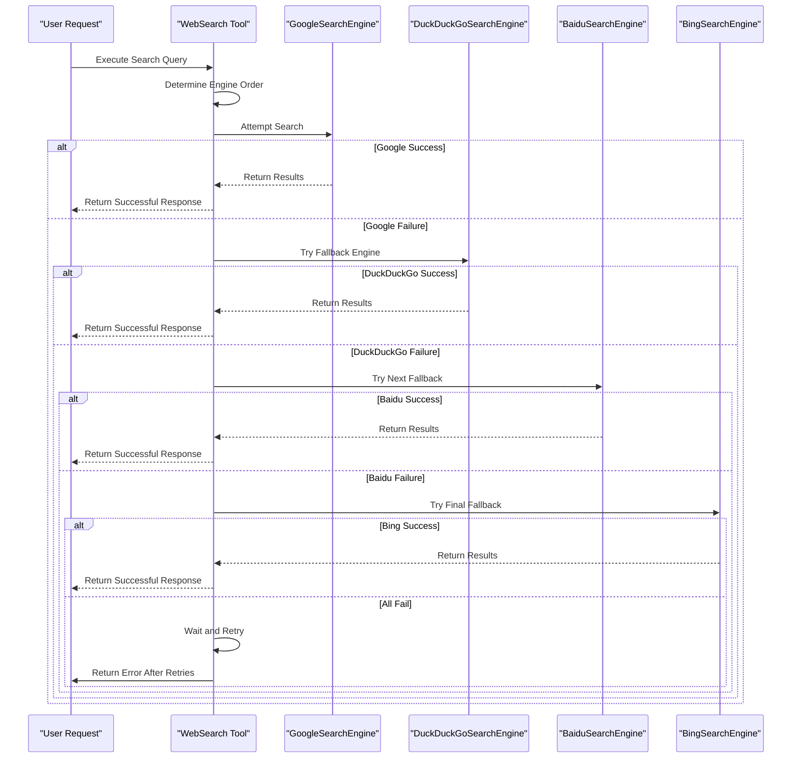
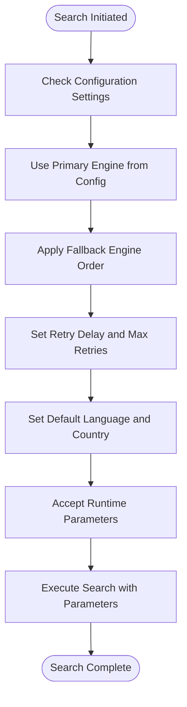
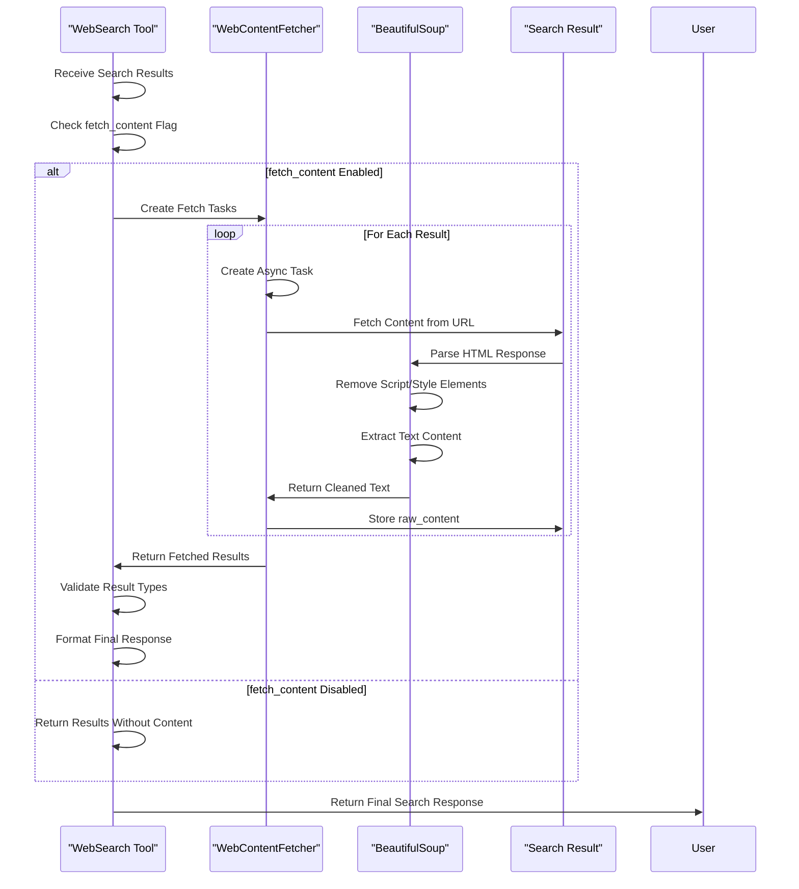
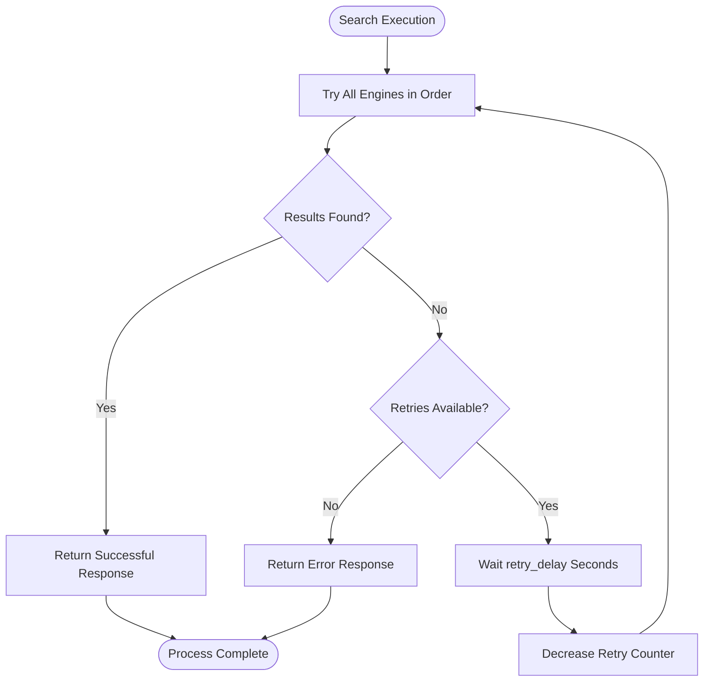
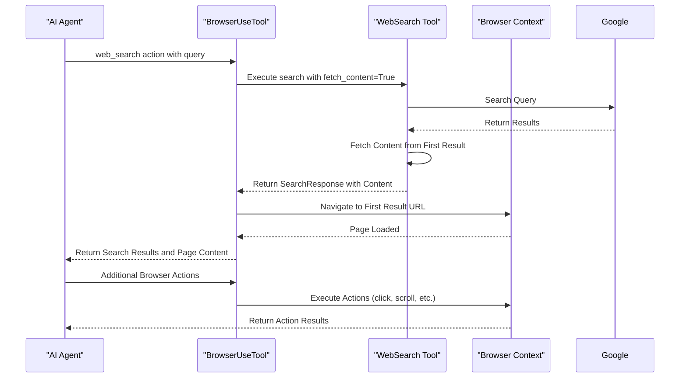

# Search Engine Integration

<cite>
**Referenced Files in This Document**   
- [web_search.py](file://app/tool/web_search.py)
- [base.py](file://app/tool/search/base.py)
- [google_search.py](file://app/tool/search/google_search.py)
- [bing_search.py](file://app/tool/search/bing_search.py)
- [duckduckgo_search.py](file://app/tool/search/duckduckgo_search.py)
- [baidu_search.py](file://app/tool/search/baidu_search.py)
- [config.example-daytona.toml](file://config/config.example-daytona.toml)
- [config.py](file://app/config.py)
- [browser_use_tool.py](file://app/tool/browser_use_tool.py)
</cite>

## Table of Contents
1. [Search Engine Architecture](#search-engine-architecture)
2. [Multi-Engine Strategy](#multi-engine-strategy)
3. [Configuration and Parameters](#configuration-and-parameters)
4. [Result Processing and Content Fetching](#result-processing-and-content-fetching)
5. [Error Handling and Retry Mechanisms](#error-handling-and-retry-mechanisms)
6. [Integration with Browser Navigation](#integration-with-browser-navigation)
7. [Performance and Ethical Considerations](#performance-and-ethical-considerations)

## Search Engine Architecture

OpenManus implements a modular search engine integration system through the `WebSearch` tool and `WebSearchEngine` base class. The architecture follows a clean separation of concerns, with each search engine implementing the common interface defined by the base class. This design enables consistent interaction patterns across different search providers while allowing engine-specific implementations.

The core components include:
- `WebSearchEngine`: Abstract base class defining the contract for all search engines
- `SearchItem`: Standardized data structure for individual search results
- `SearchResult`: Enhanced result object with additional metadata and positioning
- `SearchResponse`: Structured response container with error handling and output formatting



**Diagram sources**
- [base.py](file://app/tool/search/base.py#L19-L39)
- [google_search.py](file://app/tool/search/google_search.py#L1-L33)
- [bing_search.py](file://app/tool/search/bing_search.py#L1-L144)
- [duckduckgo_search.py](file://app/tool/search/duckduckgo_search.py#L1-L57)
- [baidu_search.py](file://app/tool/search/baidu_search.py#L1-L54)

**Section sources**
- [base.py](file://app/tool/search/base.py#L5-L39)
- [web_search.py](file://app/tool/web_search.py#L155-L407)

## Multi-Engine Strategy

OpenManus supports multiple search engines through a sophisticated primary/fallback strategy. The system is designed to maximize search reliability by automatically switching between engines when failures occur. The supported engines include Google, Bing, DuckDuckGo, and Baidu, each implemented as a specialized class inheriting from the `WebSearchEngine` base class.

The engine selection process follows a hierarchical approach:
1. Primary engine specified in configuration
2. Fallback engines in configured order
3. Remaining available engines

This strategy ensures comprehensive coverage across different regions and search result characteristics. For example, Baidu provides optimized results for Chinese-language content, while Google offers broad international coverage.



**Diagram sources**
- [web_search.py](file://app/tool/web_search.py#L271-L304)
- [web_search.py](file://app/tool/web_search.py#L306-L340)

**Section sources**
- [web_search.py](file://app/tool/web_search.py#L342-L380)
- [config.example-daytona.toml](file://config/config.example-daytona.toml#L71-L95)

## Configuration and Parameters

The search functionality is highly configurable through both runtime parameters and persistent configuration settings. Users can specify search parameters directly in the tool call, while system-wide defaults are managed through the configuration system.

### Runtime Parameters
The `WebSearch` tool accepts the following parameters:
- **query** (required): The search query string
- **num_results** (optional): Number of results to return (default: 5)
- **lang** (optional): Language code for search results (default: en)
- **country** (optional): Country code for regional results (default: us)
- **fetch_content** (optional): Whether to fetch full content from result pages (default: false)

### Configuration Settings
The system-wide search configuration is defined in the `SearchSettings` class and can be customized in the configuration file:

```toml
[search]
engine = "Google"
fallback_engines = ["DuckDuckGo", "Baidu", "Bing"]
retry_delay = 60
max_retries = 3
lang = "en"
country = "us"
```

These settings allow administrators to control the default search behavior, including the primary engine, fallback order, retry policies, and regional preferences.



**Diagram sources**
- [config.py](file://app/config.py#L38-L65)
- [config.example-daytona.toml](file://config/config.example-daytona.toml#L71-L95)
- [web_search.py](file://app/tool/web_search.py#L155-L198)

**Section sources**
- [config.py](file://app/config.py#L38-L65)
- [config.example-daytona.toml](file://config/config.example-daytona.toml#L71-L95)
- [web_search.py](file://app/tool/web_search.py#L155-L198)

## Result Processing and Content Fetching

OpenManus enhances search results through metadata enrichment and optional content fetching. The system transforms raw search results into structured data objects and can optionally retrieve full content from result pages using the `WebContentFetcher` and BeautifulSoup.

### Result Aggregation
Search results are aggregated and transformed into a standardized format with additional metadata:
- Position in results
- Source engine identification
- Structured data representation
- Metadata about the search operation

### Content Fetching
When `fetch_content` is enabled, the system retrieves and processes full content from result URLs:
- HTML parsing with BeautifulSoup
- Removal of script, style, header, footer, and navigation elements
- Text extraction with proper formatting
- Content cleaning and size limiting (100KB maximum)



**Diagram sources**
- [web_search.py](file://app/tool/web_search.py#L105-L152)
- [web_search.py](file://app/tool/web_search.py#L382-L407)

**Section sources**
- [web_search.py](file://app/tool/web_search.py#L105-L152)
- [web_search.py](file://app/tool/web_search.py#L382-L407)

## Error Handling and Retry Mechanisms

The search system implements robust error handling with exponential backoff retry logic to handle transient failures and rate limiting. This ensures reliable operation even under challenging network conditions or API limitations.

### Retry Strategy
The system employs a multi-layered retry approach:
1. **Per-engine retry**: Individual engine calls use exponential backoff with the `tenacity` library
2. **Cross-engine fallback**: When one engine fails, the system automatically tries alternative engines
3. **Global retry**: If all engines fail, the system waits and retries the entire process

The per-engine retry uses exponential backoff with parameters:
- Maximum 3 attempts
- Wait time increases exponentially (1s, 2s, 4s, 8s, 10s maximum)

### Rate Limiting Handling
When all engines fail due to rate limiting or other issues:
- The system waits for the configured `retry_delay` (default: 60 seconds)
- This process repeats up to `max_retries` times (default: 3)
- After exhausting retries, a comprehensive error response is returned



**Diagram sources**
- [web_search.py](file://app/tool/web_search.py#L200-L239)
- [web_search.py](file://app/tool/web_search.py#L271-L304)
- [web_search.py](file://app/tool/web_search.py#L382-L407)

**Section sources**
- [web_search.py](file://app/tool/web_search.py#L200-L304)
- [config.py](file://app/config.py#L38-L65)

## Integration with Browser Navigation

OpenManus provides seamless integration between search functionality and browser navigation through the `browser_use` tool. This enables a smooth workflow from search to detailed content exploration.

### Search-to-Navigation Workflow
The integration allows users to:
1. Perform a search using the `web_search` tool
2. Automatically navigate to the most relevant result
3. Extract and analyze content from the target page
4. Continue exploration with additional browser actions

The `browser_use` tool's `web_search` action combines search and navigation in a single operation:
- Executes a search query
- Returns search results with content
- Automatically navigates to the first result
- Provides access to the loaded page for further interaction



**Diagram sources**
- [browser_use_tool.py](file://app/tool/browser_use_tool.py#L200-L250)
- [web_search.py](file://app/tool/web_search.py#L155-L407)

**Section sources**
- [browser_use_tool.py](file://app/tool/browser_use_tool.py#L200-L250)
- [web_search.py](file://app/tool/web_search.py#L155-L407)

## Performance and Ethical Considerations

The search integration balances performance optimization with ethical considerations to ensure responsible usage.

### Performance Optimization
For high-volume search operations, the system implements several optimizations:
- **Concurrent execution**: Multiple search tasks can run simultaneously
- **Efficient content fetching**: Async operations with connection pooling
- **Result caching**: Potential for result caching to reduce redundant searches
- **Resource management**: Configurable timeouts and resource limits

### Ethical Considerations
The implementation addresses several ethical concerns:
- **Rate limiting compliance**: Respects search engine rate limits through retry delays
- **User agent identification**: Uses appropriate user agents to identify the crawler
- **Content extraction ethics**: Focuses on publicly available information
- **Privacy considerations**: Avoids personal data collection unless explicitly requested

### API Limitations
Each search engine has specific limitations that the system accommodates:
- **Google**: Requires API key for high-volume usage; web scraping has rate limits
- **Bing**: Has request frequency limits and may require API authentication
- **DuckDuckGo**: More permissive but may have result quality variations
- **Baidu**: Optimized for Chinese content with regional restrictions

The fallback strategy and retry mechanisms help mitigate these limitations by distributing requests across multiple engines and handling temporary unavailability gracefully.

**Section sources**
- [web_search.py](file://app/tool/web_search.py#L155-L407)
- [config.example-daytona.toml](file://config/config.example-daytona.toml#L71-L95)
- [browser_use_tool.py](file://app/tool/browser_use_tool.py#L200-L250)