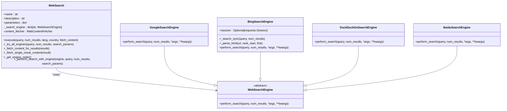
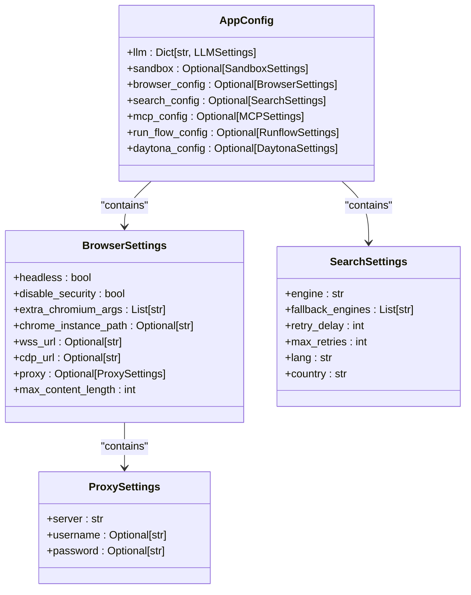

# Web Automation Scenarios

<cite>
**Referenced Files in This Document**   
- [browser_use_tool.py](file://app/tool/browser_use_tool.py)
- [web_search.py](file://app/tool/web_search.py)
- [google_search.py](file://app/tool/search/google_search.py)
- [bing_search.py](file://app/tool/search/bing_search.py)
- [duckduckgo_search.py](file://app/tool/search/duckduckgo_search.py)
- [baidu_search.py](file://app/tool/search/baidu_search.py)
- [config.py](file://app/config.py)
</cite>

## Table of Contents
1. [Browser Automation with Playwright](#browser-automation-with-playwright)
2. [Multi-Engine Web Search Capabilities](#multi-engine-web-search-capabilities)
3. [Structured Data Extraction](#structured-data-extraction)
4. [Configuration Options](#configuration-options)
5. [Handling Dynamic Content and Challenges](#handling-dynamic-content-and-challenges)
6. [Security and Ethical Considerations](#security-and-ethical-considerations)

## Browser Automation with Playwright

The OpenManus agents utilize the `browser_use_tool.py` module to perform comprehensive browser automation through Playwright. This tool enables agents to navigate web pages, interact with elements, and extract content programmatically. The `BrowserUseTool` class provides a rich set of actions for controlling browser sessions, maintaining state across calls, and enabling complex web interactions.

Key capabilities include navigation (going to URLs, going back, refreshing), element interaction (clicking, inputting text, selecting dropdown options), scrolling (by pixel amount or to specific text), content extraction, and tab management (switching, opening, closing tabs). The tool maintains a browser session until explicitly closed, allowing for stateful interactions across multiple operations.

The implementation leverages Playwright's robust browser automation features while providing a simplified interface through the `BrowserUseTool` class. This class inherits from `BaseTool` and implements the necessary methods for executing browser actions. The tool ensures browser initialization through the `_ensure_browser_initialized` method, which creates a browser instance with configuration options from the application settings.

**Section sources**
- [browser_use_tool.py](file://app/tool/browser_use_tool.py#L1-L568)

## Multi-Engine Web Search Capabilities

OpenManus supports multi-engine web search through the `web_search.py` module, which integrates with Google, Bing, DuckDuckGo, and Baidu search engines. The `WebSearch` class provides a unified interface for executing searches across these engines, with automatic fallback mechanisms when primary engines fail.

The search functionality is implemented through specialized engine classes that inherit from the `WebSearchEngine` base class:
- `GoogleSearchEngine` uses the googlesearch library to perform searches
- `BingSearchEngine` implements a synchronous search using requests and BeautifulSoup
- `DuckDuckGoSearchEngine` utilizes the duckduckgo-search library
- `BaiduSearchEngine` uses the baidusearch library

Each engine implements the `perform_search` method to return results in a standardized `SearchItem` format. The `WebSearch` tool coordinates these engines, attempting searches in a configurable order with retry mechanisms. The default engine is Google, with fallbacks to DuckDuckGo, Baidu, and Bing when necessary.

Search results are returned in a structured `SearchResponse` format that includes the query, results list, and metadata. The tool supports fetching content from result pages when requested, enhancing the search functionality beyond simple result listings.

**Diagram sources**
- [web_search.py](file://app/tool/web_search.py#L1-L419)
- [google_search.py](file://app/tool/search/google_search.py#L1-L34)
- [bing_search.py](file://app/tool/search/bing_search.py#L1-L145)
- [duckduckgo_search.py](file://app/tool/search/duckduckgo_search.py#L1-L58)
- [baidu_search.py](file://app/tool/search/baidu_search.py#L1-L55)

**Section sources**
- [web_search.py](file://app/tool/web_search.py#L1-L419)

## Structured Data Extraction

The OpenManus framework provides robust capabilities for extracting structured data from websites through both direct browser interaction and automated content fetching. The `extract_content` action in `browser_use_tool.py` enables agents to extract relevant information from web pages based on specific goals.

When extracting content, the tool first retrieves the page content and converts it to markdown format using the markdownify library. It then uses the LLM to analyze the content and extract information according to the specified goal. The extraction process is formalized through a function schema that defines the expected output structure, ensuring consistent and predictable results.

For search results, the `WebContentFetcher` class provides functionality to fetch and extract main content from webpage URLs. This utility removes script and style elements, extracts text content with proper separation, and cleans up whitespace. The fetched content is limited to 100KB to prevent excessive resource usage.

The structured data extraction process returns results in a standardized format that includes position, URL, title, description, source, and raw content when available. This allows for consistent processing and analysis of extracted information across different sources and use cases.

**Section sources**
- [browser_use_tool.py](file://app/tool/browser_use_tool.py#L388-L438)
- [web_search.py](file://app/tool/web_search.py#L200-L247)

## Configuration Options

OpenManus provides extensive configuration options for both browser settings and search engine preferences through the `config.py` file. These configurations allow users to customize the behavior of web automation and search functionality according to their specific requirements.

Browser settings are defined in the `BrowserSettings` class and include:
- `headless`: Whether to run the browser in headless mode
- `disable_security`: Whether to disable browser security features
- `extra_chromium_args`: Additional arguments to pass to the browser
- `chrome_instance_path`: Path to a specific Chrome instance
- `wss_url` and `cdp_url`: URLs for connecting to browser instances via WebSocket or CDP
- `proxy`: Proxy settings including server, username, and password
- `max_content_length`: Maximum length for content retrieval operations

Search engine configurations are managed through the `SearchSettings` class, which includes:
- `engine`: The primary search engine to use (default: Google)
- `fallback_engines`: List of fallback engines to try when the primary engine fails
- `retry_delay`: Seconds to wait before retrying all engines after failure
- `max_retries`: Maximum number of retry attempts
- `lang`: Language code for search results
- `country`: Country code for search results

These configuration options are loaded from a TOML configuration file, with default values provided when specific settings are not specified. The configuration system supports both direct browser automation and sandboxed execution environments.

**Diagram sources**
- [config.py](file://app/config.py#L1-L373)

**Section sources**
- [config.py](file://app/config.py#L1-L373)

## Handling Dynamic Content and Challenges

The OpenManus framework addresses common challenges in web automation through various mechanisms and design patterns. For dynamic content loading, the implementation uses Playwright's built-in waiting mechanisms such as `wait_for_load_state()` to ensure pages are fully loaded before interaction.

Rate limiting is handled through the search engine implementation, which includes retry mechanisms with exponential backoff. The `WebSearch` tool attempts searches with all configured engines and retries the entire process when all engines fail, with configurable delay between retries.

For CAPTCHA challenges, the framework relies on headful browser mode (non-headless) by default, which can help avoid triggering some CAPTCHA systems. The configuration also allows for proxy settings, which can be used to rotate IP addresses and reduce the likelihood of being rate-limited or blocked.

JavaScript-heavy pages are handled effectively through Playwright's support for modern web technologies. The browser automation tool can execute JavaScript directly through the `execute_javascript` method, allowing for interaction with dynamically generated content. The content extraction process also handles JavaScript-rendered content by waiting for the page to fully load before extracting information.

The framework includes error handling and validation at multiple levels, from parameter validation in the `validate_parameters` method to exception handling in the `execute` method. This ensures robust operation even when encountering unexpected conditions or errors during web automation tasks.

**Section sources**
- [browser_use_tool.py](file://app/tool/browser_use_tool.py#L189-L476)
- [web_search.py](file://app/tool/web_search.py#L104-L187)

## Security and Ethical Considerations

OpenManus incorporates several security and ethical considerations in its web automation design. The framework includes configuration options to disable browser security features, but this should be used with caution and only in trusted environments.

The implementation follows best practices for web scraping by including appropriate user agent headers and respecting robots.txt directives where possible. The search functionality uses standard user agents and includes referer headers to identify the source of requests.

Rate limiting and retry mechanisms help prevent overwhelming target servers with requests, promoting responsible usage of web resources. The configurable retry delay and maximum retries settings allow users to balance performance with server load considerations.

For sensitive operations, the framework supports proxy configurations, allowing users to route traffic through designated servers. This can help protect user privacy and comply with organizational policies.

Ethical usage guidelines recommend that users:
- Respect website terms of service and robots.txt directives
- Implement appropriate rate limiting to avoid overloading servers
- Use the technology for legitimate purposes such as research and personal productivity
- Avoid scraping personal or sensitive information without proper authorization
- Comply with applicable laws and regulations regarding data collection and privacy

The open-source nature of the project promotes transparency and allows for community review of security practices and ethical considerations.

**Section sources**
- [browser_use_tool.py](file://app/tool/browser_use_tool.py#L1-L568)
- [web_search.py](file://app/tool/web_search.py#L1-L419)
- [config.py](file://app/config.py#L1-L373)