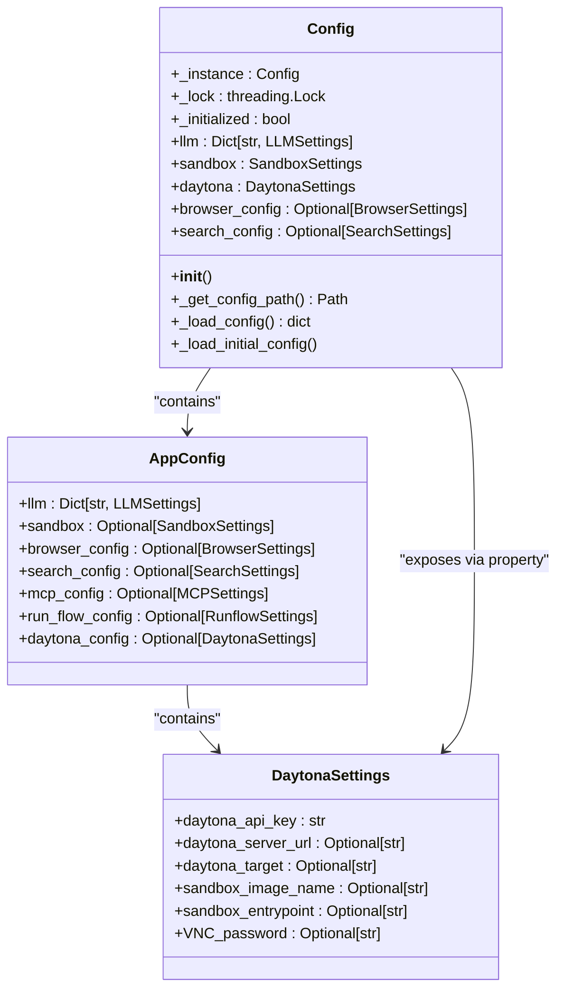
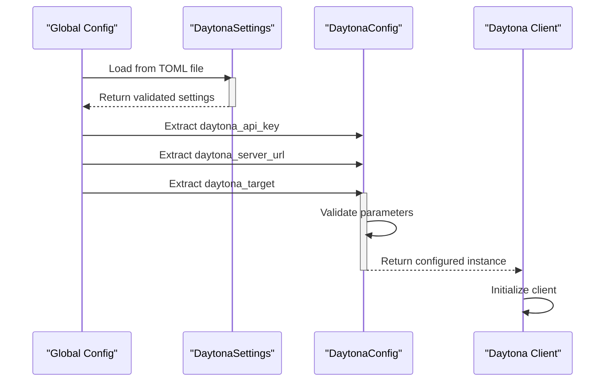
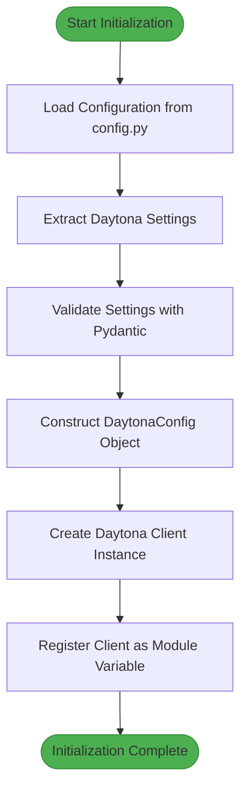
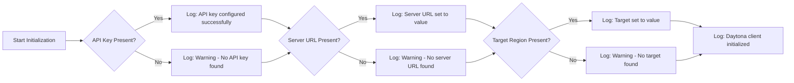

# Daytona Client Initialization

<cite>
**Referenced Files in This Document**   
- [config.py](file://app/config.py)
- [sandbox.py](file://app/daytona/sandbox.py)
- [tool_base.py](file://app/daytona/tool_base.py)
- [logger.py](file://app/utils/logger.py)
- [config.example-daytona.toml](file://config/config.example-daytona.toml)
</cite>

## Table of Contents
1. [Introduction](#introduction)
2. [Configuration System Integration](#configuration-system-integration)
3. [DaytonaConfig Construction](#daytonaconfig-construction)
4. [Client Initialization Process](#client-initialization-process)
5. [Logging and Feedback Mechanism](#logging-and-feedback-mechanism)
6. [Error Handling and Validation](#error-handling-and-validation)
7. [Best Practices for Production](#best-practices-for-production)
8. [Common Issues and Troubleshooting](#common-issues-and-troubleshooting)

## Introduction
The Daytona client initialization process in OpenManus establishes a secure connection between the application and Daytona's cloud infrastructure. This document details how the Daytona client is configured and instantiated, focusing on the integration with OpenManus's configuration system, the role of the Daytona client in mediating cloud interactions, and the logging mechanisms that provide feedback during setup. The initialization process abstracts environment variables through Pydantic settings management and ensures proper configuration of critical parameters such as API keys, server URLs, and target regions.

**Section sources**
- [config.py](file://app/config.py#L107-L135)
- [config.example-daytona.toml](file://config/config.example-daytona.toml#L97-L113)

## Configuration System Integration
OpenManus integrates with Daytona through a hierarchical configuration system that prioritizes environment variables and configuration files. The system uses Pydantic settings management to validate and structure configuration data, ensuring type safety and proper defaults. Configuration is loaded from TOML files, with the system first checking for a `config.toml` file and falling back to example configurations if necessary.

The configuration system exposes Daytona settings through a global `config` object that provides singleton access to all application settings. This object is thread-safe and initialized only once, preventing race conditions in multi-threaded environments. The Daytona-specific settings are encapsulated in the `DaytonaSettings` Pydantic model, which defines the required fields for API key, server URL, and target region.

**Diagram sources**
- [config.py](file://app/config.py#L107-L135)
- [config.py](file://app/config.py#L275-L305)

**Section sources**
- [config.py](file://app/config.py#L107-L372)
- [config.example-daytona.toml](file://config/config.example-daytona.toml#L97-L113)

## DaytonaConfig Construction
The DaytonaConfig object is constructed using configuration values extracted from OpenManus's global config system. The construction process begins by accessing the Daytona settings from the global `config` object, which has already loaded and validated the configuration from TOML files. The DaytonaConfig is then instantiated with three primary parameters: API key, server URL, and target region.

The API key is required and must be provided either through environment variables or configuration files. The server URL defaults to `https://app.daytona.io/api` if not specified, providing a sensible default for most deployments. The target region defaults to "us" (United States), with "eu" (Europe) as the alternative option, allowing users to select the geographically optimal region for performance.

Configuration values are abstracted through the Pydantic BaseModel system, which provides automatic type validation and conversion. This ensures that configuration values meet the expected types and constraints before being used to construct the DaytonaConfig. The use of Pydantic also enables rich documentation of configuration options through field descriptions and type hints.

**Diagram sources**
- [config.py](file://app/config.py#L275-L305)
- [sandbox.py](file://app/daytona/sandbox.py#L17-L25)

**Section sources**
- [config.py](file://app/config.py#L107-L135)
- [sandbox.py](file://app/daytona/sandbox.py#L17-L25)

## Client Initialization Process
The Daytona client instance is created immediately after the DaytonaConfig is constructed, serving as the primary interface for all interactions with Daytona's cloud infrastructure. The client is initialized as a module-level variable in both `sandbox.py` and `tool_base.py`, ensuring it is available throughout the application without requiring repeated instantiation.

The initialization process follows a sequential pattern: first, the configuration is loaded from the global config object; second, the DaytonaConfig is constructed with the extracted settings; third, the Daytona client is instantiated with the configuration. This creates a singleton pattern for the Daytona client, ensuring consistent behavior across different parts of the application.

The client mediates all API calls to Daytona's services, including sandbox creation, management, and deletion. It handles authentication transparently using the API key from the configuration, and routes requests to the appropriate server URL based on the configured target region. The client also manages connection pooling and request retry logic, abstracting network complexity from the application code.

**Diagram sources**
- [sandbox.py](file://app/daytona/sandbox.py#L17-L40)
- [tool_base.py](file://app/daytona/tool_base.py#L17-L21)

**Section sources**
- [sandbox.py](file://app/daytona/sandbox.py#L17-L40)
- [tool_base.py](file://app/daytona/tool_base.py#L17-L21)

## Logging and Feedback Mechanism
The initialization process includes a comprehensive logging mechanism that provides real-time feedback about the configuration status and client setup. The system uses structlog for structured logging, which formats log messages consistently and includes contextual information such as timestamps and source locations.

During initialization, the system logs informational messages for each successfully configured component, including the API key, server URL, and target region. When any of these critical settings are missing, the system emits warning messages to alert developers and operators. This immediate feedback helps identify configuration issues early in the startup process.

The logging system adapts its output format based on the environment mode. In local development mode, it uses a console renderer for human-readable output, while in production environments, it switches to JSON rendering for better integration with log aggregation systems. This flexibility ensures that logs are useful in both development and production contexts.

**Diagram sources**
- [sandbox.py](file://app/daytona/sandbox.py#L26-L39)
- [logger.py](file://app/utils/logger.py#L1-L32)

**Section sources**
- [sandbox.py](file://app/daytona/sandbox.py#L26-L39)
- [logger.py](file://app/utils/logger.py#L1-L32)

## Error Handling and Validation
The initialization process includes robust error handling to manage configuration issues and connectivity problems. Validation occurs at multiple levels: Pydantic validates the structure and types of configuration data, while runtime checks verify the presence of required values like the API key.

When critical settings are missing, the system continues initialization but logs appropriate warnings, allowing the application to start in a degraded mode. This approach prevents startup failures due to optional configuration while still alerting operators to potential issues. However, attempts to use the Daytona client without a valid API key will fail at the API level with appropriate authentication errors.

The system handles network connectivity issues gracefully by relying on the underlying Daytona client library's retry mechanisms. Connection timeouts and transient network errors are managed transparently, with exponential backoff strategies to prevent overwhelming the server during outages. Detailed error messages are logged to aid in troubleshooting connectivity problems.

**Section sources**
- [sandbox.py](file://app/daytona/sandbox.py#L26-L39)
- [config.py](file://app/config.py#L107-L135)

## Best Practices for Production
For production environments, several best practices should be followed to ensure secure and reliable Daytona client initialization. API keys should be managed through secure secret management systems rather than being hardcoded in configuration files. Environment variables are preferred for sensitive credentials, as they can be injected at deployment time without exposing them in version control.

The target region should be selected based on the geographical location of the users to minimize latency. For applications with global users, consider implementing region-aware routing or using the closest available region. The server URL should be verified to ensure it points to the production endpoint rather than development or staging environments.

Configuration files should be validated before deployment using automated testing to catch missing or incorrect settings. Monitoring should be implemented to track client initialization success rates and detect configuration issues in production. Regular rotation of API keys is recommended as a security best practice, with automated processes to update credentials across all instances.

**Section sources**
- [config.example-daytona.toml](file://config/config.example-daytona.toml#L97-L113)
- [sandbox.py](file://app/daytona/sandbox.py#L17-L40)

## Common Issues and Troubleshooting
Common issues during Daytona client initialization typically fall into three categories: misconfigured URLs, invalid API keys, and network connectivity problems. Misconfigured URLs often result from typos or using incorrect endpoints, which can be identified by connection errors or unexpected HTTP status codes. The system's logging will show warnings when no server URL is found in the configuration.

Invalid API keys are the most common authentication issue, typically resulting in 401 Unauthorized responses from the Daytona API. These can be caused by expired keys, incorrect key values, or keys with insufficient permissions. The initialization logs will show successful configuration when the key is present, but actual API calls will fail with authentication errors.

Network connectivity problems may manifest as timeouts or connection refused errors, often due to firewall rules, proxy configurations, or DNS issues. The structured logging system helps diagnose these issues by providing timestamps and contextual information about the failed requests. For persistent connectivity issues, verifying network routes and proxy settings is recommended.

**Section sources**
- [sandbox.py](file://app/daytona/sandbox.py#L26-L39)
- [config.py](file://app/config.py#L107-L135)
- [logger.py](file://app/utils/logger.py#L1-L32)