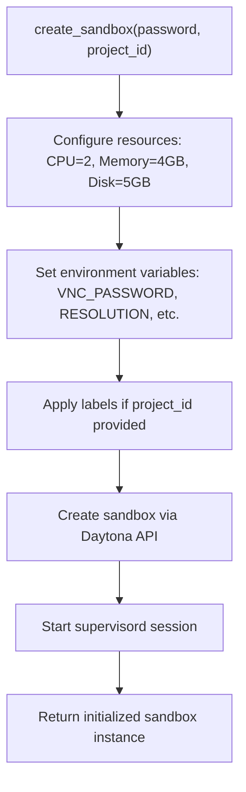
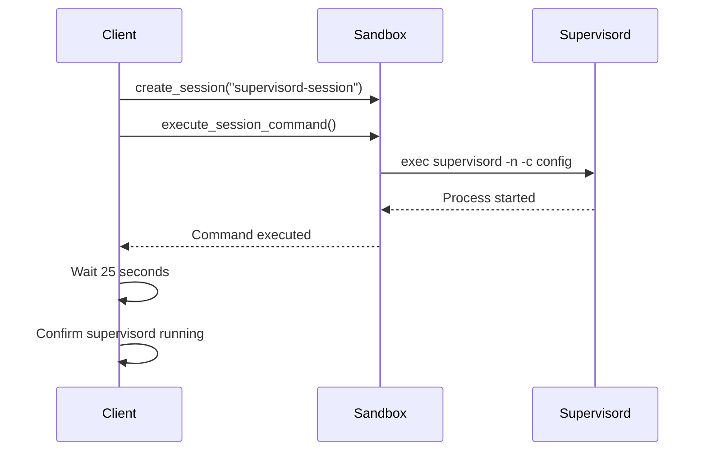

# Daytona Integration

<cite>
**Referenced Files in This Document**   
- [sandbox.py](file://app/daytona/sandbox.py)
- [tool_base.py](file://app/daytona/tool_base.py)
- [config.py](file://app/config.py)
- [config.example-daytona.toml](file://config/config.example-daytona.toml)
</cite>

## Table of Contents
1. [Introduction](#introduction)
2. [Daytona Client Initialization](#daytona-client-initialization)
3. [Sandbox Creation Process](#sandbox-creation-process)
4. [Sandbox Retrieval and Management](#sandbox-retrieval-and-management)
5. [Supervisord Session Management](#supervisord-session-management)
6. [Configuration Options](#configuration-options)
7. [Common Issues and Troubleshooting](#common-issues-and-troubleshooting)
8. [Best Practices](#best-practices)

## Introduction
The Daytona integration in OpenManus provides a cloud-based sandbox infrastructure that enables enhanced scalability and management capabilities for executing isolated tasks. This integration leverages Daytona's API to provision and manage sandboxes with specific configurations, allowing for consistent and secure execution environments. The framework supports automatic sandbox lifecycle management, including creation, retrieval, starting, stopping, and deletion of sandboxes based on project requirements.

**Section sources**
- [sandbox.py](file://app/daytona/sandbox.py#L1-L20)

## Daytona Client Initialization
The Daytona client initialization process begins by loading configuration settings from the application's configuration system. The client is configured using three essential parameters: API key, server URL, and target region. These values are extracted from the `daytona` configuration section and used to create a `DaytonaConfig` object. The API key authenticates requests to the Daytona service, while the server URL specifies the endpoint for API communications. The target region parameter determines the geographical location where sandboxes will be provisioned, with support for regions such as United States (us) and Europe (eu).

Upon initialization, the system logs the configuration status, providing feedback on whether the API key, server URL, and target region have been successfully configured. If any of these values are missing, appropriate warning messages are logged. Once the configuration is established, a Daytona client instance is created and initialized, enabling subsequent interactions with the Daytona API for sandbox management operations.

**Section sources**
- [sandbox.py](file://app/daytona/sandbox.py#L17-L40)

## Sandbox Creation Process
The `create_sandbox` function provisions new sandboxes with specific resources, environment variables, and labels. This function takes a password parameter for VNC authentication and an optional project ID for labeling purposes. When creating a sandbox, the system configures it with 2 CPU cores, 4GB of memory, and 5GB of disk space by default. The sandbox is created from a specified Docker image, which is configurable through the `sandbox_image_name` setting.

During creation, the sandbox is configured with various environment variables that control browser behavior, display resolution, and security settings. Key environment variables include `VNC_PASSWORD` for remote desktop access, `RESOLUTION` for display settings, and `CHROME_PERSISTENT_SESSION` to maintain browser state. Labels can be applied to the sandbox using the project ID, enabling better organization and identification of sandboxes associated with specific projects.

After the sandbox is created, the system automatically starts a supervisord session to manage background services within the sandbox environment. This ensures that essential services are running and monitored throughout the sandbox's lifecycle.

**Diagram sources**
- [sandbox.py](file://app/daytona/sandbox.py#L101-L146)

**Section sources**
- [sandbox.py](file://app/daytona/sandbox.py#L101-L146)

## Sandbox Retrieval and Management
The `get_or_start_sandbox` functionality provides a robust mechanism for retrieving existing sandboxes and automatically starting stopped ones. This asynchronous function takes a sandbox ID as input and attempts to retrieve the corresponding sandbox from the Daytona service. If the sandbox exists but is in a stopped or archived state, the function automatically starts it and ensures all necessary services are running.

The retrieval process includes state checking to determine if the sandbox needs to be started. When a sandbox is found in either the ARCHIVED or STOPPED state, the system initiates a start operation through the Daytona API. After starting the sandbox, the function refreshes the sandbox state and ensures that supervisord is running by creating a dedicated session. This approach ensures that sandboxes are always in a ready state when accessed, providing a seamless experience for users and applications.

The function includes comprehensive error handling to manage potential issues during retrieval or startup, logging appropriate error messages and propagating exceptions when necessary. This ensures that any problems with sandbox access are properly reported and can be addressed.

**Section sources**
- [sandbox.py](file://app/daytona/sandbox.py#L44-L76)

## Supervisord Session Management
Supervisord session management is critical for ensuring that background services run reliably within the sandbox environment. The `start_supervisord_session` function creates a dedicated session named "supervisord-session" and executes the supervisord command to manage processes. This function uses the Daytona API to create a new session and execute the command `exec /usr/bin/supervisord -n -c /etc/supervisor/conf.d/supervisord.conf` asynchronously.

The supervisord process is responsible for managing and monitoring background services within the sandbox, ensuring they remain running and can be automatically restarted if they fail. After executing the command, the function waits for 25 seconds to allow supervisord to initialize properly before returning control. This delay ensures that subsequent operations can rely on the services being available.

Error handling is implemented to catch and log any issues that occur during session creation or command execution, allowing for proper diagnosis of problems related to service management. The supervisord configuration file at `/etc/supervisor/conf.d/supervisord.conf` defines which services should be managed and their startup behavior.

**Diagram sources**
- [sandbox.py](file://app/daytona/sandbox.py#L79-L98)

**Section sources**
- [sandbox.py](file://app/daytona/sandbox.py#L79-L98)

## Configuration Options
The Daytona integration supports several configuration options that can be set in the `config.example-daytona.toml` file. Key configuration parameters include:

- **sandbox_image_name**: Specifies the Docker image used for sandbox creation. The default value is "whitezxj/sandbox:0.1.0", which includes necessary tools and services.
- **auto_stop_interval**: Determines how long (in minutes) a sandbox will run before automatically stopping. The default is set to 15 minutes.
- **VNC_password**: Sets the password for VNC access to the sandbox environment. If not specified, it defaults to "123456".
- **daytona_api_key**: Required authentication key for accessing the Daytona API.
- **daytona_server_url**: The API endpoint URL for the Daytona service.
- **daytona_target**: Specifies the target region for sandbox provisioning (e.g., "us" for United States).

These configuration options allow administrators to customize the sandbox environment according to their specific requirements, including security settings, resource allocation, and operational parameters. The configuration system also supports environment-specific settings, enabling different configurations for development, testing, and production environments.

**Section sources**
- [config.example-daytona.toml](file://config/config.example-daytona.toml#L85-L95)
- [config.py](file://app/config.py#L100-L117)

## Common Issues and Troubleshooting
Several common issues may arise when working with the Daytona integration:

**API Authentication Failures**: These occur when the `daytona_api_key` is missing or invalid. Ensure that the API key is correctly configured in the settings and has the necessary permissions. Check the application logs for authentication error messages and verify that the key hasn't expired.

**Sandbox Provisioning Timeouts**: These can happen when the Daytona service is under heavy load or network connectivity is poor. Implement retry logic with exponential backoff for sandbox creation operations. Monitor the logs for timeout errors and consider increasing the timeout threshold if necessary.

**Supervisord Startup Problems**: Issues with supervisord can prevent background services from running properly. Verify that the supervisord configuration file exists at `/etc/supervisor/conf.d/supervisord.conf` and contains valid service definitions. Check the sandbox logs for errors related to process startup and ensure that required dependencies are installed.

Additional troubleshooting steps include verifying network connectivity to the Daytona server, checking resource limits on the host system, and ensuring that the specified Docker image is accessible and contains the required tools. Monitoring logs from both the OpenManus application and the Daytona service can provide valuable insights into the root cause of issues.

**Section sources**
- [sandbox.py](file://app/daytona/sandbox.py#L44-L76)
- [sandbox.py](file://app/daytona/sandbox.py#L101-L146)
- [sandbox.py](file://app/daytona/sandbox.py#L79-L98)

## Best Practices
To effectively manage sandbox lifecycles and optimize resource usage in production environments, follow these best practices:

1. **Implement Proper Cleanup**: Always ensure that sandboxes are properly deleted when no longer needed to prevent resource exhaustion. Use the `delete_sandbox` function to remove sandboxes and free up system resources.

2. **Optimize Resource Allocation**: Configure CPU, memory, and disk resources based on actual workload requirements rather than using default values. Monitor resource usage and adjust allocations to balance performance and cost.

3. **Use Project Labels**: Apply meaningful labels to sandboxes using project IDs to facilitate organization and tracking. This makes it easier to identify and manage sandboxes associated with specific projects or tasks.

4. **Implement Connection Resilience**: Handle transient failures gracefully by implementing retry mechanisms with exponential backoff for API calls to the Daytona service.

5. **Monitor Sandbox States**: Regularly check sandbox states and implement automated recovery procedures for sandboxes that enter unexpected states.

6. **Secure Credentials**: Store API keys and passwords securely using environment variables or secret management systems rather than hardcoding them in configuration files.

7. **Limit Concurrent Sandboxes**: Implement limits on the number of concurrent sandboxes to prevent overloading the system and ensure consistent performance.

**Section sources**
- [sandbox.py](file://app/daytona/sandbox.py#L148-L164)
- [sandbox.py](file://app/daytona/sandbox.py#L101-L146)
- [tool_base.py](file://app/daytona/tool_base.py#L49-L108)