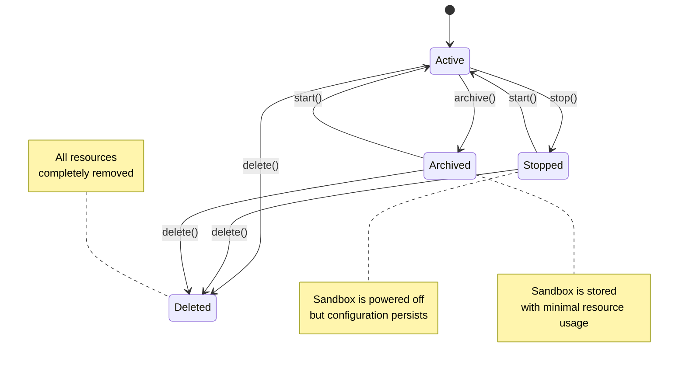
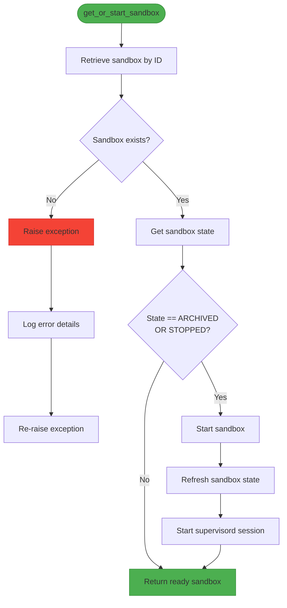
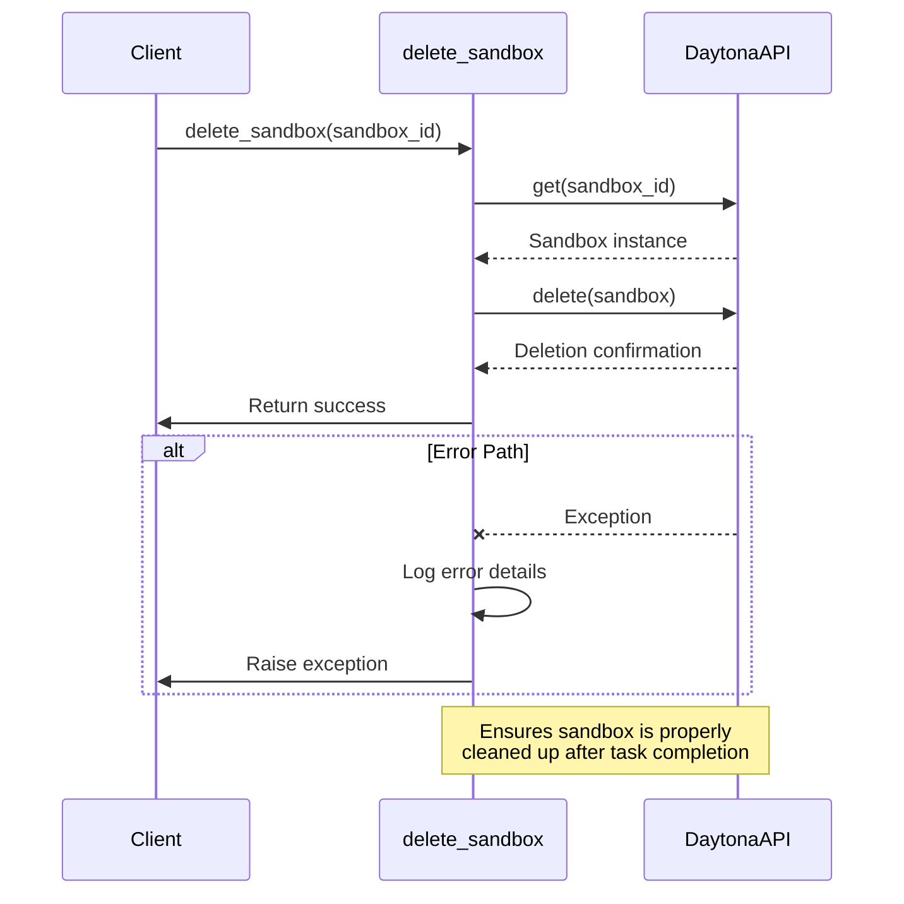

# Lifecycle Operations

<cite>
**Referenced Files in This Document**   
- [app/daytona/sandbox.py](file://app/daytona/sandbox.py)
- [app/daytona/tool_base.py](file://app/daytona/tool_base.py)
- [app/sandbox/core/manager.py](file://app/sandbox/core/manager.py)
- [app/sandbox/core/sandbox.py](file://app/sandbox/core/sandbox.py)
- [app/agent/sandbox_agent.py](file://app/agent/sandbox_agent.py)
</cite>

## Table of Contents
1. [Introduction](#introduction)
2. [Sandbox State Management](#sandbox-state-management)
3. [get_or_start_sandbox Function](#get_or_start_sandbox-function)
4. [State Checking Logic](#state-checking-logic)
5. [Start Operation Flow](#start-operation-flow)
6. [delete_sandbox Function](#delete_sandbox-function)
7. [Error Handling and Logging](#error-handling-and-logging)
8. [Integration with _ensure_sandbox](#integration-with-_ensure_sandbox)
9. [Common Issues and Solutions](#common-issues-and-solutions)
10. [Best Practices](#best-practices)

## Introduction
This document provides comprehensive documentation for sandbox lifecycle operations in OpenManus using Daytona. It details the core functions responsible for managing sandbox states, including retrieval, startup, and deletion operations. The documentation covers the implementation of automatic sandbox recovery, state validation, resource cleanup, and error resilience mechanisms that ensure reliable execution environments for agent tasks.

**Section sources**
- [app/daytona/sandbox.py](file://app/daytona/sandbox.py#L1-L20)
- [app/sandbox/core/manager.py](file://app/sandbox/core/manager.py#L1-L50)

## Sandbox State Management
The sandbox lifecycle in OpenManus is governed by the SandboxState enum from the Daytona SDK, which defines the various states a sandbox can occupy. The system specifically handles ARCHIVED and STOPPED states through automatic recovery mechanisms, ensuring that sandboxes are always available when needed. This state-aware approach enables the platform to maintain consistent execution environments while optimizing resource usage through intelligent state transitions.

**Diagram sources**
- [app/daytona/sandbox.py](file://app/daytona/sandbox.py#L44-L76)
- [app/daytona/tool_base.py](file://app/daytona/tool_base.py#L70-L115)

## get_or_start_sandbox Function
The get_or_start_sandbox function serves as the primary entry point for sandbox retrieval and initialization. It implements a lazy loading pattern that automatically handles the recovery of inactive sandboxes. When called with a sandbox ID, it first attempts to retrieve the existing sandbox instance. If the sandbox exists but is in either ARCHIVED or STOPPED state, the function automatically triggers the startup process, ensuring the sandbox is fully operational before returning it to the caller.

The function follows a robust error handling pattern, logging detailed information at each step of the process. This includes informational messages for successful operations and error messages with exception details when failures occur. The automatic startup capability eliminates the need for clients to manage sandbox state transitions manually, providing a seamless experience regardless of the sandbox's previous state.

**Section sources**
- [app/daytona/sandbox.py](file://app/daytona/sandbox.py#L44-L76)

## State Checking Logic
The state checking logic in OpenManus employs a comprehensive validation approach to ensure sandbox readiness. The system checks for two specific inactive states: ARCHIVED and STOPPED. When either state is detected, the recovery process is initiated automatically. This dual-state handling allows the system to manage both intentionally stopped sandboxes and those that have been archived for long-term storage.

The state validation occurs immediately after retrieving the sandbox instance from the Daytona API. This ensures that any state changes that may have occurred between requests are properly accounted for. The logic is implemented using direct comparison with the SandboxState enum values, providing type-safe and reliable state detection. This approach prevents invalid state transitions and ensures that only appropriate recovery actions are taken based on the current sandbox state.

**Diagram sources**
- [app/daytona/sandbox.py](file://app/daytona/sandbox.py#L55-L65)

## Start Operation Flow
The start operation flow in OpenManus involves several critical steps to ensure a fully functional sandbox environment. After detecting an inactive sandbox, the system first calls the Daytona start() method to initiate the recovery process. Following the startup command, the sandbox state is refreshed by retrieving the updated instance from the API, ensuring that the client has the most current state information.

A crucial aspect of the start operation is the initialization of supervisord through the start_supervisord_session function. This process creates a dedicated session within the sandbox and executes the supervisord command to manage background services. The function includes a 25-second delay to allow supervisord sufficient time to initialize properly, ensuring that all managed services are available before the sandbox is considered ready for use.

The start operation is wrapped in comprehensive error handling that captures and logs any failures during the startup process. This includes both API-level errors from the Daytona client and execution errors that may occur when starting supervisord. The detailed error information aids in troubleshooting startup issues and provides visibility into the recovery process.

**Section sources**
- [app/daytona/sandbox.py](file://app/daytona/sandbox.py#L66-L74)

## delete_sandbox Function
The delete_sandbox function provides a controlled mechanism for cleaning up sandbox resources after task completion. It follows a two-step process: first retrieving the sandbox instance by ID, then issuing the delete command through the Daytona client. This approach ensures that the correct sandbox is targeted for deletion and allows for proper error handling if the sandbox does not exist or cannot be deleted.

The function includes comprehensive logging at both the start and successful completion of the deletion process. In case of errors, detailed exception information is logged, including the sandbox ID and the specific error message. This logging strategy provides an audit trail for resource cleanup operations and aids in diagnosing deletion failures.

The delete operation is designed to be idempotent, meaning that attempting to delete an already deleted sandbox will not result in an error. This behavior is particularly important in distributed environments where multiple components may attempt to clean up the same resource, preventing race conditions and ensuring reliable cleanup.

**Diagram sources**
- [app/daytona/sandbox.py](file://app/daytona/sandbox.py#L149-L164)
- [app/agent/sandbox_agent.py](file://app/agent/sandbox_agent.py#L176-L185)

## Error Handling and Logging
OpenManus implements a comprehensive error handling and logging strategy for robust lifecycle management. All critical operations are wrapped in try-except blocks that capture exceptions, log detailed error information, and re-raise the exceptions to allow higher-level components to handle them appropriately. This approach ensures that errors are not silently ignored while providing sufficient context for debugging.

The logging system uses structured logging with clear message formats that include relevant identifiers such as sandbox IDs. Informational logs track the normal flow of operations, while error logs capture exception details including stack traces when available. This logging strategy provides visibility into both successful operations and failure scenarios, enabling effective monitoring and troubleshooting.

Special attention is given to error handling during sandbox startup and deletion operations, as these are critical lifecycle events. The system logs specific error messages for different failure points, such as API connectivity issues, authentication failures, or resource allocation problems. This granular error reporting helps identify the root cause of issues and supports rapid resolution.

**Section sources**
- [app/daytona/sandbox.py](file://app/daytona/sandbox.py#L75-L76)
- [app/daytona/sandbox.py](file://app/daytona/sandbox.py#L162-L164)

## Integration with _ensure_sandbox
The _ensure_sandbox method in SandboxToolsBase provides a class-level integration point for lazy initialization of sandboxes. This method serves as a gateway for all sandbox operations within tool classes, ensuring that a valid sandbox instance is available before any operation proceeds. When the _sandbox attribute is None, it creates a new sandbox using the create_sandbox function, establishing a fresh execution environment.

For existing sandboxes that are in inactive states (ARCHIVED or STOPPED), the method follows the same recovery pattern as get_or_start_sandbox, calling the Daytona start() method and initializing supervisord. This consistent approach to sandbox recovery ensures uniform behavior across different components of the system.

The method includes additional functionality beyond basic sandbox management, such as printing VNC and website URLs when a new sandbox is created. This feature provides immediate access to the sandbox environment for debugging and monitoring purposes. The _urls_printed class variable ensures that these URLs are only printed once per process, preventing redundant output in multi-tool scenarios.

**Section sources**
- [app/daytona/tool_base.py](file://app/daytona/tool_base.py#L70-L115)

## Common Issues and Solutions
OpenManus addresses several common issues in sandbox lifecycle management through proactive design patterns and defensive programming. Stale sandbox states are mitigated by refreshing the sandbox instance after startup operations, ensuring that the client has the most current state information. This approach prevents issues that could arise from working with outdated state data.

Deletion failures are handled through comprehensive error logging and exception propagation, allowing higher-level components to implement retry logic or alternative cleanup strategies. The system also addresses race conditions during startup by using the Daytona API's built-in concurrency controls and state validation, preventing multiple simultaneous startup attempts on the same sandbox.

Resource leaks are prevented through the use of context managers and proper cleanup procedures. The DockerSandbox class implements async context manager protocols (__aenter__ and __aexit__) that ensure resources are properly cleaned up even if exceptions occur during execution. The SandboxManager class provides additional protection through automatic cleanup of idle sandboxes based on configurable timeout settings.

**Section sources**
- [app/sandbox/core/manager.py](file://app/sandbox/core/manager.py#L277-L289)
- [app/sandbox/core/sandbox.py](file://app/sandbox/core/sandbox.py#L424-L453)

## Best Practices
Implementing effective sandbox lifecycle management in OpenManus requires adherence to several best practices. For graceful shutdowns, components should properly close their sandbox connections and release resources through the cleanup methods provided by the sandbox classes. This ensures that all processes are terminated cleanly and resources are freed promptly.

When handling interruptions, components should implement retry logic with exponential backoff for transient failures, particularly during sandbox startup and deletion operations. This approach improves resilience in distributed environments where temporary network issues or resource constraints may occur.

Managing sandbox state in distributed environments requires careful coordination to prevent race conditions. Components should always verify the current state before performing operations and use the provided state management functions rather than implementing custom state handling logic. This ensures consistency across the system and leverages the tested recovery mechanisms provided by the platform.

Monitoring and logging are essential for maintaining system health. Components should log significant state changes and operations, providing visibility into sandbox usage patterns and potential issues. The built-in logging in the lifecycle functions should be supplemented with application-specific logs that provide context for sandbox usage within specific workflows.

**Section sources**
- [app/sandbox/core/manager.py](file://app/sandbox/core/manager.py#L200-L250)
- [app/sandbox/core/sandbox.py](file://app/sandbox/core/sandbox.py#L455-L461)