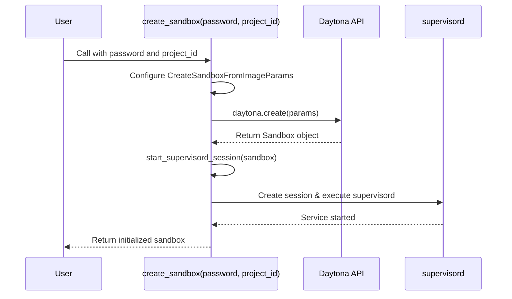

# Sandbox Provisioning

<cite>
**Referenced Files in This Document**   
- [app/daytona/sandbox.py](file://app/daytona/sandbox.py)
- [config/config.example-daytona.toml](file://config/config.example-daytona.toml)
- [app/sandbox/core/manager.py](file://app/sandbox/core/manager.py)
- [app/sandbox/client.py](file://app/sandbox/client.py)
</cite>

## Table of Contents
1. [Introduction](#introduction)
2. [Core Sandbox Creation Function](#core-sandbox-creation-function)
3. [Sandbox Configuration Parameters](#sandbox-configuration-parameters)
4. [Environment Variables for Browser and VNC](#environment-variables-for-browser-and-vnc)
5. [Resource Allocation Settings](#resource-allocation-settings)
6. [Lifecycle Management: Auto-Stop and Auto-Archive](#lifecycle-management-auto-stop-and-auto-archive)
7. [Configuration via config.toml](#configuration-via-configtoml)
8. [Sandbox Image and Label Management](#sandbox-image-and-label-management)
9. [Session Initialization with Supervisord](#session-initialization-with-supervisord)
10. [Common Issues and Troubleshooting](#common-issues-and-troubleshooting)
11. [Best Practices for Sandbox Optimization](#best-practices-for-sandbox-optimization)

## Introduction
The OpenManus platform leverages Daytona to provide isolated, secure, and reproducible sandbox environments for automated browser interactions, data analysis, and tool execution. These sandboxes are containerized environments that encapsulate all necessary tools, dependencies, and configurations required for agent operations. This document details the sandbox provisioning process, focusing on the `create_sandbox` function, its parameters, configuration options, and lifecycle management mechanisms.

**Section sources**
- [app/daytona/sandbox.py](file://app/daytona/sandbox.py#L101-L146)

## Core Sandbox Creation Function
The `create_sandbox` function in the Daytona integration module is responsible for instantiating a fully configured sandbox environment. It accepts two primary parameters: `password` for VNC access and an optional `project_id` used for labeling and tracking purposes. The function orchestrates the creation of a sandbox using a predefined Docker image, configures environment variables for browser automation and VNC, allocates system resources, and initializes essential background services.



**Diagram sources**
- [app/daytona/sandbox.py](file://app/daytona/sandbox.py#L101-L146)
- [app/daytona/sandbox.py](file://app/daytona/sandbox.py#L79-L98)

**Section sources**
- [app/daytona/sandbox.py](file://app/daytona/sandbox.py#L101-L146)

## Sandbox Configuration Parameters
The sandbox creation process is defined by the `CreateSandboxFromImageParams` object, which encapsulates all configuration aspects of the sandbox. Key parameters include the Docker image name, public accessibility, labels, environment variables, resource allocation, and lifecycle policies. The `project_id` parameter, when provided, is used to set a label (`"id": project_id`) on the sandbox, enabling better tracking and management of sandboxes associated with specific projects or workflows.

**Section sources**
- [app/daytona/sandbox.py](file://app/daytona/sandbox.py#L101-L146)

## Environment Variables for Browser and VNC
A comprehensive set of environment variables is injected into the sandbox to configure browser automation and VNC access:

- **`VNC_PASSWORD`**: Sets the password for VNC connections, ensuring secure remote desktop access.
- **`RESOLUTION`, `RESOLUTION_WIDTH`, `RESOLUTION_HEIGHT`**: Define the display resolution of the virtual desktop (default: 1024x768x24).
- **`CHROME_PERSISTENT_SESSION`**: When set to `"true"`, ensures Chrome browser sessions persist across restarts.
- **`ANONYMIZED_TELEMETRY`**: Controls whether telemetry data is collected (set to `"false"` by default).
- **`CHROME_DEBUGGING_PORT` and `CHROME_DEBUGGING_HOST`**: Configure the Chrome DevTools Protocol (CDP) endpoint for browser automation.

These variables are crucial for enabling headless browser automation and providing a consistent user interface for debugging via VNC.

**Section sources**
- [app/daytona/sandbox.py](file://app/daytona/sandbox.py#L101-L146)

## Resource Allocation Settings
Resource allocation is managed through the `Resources` object within the `CreateSandboxFromImageParams`. The default configuration allocates:
- **CPU**: 2 cores
- **Memory**: 4 GB
- **Disk**: 5 GB

These values represent a balanced configuration suitable for running browser-based automation and data processing tasks. The resource limits ensure that each sandbox has sufficient computational power while preventing any single instance from monopolizing host resources.

**Section sources**
- [app/daytona/sandbox.py](file://app/daytona/sandbox.py#L101-L146)

## Lifecycle Management: Auto-Stop and Auto-Archive
The sandbox lifecycle is governed by two key intervals:
- **`auto_stop_interval=15`**: The sandbox will automatically stop after 15 minutes of inactivity. This prevents unnecessary resource consumption when the sandbox is not actively being used.
- **`auto_archive_interval=24 * 60`**: After 24 hours (1440 minutes), the sandbox will be automatically archived. Archiving preserves the sandbox state for potential recovery while freeing up active resources.

These policies ensure efficient resource utilization and automatic cleanup of long-running or forgotten sandboxes.

**Section sources**
- [app/daytona/sandbox.py](file://app/daytona/sandbox.py#L101-L146)

## Configuration via config.toml
The Daytona integration is configured through the `config.example-daytona.toml` file, which contains the following relevant settings:

- **`daytona_api_key`**: Authentication key for the Daytona API.
- **`daytona_server_url`**: Base URL of the Daytona server (e.g., `https://app.daytona.io/api`).
- **`daytona_target`**: Geographic region for the sandbox (e.g., `us` for United States).
- **`sandbox_image_name`**: The Docker image used for sandbox creation (default: `whitezxj/sandbox:0.1.0`).
- **`sandbox_entrypoint`**: The command executed to start services within the sandbox (default: supervisord).
- **`VNC_password`**: Default VNC password (if not provided, defaults to `123456`).

These settings allow for environment-specific configuration without modifying the application code.

**Section sources**
- [config/config.example-daytona.toml](file://config/config.example-daytona.toml#L85-L95)

## Sandbox Image and Label Management
The sandbox environment is created from a pre-built Docker image specified by `daytona_settings.sandbox_image_name`. The `ensure_image` method in `SandboxManager` checks for the image's presence locally and pulls it from the registry if necessary. Labels, derived from the optional `project_id`, are used to tag the sandbox, facilitating organization and filtering within the Daytona dashboard or API.

```mermaid
flowchart TD
A["create_sandbox(password, project_id)"] --> B{"project_id provided?"}
B --> |Yes| C[Set labels = {\"id\": project_id}]
B --> |No| D[labels = None]
C --> E[params = CreateSandboxFromImageParams(..., labels=labels)]
D --> E
E --> F[daytona.create(params)]
F --> G[Sandbox created with labels]
```

**Diagram sources**
- [app/daytona/sandbox.py](file://app/daytona/sandbox.py#L101-L146)
- [app/sandbox/core/manager.py](file://app/sandbox/core/manager.py#L64-L85)

**Section sources**
- [app/daytona/sandbox.py](file://app/daytona/sandbox.py#L101-L146)
- [app/sandbox/core/manager.py](file://app/sandbox/core/manager.py#L64-L85)

## Session Initialization with Supervisord
After the sandbox is created, the `start_supervisord_session` function is called to initialize the `supervisord` process manager inside the sandbox. This is done by creating a named session (`supervisord-session`) and executing the command `/usr/bin/supervisord -n -c /etc/supervisor/conf.d/supervisord.conf`. Supervisord is responsible for managing and monitoring critical background services such as the VNC server, Chrome browser, and other automation tools, ensuring they remain running throughout the sandbox's lifecycle.

**Section sources**
- [app/daytona/sandbox.py](file://app/daytona/sandbox.py#L79-L98)

## Common Issues and Troubleshooting
Several common issues can arise during sandbox provisioning:

- **Image Pull Failures**: Occur when the Docker image specified in `sandbox_image_name` is not accessible or has been removed from the registry. Ensure the image name is correct and the registry is reachable.
- **Resource Quota Limits**: The `SandboxManager` enforces a maximum limit (`max_sandboxes=100`) on concurrent sandboxes. Exceeding this limit will raise a `RuntimeError`. Adjust the limit in the manager configuration if needed.
- **Environment Variable Misconfiguration**: Incorrect VNC password or resolution settings can prevent proper access. Verify that environment variables in `create_sandbox` match the expected values in the sandbox image.
- **API Key or Server URL Issues**: Missing or incorrect `daytona_api_key` or `daytona_server_url` will prevent communication with the Daytona service. Check the `config.toml` file for correct values.

**Section sources**
- [app/daytona/sandbox.py](file://app/daytona/sandbox.py#L101-L146)
- [app/sandbox/core/manager.py](file://app/sandbox/core/manager.py#L113-L156)
- [config/config.example-daytona.toml](file://config/config.example-daytona.toml#L85-L95)

## Best Practices for Sandbox Optimization
To ensure optimal performance and reliability:
- **Use the Recommended Image**: Stick to the default `whitezxj/sandbox:0.1.0` image to guarantee compatibility with all sandbox tools.
- **Set Meaningful Labels**: Always provide a `project_id` to enable better tracking and debugging.
- **Monitor Resource Usage**: Adjust CPU, memory, and disk allocations based on workload requirements to balance performance and cost.
- **Handle VNC Password Securely**: Avoid using default passwords in production; always pass a secure password via the `create_sandbox` function.
- **Implement Proper Cleanup**: Ensure that sandboxes are properly deleted after use to free up resources, especially in long-running applications.

Following these practices will result in faster startup times, improved stability, and more efficient resource utilization.

**Section sources**
- [app/daytona/sandbox.py](file://app/daytona/sandbox.py#L101-L146)
- [config/config.example-daytona.toml](file://config/config.example-daytona.toml#L85-L95)
- [app/sandbox/core/manager.py](file://app/sandbox/core/manager.py#L113-L156)