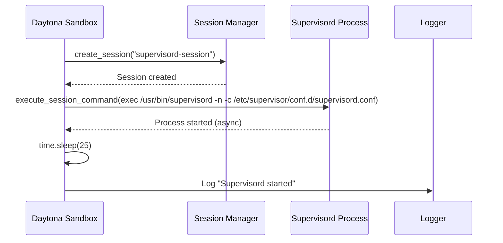
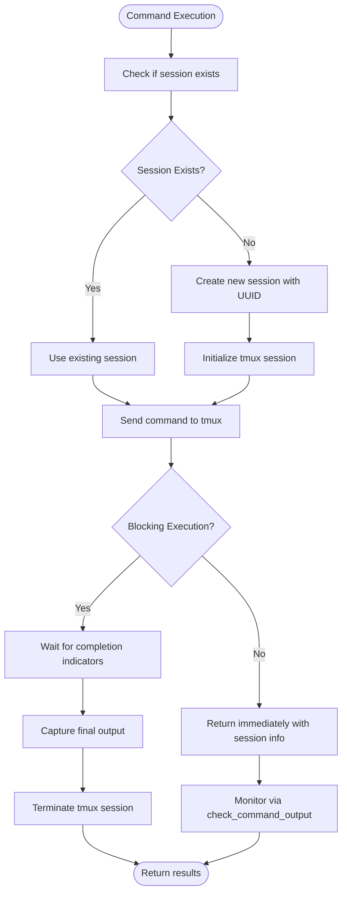
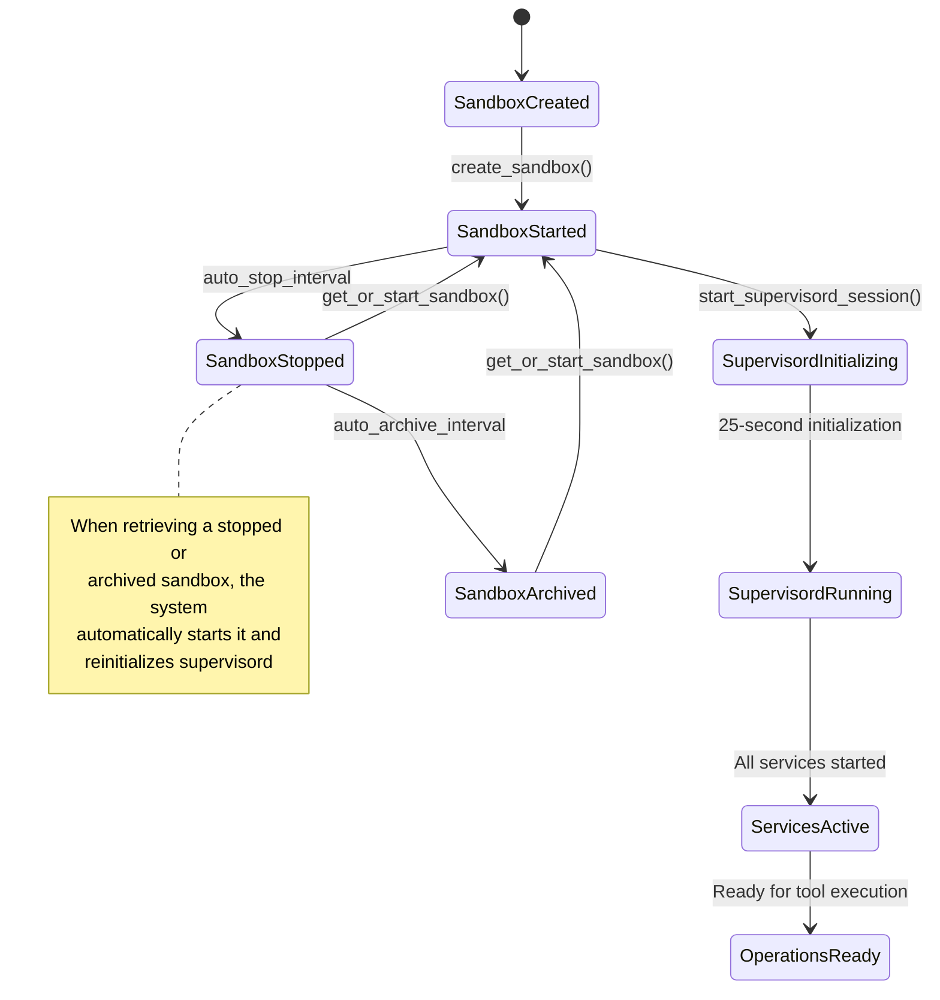

# Session Management

<cite>
**Referenced Files in This Document**   
- [sandbox.py](file://app/daytona/sandbox.py)
- [sb_shell_tool.py](file://app/tool/sandbox/sb_shell_tool.py)
- [sandbox_agent.py](file://app/agent/sandbox_agent.py)
- [terminal.py](file://app/sandbox/core/terminal.py)
- [manager.py](file://app/sandbox/core/manager.py)
</cite>

## Table of Contents
1. [Introduction](#introduction)
2. [Session Creation and Management](#session-creation-and-management)
3. [Supervisord Session Initialization](#supervisord-session-initialization)
4. [Command Execution and Process Management](#command-execution-and-process-management)
5. [Sandbox State and Session Lifecycle](#sandbox-state-and-session-lifecycle)
6. [Error Handling and Common Issues](#error-handling-and-common-issues)
7. [Best Practices](#best-practices)

## Introduction
Session management in Daytona sandboxes within OpenManus is critical for maintaining long-running background services and ensuring consistent execution environments for browser and server tools. This document details the implementation of session management, focusing on the `start_supervisord_session` function that orchestrates critical service initialization. The system ensures reliable operation of tools requiring persistent processes through structured session creation, command execution, and lifecycle management.

## Session Creation and Management
Session management in OpenManus enables stateful execution of commands within Daytona sandboxes, allowing for persistent processes and maintaining context between operations. Sessions are created with unique identifiers and managed through the sandbox's process interface.

The system uses named sessions to organize different types of operations, with special handling for critical system services like supervisord. Each session provides an isolated environment for command execution while maintaining state through tmux sessions, which is essential for long-running processes such as web servers and browser automation tools.

**Section sources**
- [sb_shell_tool.py](file://app/tool/sandbox/sb_shell_tool.py#L83-L111)
- [sandbox.py](file://app/daytona/sandbox.py#L79-L98)

## Supervisord Session Initialization
The `start_supervisord_session` function is responsible for initializing the supervisord process manager within a dedicated session, ensuring that critical background services are properly started and monitored.

**Diagram sources**
- [sandbox.py](file://app/daytona/sandbox.py#L79-L98)

**Section sources**
- [sandbox.py](file://app/daytona/sandbox.py#L79-L98)
- [README.md](file://app/daytona/README.md#L0-L57)

The function creates a session named "supervisord-session" and executes the supervisord command with specific parameters:
- Uses `exec` to replace the current process
- Runs in non-daemon mode with the `-n` flag
- Specifies the configuration file location via `-c /etc/supervisor/conf.d/supervisord.conf`

The 25-second delay (`time.sleep(25)`) is implemented to ensure that supervisord has sufficient time to initialize all configured services before subsequent operations proceed. This delay is critical because supervisord manages multiple background processes including web servers and browser instances that need to be fully operational before being accessed.

## Command Execution and Process Management
Command execution within sessions is designed to support both blocking and non-blocking operations, with special consideration for long-running processes required by browser and server tools.

**Diagram sources**
- [sb_shell_tool.py](file://app/tool/sandbox/sb_shell_tool.py#L200-L300)

**Section sources**
- [sb_shell_tool.py](file://app/tool/sandbox/sb_shell_tool.py#L83-L111)
- [terminal.py](file://app/sandbox/core/terminal.py#L122-L164)

The system integrates with tmux for process management, allowing commands to run in detached sessions. This approach enables:
- Persistence of long-running processes across multiple tool calls
- Non-blocking execution for server startup and build processes
- State maintenance between related commands
- Output retrieval at a later time through session monitoring

## Sandbox State and Session Lifecycle
The relationship between sandbox state and session lifecycle is tightly coupled, with session management adapting to the current state of the sandbox environment.

**Diagram sources**
- [sandbox.py](file://app/daytona/sandbox.py#L44-L76)
- [sandbox.py](file://app/daytona/sandbox.py#L101-L146)

**Section sources**
- [sandbox.py](file://app/daytona/sandbox.py#L44-L84)
- [manager.py](file://app/sandbox/core/manager.py#L113-L156)

When a sandbox is created or restarted, the following sequence occurs:
1. The sandbox is instantiated with configured resources and environment variables
2. The `create_sandbox` function calls `start_supervisord_session` immediately after creation
3. For existing sandboxes that were stopped or archived, `get_or_start_sandbox` detects the state and triggers restart with supervisord initialization
4. The 25-second delay ensures service stability before further operations

## Error Handling and Common Issues
The system implements comprehensive error handling for session management operations, with specific attention to common failure modes in sandbox environments.

**Common Issues and Solutions:**

| Issue | Symptoms | Resolution |
|------|---------|------------|
| **Supervisord startup failure** | Timeout errors, missing services | Verify configuration file, check resource allocation, validate image integrity |
| **Session timeout** | Connection resets, lost state | Implement proper session cleanup, increase timeout thresholds, ensure keep-alive mechanisms |
| **Command execution errors** | Non-zero exit codes, incomplete output | Validate command syntax, check dependencies, verify working directory |
| **Resource exhaustion** | Slow performance, failed allocations | Monitor CPU/memory usage, optimize resource requests, implement cleanup policies |

The error handling strategy includes:
- Comprehensive logging of session operations
- Exception propagation with contextual information
- Automatic cleanup of failed sessions
- Retry mechanisms for transient failures

**Section sources**
- [sandbox.py](file://app/daytona/sandbox.py#L79-L98)
- [sb_shell_tool.py](file://app/tool/sandbox/sb_shell_tool.py#L200-L300)

## Best Practices
Effective session management in OpenManus requires adherence to several best practices to ensure reliability and performance:

1. **Session Lifetime Management**
   - Always clean up sessions when no longer needed
   - Use descriptive session names for related operations
   - Implement timeout mechanisms for long-running operations

2. **Supervisord Configuration**
   - Maintain the 25-second initialization delay to ensure service stability
   - Keep the default entrypoint configuration to ensure compatibility
   - Regularly validate the supervisord configuration file

3. **Error Recovery**
   - Implement retry logic for transient failures
   - Monitor sandbox state before critical operations
   - Use the `get_or_start_sandbox` function to ensure sandbox availability

4. **Performance Optimization**
   - Minimize the number of concurrent sandboxes
   - Implement proper resource allocation based on workload
   - Use non-blocking execution for long-running processes

5. **Debugging Strategies**
   - Check supervisord logs for service startup issues
   - Verify network connectivity between components
   - Monitor resource utilization during peak operations
   - Use the VNC interface to visually inspect sandbox state

Following these practices ensures reliable operation of the Daytona sandbox environment and maximizes the effectiveness of the session management system.

**Section sources**
- [sandbox.py](file://app/daytona/sandbox.py#L79-L98)
- [sb_shell_tool.py](file://app/tool/sandbox/sb_shell_tool.py#L83-L111)
- [sandbox_agent.py](file://app/agent/sandbox_agent.py#L71-L106)