# Execution Environment

<cite>
**Referenced Files in This Document**   
- [DockerSandbox](file://app/sandbox/core/sandbox.py)
- [SandboxManager](file://app/sandbox/core/manager.py)
- [AsyncDockerizedTerminal](file://app/sandbox/core/terminal.py)
- [SandboxSettings](file://app/config.py)
- [create_sandbox](file://app/daytona/sandbox.py)
- [LocalSandboxClient](file://app/sandbox/client.py)
</cite>

## Table of Contents
1. [Sandbox Architecture](#sandbox-architecture)
2. [Core Components](#core-components)
3. [Resource Limitations and Security Model](#resource-limitations-and-security-model)
4. [Daytona Integration](#daytona-integration)
5. [Configuration Options](#configuration-options)
6. [Common Issues and Troubleshooting](#common-issues-and-troubleshooting)
7. [Performance Optimization and Security Best Practices](#performance-optimization-and-security-best-practices)

## Sandbox Architecture

The OpenManus execution environment provides isolated code execution through Docker containerization, ensuring secure and controlled execution of untrusted code. The architecture is built around three core components: DockerSandbox, SandboxManager, and AsyncDockerizedTerminal, which work together to create, manage, and interact with isolated execution environments.

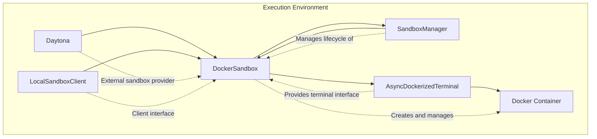

**Diagram sources**
- [DockerSandbox](file://app/sandbox/core/sandbox.py)
- [SandboxManager](file://app/sandbox/core/manager.py)
- [AsyncDockerizedTerminal](file://app/sandbox/core/terminal.py)

**Section sources**
- [DockerSandbox](file://app/sandbox/core/sandbox.py)
- [SandboxManager](file://app/sandbox/core/manager.py)

## Core Components

The execution environment consists of three primary components that handle different aspects of sandbox management and interaction.

### DockerSandbox Class

The DockerSandbox class represents an isolated execution environment within a Docker container. It provides the fundamental capabilities for containerized code execution, including command execution, file operations, and resource management. The sandbox is initialized with configuration parameters that define its behavior and resource constraints.

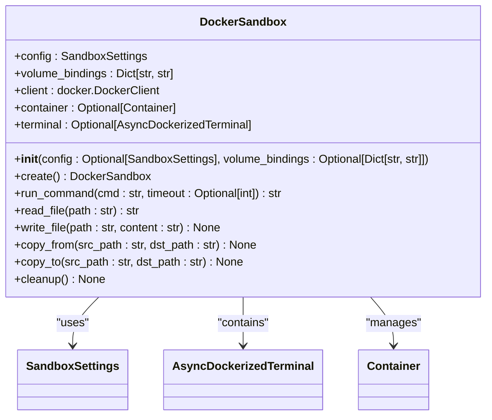

**Diagram sources**
- [DockerSandbox](file://app/sandbox/core/sandbox.py#L0-L46)

**Section sources**
- [DockerSandbox](file://app/sandbox/core/sandbox.py)

### SandboxManager Class

The SandboxManager class handles the lifecycle management of multiple DockerSandbox instances. It provides centralized control over sandbox creation, monitoring, and cleanup, ensuring efficient resource utilization and preventing resource exhaustion.

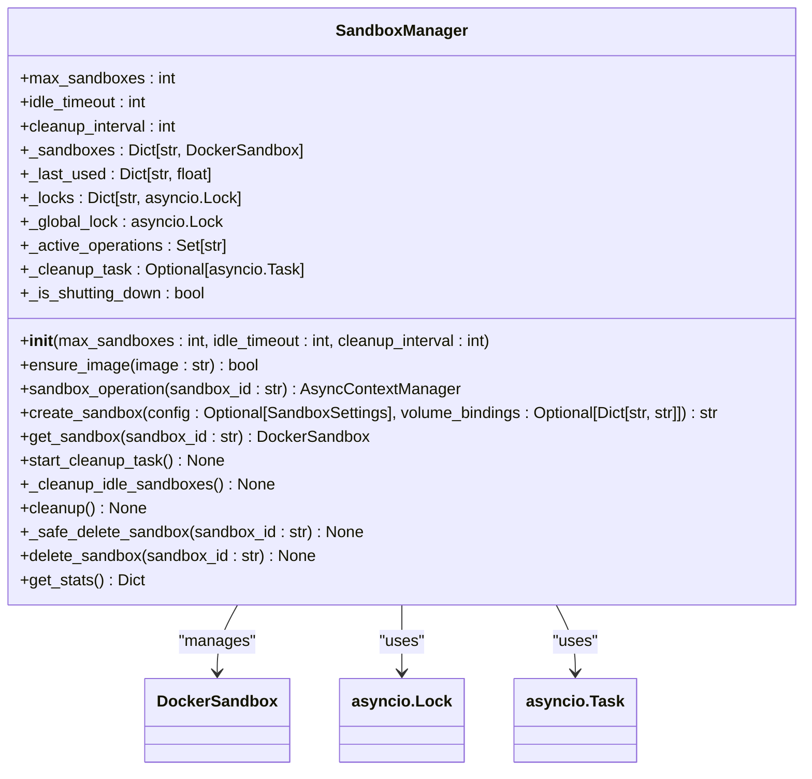

**Diagram sources**
- [SandboxManager](file://app/sandbox/core/manager.py#L0-L46)

**Section sources**
- [SandboxManager](file://app/sandbox/core/manager.py)

### AsyncDockerizedTerminal Class

The AsyncDockerizedTerminal class provides an asynchronous interface for executing commands within a Docker container. It manages the terminal session, handles command execution, and ensures proper cleanup of resources.

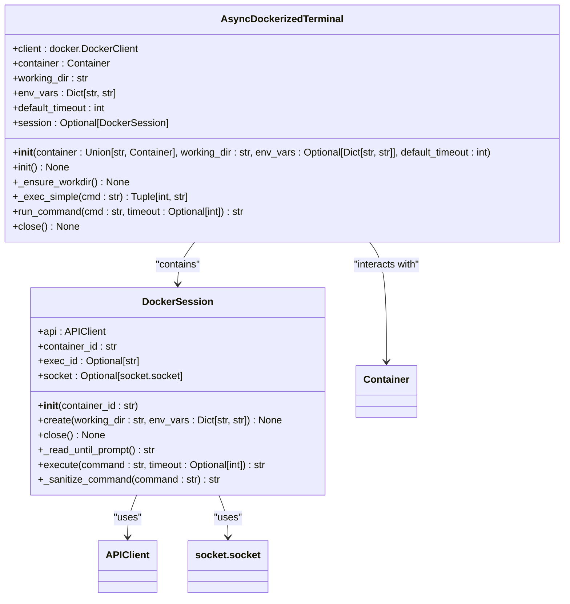

**Diagram sources**
- [AsyncDockerizedTerminal](file://app/sandbox/core/terminal.py#L0-L50)

**Section sources**
- [AsyncDockerizedTerminal](file://app/sandbox/core/terminal.py)

## Resource Limitations and Security Model

The execution environment implements comprehensive resource limitations and security measures to ensure safe and controlled code execution.

### Resource Limitations

The DockerSandbox class enforces resource limitations through Docker container configuration. These limitations are defined in the SandboxSettings configuration and applied during container creation.

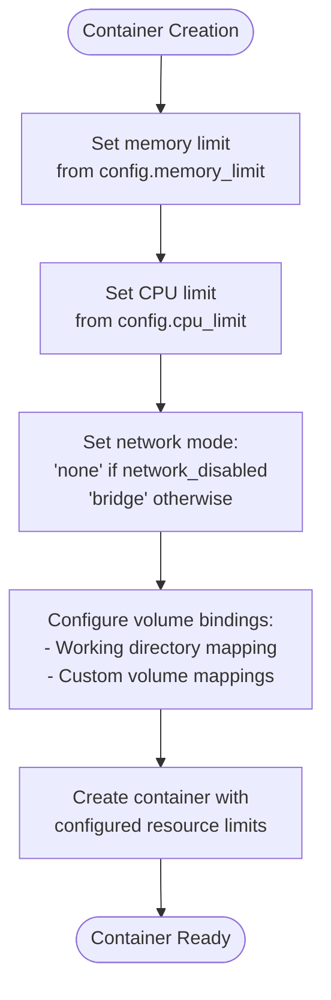

**Diagram sources**
- [DockerSandbox](file://app/sandbox/core/sandbox.py#L48-L87)

**Section sources**
- [DockerSandbox](file://app/sandbox/core/sandbox.py)
- [SandboxSettings](file://app/config.py)

### Security Model

The execution environment implements multiple layers of security to prevent malicious activities and ensure isolation.

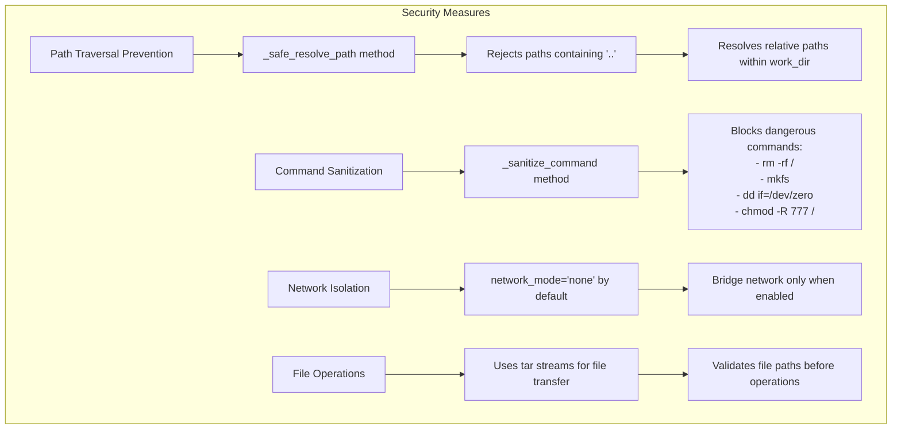

**Diagram sources**
- [DockerSandbox](file://app/sandbox/core/sandbox.py#L218-L259)
- [AsyncDockerizedTerminal](file://app/sandbox/core/terminal.py#L212-L258)

**Section sources**
- [DockerSandbox](file://app/sandbox/core/sandbox.py)
- [AsyncDockerizedTerminal](file://app/sandbox/core/terminal.py)

## Daytona Integration

The execution environment integrates with Daytona for workspace and session management, providing enhanced capabilities for remote sandbox operations.

### Daytona Sandbox Management

The Daytona integration allows for the creation and management of sandboxes through the Daytona platform, enabling persistent workspaces and advanced session management.

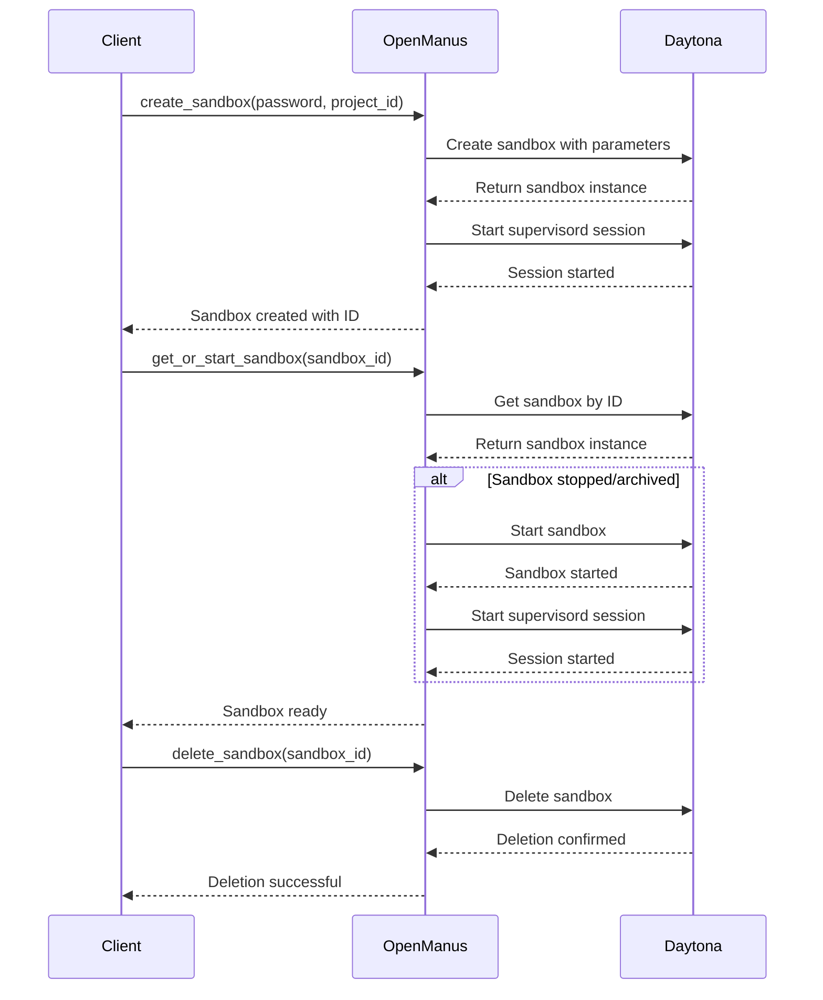

**Diagram sources**
- [create_sandbox](file://app/daytona/sandbox.py#L107-L164)
- [get_or_start_sandbox](file://app/daytona/sandbox.py#L52-L85)
- [delete_sandbox](file://app/daytona/sandbox.py#L147-L164)

**Section sources**
- [create_sandbox](file://app/daytona/sandbox.py)
- [get_or_start_sandbox](file://app/daytona/sandbox.py)
- [delete_sandbox](file://app/daytona/sandbox.py)

### Configuration and Environment Variables

The Daytona integration uses specific configuration parameters and environment variables to customize sandbox behavior.

```mermaid
flowchart TD
subgraph "Daytona Configuration"
A[CreateSandboxFromImageParams] --> B["image: sandbox_image_name"]
A --> C["public: true"]
A --> D["labels: {id: project_id}"]
A --> E["env_vars: CHROME_PERSISTENT_SESSION, RESOLUTION, VNC_PASSWORD, etc."]
A --> F["resources: CPU=2, Memory=4GB, Disk=5GB"]
A --> G["auto_stop_interval: 15 minutes"]
A --> H["auto_archive_interval: 24 hours"]
end
subgraph "Environment Variables"
I[CHROME_PERSISTENT_SESSION: "true"] --> J[Enables persistent Chrome session]
K[RESOLUTION: "1024x768x24"] --> L[Sets display resolution]
M[VNC_PASSWORD: password] --> N[Sets VNC access password]
O[ANONYMIZED_TELEMETRY: "false"] --> P[Disables telemetry]
end
```

**Diagram sources**
- [create_sandbox](file://app/daytona/sandbox.py#L107-L164)

**Section sources**
- [create_sandbox](file://app/daytona/sandbox.py)
- [DaytonaSettings](file://app/config.py)

## Configuration Options

The execution environment provides extensive configuration options for customizing sandbox behavior, resource limits, and storage settings.

### Container Image Configuration

The sandbox environment can be configured to use different container images based on the requirements of the execution environment.

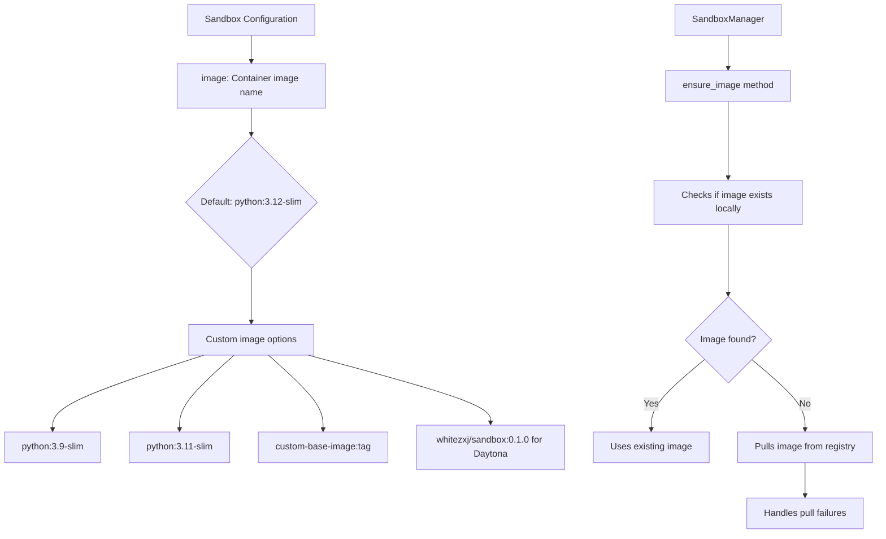

**Diagram sources**
- [SandboxSettings](file://app/config.py#L93-L110)
- [SandboxManager](file://app/sandbox/core/manager.py#L48-L94)

**Section sources**
- [SandboxSettings](file://app/config.py)
- [SandboxManager](file://app/sandbox/core/manager.py)

### Resource Limits Configuration

Resource limits can be configured to control the computational resources available to each sandbox instance.

```mermaid
flowchart TD
A[SandboxSettings] --> B["memory_limit: Memory allocation"]
B --> C{Default: 512m}
C --> D[Examples: 1g, 2g, 512m]
A --> E["cpu_limit: CPU allocation"]
E --> F{Default: 1.0}
F --> G[Examples: 0.5 (50% of one CPU), 2.0 (2 CPUs)]
A --> H["timeout: Command execution timeout"]
H --> I{Default: 300 seconds}
I --> J[Custom values: 60, 600, 1800]
A --> K["network_enabled: Network access"]
K --> L{Default: false}
L --> M[true: Bridge network]
L --> N[false: No network]
```

**Diagram sources**
- [SandboxSettings](file://app/config.py#L93-L110)
- [DockerSandbox](file://app/sandbox/core/sandbox.py#L48-L87)

**Section sources**
- [SandboxSettings](file://app/config.py)
- [DockerSandbox](file://app/sandbox/core/sandbox.py)

### Persistent Storage Configuration

The execution environment supports persistent storage through volume bindings, allowing data to persist beyond the lifecycle of individual sandbox instances.

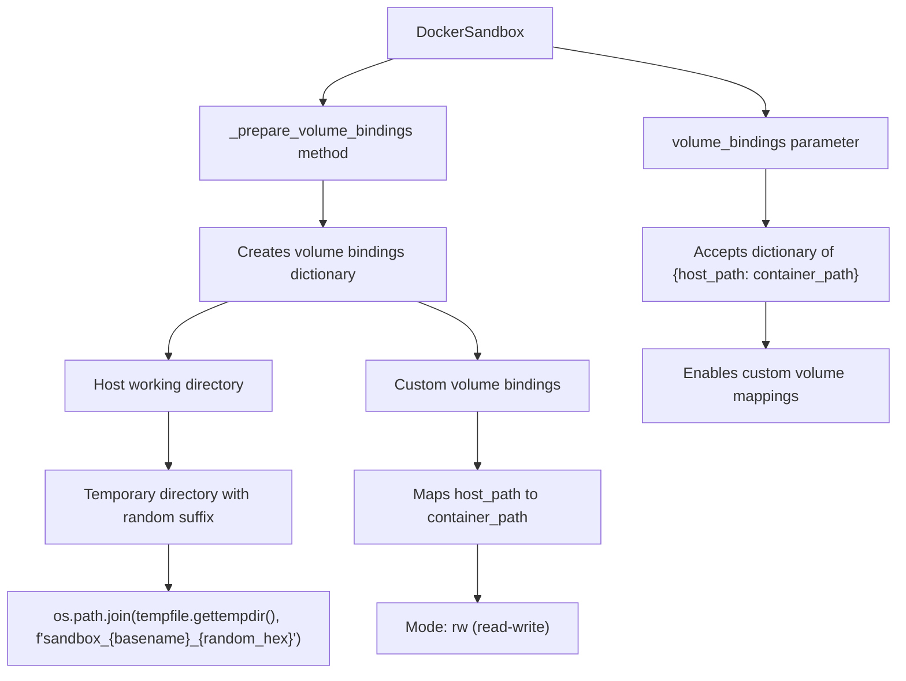

**Diagram sources**
- [DockerSandbox](file://app/sandbox/core/sandbox.py#L89-L127)

**Section sources**
- [DockerSandbox](file://app/sandbox/core/sandbox.py)

## Common Issues and Troubleshooting

This section addresses common issues that may occur when working with the execution environment and provides troubleshooting guidance.

### Container Startup Failures

Container startup failures can occur due to various reasons, including missing images, resource constraints, or configuration issues.

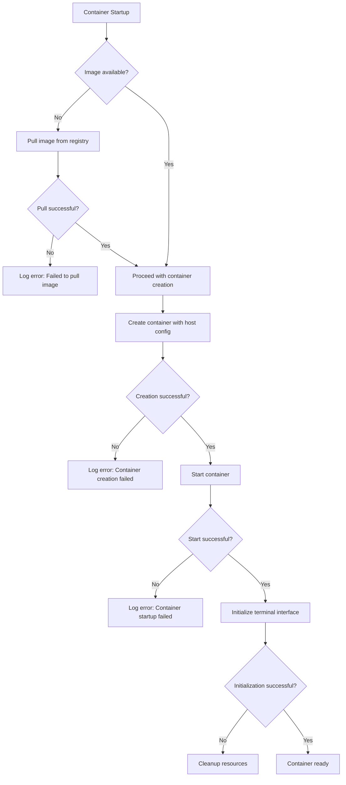

**Diagram sources**
- [DockerSandbox](file://app/sandbox/core/sandbox.py#L48-L87)
- [SandboxManager](file://app/sandbox/core/manager.py#L136-L174)

**Section sources**
- [DockerSandbox](file://app/sandbox/core/sandbox.py)
- [SandboxManager](file://app/sandbox/core/manager.py)

### Resource Exhaustion

Resource exhaustion can occur when the system runs out of memory, CPU, or when the maximum number of sandboxes is reached.

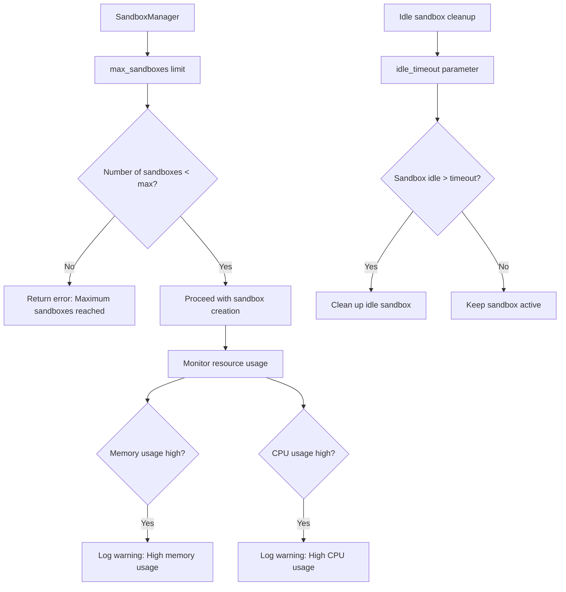

**Diagram sources**
- [SandboxManager](file://app/sandbox/core/manager.py#L96-L134)
- [SandboxManager](file://app/sandbox/core/manager.py#L210-L244)

**Section sources**
- [SandboxManager](file://app/sandbox/core/manager.py)

### Network Connectivity Problems

Network connectivity issues can arise due to the default network isolation settings or configuration problems.

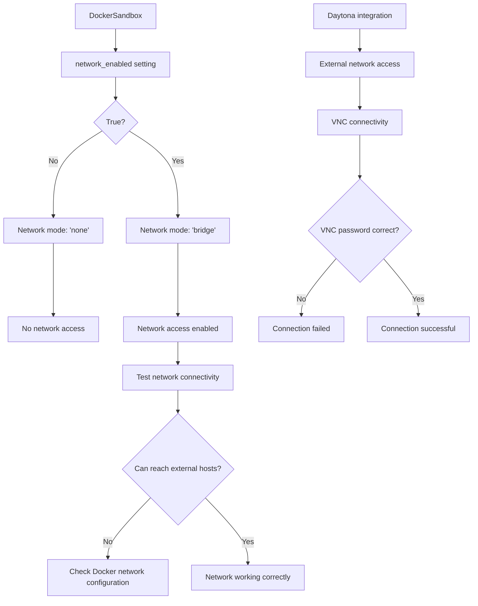

**Diagram sources**
- [DockerSandbox](file://app/sandbox/core/sandbox.py#L48-L87)
- [create_sandbox](file://app/daytona/sandbox.py#L107-L164)

**Section sources**
- [DockerSandbox](file://app/sandbox/core/sandbox.py)
- [create_sandbox](file://app/daytona/sandbox.py)

## Performance Optimization and Security Best Practices

This section provides recommendations for optimizing performance and ensuring security when deploying the execution environment in production.

### Performance Optimization Tips

Optimizing the execution environment can significantly improve performance and resource utilization.

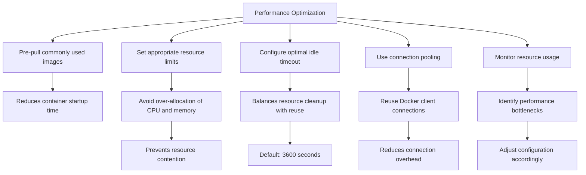

**Diagram sources**
- [SandboxManager](file://app/sandbox/core/manager.py#L0-L46)
- [SandboxSettings](file://app/config.py#L93-L110)

**Section sources**
- [SandboxManager](file://app/sandbox/core/manager.py)
- [SandboxSettings](file://app/config.py)

### Security Best Practices

Implementing security best practices is crucial for protecting the system and ensuring safe code execution.

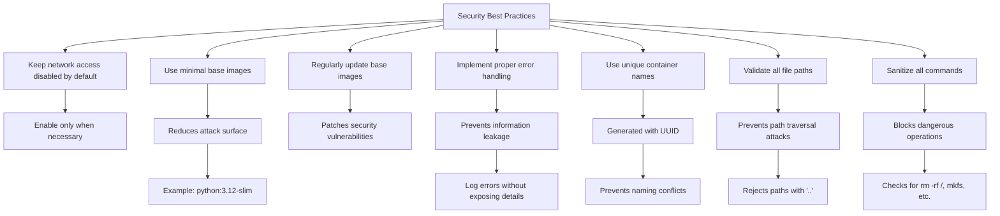

**Diagram sources**
- [DockerSandbox](file://app/sandbox/core/sandbox.py#L218-L259)
- [AsyncDockerizedTerminal](file://app/sandbox/core/terminal.py#L212-L258)

**Section sources**
- [DockerSandbox](file://app/sandbox/core/sandbox.py)
- [AsyncDockerizedTerminal](file://app/sandbox/core/terminal.py)