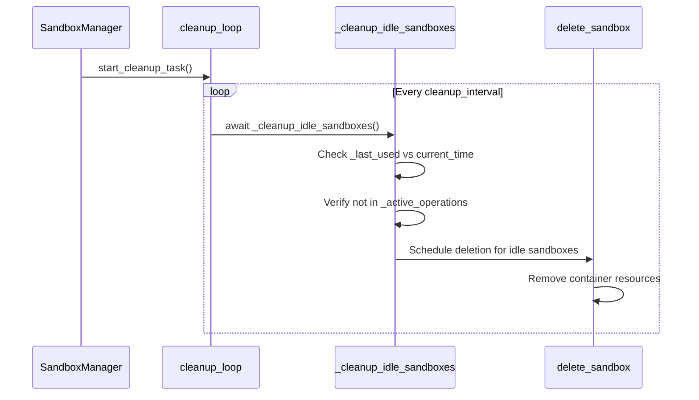
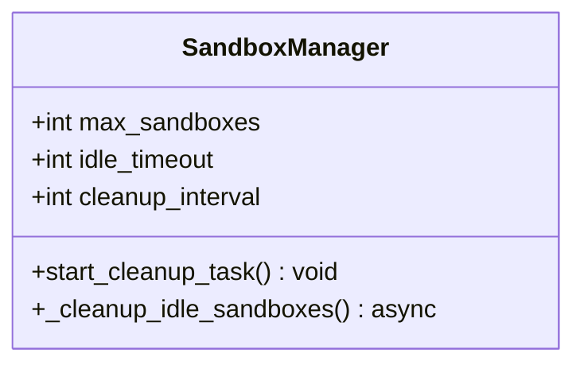
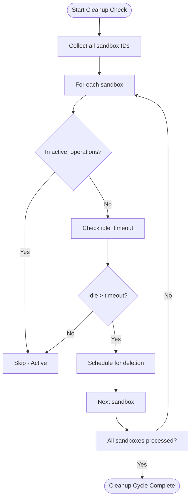
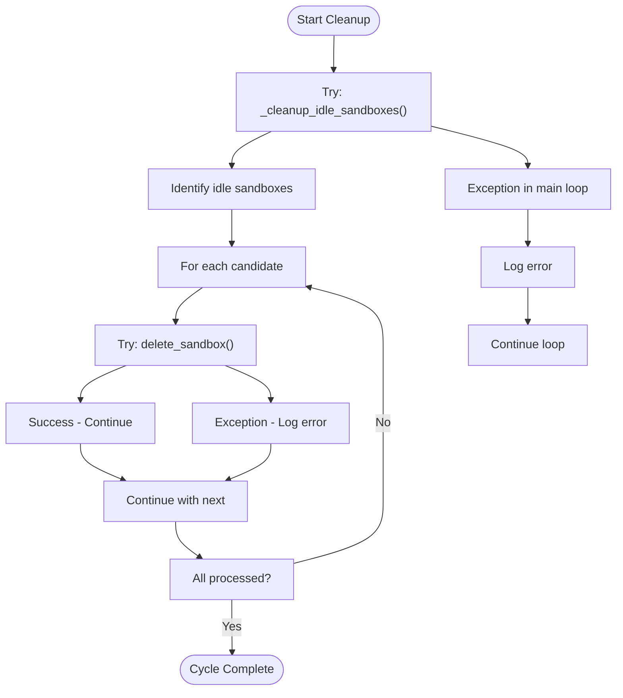
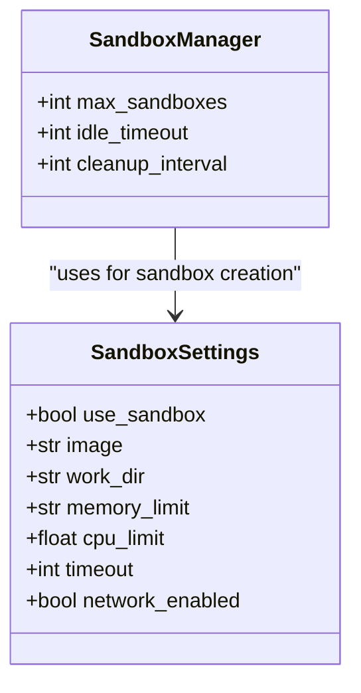

# Automatic Cleanup

<cite>
**Referenced Files in This Document**   
- [manager.py](file://app/sandbox/core/manager.py)
- [config.py](file://app/config.py)
- [config.example.toml](file://config/config.example.toml)
</cite>

## Table of Contents
1. [Introduction](#introduction)
2. [Cleanup Task Lifecycle](#cleanup-task-lifecycle)
3. [Configuration Parameters](#configuration-parameters)
4. [Idle Detection and Cleanup Logic](#idle-detection-and-cleanup-logic)
5. [Asynchronous Cleanup Loop](#asynchronous-cleanup-loop)
6. [Error Handling and Resilience](#error-handling-and-resilience)
7. [Configuration via SandboxSettings](#configuration-via-sandboxsettings)
8. [Common Issues and Troubleshooting](#common-issues-and-troubleshooting)
9. [Performance Optimization](#performance-optimization)
10. [Conclusion](#conclusion)

## Introduction
The Automatic Cleanup system in OpenManus ensures efficient resource management by automatically removing idle sandbox environments. This prevents resource exhaustion and maintains system performance by terminating unused sandboxes based on configurable timeout policies. The cleanup mechanism is implemented within the `SandboxManager` class and operates as a background task that periodically evaluates sandbox activity.

**Section sources**
- [manager.py](file://app/sandbox/core/manager.py#L13-L312)

## Cleanup Task Lifecycle
The cleanup task lifecycle begins when a `SandboxManager` instance is initialized, automatically triggering the `start_cleanup_task` method. This method creates an asynchronous background task that continuously monitors and removes idle sandboxes. The lifecycle includes task initiation, periodic idle checks, sandbox deletion, and graceful shutdown during system termination.

The `_cleanup_idle_sandboxes` method performs the core cleanup logic by identifying sandboxes that have exceeded their idle timeout and are not currently involved in active operations. These identified sandboxes are then scheduled for deletion through the `delete_sandbox` method, which safely removes the container and associated resources.



**Diagram sources**
- [manager.py](file://app/sandbox/core/manager.py#L173-L203)
- [manager.py](file://app/sandbox/core/manager.py#L277-L289)

**Section sources**
- [manager.py](file://app/sandbox/core/manager.py#L173-L184)
- [manager.py](file://app/sandbox/core/manager.py#L186-L203)

## Configuration Parameters
The cleanup behavior is controlled by two key configuration parameters: `cleanup_interval` and `idle_timeout`. The `cleanup_interval` determines how frequently the system checks for idle sandboxes, while `idle_timeout` specifies the duration of inactivity after which a sandbox becomes eligible for cleanup.

These parameters are initialized in the `SandboxManager` constructor with default values of 300 seconds (5 minutes) for cleanup interval and 3600 seconds (1 hour) for idle timeout. These values can be customized during manager instantiation to meet specific performance and resource management requirements.



**Diagram sources**
- [manager.py](file://app/sandbox/core/manager.py#L28-L62)
- [manager.py](file://app/sandbox/core/manager.py#L41-L43)

**Section sources**
- [manager.py](file://app/sandbox/core/manager.py#L28-L62)

## Idle Detection and Cleanup Logic
The idle detection mechanism compares the current time with the `_last_used` timestamp for each sandbox to determine inactivity. Sandboxes are tracked in the `_last_used` dictionary, which stores the last access time for each sandbox ID. When a sandbox is accessed through `get_sandbox`, its timestamp is updated via the `sandbox_operation` context manager.

A sandbox is considered idle when both conditions are met: it is not listed in `_active_operations` (indicating no ongoing operations) and the difference between current time and `_last_used` exceeds `idle_timeout`. This dual-check prevents active sandboxes from being prematurely terminated while ensuring truly idle environments are cleaned up.



**Diagram sources**
- [manager.py](file://app/sandbox/core/manager.py#L186-L203)
- [manager.py](file://app/sandbox/core/manager.py#L88-L111)

**Section sources**
- [manager.py](file://app/sandbox/core/manager.py#L186-L203)
- [manager.py](file://app/sandbox/core/manager.py#L50-L50)
- [manager.py](file://app/sandbox/core/manager.py#L55-L55)

## Asynchronous Cleanup Loop
The cleanup system operates as a non-blocking background task through an asynchronous event loop. The `start_cleanup_task` method creates a coroutine that runs indefinitely until the manager begins shutting down (`_is_shutting_down` flag is set). This design ensures that cleanup operations do not interfere with normal sandbox operations.

The loop follows a simple pattern: execute cleanup logic, handle any exceptions to prevent crashes, then sleep for `cleanup_interval` seconds before the next iteration. This approach provides consistent cleanup frequency while maintaining system responsiveness. During shutdown, the cleanup task is properly canceled and awaited to ensure all resources are released.

```mermaid
sequenceDiagram
participant Loop as cleanup_loop
participant Cleanup as _cleanup_idle_sandboxes
participant Sleep as asyncio.sleep
Loop->>Cleanup : await _cleanup_idle_sandboxes()
alt Success
Cleanup-->>Loop : Success
end
alt Exception
Cleanup-->>Loop : Exception caught
Loop->>Logger : Log error
end
Loop->>Sleep : await asyncio.sleep(cleanup_interval)
Sleep-->>Loop : Wake up
Loop->>Cleanup : Repeat cycle
```

**Diagram sources**
- [manager.py](file://app/sandbox/core/manager.py#L173-L184)
- [manager.py](file://app/sandbox/core/manager.py#L59-L59)

**Section sources**
- [manager.py](file://app/sandbox/core/manager.py#L173-L184)

## Error Handling and Resilience
The cleanup system incorporates comprehensive error handling to ensure reliability and prevent crashes. The main cleanup loop wraps the `_cleanup_idle_sandboxes` call in a try-except block that catches all exceptions, logs them, and continues the loop. This fault tolerance prevents a single error from stopping the entire cleanup process.

Individual sandbox deletions are also wrapped in exception handlers within the `_cleanup_idle_sandboxes` method. If an error occurs while deleting a specific sandbox, it is logged and the process continues with other candidates. The `_safe_delete_sandbox` method includes additional safeguards, such as waiting for active operations to complete before deletion and handling various Docker API errors during container removal.



**Diagram sources**
- [manager.py](file://app/sandbox/core/manager.py#L173-L184)
- [manager.py](file://app/sandbox/core/manager.py#L186-L203)
- [manager.py](file://app/sandbox/core/manager.py#L243-L275)

**Section sources**
- [manager.py](file://app/sandbox/core/manager.py#L173-L184)
- [manager.py](file://app/sandbox/core/manager.py#L186-L203)
- [manager.py](file://app/sandbox/core/manager.py#L243-L275)

## Configuration via SandboxSettings
The cleanup behavior can be configured through the `SandboxSettings` class, which defines the default parameters for sandbox management. While the primary cleanup parameters are set directly in the `SandboxManager` constructor, the overall sandbox configuration influences cleanup effectiveness through resource limits and operational constraints.

The configuration system supports both direct parameter passing and TOML-based configuration files. The `config.example.toml` file provides a template for setting sandbox parameters, including image, resource limits, and operational constraints that indirectly affect cleanup behavior by determining sandbox lifespan and resource consumption patterns.



**Diagram sources**
- [config.py](file://app/config.py#L93-L104)
- [config.example.toml](file://config/config.example.toml#L65-L72)
- [manager.py](file://app/sandbox/core/manager.py#L113-L156)

**Section sources**
- [config.py](file://app/config.py#L93-L104)
- [config.example.toml](file://config/config.example.toml#L65-L72)

## Common Issues and Troubleshooting
Several common issues may arise with the automatic cleanup system. If the cleanup task fails to start, verify that `start_cleanup_task` is called in the `SandboxManager` initialization and that the event loop is properly running. Sandboxes not being removed as expected could indicate incorrect `idle_timeout` settings or sandboxes remaining in `_active_operations` due to incomplete operations.

Clock drift between the application server and Docker daemon can affect timeout calculations, potentially causing premature or delayed cleanup. Monitoring the `_last_used` timestamps and comparing them with actual usage patterns can help identify timing issues. The `get_stats` method provides valuable diagnostic information about the current state of the sandbox manager, including total sandboxes and active operations.

When troubleshooting cleanup issues, check the application logs for error messages from the cleanup loop, verify that the cleanup task is running (not canceled), and ensure that sandbox access operations are properly updating the `_last_used` timestamps through the `sandbox_operation` context manager.

**Section sources**
- [manager.py](file://app/sandbox/core/manager.py#L299-L312)
- [manager.py](file://app/sandbox/core/manager.py#L88-L111)

## Performance Optimization
Optimizing the cleanup system involves balancing resource efficiency with operational performance. For environments with frequent short-lived sandboxes, reducing the `cleanup_interval` can improve resource reclamation speed, while increasing `idle_timeout` prevents premature termination of legitimately idle environments.

In high-throughput scenarios, consider increasing `max_sandboxes` to accommodate more concurrent operations while tuning the cleanup parameters to maintain optimal resource utilization. Monitoring the ratio of active to total sandboxes through the `get_stats` method can inform optimization decisions. For production environments, implement logging and monitoring to track cleanup frequency, duration, and success rates to identify performance bottlenecks.

**Section sources**
- [manager.py](file://app/sandbox/core/manager.py#L299-L312)

## Conclusion
The Automatic Cleanup system in OpenManus provides a robust mechanism for managing sandbox resources through configurable idle detection and asynchronous cleanup. By leveraging the `start_cleanup_task` and `_cleanup_idle_sandboxes` methods, the system ensures efficient resource utilization while maintaining system stability through comprehensive error handling. Proper configuration of `cleanup_interval` and `idle_timeout` parameters allows administrators to balance resource efficiency with operational requirements, making the cleanup system adaptable to various deployment scenarios.