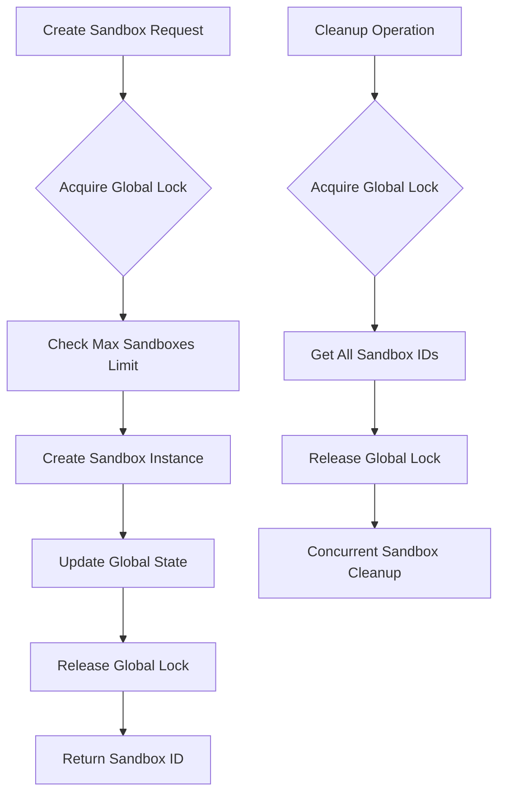
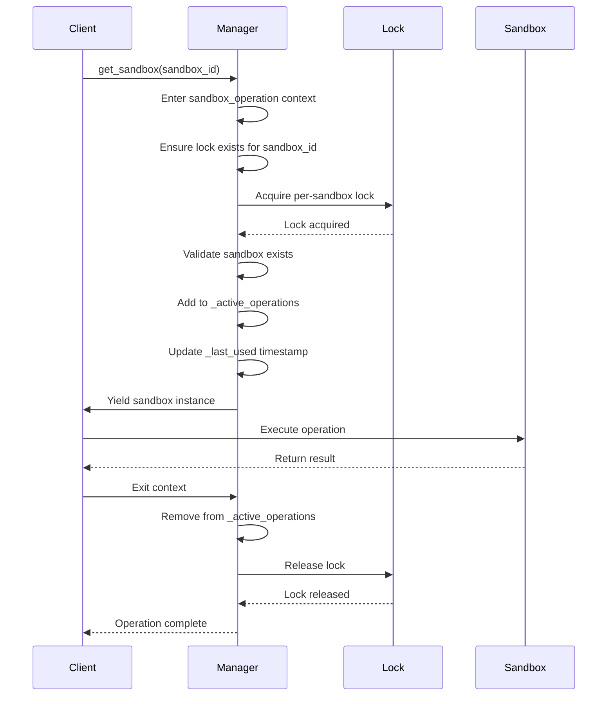
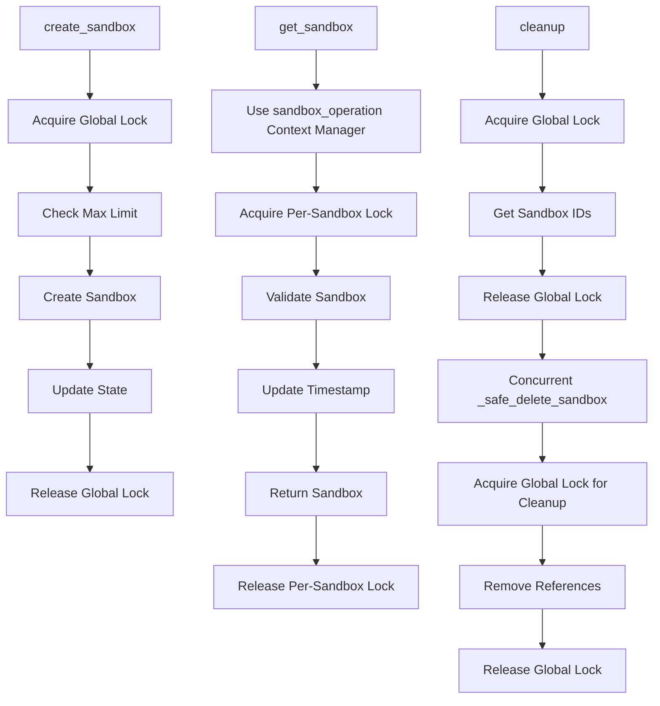

# Concurrency Control

<cite>
**Referenced Files in This Document**   
- [manager.py](file://app/sandbox/core/manager.py)
- [sandbox.py](file://app/sandbox/core/sandbox.py)
- [exceptions.py](file://app/sandbox/core/exceptions.py)
- [test_sandbox_manager.py](file://tests/sandbox/test_sandbox_manager.py)
</cite>

## Table of Contents
1. [Introduction](#introduction)
2. [Global Lock Mechanism](#global-lock-mechanism)
3. [Per-Sandbox Locking](#per-sandbox-locking)
4. [Sandbox Operation Context Manager](#sandbox-operation-context-manager)
5. [Lock Acquisition Patterns](#lock-acquisition-patterns)
6. [Resource Management and Cleanup](#resource-management-and-cleanup)
7. [Concurrency Challenges](#concurrency-challenges)
8. [Performance Optimization](#performance-optimization)
9. [Conclusion](#conclusion)

## Introduction
The OpenManus system implements a sophisticated concurrency control mechanism within its SandboxManager class to ensure thread-safe operations when managing multiple sandbox instances. This documentation details the implementation of asyncio.Lock for both global and per-sandbox synchronization, explaining how these mechanisms prevent race conditions, ensure data consistency, and prevent resource leaks during concurrent access to sandbox resources. The system employs a multi-layered locking strategy that combines global coordination with individual sandbox isolation to handle high-concurrency scenarios effectively.

**Section sources**
- [manager.py](file://app/sandbox/core/manager.py#L13-L312)

## Global Lock Mechanism
The SandboxManager class implements a global asyncio.Lock instance (_global_lock) to coordinate atomic operations across the entire sandbox management system. This lock is critical for maintaining data consistency when modifying shared state that affects multiple sandboxes simultaneously. The global lock is acquired during operations that require atomic updates to the system's global state, such as sandbox creation and cleanup processes.

In the create_sandbox method, the global lock ensures that the check for maximum sandbox limits and the subsequent creation process are performed atomically. This prevents race conditions where multiple concurrent requests could collectively exceed the configured maximum sandbox count. Similarly, during cleanup operations in the cleanup method, the global lock protects the enumeration of all active sandboxes, ensuring that the list of sandboxes to be cleaned up remains consistent throughout the process.

The global lock also plays a crucial role in the _safe_delete_sandbox method, where it protects the removal of sandbox references from the _sandboxes, _last_used, and _locks dictionaries. This atomic removal prevents scenarios where a sandbox might be partially removed from the system's state, which could lead to resource leaks or inconsistent state.



**Diagram sources**
- [manager.py](file://app/sandbox/core/manager.py#L113-L156)
- [manager.py](file://app/sandbox/core/manager.py#L205-L241)

**Section sources**
- [manager.py](file://app/sandbox/core/manager.py#L54-L54)
- [manager.py](file://app/sandbox/core/manager.py#L113-L156)
- [manager.py](file://app/sandbox/core/manager.py#L205-L241)

## Per-Sandbox Locking
Complementing the global lock, the SandboxManager employs per-sandbox asyncio.Lock instances stored in the _locks dictionary to serialize operations on individual sandbox instances. Each sandbox is assigned its own lock upon first access, ensuring that concurrent operations targeting the same sandbox are processed sequentially. This approach provides fine-grained concurrency control that allows multiple sandboxes to be operated on simultaneously while preventing conflicts on individual sandbox resources.

The per-sandbox locks are created on-demand within the sandbox_operation context manager when a sandbox ID is not already present in the _locks dictionary. This lazy initialization optimizes resource usage by only creating locks for sandboxes that are actually being accessed. The locks are stored in the dictionary with the sandbox ID as the key, enabling efficient lookup and reuse across multiple operations on the same sandbox.

This per-sandbox locking strategy enables the system to handle high concurrency efficiently. While operations on a specific sandbox are serialized, operations on different sandboxes can proceed in parallel, maximizing throughput. The lock is held for the duration of each operation on the sandbox, ensuring that the sandbox's state remains consistent throughout the operation.

```mermaid
classDiagram
class SandboxManager {
+max_sandboxes : int
+idle_timeout : int
+cleanup_interval : int
-_sandboxes : Dict[str, DockerSandbox]
-_last_used : Dict[str, float]
-_locks : Dict[str, asyncio.Lock]
-_global_lock : asyncio.Lock
-_active_operations : Set[str]
+create_sandbox() : str
+get_sandbox() : DockerSandbox
+cleanup() : None
}
class DockerSandbox {
+config : SandboxSettings
+volume_bindings : Dict[str, str]
-client : docker.client
-container : Container
-terminal : AsyncDockerizedTerminal
+create() : DockerSandbox
+run_command() : str
+read_file() : str
+write_file() : None
+cleanup() : None
}
SandboxManager --> DockerSandbox : "manages"
SandboxManager : "_locks : Dict[str, asyncio.Lock]"
SandboxManager : "_global_lock : asyncio.Lock"
```

**Diagram sources**
- [manager.py](file://app/sandbox/core/manager.py#L53-L53)
- [sandbox.py](file://app/sandbox/core/sandbox.py#L13-L462)

**Section sources**
- [manager.py](file://app/sandbox/core/manager.py#L53-L53)
- [manager.py](file://app/sandbox/core/manager.py#L88-L111)

## Sandbox Operation Context Manager
The sandbox_operation context manager serves as the primary interface for accessing sandbox instances with proper concurrency control. This context manager implements a comprehensive approach to sandbox access that combines locking, usage tracking, and exception safety. When invoked with a specific sandbox ID, it first ensures that a lock exists for that sandbox, creating one if necessary.

The context manager acquires the per-sandbox lock and performs validation to confirm that the requested sandbox exists in the _sandboxes dictionary. If the sandbox is not found, it raises a KeyError, preventing operations on non-existent resources. Upon successful validation, the sandbox ID is added to the _active_operations set, which tracks currently executing operations on each sandbox.

A key feature of the context manager is its automatic update of the last-used timestamp in the _last_used dictionary. This timestamp is crucial for the idle cleanup mechanism, which removes sandboxes that have not been accessed for a configurable period. The context manager uses a try-finally block to ensure that the sandbox ID is always removed from the _active_operations set, even if an exception occurs during the operation, preventing the system from permanently marking a sandbox as having active operations.



**Diagram sources**
- [manager.py](file://app/sandbox/core/manager.py#L88-L111)
- [manager.py](file://app/sandbox/core/manager.py#L158-L171)

**Section sources**
- [manager.py](file://app/sandbox/core/manager.py#L88-L111)

## Lock Acquisition Patterns
The OpenManus system demonstrates several distinct lock acquisition patterns across its core methods, each tailored to the specific concurrency requirements of the operation. In the create_sandbox method, the global lock is acquired at the beginning of the method and held throughout the entire creation process. This ensures atomicity of the limit check and sandbox creation, preventing race conditions that could lead to exceeding the maximum sandbox count.

The get_sandbox method employs a different pattern, delegating its concurrency control to the sandbox_operation context manager. This approach promotes code reuse and ensures consistent locking behavior across all operations that access individual sandboxes. By using the context manager, get_sandbox benefits from the comprehensive concurrency control, usage tracking, and exception safety provided by the sandbox_operation implementation.

In the cleanup methods, a hybrid approach is used. The cleanup method acquires the global lock to safely enumerate all active sandboxes, then releases it before initiating concurrent cleanup tasks for each sandbox. This minimizes the duration of global lock acquisition, reducing contention. Each individual sandbox cleanup in _safe_delete_sandbox then acquires the global lock only for the brief period required to remove the sandbox's references from the manager's dictionaries, further optimizing lock usage.



**Diagram sources**
- [manager.py](file://app/sandbox/core/manager.py#L113-L156)
- [manager.py](file://app/sandbox/core/manager.py#L158-L171)
- [manager.py](file://app/sandbox/core/manager.py#L205-L241)

**Section sources**
- [manager.py](file://app/sandbox/core/manager.py#L113-L156)
- [manager.py](file://app/sandbox/core/manager.py#L158-L171)
- [manager.py](file://app/sandbox/core/manager.py#L205-L241)

## Resource Management and Cleanup
The concurrency control system in OpenManus is tightly integrated with resource management and cleanup operations to prevent resource leaks and ensure proper cleanup under concurrent access. The _active_operations set plays a crucial role in this integration, tracking which sandboxes currently have operations in progress. This information is used by the _safe_delete_sandbox method to detect and handle sandboxes with active operations, preventing premature cleanup that could interrupt ongoing work.

When _safe_delete_sandbox detects that a sandbox has active operations, it implements a waiting strategy, polling every 500 milliseconds for up to 5 seconds to see if the operations complete. This graceful waiting period allows legitimate operations to finish before cleanup proceeds, reducing the risk of interrupting important work. If the operations do not complete within the timeout period, the cleanup proceeds anyway, logging a warning to alert administrators to potential issues.

The cleanup process is designed to be resilient to exceptions, with comprehensive error handling that ensures cleanup continues even if individual sandbox cleanup operations fail. Each cleanup task is wrapped in exception handling, and errors are logged without stopping the overall cleanup process. This fault tolerance is essential for ensuring that the system can recover from various error conditions without leaving resources in an inconsistent state.

**Section sources**
- [manager.py](file://app/sandbox/core/manager.py#L243-L275)
- [manager.py](file://app/sandbox/core/manager.py#L277-L289)
- [manager.py](file://app/sandbox/core/manager.py#L205-L241)

## Concurrency Challenges
The implementation of concurrency control in OpenManus addresses several common challenges associated with concurrent systems. One potential issue is lock contention under high load, particularly with the global lock that can become a bottleneck when many operations require it simultaneously. The system mitigates this by minimizing the scope and duration of global lock acquisition, releasing it as soon as possible after critical sections.

Deadlock scenarios are prevented through careful design of the locking hierarchy. The system follows a consistent order of lock acquisition, always acquiring the global lock before any per-sandbox locks when both are needed. This prevents circular wait conditions that could lead to deadlocks. Additionally, the use of context managers with guaranteed cleanup ensures that locks are always released, even in the event of exceptions.

Exception handling within lock contexts is another critical consideration. The implementation uses try-finally blocks to ensure that cleanup operations, such as removing sandbox IDs from the _active_operations set, are always performed regardless of whether an exception occurs. This prevents the system from permanently marking sandboxes as having active operations, which could prevent their cleanup and lead to resource exhaustion over time.

**Section sources**
- [manager.py](file://app/sandbox/core/manager.py#L88-L111)
- [manager.py](file://app/sandbox/core/manager.py#L243-L275)
- [exceptions.py](file://app/sandbox/core/exceptions.py#L1-L17)

## Performance Optimization
Several performance optimization strategies are employed in the concurrency control system to minimize overhead and maximize throughput. The most significant optimization is the reduction of lock scope, where locks are acquired for the minimum necessary duration. For example, in the cleanup method, the global lock is only held while enumerating sandbox IDs, after which it is released before initiating the actual cleanup tasks.

The system also optimizes for common access patterns by using lazy initialization of per-sandbox locks. Locks are only created when a sandbox is first accessed, rather than pre-allocating locks for all possible sandboxes. This reduces memory usage and initialization overhead, particularly in systems with many sandboxes that may not all be accessed frequently.

Another optimization is the use of concurrent cleanup tasks. Rather than cleaning up sandboxes sequentially, the cleanup method creates asynchronous tasks for each sandbox cleanup, allowing them to proceed in parallel. This significantly reduces the total time required for system-wide cleanup operations, especially when dealing with many sandboxes.

To avoid nested lock scenarios, the system carefully separates concerns between global and per-sandbox operations. Operations that require both types of locks are designed to acquire them in a specific order and for minimal durations, reducing the window of potential contention. The architecture also minimizes the need for nested locks by designing operations to be as independent as possible.

**Section sources**
- [manager.py](file://app/sandbox/core/manager.py#L205-L241)
- [manager.py](file://app/sandbox/core/manager.py#L243-L275)
- [manager.py](file://app/sandbox/core/manager.py#L53-L53)

## Conclusion
The concurrency control system in OpenManus demonstrates a well-designed approach to managing concurrent access to sandbox resources. By combining global and per-sandbox locking mechanisms, the system effectively prevents race conditions while allowing for high levels of parallelism. The sandbox_operation context manager provides a robust interface for accessing sandboxes with proper concurrency control, usage tracking, and exception safety.

The implementation successfully addresses common concurrency challenges such as deadlocks, lock contention, and resource leaks through careful design and comprehensive error handling. Performance optimizations, including reduced lock scope and concurrent cleanup, ensure that the system can handle high loads efficiently. The tight integration between concurrency control and resource management ensures that sandboxes are properly tracked and cleaned up, maintaining system stability even under demanding conditions.

This sophisticated concurrency model enables OpenManus to safely manage multiple sandbox instances in a high-concurrency environment, providing reliable isolation and resource management for its users.